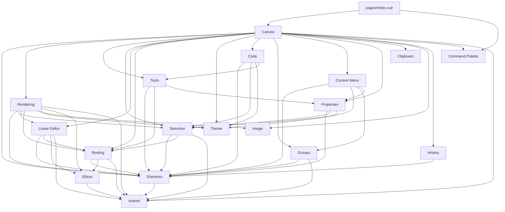
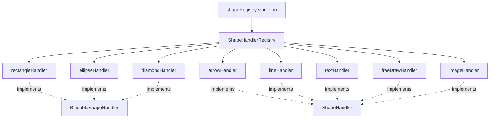

# System Knowledge Map

> Lightweight index — each section lives in its own file. Load only what you need.

## Feature Inventory

Seventeen feature modules under `packages/core/src/features/`:

| Feature             | Directory          | Key Exports                                                                                                                                                                                                                                       | Purpose                                                                                                                                                                 |
| ------------------- | ------------------ | ------------------------------------------------------------------------------------------------------------------------------------------------------------------------------------------------------------------------------------------------- | ----------------------------------------------------------------------------------------------------------------------------------------------------------------------- |
| **Canvas**          | `canvas/`          | `useViewport`, `useRenderer`, `useSceneRenderer`, `useCanvasLayers`, `usePanning`, `useAnimationController`, `createDirtyFlags`, `screenToScene`/`sceneToScreen`                                                                                  | Triple canvas stack, RAF render loop, viewport, panning, coordinate transforms                                                                                          |
| **Context Menu**    | `context-menu/`    | `useContextMenu`, `ContextMenu.vue`, `contextMenuItems`                                                                                                                                                                                           | Right-click overlay with element/canvas actions (copy, paste, duplicate, delete, z-order, group, flip)                                                                  |
| **Elements**        | `elements/`        | `useElements`, `createElement`, `mutateElement`, `useLayerOrder`, element types                                                                                                                                                                   | Reactive element array, factory, in-place mutation + version bump, group-aware z-order reordering                                                                       |
| **Rendering**       | `rendering/`       | `renderGrid`, `renderScene`, `renderElement`, `renderInteractiveScene`, `generateShape`, `renderArrowheads`, per-type shape handlers (`handlers/`)                                                                                                | Grid, roughjs shapes, arrowheads, interactive overlays, shape handler registry with per-type handlers (rectangle, ellipse, diamond, arrow, line, text, freeDraw, image) |
| **Selection**       | `selection/`       | `useSelection`, `useSelectionInteraction`, `hitTest`, `getTransformHandles`, `dragElements`, `resizeElement`, `rotateElement`, `bounds`                                                                                                           | Click/drag selection, state machine, hit testing, transform handles, drag + resize + rotate                                                                             |
| **Tools**           | `tools/`           | `useToolStore`, `useDrawingInteraction`, `useFreeDrawInteraction`, `useTextInteraction`, `useEraserInteraction`, `eraserTest`, `ToolType`/`DrawingToolType`                                                                                       | Active tool state, keyboard shortcuts, pointer-to-shape/arrow/line creation, free-draw, text editing, eraser interaction                                                |
| **Linear Editor**   | `linear-editor/`   | `useLinearEditor`, `useMultiPointCreation`, `pointHandles` (`movePoint`, `movePoints`, `getSizeFromPoints`, etc.), `renderLinearEditor`                                                                                                           | Arrow/line point editing (double-click), multi-point click-to-place creation, rubber band preview                                                                       |
| **Elbow**           | `elbow/`           | `routeElbowArrow`, `generateElbowArrowShape`, `astar`, `calculateGrid`, `validateElbowPoints`, heading utils                                                                                                                                      | Elbow (right-angle) arrow routing via A\* pathfinding on a grid, shape generation, corner rounding, segment validation                                                  |
| **Code**            | `code/`            | `useCodeInteraction`, `useShikiHighlighter`, `renderCodeElement`, `measureCode`, `isCodeElement`, `getCodeData`                                                                                                                                   | Code element with syntax highlighting via Shiki, inline code editor, TypeScript/Vue language support                                                                    |
| **Clipboard**       | `clipboard/`       | `useClipboard`                                                                                                                                                                                                                                    | Element copy/cut/paste lifecycle with offset-on-paste behavior                                                                                                          |
| **Image**           | `image/`           | `useImageInteraction`, `useImageUpload`, `useImageCache`, `renderImageElement`, `toFileId`, `ImageCacheEntry`                                                                                                                                     | Image insertion (tool, paste, drag/drop), upload/cache, dimensions/loading lifecycle, rendering                                                                         |
| **Command Palette** | `command-palette/` | `CommandPalette.vue`, `useCommandPalette`                                                                                                                                                                                                         | Global action search/execute UI backed by action registry                                                                                                               |
| **Binding**         | `binding/`         | `getHoveredElementForBinding`, `bindArrowToElement`, `unbindArrowEndpoint`, `updateBoundArrowEndpoints`, `renderSuggestedBinding`, `proximity`, `bindTextToContainer`, `unbindTextFromContainer`, `arrowMidpoint`, `heading`, `updateBoundPoints` | Arrow-to-shape binding, fixedPoint system, edge distance, blue highlight, bound text lifecycle, heading direction calculations, midpoint rendering                      |
| **Groups**          | `groups/`          | `useGroups`, `expandSelectionToGroups`, `addToGroup`, `removeFromGroups`, `reorderElementsForGroup`, `cleanupAfterDelete`                                                                                                                         | Flat groupIds model, Cmd+G/Cmd+Shift+G, group selection expansion, z-order reordering                                                                                   |
| **Properties**      | `properties/`      | `useStyleDefaults`, `usePropertyActions`, `usePropertyVisibility`, `useStyleClipboard`, `propertyPredicates`, `palette`                                                                                                                           | Element style editing (colors, stroke, fill, opacity, fonts, arrowheads, arrow subtype), sticky defaults, copy/paste styles, property visibility rules                  |
| **History**         | `history/`         | `useHistory`                                                                                                                                                                                                                                      | Snapshot-based undo/redo (Cmd+Z / Cmd+Shift+Z), checkpoint pairs for deferred interactions, max 100 entries                                                             |
| **Theme**           | `theme/`           | `useTheme`, `resolveColor`, `applyDarkModeFilter`, `THEME`                                                                                                                                                                                        | Light/dark mode via localStorage, CSS invert+hue-rotate color transform, Alt+Shift+D toggle                                                                             |

### App-Level Features

The `app/features/` directory contains **presentation-only** components and browser tests. These are distinct from the core features:

| Feature             | Directory                                                                        | Contents                                                                                                         |
| ------------------- | -------------------------------------------------------------------------------- | ---------------------------------------------------------------------------------------------------------------- |
| **Canvas**          | `app/features/canvas/`                                                           | `BottomBar.vue` (zoom/undo/redo)                                                                                 |
| **Tools**           | `app/features/tools/`                                                            | `DrawingToolbar.vue`, `toolIcons.ts`, eraser browser test                                                        |
| **Properties**      | `app/features/properties/`                                                       | `PropertiesPanel.vue`, `ColorSwatch`, `ArrowheadPicker`, etc.                                                    |
| **Command Palette** | `app/features/command-palette/`                                                  | `CommandPalette.vue`                                                                                             |
| **Image**           | `app/features/image/`                                                            | `ImageActions.vue`, image browser test                                                                           |
| **Dev Inspector**   | `app/features/dev-inspector/`                                                    | `DevInspector.vue` + tabs (Actions, Elements, History, Layers, State) — debug panel for inspecting runtime state |
| **Other features**  | `app/features/{clipboard,code,history,linear-editor,rendering,selection,theme}/` | Browser tests only                                                                                               |

### App Workers

| Worker                 | File                                       | Purpose                                                                                                                                     |
| ---------------------- | ------------------------------------------ | ------------------------------------------------------------------------------------------------------------------------------------------- |
| **Background Removal** | `app/workers/background-removal.worker.ts` | Web Worker for AI-powered image background removal using `@huggingface/transformers`; type-safe messaging via `background-removal.types.ts` |

## Cross-Feature Dependencies

**Key dependency notes:**

- `DrawVue.vue` (`packages/core/src/components/`) is the top-level orchestrator — it imports from elements/, tools/, code/, selection/, linear-editor/, binding/, groups/, context-menu/, properties/, and theme/ directly
- `useSceneRenderer` (canvas/) wires dirty flags to domain paint callbacks across static/newElement/interactive layers
- `renderInteractive.ts` (rendering/) is the cross-cutting overlay renderer — imports from selection/, linear-editor/, and binding/ to draw all interactive UI
- `binding/proximity.ts` uses `@excalidraw/math` directly (no dependency on selection/hitTest)
- `binding/heading.ts` provides heading direction calculations; re-exported by `elbow/` for convenience
- `code/` depends on elements/, selection/, theme/, and tools/ (for type imports)
- `groups/` is relatively isolated — only depends on elements/ and shared/; `useGroups` is not re-exported from index.ts (imported directly from `groups/composables/useGroups`)
- `context-menu/` wired into `DrawVue.vue` via `@contextmenu` handler with hit-test for element vs canvas context; calls into elements/, selection/, groups/, and properties/ for actions
- `properties/` depends on elements/ (mutateElement), selection/ (selectedElements), and theme/ (palette switching); uses `createGlobalState` for sticky defaults and style clipboard
- `elbow/` is a pure computation module (no Vue composables) — provides A\* pathfinding and routing, consumed by rendering/ and linear-editor/
- `rendering/handlers/` contains per-type `ShapeHandler` implementations registered in the `shapeRegistry` singleton — each handler provides `render()`, `hitTest()`, and `getBounds()` for its element type

## Shape Handler Registry

The rendering system uses a registry pattern for per-element-type rendering, hit testing, and bounds calculation:

- `ShapeHandler` — base interface: `render()`, `hitTest()`, `getBounds()`
- `BindableShapeHandler` — extends with: `distanceToEdge()`, `isPointInside()`, `projectOntoEdge()`, `drawHighlight()`
- `shapeRegistry` (in `shared/`) — lazily initialized singleton, deferred to break circular imports
- `registerDefaultHandlers()` (in `rendering/handlers/index.ts`) — registers all 8 built-in handlers

## Diagrams

| Diagram                 | File                                                                       | What it shows                                                       |
| ----------------------- | -------------------------------------------------------------------------- | ------------------------------------------------------------------- |
| Architecture Overview   | [diagrams/architecture-overview.md](diagrams/architecture-overview.md)     | Full dependency graph: Nuxt shell → pages → features → composables  |
| Canvas Architecture     | [diagrams/canvas-architecture.md](diagrams/canvas-architecture.md)         | Triple canvas stack data flow + composable wiring                   |
| Render Pipeline         | [diagrams/render-pipeline.md](diagrams/render-pipeline.md)                 | Dirty-flag driven RAF loop sequence                                 |
| Shape Drawing Flow      | [diagrams/shape-drawing-flow.md](diagrams/shape-drawing-flow.md)           | Pointer event sequence for creating shapes/arrows                   |
| Feature Architecture    | [diagrams/feature-architecture.md](diagrams/feature-architecture.md)       | Feature directory layout + import rules                             |
| Testing Architecture    | [diagrams/testing-architecture.md](diagrams/testing-architecture.md)       | Vitest three-project setup + testing pyramid                        |
| File Map                | [diagrams/file-map.md](diagrams/file-map.md)                               | Complete file tree of every module                                  |
| Selection State Machine | [diagrams/selection-state-machine.md](diagrams/selection-state-machine.md) | useSelectionInteraction states, transitions, modifiers, cursors     |
| Coordinate System       | [diagrams/coordinate-system.md](diagrams/coordinate-system.md)             | Screen ↔ scene transforms, viewport, zoom-anchored scrolling        |
| Initialization Sequence | [diagrams/initialization-sequence.md](diagrams/initialization-sequence.md) | Composable boot order, deferred dirty-flag binding pattern          |
| Event Flow              | [diagrams/event-flow.md](diagrams/event-flow.md)                           | Listener targets, pointer capture, panning priority, event pipeline |

**Staleness warnings:** The architecture-overview, file-map, and feature-architecture diagrams were written before groups/, theme/, code/, context-menu/, properties/, elbow/, and the shape handler registry existed. They need updates to include:

- `elbow/` feature box + edges to rendering/ and linear-editor/
- `context-menu/` and `properties/` feature boxes + edges
- `useSceneRenderer` and `useCanvasLayers` in canvas composables
- Cross-feature edges for context-menu → elements/selection/groups/properties, properties → elements/selection/theme
- `rendering/handlers/` subdirectory and shape handler registry in shared/
- `dev-inspector/` in app/features/
- `app/workers/` directory for background removal worker

## Specs

| Spec                      | File                                                                                   | Status                                                                                                                                          |
| ------------------------- | -------------------------------------------------------------------------------------- | ----------------------------------------------------------------------------------------------------------------------------------------------- |
| Grouping Feature          | [specs/grouping-feature.md](specs/grouping-feature.md)                                 | V1 implemented — flat groupIds, Cmd+G/Cmd+Shift+G, group borders, delete cleanup                                                                |
| Arrow Implementation Plan | [specs/arrow-implementation-plan.md](specs/arrow-implementation-plan.md)               | 10-phase plan: data model → curved → arrowheads → stroke → binding → elbow → creation → UI → cache → text                                       |
| Context Menu & Properties | [context-menu-properties-spec.md](context-menu-properties-spec.md)                     | **Implemented** — Right-click context menu + element properties panel (colors, stroke, fill, opacity, fonts, arrowheads). All 7 phases complete |
| Eraser Tool Plan          | [plans/2026-02-15-feat-eraser-tool-plan.md](plans/2026-02-15-feat-eraser-tool-plan.md) | Eraser tool implementation plan                                                                                                                 |

## Reference

| Topic                   | File                                                                         | What it covers                                                                                                                                                                                                                              |
| ----------------------- | ---------------------------------------------------------------------------- | ------------------------------------------------------------------------------------------------------------------------------------------------------------------------------------------------------------------------------------------- |
| Architectural Decisions | [reference/architectural-decisions.md](reference/architectural-decisions.md) | Rendering, state, reactivity, SSR, testing, and other key choices with rationale                                                                                                                                                            |
| Technology Stack        | [reference/technology-stack.md](reference/technology-stack.md)               | Framework, UI, styling, canvas, composables, and utility libraries                                                                                                                                                                          |
| Element Types           | [reference/element-types.md](reference/element-types.md)                     | Shape/arrow models, arrow architecture, linear editor, and binding feature                                                                                                                                                                  |
| Arrow Tech Spec         | [arrow-tech-spec.md](arrow-tech-spec.md)                                     | Complete arrow behavior spec: data model, binding, curves, elbow routing, hit testing, creation flow                                                                                                                                        |
| State & Persistence     | [excalidraw-state-and-persistence.md](excalidraw-state-and-persistence.md)   | How Excalidraw manages state (AppState, Scene, Actions, Jotai), persistence (localStorage, IndexedDB, file export, encryption), history/undo (delta-based dual stacks), and collaboration (reconciliation, versioning, fractional indexing) |

## Composable Quick Reference

| Composable                | Feature       | Pattern             | Description                                                                                                                                                                                                                                                            |
| ------------------------- | ------------- | ------------------- | ---------------------------------------------------------------------------------------------------------------------------------------------------------------------------------------------------------------------------------------------------------------------- |
| `useViewport`             | canvas        | Options object      | Pan/zoom state, screen↔scene coordinate transforms                                                                                                                                                                                                                     |
| `useRenderer`             | canvas        | Options object      | RAF loop, dirty-flag diffing, three-layer render callbacks                                                                                                                                                                                                             |
| `useSceneRenderer`        | canvas        | Options object      | Orchestrates all rendering: wires dirty flags to domain paint callbacks across static/newElement/interactive layers                                                                                                                                                    |
| `useCanvasLayers`         | canvas        | Ref-based           | Creates and manages three `<canvas>` elements + RoughCanvas contexts                                                                                                                                                                                                   |
| `usePanning`              | canvas        | Options object      | Middle-click and Space+drag panning via pointer events                                                                                                                                                                                                                 |
| `useAnimationController`  | canvas        | Options object      | Key-based animation registry, rAF scheduling, visibility-aware pause/resume                                                                                                                                                                                            |
| `createDirtyFlags`        | canvas        | Factory             | Deferred callback binding — noop until `bind()` is called with real render functions                                                                                                                                                                                   |
| `useElements`             | elements      | Provide/inject      | Reactive element array with add/remove/replace + computed helpers                                                                                                                                                                                                      |
| `useToolStore`            | tools         | `createGlobalState` | Active tool type + keyboard shortcut handling                                                                                                                                                                                                                          |
| `useDrawingInteraction`   | tools         | Options object      | Pointer→shape/arrow creation pipeline, delegates to multi-point for arrows                                                                                                                                                                                             |
| `useFreeDrawInteraction`  | tools         | Options object      | Free-draw stroke creation via perfect-freehand                                                                                                                                                                                                                         |
| `useTextInteraction`      | tools         | Options object      | Text element creation and inline editing                                                                                                                                                                                                                               |
| `useEraserInteraction`    | tools         | Options object      | Eraser tool: pointer-based element deletion by hit testing during drag                                                                                                                                                                                                 |
| `useSelection`            | selection     | Options object      | `selectedIds` set, computed `selectedElements`, select/deselect/toggle/clear                                                                                                                                                                                           |
| `useSelectionInteraction` | selection     | Options object      | State machine: idle → clicking → dragging → marquee → resizing                                                                                                                                                                                                         |
| `useLinearEditor`         | linear-editor | Options object      | Double-click arrow editing: point selection, drag, insert, delete, binding updates                                                                                                                                                                                     |
| `useMultiPointCreation`   | linear-editor | Options object      | Click-to-place arrow points, Shift for angle snapping, dblclick/Enter/Esc to finalize                                                                                                                                                                                  |
| `useGroups`               | groups        | Options object      | Group/ungroup selected elements, expand selection to groups, selectedGroupIds state. Not re-exported from index.ts — import from `groups/composables/useGroups`                                                                                                        |
| `useTheme`                | theme         | `createGlobalState` | Light/dark toggle via localStorage, Alt+Shift+D shortcut, `isDark` computed                                                                                                                                                                                            |
| `useCodeInteraction`      | code          | Options object      | Code element creation/editing: click-to-create, inline editor with Shiki highlighting                                                                                                                                                                                  |
| `useShikiHighlighter`     | code          | `createGlobalState` | Lazy-loads Shiki highlighter, caches instance, provides `highlight(code, lang, theme)`                                                                                                                                                                                 |
| `useContextMenu`          | context-menu  | Options object      | Open/close state, position, menu type (element vs canvas), filtered items by predicate. Closes on Escape, click-away, scroll                                                                                                                                           |
| `useStyleDefaults`        | properties    | `createGlobalState` | 15 reactive style default refs (strokeColor, backgroundColor, fillStyle, strokeWidth, strokeStyle, opacity, roughness, roundness, arrowSubtype, fontFamily, fontSize, textAlign, startArrowhead, endArrowhead, recentColors). Sticky: updates when user changes styles |
| `usePropertyActions`      | properties    | Options object      | Change methods + getFormValue for mixed-value detection. Mutates selected elements, updates sticky defaults, triggers dirty flags                                                                                                                                      |
| `usePropertyVisibility`   | properties    | Options object      | Determines which property controls are visible based on the current selection's element types                                                                                                                                                                          |
| `useStyleClipboard`       | properties    | `createGlobalState` | Copy/paste styles between elements. Snapshots style properties, skips text-only props on non-text elements. Cmd+Alt+C / Cmd+Alt+V                                                                                                                                      |
| `useLayerOrder`           | elements      | Options object      | Z-order reordering: bringToFront, bringForward, sendBackward, sendToBack. Group-aware: auto-expands selection to include group members, preserves adjacency                                                                                                            |
| `useHistory`              | history       | Options object      | Snapshot-based undo/redo. `recordAction(fn)` for instant operations, `saveCheckpoint`/`commitCheckpoint` pair for deferred interactions (drag, resize, text edit). Max 100 entries, ~5MB. Cmd+Z / Cmd+Shift+Z via action registry                                      |
| `useImageInteraction`     | image         | Options object      | Image insertion lifecycle: tool click, paste, drag/drop handling                                                                                                                                                                                                       |
| `useImageUpload`          | image         | Options object      | File validation, upload, and dimension loading for image elements                                                                                                                                                                                                      |
| `useImageCache`           | image         | Factory             | In-memory image cache keyed by FileId, provides add/get/has/remove                                                                                                                                                                                                     |

## Shared Modules

`packages/core/src/shared/` contains cross-cutting utilities used by multiple features:

| Module                   | File                             | Description                                                                                                                                                                                                                                                      |
| ------------------------ | -------------------------------- | ---------------------------------------------------------------------------------------------------------------------------------------------------------------------------------------------------------------------------------------------------------------- |
| **math**                 | `shared/math.ts`                 | Re-exports from `@excalidraw/math` and `@excalidraw/common` — point operations (`pointFrom`, `pointDistance`, etc.), angle/vector math, branded types (`GlobalPoint`, `LocalPoint`, `Radians`). Also has project-specific utils (`snapAngle`, `normalizePoints`) |
| **random**               | `shared/random.ts`               | `generateId()`, `randomInteger()`, `randomVersionNonce()`                                                                                                                                                                                                        |
| **isTypingElement**      | `shared/isTypingElement.ts`      | Detects input/textarea focus for keyboard shortcut suppression                                                                                                                                                                                                   |
| **curve**                | `shared/curve.ts`                | Catmull-Rom to cubic Bezier conversion, Bezier evaluation, arc length, closest point (hit testing for curved arrows)                                                                                                                                             |
| **toolTypes**            | `shared/toolTypes.ts`            | `ToolType` union, `DrawingToolType`, `LinearToolType`, `ShapeToolType` + type guard functions (`isDrawingTool`, `isLinearTool`, `isShapeTool`, `isTextTool`, `isCodeTool`, `isImageTool`, `isFreeDrawTool`, `isEraserTool`)                                      |
| **shapeHandlerRegistry** | `shared/shapeHandlerRegistry.ts` | `ShapeHandler` and `BindableShapeHandler` interfaces, `ShapeHandlerRegistry` factory, `isBindableHandler` type guard                                                                                                                                             |
| **shapeRegistry**        | `shared/shapeRegistry.ts`        | Lazily initialized singleton `shapeRegistry` backed by `ShapeHandlerRegistry`, deferred init to break circular imports                                                                                                                                           |
| **useActionRegistry**    | `shared/useActionRegistry.ts`    | `ActionDefinition`, `ActionRegistry`, `ActionId` union type, `createActionRegistry()`, `useActionRegistry()` (via DrawVueContext)                                                                                                                                |
| **useKeyboardShortcuts** | `shared/useKeyboardShortcuts.ts` | Global keyboard shortcut handler, binds `kbds` from action definitions to key events                                                                                                                                                                             |

## DrawVueContext Slices

The `DrawVueContext` (provided via `provideDrawVue()`) contains these slices:

| Slice            | Type                       | Creation                 | Notes                                        |
| ---------------- | -------------------------- | ------------------------ | -------------------------------------------- | ------------------------------------------------ |
| `elements`       | `ElementsSlice`            | `createElements()`       | Reactive element array                       |
| `tool`           | `ToolSlice`                | `createToolStore()`      | Active tool + lifecycle hooks                |
| `actionRegistry` | `ActionRegistry`           | `createActionRegistry()` | All registered actions                       |
| `clipboard`      | `ClipboardSlice`           | `createClipboard()`      | Element copy/cut/paste                       |
| `imageCache`     | `ImageCacheSlice`          | `createImageCache()`     | In-memory image cache                        |
| `styleDefaults`  | `StyleDefaultsSlice`       | `createStyleDefaults()`  | 15 sticky style refs + `getStyleOverrides()` |
| `styleClipboard` | `StyleClipboardSlice`      | `createStyleClipboard()` | Copy/paste styles                            |
| `commandPalette` | `CommandPaletteSlice`      | `createCommandPalette()` | Command palette open/execute                 |
| `selection`      | `ShallowRef<SelectionSlice | null>`                   | Deferred (`shallowRef(null)`)                | Set later by canvas setup (avoids circular deps) |
| `history`        | `ShallowRef<HistorySlice   | null>`                   | Deferred (`shallowRef(null)`)                | Set later by canvas setup                        |
| `dirty`          | `ShallowRef<DirtySlice     | null>`                   | Deferred (`shallowRef(null)`)                | Set later by canvas setup                        |

## Action Registry IDs

All registered actions use typed IDs:

| Category      | IDs                                                                                                                                                                                |
| ------------- | ---------------------------------------------------------------------------------------------------------------------------------------------------------------------------------- |
| **Tool**      | `tool:selection`, `tool:hand`, `tool:rectangle`, `tool:ellipse`, `tool:diamond`, `tool:arrow`, `tool:line`, `tool:text`, `tool:code`, `tool:image`, `tool:freedraw`, `tool:eraser` |
| **Action**    | `action:delete`, `action:duplicate`, `action:select-all`, `action:group`, `action:ungroup`                                                                                         |
| **Layer**     | `layer:bring-to-front`, `layer:bring-forward`, `layer:send-backward`, `layer:send-to-back`                                                                                         |
| **Clipboard** | `clipboard:copy`, `clipboard:cut`, `clipboard:paste`                                                                                                                               |
| **Style**     | `style:copy-styles`, `style:paste-styles`                                                                                                                                          |
| **Settings**  | `settings:toggle-theme`, `settings:toggle-grid`                                                                                                                                    |
| **Flip**      | `flip:horizontal`, `flip:vertical`                                                                                                                                                 |
| **History**   | `history:undo`, `history:redo`                                                                                                                                                     |
| **Image**     | `image:remove-background`                                                                                                                                                          |

> **Note:** Update this map when new features, diagrams, or reference docs are added.

## Free-draw Notes

- `DrawVue.vue` wires `useFreeDrawInteraction()` separately from `useDrawingInteraction()`.
- Free-draw finalization happens on both `pointerup` and tool-switch lifecycle (`onBeforeToolChange` via `finalizeFreeDrawIfActive()`).
- Free-draw commit does not auto-switch back to selection and does not auto-select the committed stroke.
