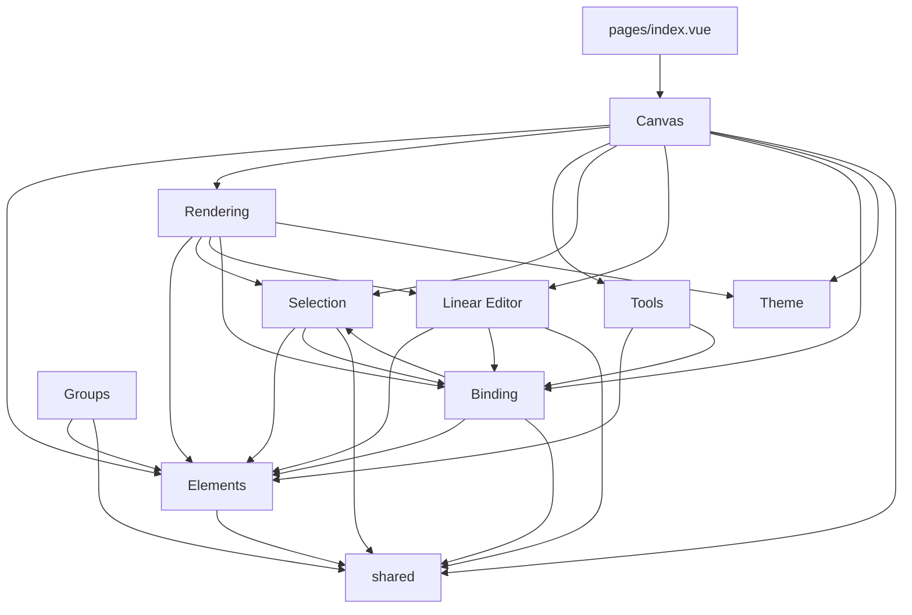

# System Knowledge Map

> Lightweight index — each section lives in its own file. Load only what you need.

## Feature Inventory

Nine feature modules under `app/features/`:

| Feature | Directory | Key Exports | Purpose |
|---------|-----------|-------------|---------|
| **Canvas** | `canvas/` | `useViewport`, `useRenderer`, `useSceneRenderer`, `useCanvasLayers`, `usePanning`, `useAnimationController`, `createDirtyFlags`, `screenToScene`/`sceneToScreen` | Triple canvas stack, RAF render loop, viewport, panning, coordinate transforms |
| **Elements** | `elements/` | `useElements`, `createElement`, `mutateElement`, element types | Reactive element array, factory, in-place mutation + version bump |
| **Rendering** | `rendering/` | `renderGrid`, `renderScene`, `renderElement`, `renderInteractiveScene`, `generateShape`, `renderArrowheads` | Grid, roughjs shapes, arrowheads, interactive overlays (selection borders, handles, linear editor, binding highlights, groups) |
| **Selection** | `selection/` | `useSelection`, `useSelectionInteraction`, `hitTest`, `getTransformHandles`, `dragElements`, `resizeElement`, `bounds` | Click/drag selection, state machine, hit testing, transform handles, drag + resize |
| **Tools** | `tools/` | `useToolStore`, `useDrawingInteraction`, `useTextInteraction`, `DrawingToolbar.vue` | Active tool state, keyboard shortcuts, pointer-to-shape/arrow creation, bound text on shapes |
| **Linear Editor** | `linear-editor/` | `useLinearEditor`, `useMultiPointCreation`, `pointHandles`, `renderLinearEditor` | Arrow point editing (double-click), multi-point click-to-place creation, rubber band preview |
| **Binding** | `binding/` | `getHoveredElementForBinding`, `bindArrowToElement`, `unbindArrowEndpoint`, `updateBoundArrowEndpoints`, `renderSuggestedBinding`, `proximity`, `bindTextToContainer`, `unbindTextFromContainer`, `updateBoundTextAfterContainerChange` | Arrow-to-shape binding, fixedPoint system, edge distance, blue highlight, bound text lifecycle |
| **Groups** | `groups/` | `useGroups`, `expandSelectionToGroups`, `addToGroup`, `removeFromGroups`, `reorderElementsForGroup`, `cleanupAfterDelete` | Flat groupIds model, Cmd+G/Cmd+Shift+G, group selection expansion, z-order reordering |
| **Theme** | `theme/` | `useTheme`, `resolveColor`, `applyDarkModeFilter`, `THEME` | Light/dark mode via localStorage, CSS invert+hue-rotate color transform, Alt+Shift+D toggle |

## Cross-Feature Dependencies

**Key dependency notes:**
- `useSceneRenderer` (canvas/) is the main orchestrator — it imports from rendering/, elements/, theme/, and receives state from selection/, linear-editor/, binding/, and groups/ via options
- `renderInteractive.ts` (rendering/) is the cross-cutting overlay renderer — imports from selection/, linear-editor/, and binding/ to draw all interactive UI
- `binding/proximity.ts` imports `distanceToSegment` from selection/hitTest (binding depends on selection)
- `groups/` is relatively isolated — only depends on elements/ and shared/

## Diagrams

| Diagram | File | What it shows |
|---------|------|---------------|
| Architecture Overview | [diagrams/architecture-overview.md](diagrams/architecture-overview.md) | Full dependency graph: Nuxt shell → pages → features → composables |
| Canvas Architecture | [diagrams/canvas-architecture.md](diagrams/canvas-architecture.md) | Triple canvas stack data flow + composable wiring |
| Render Pipeline | [diagrams/render-pipeline.md](diagrams/render-pipeline.md) | Dirty-flag driven RAF loop sequence |
| Shape Drawing Flow | [diagrams/shape-drawing-flow.md](diagrams/shape-drawing-flow.md) | Pointer event sequence for creating shapes/arrows |
| Feature Architecture | [diagrams/feature-architecture.md](diagrams/feature-architecture.md) | Feature directory layout + import rules |
| Testing Architecture | [diagrams/testing-architecture.md](diagrams/testing-architecture.md) | Vitest dual-project setup + testing pyramid |
| File Map | [diagrams/file-map.md](diagrams/file-map.md) | Complete file tree of every module |
| Selection State Machine | [diagrams/selection-state-machine.md](diagrams/selection-state-machine.md) | useSelectionInteraction states, transitions, modifiers, cursors |
| Coordinate System | [diagrams/coordinate-system.md](diagrams/coordinate-system.md) | Screen ↔ scene transforms, viewport, zoom-anchored scrolling |
| Initialization Sequence | [diagrams/initialization-sequence.md](diagrams/initialization-sequence.md) | Composable boot order, deferred dirty-flag binding pattern |
| Event Flow | [diagrams/event-flow.md](diagrams/event-flow.md) | Listener targets, pointer capture, panning priority, event pipeline |

**Staleness warnings:** The architecture-overview, file-map, and feature-architecture diagrams were written before groups/ and theme/ features existed. They need updates to include:
- `groups/` and `theme/` feature boxes + edges
- `useSceneRenderer` and `useCanvasLayers` in canvas composables
- Cross-feature edges for rendering → theme, rendering → linear-editor, rendering → binding, binding → selection

## Specs

| Spec | File | Status |
|------|------|--------|
| Grouping Feature | [specs/grouping-feature.md](specs/grouping-feature.md) | V1 implemented — flat groupIds, Cmd+G/Cmd+Shift+G, group borders, delete cleanup |
| Arrow Implementation Plan | [specs/arrow-implementation-plan.md](specs/arrow-implementation-plan.md) | 10-phase plan: data model → curved → arrowheads → stroke → binding → elbow → creation → UI → cache → text |

## Reference

| Topic | File | What it covers |
|-------|------|----------------|
| Architectural Decisions | [reference/architectural-decisions.md](reference/architectural-decisions.md) | Rendering, state, reactivity, SSR, testing, and other key choices with rationale |
| Technology Stack | [reference/technology-stack.md](reference/technology-stack.md) | Framework, UI, styling, canvas, composables, and utility libraries |
| Element Types | [reference/element-types.md](reference/element-types.md) | Shape/arrow models, arrow architecture, linear editor, and binding feature |
| Arrow Tech Spec | [arrow-tech-spec.md](arrow-tech-spec.md) | Complete arrow behavior spec: data model, binding, curves, elbow routing, hit testing, creation flow |

## Composable Quick Reference

| Composable | Feature | Pattern | Description |
|------------|---------|---------|-------------|
| `useViewport` | canvas | Options object | Pan/zoom state, screen↔scene coordinate transforms |
| `useRenderer` | canvas | Options object | RAF loop, dirty-flag diffing, three-layer render callbacks |
| `useSceneRenderer` | canvas | Options object | Orchestrates all rendering: wires dirty flags to domain paint callbacks across static/newElement/interactive layers |
| `useCanvasLayers` | canvas | Ref-based | Creates and manages three `<canvas>` elements + RoughCanvas contexts |
| `usePanning` | canvas | Options object | Middle-click and Space+drag panning via pointer events |
| `useAnimationController` | canvas | Options object | Key-based animation registry, rAF scheduling, visibility-aware pause/resume |
| `createDirtyFlags` | canvas | Factory | Deferred callback binding — noop until `bind()` is called with real render functions |
| `useElements` | elements | Provide/inject | Reactive element array with add/remove/replace + computed helpers |
| `useToolStore` | tools | `createGlobalState` | Active tool type + keyboard shortcut handling |
| `useDrawingInteraction` | tools | Options object | Pointer→shape/arrow creation pipeline, delegates to multi-point for arrows |
| `useSelection` | selection | Options object | `selectedIds` set, computed `selectedElements`, select/deselect/toggle/clear |
| `useSelectionInteraction` | selection | Options object | State machine: idle → clicking → dragging → marquee → resizing |
| `useLinearEditor` | linear-editor | Options object | Double-click arrow editing: point selection, drag, insert, delete, binding updates |
| `useMultiPointCreation` | linear-editor | Options object | Click-to-place arrow points, Shift for angle snapping, dblclick/Enter/Esc to finalize |
| `useGroups` | groups | Options object | Group/ungroup selected elements, expand selection to groups, selectedGroupIds state |
| `useTheme` | theme | `createGlobalState` | Light/dark toggle via localStorage, Alt+Shift+D shortcut, `isDark` computed |

> **Note:** Update this map when new features, diagrams, or reference docs are added.
