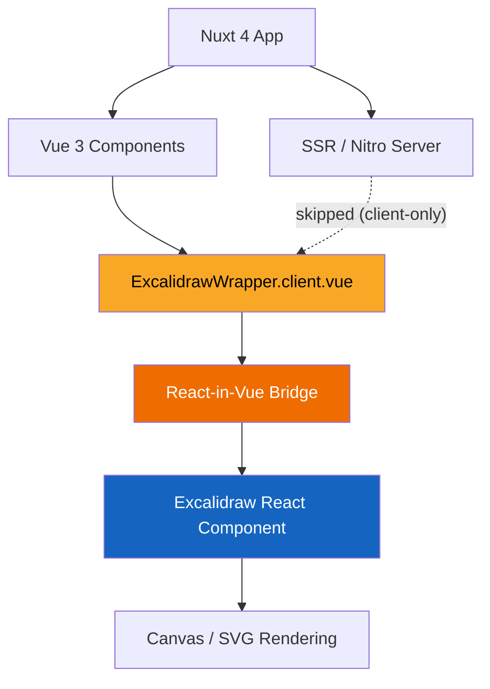
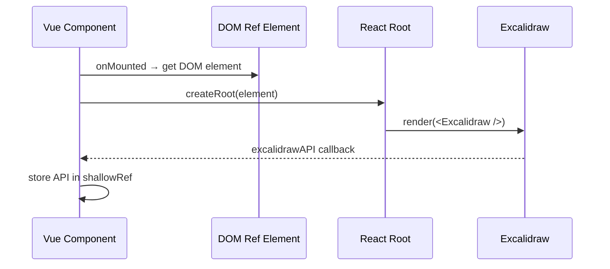
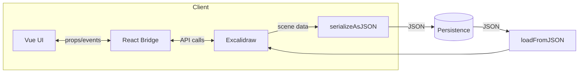
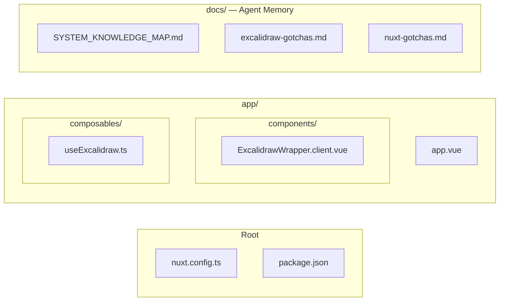

# System Knowledge Map

## Architecture Overview

## React-in-Vue Bridge

## Data Flow

## Key Architectural Decisions

| Decision | Choice | Rationale |
|----------|--------|-----------|
| React integration | React-in-Vue bridge | Excalidraw is React-only, no Vue port exists |
| SSR strategy | Client-only for Excalidraw | Canvas/DOM APIs unavailable in SSR |
| API storage | `shallowRef` | Deep reactivity on Excalidraw API destroys performance |
| Serialization | `serializeAsJSON` | Handles circular refs in scene elements |

## File Map

> **Note:** This map reflects the target structure. Files are added as features are built. Update this diagram when new directories or key files are introduced.
