# System Knowledge Map

## Architecture Overview

## Canvas Architecture

## Render Pipeline

## Feature-Based Architecture

### Import Rules

1. **Pages** can import from **features** (pages are top-level orchestrators)
2. **Features** can import from **shared** (zero-dependency utilities)
3. **shared/** imports from nothing — it is dependency-free
4. **components/** and **composables/** (top-level) cannot import from **features/**

## Key Architectural Decisions

| Decision | Choice | Rationale |
|----------|--------|-----------|
| Rendering | Native Canvas 2D + roughjs | Hand-drawn aesthetic, Excalidraw format compat |
| Canvas layers | Triple canvas (static/new-element/interactive) | Avoid re-rendering all elements during draw |
| State management | Composables + shallowRef (no Pinia) | Canvas apps need raw performance, no Proxy overhead |
| Reactivity | shallowRef + markRaw for DOM/Canvas APIs | Never proxy CanvasRenderingContext2D |
| SSR | Disabled (ssr: false) | Canvas API is browser-only |
| Render loop | useRafFn + dirty flags | Only re-render when state changes |
| HiDPI | devicePixelRatio scaling in bootstrapCanvas | Crisp rendering on Retina displays |
| Coordinate system | screenToScene / sceneToScreen pure functions | Clean separation of screen vs scene space |

## File Map

```mermaid
graph LR
    subgraph Root
        NC[nuxt.config.ts]
        PK[package.json]
    end

    subgraph "app/"
        AV[app.vue]
        subgraph "pages/"
            PI[index.vue]
        end
        subgraph "features/canvas/"
            CO[coords.ts]
            IX[index.ts]
            subgraph "composables/"
                UV[useViewport.ts]
                UR[useRenderer.ts]
            end
            subgraph "components/"
                CC[CanvasContainer.vue]
            end
        end
        subgraph "shared/"
            MT[math.ts]
            RN[random.ts]
        end
        subgraph "utils/"
            TC[tryCatch.ts]
        end
    end

    subgraph "docs/ — Agent Memory"
        SK[SYSTEM_KNOWLEDGE_MAP.md]
        EG[excalidraw-gotchas.md]
        NG[nuxt-gotchas.md]
    end
```

## Technology Stack

| Layer | Technology | Purpose |
|-------|-----------|---------|
| Framework | Nuxt 4 (SPA) | Shell, routing, auto-imports |
| UI | Vue 3.5+ | Composition API, shallowRef |
| Styling | Tailwind CSS 4 | UI layout (not canvas) |
| Canvas shapes | roughjs | Hand-drawn rendering (Phase 2+) |
| Freedraw | perfect-freehand | Pressure-sensitive strokes (Phase 4+) |
| Composables | VueUse | Events, RAF, element size |
| IDs | nanoid | Element ID generation |
| Math | shared/math.ts | Point/vector utilities |

> **Note:** This map reflects the current state after Phase 1. Update when new features/directories are added.
