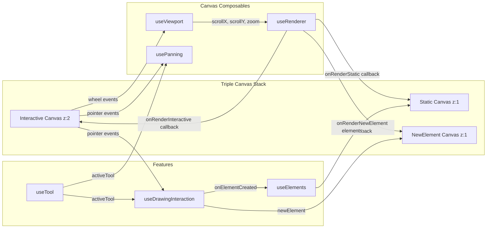
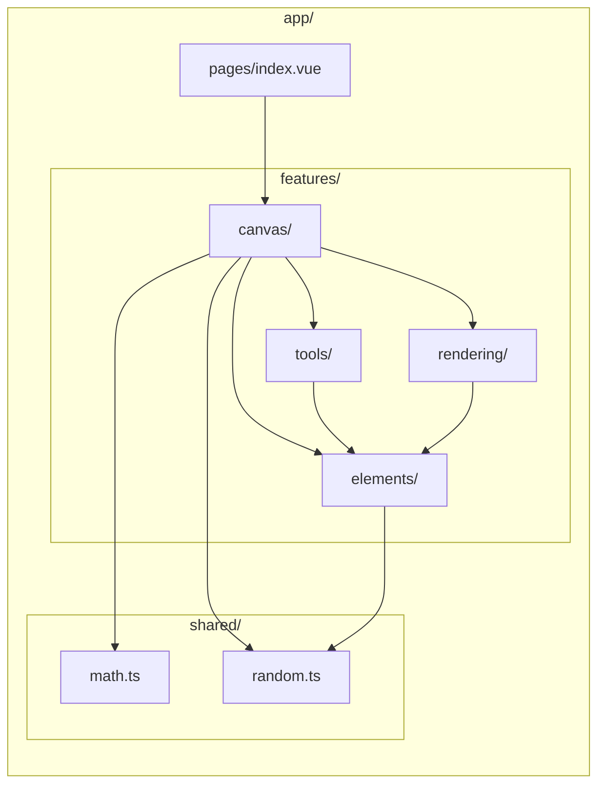
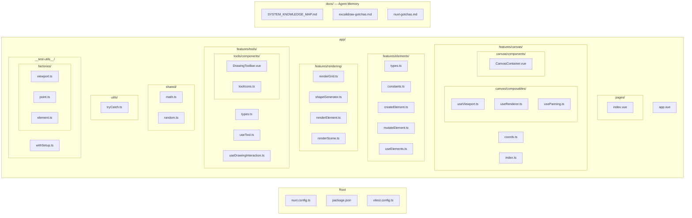

# System Knowledge Map

## Architecture Overview

```mermaid
graph TD
    A[Nuxt 4 SPA Shell] --> B[Vue 3 Pages]
    B --> C[CanvasContainer.vue]
    C --> D[Triple Canvas Stack]
    D --> E1[Static Canvas - grid + elements]
    D --> E2[NewElement Canvas - in-progress shape]
    D --> E3[Interactive Canvas - selection UI + events]

    C --> F[Canvas Composables]
    F --> F1[useViewport - pan/zoom/coords]
    F --> F2[useRenderer - RAF loop + dirty flags + callbacks]

    C --> EL[Elements Feature]
    EL --> EL1[useElements - reactive element array]
    EL --> EL2[createElement - factory with defaults]
    EL --> EL3[mutateElement - in-place mutation + version bump]

    C --> RN[Rendering Feature]
    RN --> RN1[renderGrid - dot grid with zoom fade]
    RN --> RN2[shapeGenerator - roughjs Drawables + cache]
    RN --> RN3[renderElement / renderScene]

    C --> TL[Tools Feature]
    TL --> TL1[useTool - active tool + keyboard shortcuts]
    TL --> TL2[useDrawingInteraction - pointer → shape]
    TL --> TL3[DrawingToolbar.vue - tool selection UI]

    A --> G[shared/]
    G --> G1[math.ts - Point, distance, clamp, lerp]
    G --> G2[random.ts - nanoid, randomInteger]

    style C fill:#f9a825,color:#000
    style D fill:#ef6c00,color:#fff
    style F fill:#1565c0,color:#fff
    style EL fill:#2e7d32,color:#fff
    style RN fill:#6a1b9a,color:#fff
    style TL fill:#c62828,color:#fff
```

## Canvas Architecture

## Render Pipeline

## Shape Drawing Flow (Phase 2)

## Feature-Based Architecture

### Import Rules

1. **Pages** can import from **features** (pages are top-level orchestrators)
2. **Features** can import from **shared** (zero-dependency utilities)
3. **Features** can import from **other features** (canvas orchestrates elements, rendering, tools)
4. **shared/** imports from nothing — it is dependency-free
5. **components/** and **composables/** (top-level) cannot import from **features/**

## Key Architectural Decisions

| Decision | Choice | Rationale |
|----------|--------|-----------|
| Rendering | Native Canvas 2D + roughjs | Hand-drawn aesthetic, Excalidraw format compat |
| Canvas layers | Triple canvas (static/new-element/interactive) | Avoid re-rendering all elements during draw |
| State management | Composables + shallowRef (no Pinia) | Canvas apps need raw performance, no Proxy overhead |
| Reactivity | shallowRef + markRaw for DOM/Canvas/RoughCanvas APIs | Never proxy CanvasRenderingContext2D or RoughCanvas |
| SSR | Disabled (ssr: false) | Canvas API is browser-only |
| Render loop | useRafFn + dirty flags + configurable callbacks | Only re-render when state changes; renderer stays generic |
| HiDPI | devicePixelRatio scaling in bootstrapCanvas | Crisp rendering on Retina displays |
| Coordinate system | screenToScene / sceneToScreen pure functions | Clean separation of screen vs scene space |
| Auto-imports | Disabled (`imports: { autoImport: false }`) | Explicit imports improve IDE support, make files self-documenting, fix Vitest node-mode compat |
| Testing | Vitest (node + browser projects) | 60% unit / 30% integration / 10% visual — canvas apps need more unit tests |
| Test style | Flat tests + `using` disposable | No shared mutable state, automatic cleanup (see `docs/testing-conventions.md`) |
| Element mutation | In-place mutateElement + versionNonce bump | Performance: called every pointermove during draw |
| Shape cache | Map keyed by id, invalidated by versionNonce | Avoid regenerating roughjs Drawables every frame |
| roughjs integration | RoughGenerator (headless, testable) + RoughCanvas (render) | Generator works in Node tests; RoughCanvas created per canvas in onMounted |
| Tool shortcuts | useMagicKeys + useActiveElement typing guard | Simple keyboard shortcuts, safe when typing in inputs |

## Testing Architecture

### Testing Pyramid (Canvas App)

| Layer | Target % | What | How |
|-------|---------|------|-----|
| Unit (node) | 60% | Pure functions, composables | `*.unit.test.ts`, fast, no DOM |
| Integration (browser) | 30% | Event wiring, DOM classes, component mounting | `*.browser.test.ts`, real Chromium |
| Visual | 10% | Canvas pixel output | Future: screenshot comparison |

### Naming Conventions

- `app/shared/math.unit.test.ts` — co-located unit test
- `app/features/canvas/components/CanvasContainer.browser.test.ts` — co-located browser test
- `app/__test-utils__/` — shared helpers and factories

### Key Decisions

- **No `@nuxt/test-utils`** — overkill for SPA with no SSR
- **No jsdom/happy-dom** — unit tests run in node (pure functions), browser tests use real Chromium
- **`withSetup` returns `T & Disposable`** — use with `using` keyword for automatic `effectScope` cleanup (see `docs/testing-conventions.md`)
- **Test files excluded from `nuxi typecheck`** via `typescript.tsConfig.exclude` in nuxt config
- **Vitest globals enabled** — `describe`, `it`, `expect` available without imports

## File Map

## Technology Stack

| Layer | Technology | Purpose |
|-------|-----------|---------|
| Framework | Nuxt 4 (SPA) | Shell, routing (auto-imports disabled) |
| UI | Vue 3.5+ | Composition API, shallowRef |
| Styling | Tailwind CSS 4 | UI layout (not canvas) |
| Canvas shapes | roughjs | Hand-drawn rendering |
| Freedraw | perfect-freehand | Pressure-sensitive strokes (Phase 4+) |
| Composables | VueUse | Events, RAF, element size, magic keys |
| IDs | nanoid | Element ID generation |
| Math | shared/math.ts | Point/vector utilities |

> **Note:** This map reflects the current state after Phase 2 (Shape Drawing). Update when new features/directories are added.
