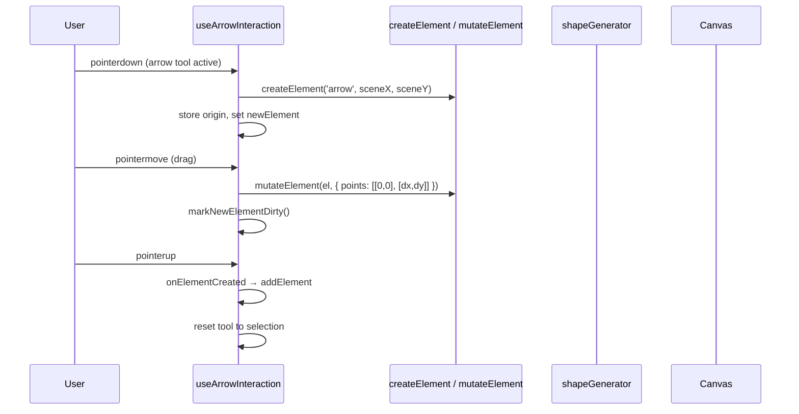
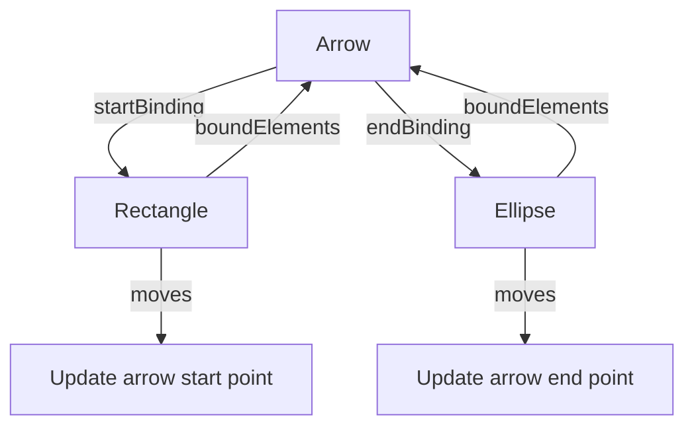

# Arrow Tool Spec

## How Excalidraw Does It

Excalidraw has a sophisticated arrow system built on a `ExcalidrawLinearElement` base (shared with the line tool) extended by `ExcalidrawArrowElement`. Key aspects:

- **Points-based model** — arrows store a `points: LocalPoint[]` array (not width/height). First point is always `[0,0]`, all others are relative offsets from `element.x, element.y`.
- **Three routing modes** — straight (default), curved (roughjs `generator.curve()`), elbow (A* pathfinding for orthogonal routes).
- **Binding system** — arrows can bind to shapes via `startBinding`/`endBinding` objects. When a bound shape moves, the arrow endpoint follows. Uses ratio-based positioning `[0.0–1.0, 0.0–1.0]` on the bound shape.
- **Arrowhead styles** — 11 types (arrow, bar, circle, triangle, diamond, crowfoot variants, plus outline variants). Arrowhead angle derived from cubic Bezier sampling.
- **`LinearElementEditor`** — a stateful class managing the entire arrow lifecycle (creation, point editing, endpoint dragging, multi-point insertion).
- **Rendering** — roughjs `generator.linearPath()` for straight, `generator.curve()` for curved. Arrowheads rendered as separate polygons/circles/lines.
- **Hit testing** — point-to-line-segment distance with zoom-scaled threshold.

### What We Take, What We Simplify

Excalidraw's arrow system is ~5000 LOC across binding, elbow routing, focus points, and fixed segments. We start much simpler and layer complexity in phases.

---

## Our Implementation Plan

### Phase 1: Basic Straight Arrow (MVP) — DONE

**Goal:** Click-drag to create a straight arrow with a single arrowhead at the end. Selectable, movable, deletable.



#### 1a. Element Type

**File: `app/features/elements/types.ts`**

```ts
type ArrowheadType = 'arrow' | 'triangle' | 'none'

interface ExcalidrawArrowElement extends ExcalidrawElementBase {
  readonly type: 'arrow'
  /** Relative points — first is always [0,0], rest are offsets from element.x/y */
  points: readonly Point[]
  startArrowhead: ArrowheadType | null
  endArrowhead: ArrowheadType
}
```

- `points` replaces `width`/`height` as the primary geometry. For Phase 1 it's always a 2-point array: `[[0,0], [endX - startX, endY - startY]]`.
- `x`/`y` on the base element = the start point position in scene coords.
- `width`/`height` are computed from the points bounding box (for AABB compatibility).
- `startArrowhead` defaults to `null` (no head), `endArrowhead` defaults to `'arrow'`.

Add `'arrow'` to `ExcalidrawElementType` union and `ExcalidrawElement` union.

#### 1b. Tool Registration

**File: `app/features/tools/types.ts`**

```ts
type LinearToolType = 'arrow' | 'line'  // future: line tool shares this
type DrawingToolType = 'rectangle' | 'ellipse' | 'diamond' | LinearToolType
```

Add `isLinearTool()` type guard to distinguish arrow/line from box-based tools.

**File: `app/features/tools/useTool.ts`**

- Add keyboard shortcut: `a` → arrow, `5` → arrow (number row).

**File: `app/features/tools/components/toolIcons.ts`**

- Add arrow SVG icon (diagonal line with arrowhead).

#### 1c. Drawing Interaction

**File: `app/features/tools/useDrawingInteraction.ts`**

The current interaction assumes box-based drawing (origin + width/height). Arrows need point-based drawing. Two approaches:

**Chosen approach:** Branch inside `useDrawingInteraction` based on `isLinearTool()`:

- **pointerdown** — same as now but call `createElement('arrow', ...)` with `points: [[0,0]]`.
- **pointermove** — instead of computing `{x, y, width, height}`, compute the endpoint offset `[dx, dy]` from origin. If `shiftKey`, snap angle to nearest 15° increment. Call `mutateElement(el, { points: [createPoint(0,0), createPoint(dx, dy)], width: ..., height: ... })` where width/height are derived from the points AABB (needed for bounds compatibility).
- **pointerup** — same as now. Minimum size check uses `distance(start, end) > 2` instead of `width > 1 || height > 1`.

```ts
// Angle snapping for shift-constrained arrows
function snapAngle(dx: number, dy: number): Point {
  const angle = Math.atan2(dy, dx)
  const snapped = Math.round(angle / (Math.PI / 12)) * (Math.PI / 12) // 15° steps
  const length = Math.hypot(dx, dy)
  return { x: Math.cos(snapped) * length, y: Math.sin(snapped) * length }
}
```

#### 1d. Rendering

**File: `app/features/rendering/shapeGenerator.ts`**

Add arrow case to `generateDrawable()`:

```ts
if (element.type === 'arrow') {
  const pts = element.points.map(p => [p.x, p.y] as [number, number])
  return generator.linearPath(pts, options)
}
```

**File: `app/features/rendering/renderElement.ts`**

After drawing the roughjs shaft, render the arrowhead with native Canvas 2D:

```ts
if (element.type === 'arrow') {
  const drawable = generateShape(element)
  rc.draw(drawable)
  renderArrowheads(ctx, element) // new function
}
```

**New file: `app/features/rendering/arrowhead.ts`**

```ts
function renderArrowheads(ctx: CanvasRenderingContext2D, element: ExcalidrawArrowElement): void {
  const points = element.points
  if (points.length < 2) return

  if (element.endArrowhead) {
    const tip = points[points.length - 1]
    const prev = points[points.length - 2]
    drawArrowhead(ctx, prev, tip, element.endArrowhead, element.strokeWidth, element.strokeColor)
  }

  if (element.startArrowhead) {
    const tip = points[0]
    const next = points[1]
    drawArrowhead(ctx, next, tip, element.startArrowhead, element.strokeWidth, element.strokeColor)
  }
}

function drawArrowhead(ctx, from: Point, tip: Point, style: ArrowheadType, strokeWidth: number, color: string): void {
  const angle = Math.atan2(tip.y - from.y, tip.x - from.x)
  const headLength = Math.max(10, strokeWidth * 4)
  const headAngle = Math.PI / 6 // 30°

  ctx.save()
  ctx.strokeStyle = color
  ctx.fillStyle = style === 'triangle' ? color : 'none'
  ctx.lineWidth = strokeWidth
  ctx.lineCap = 'round'
  ctx.lineJoin = 'round'

  if (style === 'arrow') {
    // Two lines forming a V
    ctx.beginPath()
    ctx.moveTo(tip.x - headLength * Math.cos(angle - headAngle), tip.y - headLength * Math.sin(angle - headAngle))
    ctx.lineTo(tip.x, tip.y)
    ctx.lineTo(tip.x - headLength * Math.cos(angle + headAngle), tip.y - headLength * Math.sin(angle + headAngle))
    ctx.stroke()
  }

  if (style === 'triangle') {
    // Filled triangle
    ctx.beginPath()
    ctx.moveTo(tip.x, tip.y)
    ctx.lineTo(tip.x - headLength * Math.cos(angle - headAngle), tip.y - headLength * Math.sin(angle - headAngle))
    ctx.lineTo(tip.x - headLength * Math.cos(angle + headAngle), tip.y - headLength * Math.sin(angle + headAngle))
    ctx.closePath()
    ctx.fill()
    ctx.stroke()
  }

  ctx.restore()
}
```

#### 1e. Hit Testing

**File: `app/features/selection/hitTest.ts`**

Add `hitTestArrow()` — reuses the existing `distanceToSegment()` helper:

```ts
if (element.type === 'arrow') return hitTestArrow(point, element, threshold)

function hitTestArrow(point: Point, el: ExcalidrawArrowElement, threshold: number): boolean {
  const pts = el.points.map(p => ({ x: p.x + el.x, y: p.y + el.y }))
  for (let i = 0; i < pts.length - 1; i++) {
    if (distanceToSegment(point, pts[i], pts[i + 1]) <= threshold) return true
  }
  return false
}
```

No rotation unrotation needed — arrows don't use the `angle` property (rotation is implicit in the points).

#### 1f. Bounds

**File: `app/features/selection/bounds.ts`**

Add arrow-specific bounds that derive from points:

```ts
if (element.type === 'arrow') {
  const xs = element.points.map(p => p.x + element.x)
  const ys = element.points.map(p => p.y + element.y)
  return [Math.min(...xs), Math.min(...ys), Math.max(...xs), Math.max(...ys)]
}
```

#### 1g. Selection & Manipulation

For Phase 1, arrows get:
- **Dragging** — works unchanged via `dragElements.ts` (updates `x`/`y`, points stay relative).
- **Delete** — works unchanged (sets `isDeleted`).
- **Selection border** — render a dashed bounding box around the arrow's AABB.
- **No 8-handle resize** — arrows should show **endpoint handles** instead (see Phase 2).

**File: `app/features/selection/transformHandles.ts`**

Add an early return for arrows — skip the 8-direction handles in Phase 1:

```ts
if (element.type === 'arrow') return {} // Phase 2 adds endpoint handles
```

#### 1h. createElement Update

**File: `app/features/elements/createElement.ts`**

Handle arrow type with default points and arrowhead:

```ts
if (type === 'arrow') {
  return {
    ...base,
    type: 'arrow',
    points: [createPoint(0, 0)],
    startArrowhead: null,
    endArrowhead: 'arrow',
  }
}
```

---

### Phase 2: Endpoint Handles & Resize — DONE

**Goal:** Select an arrow and drag its start/end points independently.

```mermaid
graph LR
    A[Selected Arrow] --> B[Start Handle ●]
    A --> C[End Handle ●]
    B -->|drag| D[Update points[0] + element.x/y]
    C -->|drag| E[Update points[last]]
```

#### Changes

- **`transformHandles.ts`** — for arrows, return two circular handles at the start/end point positions (scene coords) instead of 8 box handles.
- **`resizeElement.ts`** — for arrows, dragging the end handle updates `points[last]`. Dragging the start handle updates `element.x/y` and re-normalizes all other points (so `points[0]` stays `[0,0]`).
- **`renderInteractive.ts`** — render circular endpoint handles instead of square corner handles for arrows.
- **Cursor** — show `grab`/`grabbing` cursor when hovering/dragging endpoint handles.

---

### Phase 3: Multi-Point Arrows (Polyline) — DONE

**Goal:** Click multiple times to add intermediate waypoints before finishing.

#### Interaction Change

- **Single click** adds a point (doesn't finish the arrow).
- **Double-click** or **Enter** or **Escape** finishes the arrow.
- Points array grows: `[[0,0], [dx1,dy1], [dx2,dy2], ...]`.
- Hit testing already loops through all segments (Phase 1).
- roughjs `generator.linearPath()` already supports N points.

#### Mid-Point Insertion (stretch goal)

- When hovering the arrow shaft between two points, show a ghost handle.
- Clicking inserts a new point at that position.
- Same pattern Excalidraw uses with `LinearElementEditor`.

---

### Phase 4: Curved Arrows — TODO

**Goal:** Smooth Bezier curves instead of straight segments.

- Switch from `generator.linearPath()` to `generator.curve()` for curved mode.
- Add a `roundness` property to the arrow element (like Excalidraw).
- Arrowhead angle calculation changes — sample the Bezier curve at `t=0.3` to get the tangent direction.
- Hit testing switches from segment-distance to curve-sampling (subdivide Bezier into small segments, test each).

---

### Phase 5: Element Binding — DONE

**Goal:** Arrows snap to shapes and stay connected when shapes move. **Implemented** in `features/binding/`.



#### Binding Data Model (as implemented)

```ts
// elements/types.ts
interface FixedPointBinding {
  readonly elementId: string
  readonly fixedPoint: readonly [number, number]  // 0-1 ratio on shape bbox
}

// On ExcalidrawArrowElement:
startBinding: FixedPointBinding | null
endBinding: FixedPointBinding | null

// On ExcalidrawElementBase (all elements):
boundElements: readonly BoundElement[]  // { id: string; type: 'arrow' }
```

#### Binding Flow (implemented)

1. **During arrow drag** — `getHoveredElementForBinding()` detects shapes within `BASE_BINDING_DISTANCE` (15px).
2. **Snap indicator** — `renderSuggestedBinding()` draws a themed highlight outline on the target shape.
3. **On arrow finish** — `bindArrowToElement()` commits binding + back-references.
4. **On shape move/resize** — `updateBoundArrowEndpoints()` recalculates all bound arrow positions.
5. **On arrow endpoint drag** — re-check binding (snap to new shape or unbind).
6. **On shape/arrow delete** — `unbindArrow()` / `unbindAllArrowsFromShape()` clean up cross-references.

#### Perimeter Intersection (implemented in `proximity.ts`)

`distanceToShapeEdge()` per shape type + `computeFixedPoint()` / `getPointFromFixedPoint()` for coordinate conversion:
- **Rectangle** — project from center through ratio point to edge.
- **Ellipse** — parametric ellipse equation.
- **Diamond** — project to polygon edge.

---

### Phase 6: Elbow Arrows (Stretch) — TODO

Orthogonal routing with rounded corners. Excalidraw uses A* pathfinding on a grid — this is significant complexity (~1500 LOC). Only build if there's demand.

---

## Files Changed Per Phase

| Phase | New Files | Modified Files |
|-------|-----------|----------------|
| **1 (MVP)** | `rendering/arrowhead.ts` | `elements/types.ts`, `elements/createElement.ts`, `tools/types.ts`, `tools/useTool.ts`, `tools/useDrawingInteraction.ts`, `tools/components/toolIcons.ts`, `rendering/shapeGenerator.ts`, `rendering/renderElement.ts`, `selection/hitTest.ts`, `selection/bounds.ts`, `selection/transformHandles.ts` |
| **2 (Endpoints)** | — | `selection/transformHandles.ts`, `selection/resizeElement.ts`, `rendering/renderInteractive.ts` |
| **3 (Multi-point)** | — | `tools/useDrawingInteraction.ts` |
| **4 (Curves)** | — | `rendering/shapeGenerator.ts`, `rendering/arrowhead.ts`, `selection/hitTest.ts`, `elements/types.ts` |
| **5 (Binding)** | `features/binding/` (new feature dir) | `elements/types.ts`, `selection/dragElements.ts`, `selection/resizeElement.ts`, `tools/useDrawingInteraction.ts` |

## Open Questions (Resolved)

1. ~~**Line tool?**~~ **RESOLVED** — Line tool is now implemented (`type: 'line'`). Shares `ExcalidrawLinearElement` base with arrow. Created via `createElement('line', ...)` with `endArrowhead: null`. Added to toolbar as shortcut `8`. Lines don't bind to shapes (binding checks `isArrowElement()` before binding).
2. **Arrowhead picker UI** — Still TODO. No toolbar/properties panel for choosing arrowhead style yet. Only `'arrow'` (end) and `null` (start) are set by default.
3. **Bidirectional arrows** — Still TODO. `startArrowhead` is in the type but defaults to `null`. No UI to toggle.

## Implementation Notes (Updated 2026-02)

- **Types are re-exported from `@excalidraw/element/types`**, not custom-defined. The spec code snippets show simplified versions for illustration. The actual `ExcalidrawArrowElement`, `FixedPointBinding`, `Arrowhead`, etc. come from the official package.
- **`createElement.ts`** already sets `elbowed: false`, `strokeStyle: 'solid'`, `roundness: null`, and `groupIds: []` on all elements by default.
- **`useDrawingInteraction.ts`** handles arrow creation (not `useArrowInteraction` as shown in Phase 1 diagram).
- **Line tool** shares the same multi-point creation and linear editor infrastructure as arrows.
