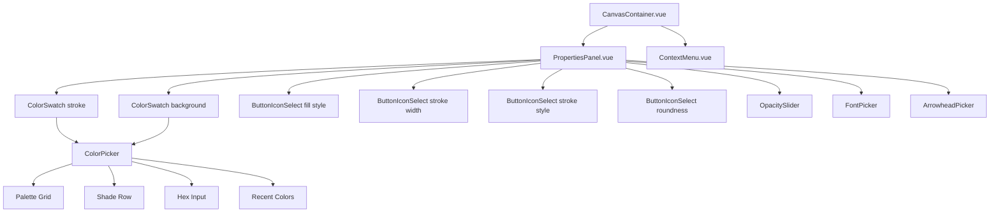
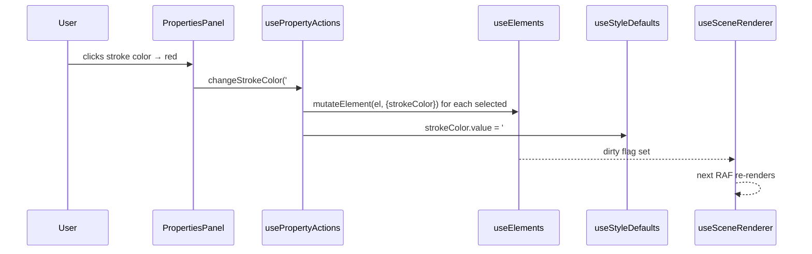
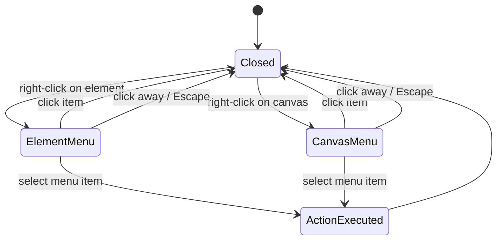
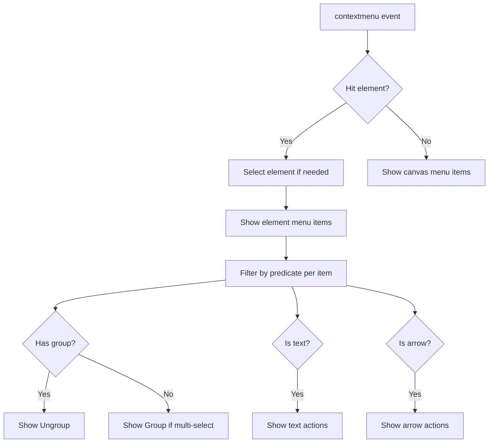

# Context Menu & Element Properties Panel — Tech Spec

> Right-click an element to access a context menu with structural actions (copy, paste, group, layer ordering, delete) and edit element styles through a properties panel (colors, stroke, fill, opacity, font, arrowheads).

## Status: Implemented

All 7 phases are complete. Tests: 52 unit tests across 4 test files.

| Phase | Status | Notes |
|-------|--------|-------|
| Phase 1: Style Defaults & Property Actions Core | Done | `useStyleDefaults` (14 refs), `usePropertyActions` (11 methods + getFormValue) |
| Phase 2: Properties Panel UI | Done | `PropertiesPanel.vue`, `ButtonIconSelect.vue`, `OpacitySlider.vue`, `ColorSwatch.vue` |
| Phase 3: Color Picker | Done | `ColorPicker.vue`, `palette.ts` with palette grid, hex input, recent colors, keyboard quick-pick (1-5) |
| Phase 4: Context Menu | Done | `useContextMenu`, `ContextMenu.vue`, `contextMenuItems.ts` with element + canvas menus |
| Phase 5: Copy/Paste Styles | Done | `useStyleClipboard` — Cmd+Alt+C / Cmd+Alt+V |
| Phase 6: Layer Ordering (Z-Index) | Done | `useLayerOrder` in elements/ — group-aware bringToFront/bringForward/sendBackward/sendToBack |
| Phase 7: Font & Arrowhead Pickers | Done | `FontPicker.vue` (Virgil/Helvetica/Cascadia), `ArrowheadPicker.vue` (6 types with SVG icons) |

### Remaining stubs

The following context menu actions are wired up with placeholder stubs (no-ops or console warnings) and will need real implementations when their underlying features are built:

- **Clipboard actions**: Cut, Copy, Paste (element and canvas menus) — needs a `useClipboard` composable
- **Flip horizontal / Flip vertical** — needs flip transform logic in elements/
- **Select all** (canvas menu) — needs a select-all method on `useSelection`
- **Toggle grid** (canvas menu) — needs grid visibility state in canvas/

---

## Table of Contents

1. [How Excalidraw Does It](#1-how-excalidraw-does-it)
2. [Our Adaptation Plan](#2-our-adaptation-plan)
3. [Component Architecture](#3-component-architecture)
4. [Composables](#4-composables)
5. [Action/Command System](#5-actioncommand-system)
6. [State Management](#6-state-management)
7. [Color Palette](#7-color-palette)
8. [Context Menu Items](#8-context-menu-items)
9. [Properties Panel Controls](#9-properties-panel-controls)
10. [Keyboard Shortcuts](#10-keyboard-shortcuts)
11. [Implementation Phases](#11-implementation-phases)
12. [Diagrams](#12-diagrams)

---

## 1. How Excalidraw Does It

### Key Insight: Two Separate Systems

Excalidraw keeps **context menu** and **property editing** as two distinct UIs:

| Concern | UI | Where |
|---------|-----|-------|
| Structural actions (copy, paste, delete, group, layer order) | **Context Menu** — right-click popup | `components/ContextMenu.tsx` + `contextMenu.ts` |
| Style editing (colors, stroke, fill, opacity, font) | **Properties Panel** — top toolbar | `actions/actionProperties.tsx` + `components/ColorPicker/` |

Both are powered by the same **action system** (`ActionManager` + registered `Action` objects).

### Excalidraw's Action Pattern

Every user-facing operation is an `Action`:

```
Action = {
  name: string
  perform(elements, appState, value) → { elements, appState, storeAction }
  PanelComponent? → React UI control
  keyTest? → keyboard shortcut
  predicate? → enable/disable
  contextItemPredicate? → show/hide in context menu
}
```

The `ActionManager` orchestrates: register actions → render their UI → dispatch `perform` → update state → trigger re-render.

### Context Menu Flow

```
contextmenu event on canvas
  → hit-test: element or empty canvas?
  → select element (if not already)
  → show menu at cursor position
  → filter items by contextItemPredicate
  → on click: actionManager.executeAction(action)
  → close menu
```

### Property Panel Flow

```
elements selected → show properties toolbar
  → for each style action: render PanelComponent
  → user interacts (e.g., picks color)
  → updateData(value) → executeAction(action, value)
  → action.perform:
      1. changeProperty(selectedElements, callback) → newElementWith(el, updates)
      2. update appState.currentItem* (sticky defaults)
      3. return StoreAction.CAPTURE (undo/redo)
  → re-render canvas
```

### Element Mutation: Two Patterns

| Pattern | When | How |
|---------|------|-----|
| `newElementWith(el, updates)` | Committed changes (action performs, undo) | Immutable copy, bumps version |
| `mutateElement(el, updates)` | Interactive/in-progress (drag, resize) | In-place mutation, bumps version |

We already have both in `app/features/elements/mutateElement.ts`.

---

## 2. Our Adaptation Plan

### Design Decisions

1. **Two new features**: `app/features/context-menu/` and `app/features/properties/`
2. **Command pattern via composable**, not a class-based ActionManager — idiomatic Vue
3. **Context menu** is a Teleported overlay positioned at pointer coords
4. **Properties panel** is a horizontal toolbar below the drawing toolbar (or inline at top)
5. **Sticky defaults** stored in a `useStyleDefaults` composable with `createGlobalState`
6. **Color picker** is a popover component with palette grid + shade slider + hex input + recents
7. **All changes go through the existing `mutateElement` / element replacement pipeline**
8. **Undo/redo integration** — property changes captured in history (future feature, noted here)

### What We Already Have

| Existing | Used By |
|----------|---------|
| `mutateElement(el, updates)` | elements/ — in-place mutation with version bump |
| `useElements()` → `replaceElement()` | elements/ — immutable element replacement |
| `useSelection()` → `selectedElements` | selection/ — current selection |
| `useToolStore()` | tools/ — active tool state |
| Element types with all style properties | elements/types.ts — re-exported from @excalidraw/element |
| Default constants | elements/constants.ts — stroke, fill, opacity, font defaults |

### What We Need to Build

| New Module | Contents |
|------------|----------|
| `features/context-menu/` | `ContextMenu.vue`, `useContextMenu.ts`, menu item definitions |
| `features/properties/` | `PropertiesPanel.vue`, `ColorPicker.vue`, `ButtonIconSelect.vue`, `OpacitySlider.vue`, `usePropertyActions.ts`, `useStyleDefaults.ts` |

---

## 3. Component Architecture

### Context Menu

```
features/context-menu/
  ├── components/
  │   └── ContextMenu.vue          # Teleported overlay, positioned at pointer
  ├── composables/
  │   └── useContextMenu.ts        # open/close state, position, filtered items
  ├── contextMenuItems.ts          # Item definitions per context type
  ├── types.ts                     # ContextMenuItem, ContextMenuType
  └── index.ts
```

**ContextMenu.vue** structure:
```
<Teleport to="body">
  <div v-if="isOpen" class="context-menu" :style="positionStyle">
    <template v-for="item in filteredItems">
      <hr v-if="item === 'separator'" />
      <button v-else @click="item.action" class="context-menu-option">
        <component v-if="item.icon" :is="item.icon" />
        <span>{{ item.label }}</span>
        <kbd v-if="item.shortcut">{{ item.shortcut }}</kbd>
      </button>
    </template>
  </div>
</Teleport>
```

### Properties Panel

```
features/properties/
  ├── components/
  │   ├── PropertiesPanel.vue       # Horizontal toolbar, shown when elements selected
  │   ├── ColorPicker.vue           # Full color picker (palette + shades + hex + recents)
  │   ├── ColorSwatch.vue           # Single color button that opens ColorPicker
  │   ├── ButtonIconSelect.vue      # Icon button group (stroke width, fill style, etc.)
  │   ├── OpacitySlider.vue         # 0–100 range slider
  │   ├── FontPicker.vue            # Font family selector
  │   └── ArrowheadPicker.vue       # Start/end arrowhead selector
  ├── composables/
  │   ├── usePropertyActions.ts     # Dispatches property changes to selected elements
  │   └── useStyleDefaults.ts       # Sticky currentItem* defaults (createGlobalState)
  ├── palette.ts                    # Color palette constants (light/dark)
  ├── types.ts                      # PropertyAction, StyleProperty types
  └── index.ts
```

**PropertiesPanel.vue** renders (conditionally based on selected element types):
```
PropertiesPanel
  ├── ColorSwatch (stroke color)     → opens ColorPicker
  ├── ColorSwatch (background color) → opens ColorPicker
  ├── ButtonIconSelect (fill style)  — hachure | cross-hatch | solid
  ├── ButtonIconSelect (stroke width) — thin(1) | bold(2) | extra-bold(4)
  ├── ButtonIconSelect (stroke style) — solid | dashed | dotted
  ├── ButtonIconSelect (edge roundness) — sharp | round
  ├── OpacitySlider (0–100)
  ├── [if text] FontPicker + font size + text align
  ├── [if arrow] ArrowheadPicker (start/end)
  └── [if arrow] ButtonIconSelect (arrow type) — sharp | round | elbow
```

---

## 4. Composables

### `useContextMenu(options)`

```ts
type UseContextMenuOptions = {
  elements: Ref<readonly ExcalidrawElement[]>
  selectedIds: Ref<ReadonlySet<string>>
  onAction: (action: string, payload?: unknown) => void
}

// Returns:
{
  isOpen: Ref<boolean>
  position: Ref<{ x: number; y: number }>
  menuType: Ref<'element' | 'canvas'>
  filteredItems: ComputedRef<ContextMenuItem[]>
  open(event: PointerEvent, type: 'element' | 'canvas'): void
  close(): void
}
```

### `usePropertyActions(options)`

```ts
type UsePropertyActionsOptions = {
  elements: ReturnType<typeof useElements>
  selection: ReturnType<typeof useSelection>
  styleDefaults: ReturnType<typeof useStyleDefaults>
}

// Returns:
{
  changeStrokeColor(color: string): void
  changeBackgroundColor(color: string): void
  changeFillStyle(style: FillStyle): void
  changeStrokeWidth(width: number): void
  changeStrokeStyle(style: StrokeStyle): void
  changeOpacity(opacity: number): void
  changeRoundness(type: 'sharp' | 'round'): void
  changeFontFamily(family: number): void
  changeFontSize(size: number): void
  changeTextAlign(align: TextAlign): void
  changeArrowhead(end: 'start' | 'end', type: Arrowhead | null): void

  // For mixed-value detection
  getFormValue<T>(property: string, fallback: T): T | 'mixed'
}
```

Each method:
1. Iterates selected elements
2. Calls `mutateElement(el, { [property]: value })` or replaces via `replaceElement`
3. Updates `styleDefaults` (sticky)
4. Marks dirty flags for re-render

### `useStyleDefaults()`

```ts
// createGlobalState — singleton, survives component unmount
const useStyleDefaults = createGlobalState(() => {
  const strokeColor = ref(DEFAULT_STROKE_COLOR)
  const backgroundColor = ref(DEFAULT_BG_COLOR)
  const fillStyle = ref<FillStyle>(DEFAULT_FILL_STYLE)
  const strokeWidth = ref(DEFAULT_STROKE_WIDTH)
  const strokeStyle = ref<StrokeStyle>('solid')
  const opacity = ref(DEFAULT_OPACITY)
  const roughness = ref(DEFAULT_ROUGHNESS)
  const roundness = ref<'sharp' | 'round'>('round')
  const fontFamily = ref(DEFAULT_FONT_FAMILY)
  const fontSize = ref(DEFAULT_FONT_SIZE)
  const textAlign = ref<TextAlign>(DEFAULT_TEXT_ALIGN)
  const startArrowhead = ref<Arrowhead | null>(null)
  const endArrowhead = ref<Arrowhead | null>('arrow')

  return {
    strokeColor, backgroundColor, fillStyle, strokeWidth,
    strokeStyle, opacity, roughness, roundness,
    fontFamily, fontSize, textAlign, startArrowhead, endArrowhead,
  }
})
```

---

## 5. Action/Command System

We do NOT build a class-based ActionManager. Instead, each action is a function in `usePropertyActions` that:

1. Gets selected elements from `useSelection`
2. Applies the change via `mutateElement` (for each selected element)
3. Updates `useStyleDefaults` (sticky defaults for next created element)
4. Triggers canvas dirty flag

**Context menu actions** (copy, paste, delete, group, etc.) are simpler — they call existing composable methods directly:

```ts
const contextMenuActions = {
  copy: () => clipboard.copy(selectedElements.value),
  paste: () => clipboard.paste(),
  delete: () => elements.removeElements(selectedIds.value),
  duplicate: () => elements.duplicateElements(selectedIds.value),
  group: () => groups.groupSelected(),
  ungroup: () => groups.ungroupSelected(),
  bringToFront: () => elements.reorder(selectedIds.value, 'front'),
  sendToBack: () => elements.reorder(selectedIds.value, 'back'),
  // etc.
}
```

---

## 6. State Management

### Style Defaults (Sticky Behavior)

When a user changes a style on selected elements, the default for that property updates. Next element drawn uses the new default.

```
User changes stroke color to red on selected rectangle
  → mutateElement(rect, { strokeColor: '#fa5252' })
  → styleDefaults.strokeColor.value = '#fa5252'
  → User draws new rectangle → createElement uses styleDefaults → red stroke
```

### Mixed Values

When multiple elements are selected with different values for a property:

```ts
function getFormValue<T>(elements: ExcalidrawElement[], property: string, fallback: T): T | 'mixed' {
  const values = new Set(elements.map(el => el[property]))
  if (values.size === 0) return fallback
  if (values.size === 1) return [...values][0] as T
  return 'mixed'
}
```

UI shows mixed state: empty color swatch, no icon highlighted, etc.

---

## 7. Color Palette

### Base Colors (10 colors, 5 shades each)

```ts
const COLOR_PALETTE = {
  transparent: 'transparent',
  black: '#1e1e1e',
  white: '#ffffff',

  // [shade0=lightest, shade1, shade2, shade3, shade4=darkest]
  red:    ['#ffc9c9', '#ffa8a8', '#ff8787', '#ff6b6b', '#fa5252'],
  pink:   ['#eebefa', '#e599f7', '#da77f2', '#cc5de8', '#be4bdb'],
  grape:  ['#d0bfff', '#b197fc', '#9775fa', '#845ef7', '#7950f2'],
  violet: ['#b4d0fe', '#91a7ff', '#748ffc', '#5c7cfa', '#4c6ef5'],
  blue:   ['#a5d8ff', '#74c0fc', '#4dabf7', '#339af0', '#228be6'],
  cyan:   ['#99e9f2', '#66d9e8', '#3bc9db', '#22b8cf', '#15aabf'],
  teal:   ['#96f2d7', '#63e6be', '#38d9a9', '#20c997', '#12b886'],
  green:  ['#b2f2bb', '#8ce99a', '#69db7c', '#51cf66', '#40c057'],
  yellow: ['#ffec99', '#ffe066', '#ffd43b', '#fcc419', '#fab005'],
  orange: ['#ffd8a8', '#ffc078', '#ffa94d', '#ff922b', '#fd7e14'],
} as const
```

### Dark Theme Palette

Separate set of shades optimized for dark backgrounds. We derive these using our existing `theme/` feature's `useTheme` to switch palettes.

### Recent/Custom Colors

Store up to 10 recently used custom colors (hex values not in the palette) in `useStyleDefaults`. Shown at the bottom of the color picker.

---

## 8. Context Menu Items

### Element Context (right-click on element)

| Item | Shortcut | Action |
|------|----------|--------|
| Cut | Cmd+X | Cut to clipboard |
| Copy | Cmd+C | Copy to clipboard |
| Paste | Cmd+V | Paste from clipboard |
| — separator — | | |
| Copy styles | Cmd+Alt+C | Copy all styles from element |
| Paste styles | Cmd+Alt+V | Paste styles to selected elements |
| — separator — | | |
| Duplicate | Cmd+D | Duplicate selected |
| Delete | Backspace / Del | Delete selected |
| — separator — | | |
| Bring to front | Cmd+Shift+] | Move to top of z-order |
| Bring forward | Cmd+] | Move up one layer |
| Send backward | Cmd+[ | Move down one layer |
| Send to back | Cmd+Shift+[ | Move to bottom of z-order |
| — separator — | | |
| Group | Cmd+G | Group selected elements |
| Ungroup | Cmd+Shift+G | Ungroup selected group |
| — separator — | | |
| Flip horizontal | Shift+H | Mirror horizontally |
| Flip vertical | Shift+V | Mirror vertically |

### Canvas Context (right-click on empty canvas)

| Item | Shortcut | Action |
|------|----------|--------|
| Paste | Cmd+V | Paste from clipboard |
| Select all | Cmd+A | Select all elements |
| — separator — | | |
| Toggle grid | Cmd+' | Show/hide grid |

---

## 9. Properties Panel Controls

### Always Shown (when elements selected)

| Control | Type | Values | Maps To |
|---------|------|--------|---------|
| Stroke color | ColorSwatch → ColorPicker | Any CSS color | `strokeColor` |
| Background color | ColorSwatch → ColorPicker | Any CSS color | `backgroundColor` |
| Fill style | ButtonIconSelect | hachure, cross-hatch, solid | `fillStyle` |
| Stroke width | ButtonIconSelect | thin(1), bold(2), extra-bold(4) | `strokeWidth` |
| Stroke style | ButtonIconSelect | solid, dashed, dotted | `strokeStyle` |
| Edge roundness | ButtonIconSelect | sharp, round | `roundness` |
| Opacity | Range slider | 0–100 | `opacity` |

### Text-Specific (when text element selected)

| Control | Type | Values | Maps To |
|---------|------|--------|---------|
| Font family | FontPicker dropdown | Virgil, Helvetica, Cascadia, etc. | `fontFamily` |
| Font size | Number input | any number, common: 16, 20, 24, 28, 36 | `fontSize` |
| Text align | ButtonIconSelect | left, center, right | `textAlign` |

### Arrow-Specific (when arrow element selected)

| Control | Type | Values | Maps To |
|---------|------|--------|---------|
| Start arrowhead | ArrowheadPicker | none, arrow, bar, dot, triangle, diamond | `startArrowhead` |
| End arrowhead | ArrowheadPicker | none, arrow, bar, dot, triangle, diamond | `endArrowhead` |

---

## 10. Keyboard Shortcuts

### Color Quick-Pick (when ColorPicker open)

| Key | Action |
|-----|--------|
| 1 | Select 1st top-pick color |
| 2 | Select 2nd top-pick color |
| 3 | Select 3rd top-pick color |
| 4 | Select 4th top-pick color |
| 5 | Select 5th top-pick color |
| Escape | Close color picker |

### Property Shortcuts (when elements selected)

These are future candidates — not required for v1:

| Key | Action |
|-----|--------|
| Cmd+Alt+C | Copy styles |
| Cmd+Alt+V | Paste styles |

---

## 11. Implementation Phases

### Phase 1: Style Defaults & Property Actions Core

**Files:** `features/properties/composables/useStyleDefaults.ts`, `features/properties/composables/usePropertyActions.ts`

- `useStyleDefaults` with all currentItem* refs
- `usePropertyActions` with all change* methods
- Wire `createElement` to read from `useStyleDefaults` instead of hardcoded constants
- Unit tests for all property change functions

### Phase 2: Properties Panel UI

**Files:** `features/properties/components/PropertiesPanel.vue`, `ButtonIconSelect.vue`, `OpacitySlider.vue`, `ColorSwatch.vue`

- `PropertiesPanel.vue` with all non-color controls
- `ButtonIconSelect.vue` — generic icon button group
- `OpacitySlider.vue` — range input with label
- `ColorSwatch.vue` — clickable color preview button
- Wire into `CanvasContainer.vue` (show when selection is non-empty)
- Conditional sections for text/arrow elements

### Phase 3: Color Picker

**Files:** `features/properties/components/ColorPicker.vue`, `features/properties/palette.ts`

- Color palette constants (light + dark)
- `ColorPicker.vue` — popover with palette grid, shade row, hex input, recent colors
- Keyboard shortcuts for quick-pick (1–5)
- Theme-aware palette switching via `useTheme`

### Phase 4: Context Menu

**Files:** `features/context-menu/` (all files)

- `useContextMenu.ts` — open/close, position, item filtering
- `ContextMenu.vue` — Teleported overlay
- `contextMenuItems.ts` — element and canvas item definitions
- Wire `contextmenu` event handler in `CanvasContainer.vue`
- Close on click-away, Escape, or scroll

### Phase 5: Copy/Paste Styles

- `actionCopyStyles` — snapshot all style props from first selected element
- `actionPasteStyles` — apply snapshot to all selected elements
- Context menu items + keyboard shortcuts (Cmd+Alt+C / Cmd+Alt+V)

### Phase 6: Layer Ordering (Z-Index)

- `bringToFront`, `bringForward`, `sendBackward`, `sendToBack` in `useElements`
- Context menu items + keyboard shortcuts
- Respect group ordering (elements in a group stay adjacent)

### Phase 7: Font & Arrowhead Pickers

- `FontPicker.vue` — dropdown with font previews
- `ArrowheadPicker.vue` — icon buttons for start/end arrowhead types
- Wire into `PropertiesPanel.vue` conditional sections

---

## 12. Diagrams

### Component Hierarchy



### Data Flow: Property Change



### Context Menu Flow



### Context Menu Item Filtering



---

## Notes

- **No class-based ActionManager** — we use composables and direct function calls. Simpler, more Vue-idiomatic, easier to tree-shake.
- **Undo/redo** is not in scope for this spec. When we add history, property changes will need to create snapshots before mutation. The `mutateElement` function already bumps versions, which history can track.
- **Clipboard** (cut/copy/paste) for context menu depends on a future `useClipboard` composable. Phase 4 can stub these items initially.
- **Bound text** — when changing properties on a shape with bound text, some properties (strokeColor, opacity) should propagate to the bound text element. Handle in `usePropertyActions`.
