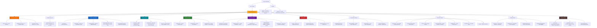

# Architecture Overview

Full dependency graph from Nuxt shell down to individual composables and features.

```mermaid
graph TD
    A[Nuxt 4 SPA Shell] --> B[Vue 3 Pages]
    B --> C[CanvasContainer.vue]
    C --> D[Triple Canvas Stack]
    D --> E1[Static Canvas - grid + elements]
    D --> E2[NewElement Canvas - in-progress shape]
    D --> E3[Interactive Canvas - selection UI + events]

    C --> CL[Canvas Layer Init]
    CL --> CL1[useCanvasLayers - 2D contexts + RoughCanvas on mount]

    C --> F[Canvas Composables]
    F --> F1[useViewport - pan/zoom/coords]
    F --> F2[useRenderer - RAF loop + dirty flags per layer]
    F --> F3[createDirtyFlags - deferred callback binding]
    F --> F4[useSceneRenderer - wires render callbacks to domain state]
    F --> F5[useAnimationController - keyed RAF animations]

    C --> TH[Theme Feature]
    TH --> TH1[useTheme - global light/dark state + Alt+Shift+D toggle]
    TH --> TH2[resolveColor - dark mode color transform via invert+hue-rotate]
    TH --> TH3[colors.ts - tinycolor2 CSS filter emulation + cache]

    C --> EL[Elements Feature]
    EL --> EL1[useElements - reactive element array]
    EL --> EL2[createElement - factory with defaults]
    EL --> EL3[mutateElement - in-place mutation + version bump]

    C --> RN[Rendering Feature]
    RN --> RN1[renderGrid - dot grid with zoom fade, theme-aware]
    RN --> RN2[shapeGenerator - roughjs Drawables + cache]
    RN --> RN3[renderElement / renderScene - theme-aware]
    RN --> RN4[renderInteractive - selection borders + handles + marquee + groups]
    RN --> RN5[arrowhead.ts - Canvas 2D arrowhead rendering]

    C --> TL[Tools Feature]
    TL --> TL1[useTool - active tool + keyboard shortcuts]
    TL --> TL2[useDrawingInteraction - pointer to shape/arrow]
    TL --> TL3[DrawingToolbar.vue - tool selection UI]

    C --> LE[Linear Editor Feature]
    LE --> LE1[useMultiPointCreation - click-to-place mode]
    LE --> LE2[useLinearEditor - double-click to edit points]
    LE --> LE3[pointHandles.ts - pure point manipulation]
    LE --> LE4[renderLinearEditor.ts - handles + rubber-band]

    C --> SL[Selection Feature]
    SL --> SL1[useSelection - selectedIds + computed bounds]
    SL --> SL2[useSelectionInteraction - state machine]
    SL --> SL3[hitTest - point-in-shape collision]
    SL --> SL4[transformHandles - handle positions + detection]
    SL --> SL5[dragElements - origin-based move]
    SL --> SL6[resizeElement - per-handle resize]
    SL --> SL7[bounds - AABB calculations]

    C --> BN[Binding Feature]
    BN --> BN1[proximity.ts - shape edge distance + fixedPoint]
    BN --> BN2[bindUnbind.ts - bind/unbind arrow endpoints]
    BN --> BN3[updateBoundPoints.ts - recalc on move/resize]
    BN --> BN4[renderBindingHighlight.ts - blue highlight]

    C --> GR[Groups Feature]
    GR --> GR1[useGroups - group/ungroup selection, Cmd+G / Cmd+Shift+G]
    GR --> GR2[groupUtils.ts - pure functions: expand, reorder, cleanup]
    GR --> GR3[cleanupAfterDelete - remove orphan groups]

    A --> G[shared/]
    G --> G1[math.ts - Point, Box, distance, clamp, lerp, TWO_PI]
    G --> G2[random.ts - nanoid, randomInteger, generateId]

    style C fill:#f9a825,color:#000
    style D fill:#ef6c00,color:#fff
    style F fill:#1565c0,color:#fff
    style EL fill:#2e7d32,color:#fff
    style RN fill:#6a1b9a,color:#fff
    style TL fill:#c62828,color:#fff
    style TH fill:#00838f,color:#fff
    style GR fill:#4e342e,color:#fff
```
