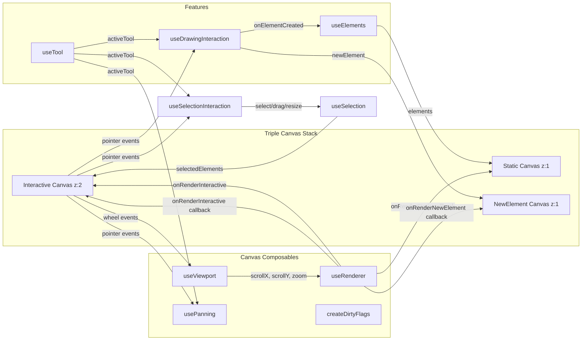

# Canvas Architecture

Data flow between the triple canvas stack, composables, and features.

```mermaid
flowchart LR
    subgraph "Triple Canvas Stack"
        SC[Static Canvas z:1]
        NC[NewElement Canvas z:1]
        IC[Interactive Canvas z:2]
    end

    subgraph "Canvas Composables"
        VP[useViewport]
        RD[useRenderer]
        PN[usePanning]
        DF2[createDirtyFlags]
    end

    subgraph "Features"
        EL[useElements]
        TL[useTool]
        DI[useDrawingInteraction]
    end

    VP -->|scrollX, scrollY, zoom| RD
    RD -->|onRenderStatic callback| SC
    RD -->|onRenderNewElement callback| NC
    RD -->|onRenderInteractive callback| IC
    IC -->|wheel events| VP
    IC -->|pointer events| PN
    IC -->|pointer events| DI
    IC -->|pointer events| SI
    SI[useSelectionInteraction] -->|select/drag/resize| SEL[useSelection]
    SEL -->|selectedElements| IC
    RD -->|onRenderInteractive| IC
    TL -->|activeTool| SI
    TL -->|activeTool| PN
    TL -->|activeTool| DI
    DI -->|newElement| NC
    DI -->|onElementCreated| EL
    EL -->|elements| SC
```
