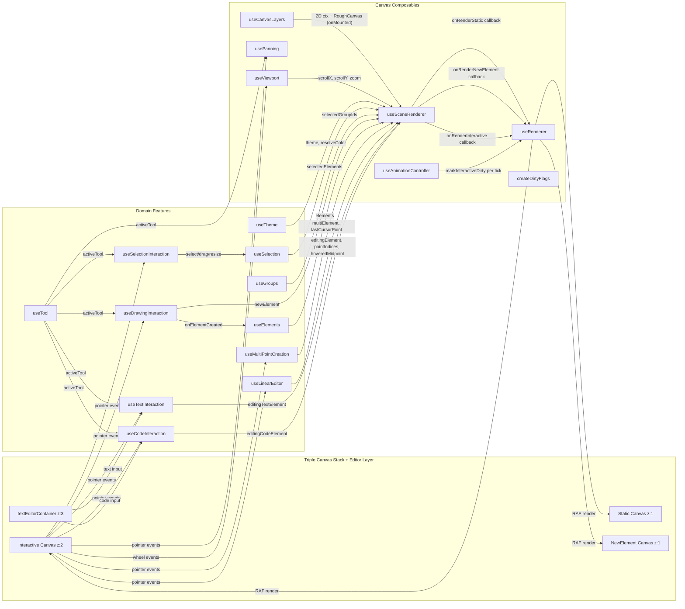

# Canvas Architecture

Data flow between the triple canvas stack, composables, and features.

## Layer Responsibilities

| Canvas | z-index | Pointer Events | Renders |
|--------|---------|----------------|---------|
| **Static** | 1 | None | Grid dots + all committed elements (roughjs) |
| **NewElement** | 1 | None | Single in-progress shape during drawing |
| **Interactive** | 2 | All pointer/wheel | Selection borders, handles, group borders, linear editor overlays, binding highlights, marquee box |
| **textEditorContainer** | 3 | None (pointer-events-none) | Overlay div for text/code editing DOM elements |

## useSceneRenderer Orchestration

`useSceneRenderer` is the bridge between domain state and the render loop. It:
1. Accepts all domain refs (elements, selection, newElement, linear editor state, groups, bindings, editingTextElement, editingCodeElement)
2. Calls `useTheme()` to get the current theme
3. Calls `useRenderer()` with three render callbacks that read domain state
4. Calls `useAnimationController()` for keyed RAF animations
5. Watches `selectedIds` and `theme` to mark dirty flags
6. Returns `mark*Dirty` functions for the deferred dirty-flag pattern
