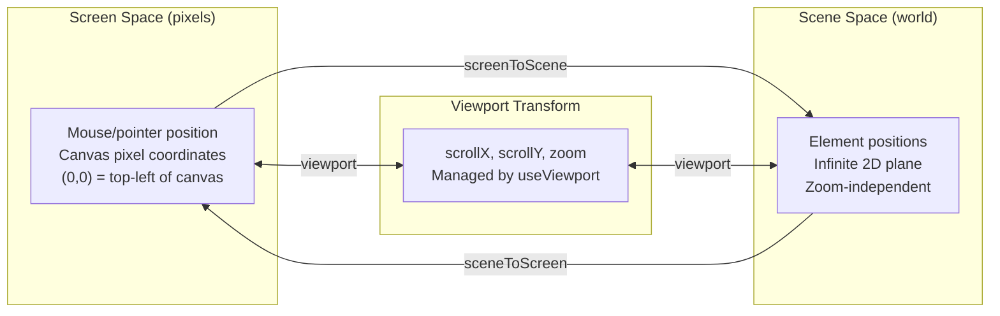
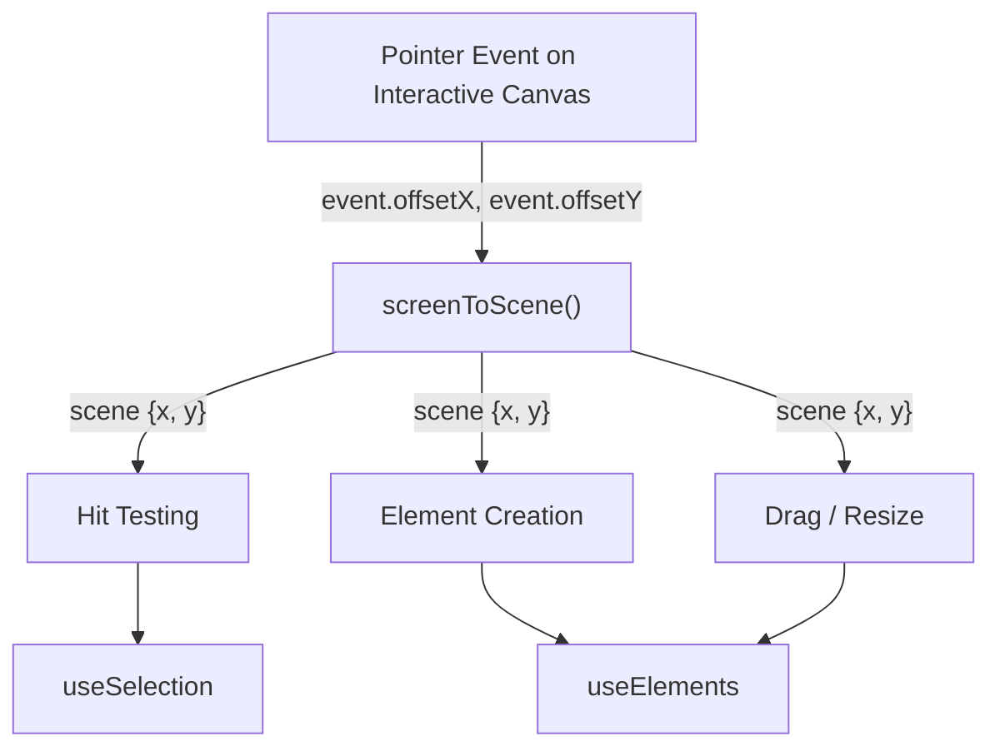
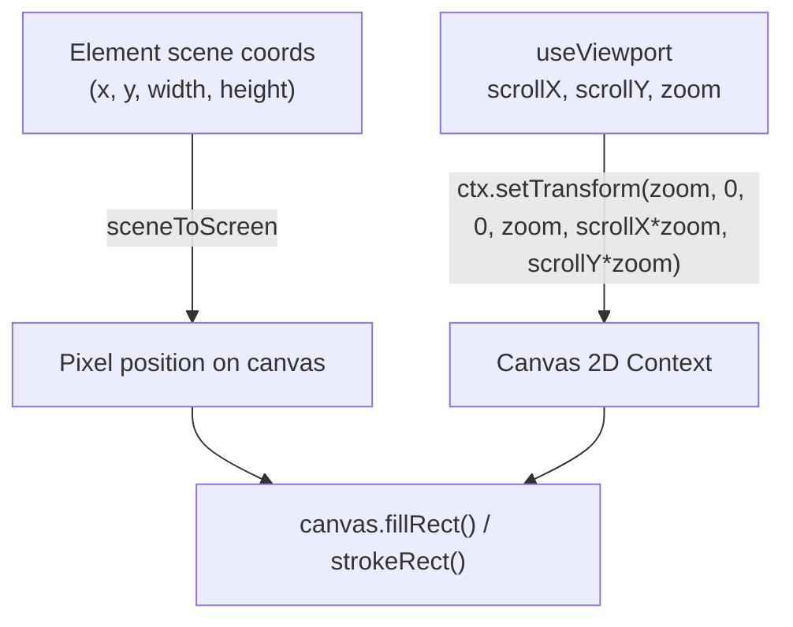

# Coordinate System

How screen pixels map to scene coordinates through the viewport transform.

## Spaces Overview



## Transform Formulas

From `packages/core/src/features/canvas/coords.ts`:

```
screenToScene(screenX, screenY, viewport):
  sceneX = screenX / zoom - scrollX
  sceneY = screenY / zoom - scrollY

sceneToScreen(sceneX, sceneY, viewport):
  screenX = (sceneX + scrollX) * zoom
  screenY = (sceneY + scrollY) * zoom
```

These are exact inverses: `sceneToScreen(screenToScene(x, y, v), v) === {x, y}`.

## Data Flow: Input to Scene



## Data Flow: Scene to Render



## Viewport Operations

From `packages/core/src/features/canvas/composables/useViewport.ts`:

| Operation                  | Formula                                                            | Description                                     |
| -------------------------- | ------------------------------------------------------------------ | ----------------------------------------------- |
| `panBy(dx, dy)`            | `scrollX += dx / zoom`<br/>`scrollY += dy / zoom`                  | Pan converts screen-pixel deltas to scene units |
| `zoomTo(newZoom, center?)` | Clamp to `[0.1, 30]`, recompute scroll to keep center point stable | Zoom anchored to a screen point                 |
| `zoomBy(delta, center?)`   | `zoomTo(zoom * (1 + delta), center)`                               | Relative zoom (e.g. wheel scroll)               |

## Zoom-Anchored Scroll Adjustment

When zooming to a center point, the viewport keeps that scene point stationary on screen:

```
scenePoint = screenToScene(center.x, center.y, currentViewport)
scrollX = center.x / newZoom - scenePoint.x
scrollY = center.y / newZoom - scenePoint.y
```

This ensures the point under the cursor stays fixed during pinch/scroll zoom.
