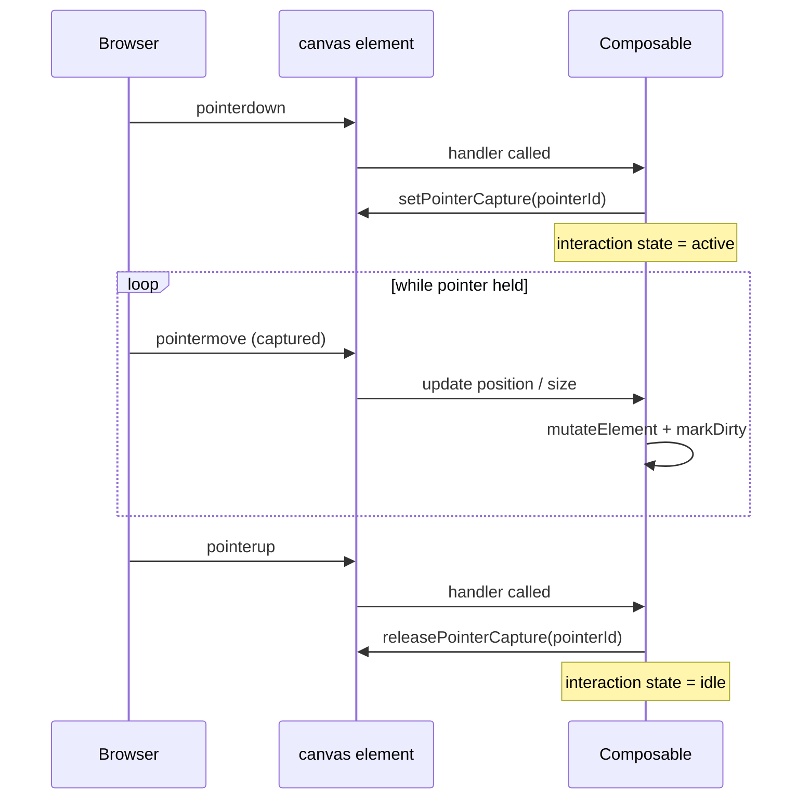
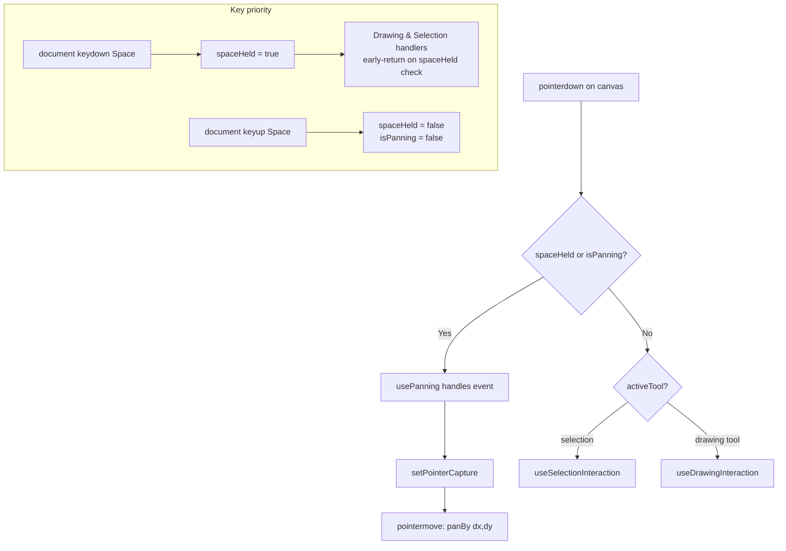
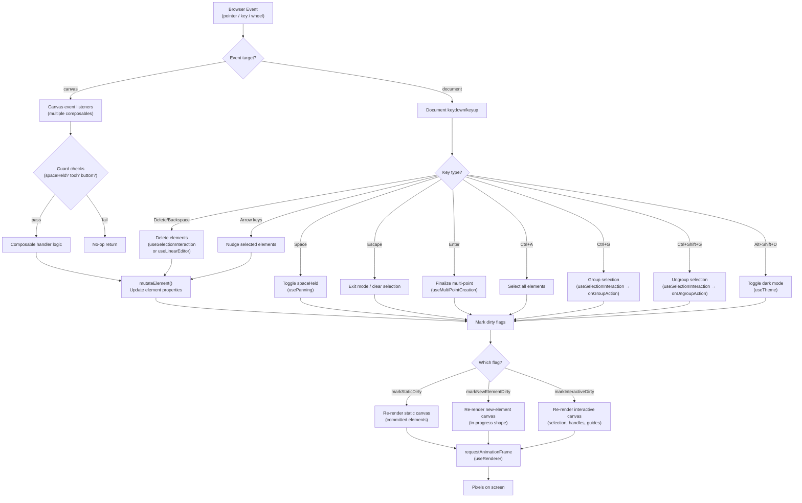

# Event Flow

How browser events flow from DOM targets through composable handlers to state updates, dirty flags, and re-renders.

## Event Listener Attachment Points

Which composable listens to which events, and on which DOM target.

```mermaid
flowchart TB
    subgraph "DOM Targets"
        WIN[window]
        DOC[document]
        CVS["canvas element (canvasRef)"]
    end

    subgraph "usePanning"
        P_KD[keydown: Space toggle]
        P_KU[keyup: Space release]
        P_WH[wheel: zoom / pan]
        P_PD[pointerdown: start pan]
        P_PM[pointermove: continue pan]
        P_PU[pointerup: end pan]
    end

    subgraph "useDrawingInteraction"
        D_PD[pointerdown: create element]
        D_PM[pointermove: resize element]
        D_PU[pointerup: finalize element]
    end

    subgraph "useFreeDrawInteraction"
        F_PD[pointerdown: start stroke]
        F_PM[pointermove: append points]
        F_PU[pointerup: finalize stroke]
    end

    subgraph "useSelectionInteraction"
        S_PD[pointerdown: hit-test / box-select]
        S_PM[pointermove: drag / resize / box]
        S_PU[pointerup: commit interaction]
        S_DBL[dblclick: enter linear editor]
        S_KD[keydown: Delete / Escape / Ctrl+A / Ctrl+G / arrows]
    end

    subgraph "useMultiPointCreation"
        M_PD[pointerdown: add point]
        M_PM[pointermove: cursor preview]
        M_DBL[dblclick: finalize polyline]
        M_KD[keydown: Escape / Enter finalize]
    end

    subgraph "useLinearEditor"
        L_PD[pointerdown: select / insert point]
        L_PM[pointermove: drag point / hover midpoint]
        L_PU[pointerup: commit binding]
        L_KD[keydown: Escape exit / Delete points]
    end

    subgraph "useTextInteraction"
        T_PD[pointerdown: create/edit text element]
    end

    subgraph "useCodeInteraction"
        C_PD[pointerdown: create/edit code element]
    end

    DOC --> P_KD
    DOC --> P_KU
    DOC --> S_KD
    DOC --> M_KD
    DOC --> L_KD

    CVS --> P_WH
    CVS --> P_PD
    CVS --> P_PM
    CVS --> P_PU
    CVS --> D_PD
    CVS --> D_PM
    CVS --> D_PU
    CVS --> F_PD
    CVS --> F_PM
    CVS --> F_PU
    CVS --> S_PD
    CVS --> S_PM
    CVS --> S_PU
    CVS --> S_DBL
    CVS --> M_PD
    CVS --> M_PM
    CVS --> M_DBL
    CVS --> L_PD
    CVS --> L_PM
    CVS --> L_PU
    CVS --> T_PD
    CVS --> C_PD
```

## Pointer Capture Lifecycle

Every drag interaction follows the same pattern: `setPointerCapture` on `pointerdown`, `releasePointerCapture` on `pointerup`. This ensures `pointermove` events continue even if the cursor leaves the canvas.

**Composables using pointer capture:**

| Composable                | Capture on                                 | Release on |
| ------------------------- | ------------------------------------------ | ---------- |
| `usePanning`              | pointerdown (space held or hand tool)      | pointerup  |
| `useDrawingInteraction`   | pointerdown (drawing tool active)          | pointerup  |
| `useSelectionInteraction` | pointerdown (resize, drag, or box-select)  | pointerup  |
| `useLinearEditor`         | pointerdown (point handle or midpoint hit) | pointerup  |

## Space-Key Panning vs Selection Priority

`usePanning` exposes `spaceHeld` and `isPanning` refs. Both `useDrawingInteraction` and `useSelectionInteraction` check these as early-exit guards, giving panning unconditional priority.

## Full Event Pipeline

End-to-end flow from browser event to pixel on screen.

## Composable Event Summary

| Composable                | Canvas Events                                         | Document Events                                                  | State Written                                                                         |
| ------------------------- | ----------------------------------------------------- | ---------------------------------------------------------------- | ------------------------------------------------------------------------------------- |
| `usePanning`              | `wheel`, `pointerdown`, `pointermove`, `pointerup`    | `keydown` (Space), `keyup` (Space)                               | `spaceHeld`, `isPanning`, viewport scroll/zoom                                        |
| `useDrawingInteraction`   | `pointerdown`, `pointermove`, `pointerup`             | --                                                               | `newElement`, element mutations, `suggestedBindings`                                  |
| `useFreeDrawInteraction`  | `pointerdown`, `pointermove`, `pointerup`             | --                                                               | `newFreeDrawElement`, freedraw points/pressures, static/newElement dirty flags        |
| `useSelectionInteraction` | `pointerdown`, `pointermove`, `pointerup`, `dblclick` | `keydown` (Delete, Escape, Ctrl+A, Ctrl+G, Ctrl+Shift+G, arrows) | selection state, `selectionBox`, `cursorStyle`, element mutations, group actions      |
| `useMultiPointCreation`   | `pointerdown`, `pointermove`, `dblclick`              | `keydown` (Escape, Enter)                                        | `multiElement`, `lastCursorPoint`, `suggestedBindings`                                |
| `useLinearEditor`         | `pointerdown`, `pointermove`, `pointerup`             | `keydown` (Escape, Delete/Backspace)                             | `editingElement`, `selectedPointIndices`, `hoveredMidpointIndex`, `suggestedBindings` |
| `useTextInteraction`      | `pointerdown`                                         | --                                                               | `editingTextElement`, element mutations, text editor DOM                              |
| `useCodeInteraction`      | `pointerdown`                                         | --                                                               | `editingCodeElement`, element mutations, code editor DOM                              |
| `useTheme`                | --                                                    | `keydown` (Alt+Shift+D)                                          | `theme` (light/dark), document root class toggle                                      |
