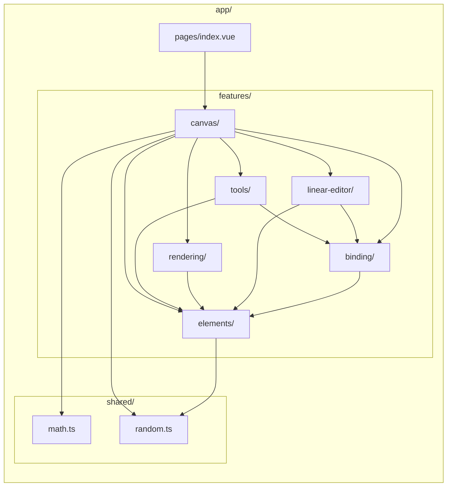

# Feature-Based Architecture

Feature directory layout and inter-feature dependency graph.

## Import Rules

1. **Pages** can import from **features** (pages are top-level orchestrators)
2. **Features** can import from **shared** (zero-dependency utilities)
3. **Features** can import from **other features** (canvas orchestrates elements, rendering, tools)
4. **shared/** imports from nothing — it is dependency-free
5. **components/** and **composables/** (top-level) cannot import from **features/**
