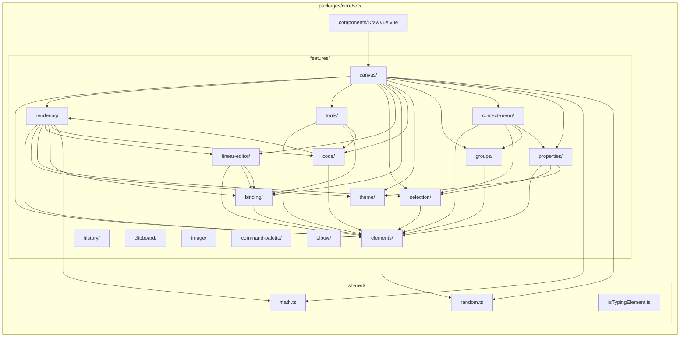

# Feature-Based Architecture

Feature directory layout and inter-feature dependency graph.

> **Note:** After the monorepo extraction, all domain features live in `packages/core/src/features/`. The `app/features/` directory contains only presentation-layer components (toolbars, panels, etc.). The graph below shows the core library feature dependencies.

## Import Rules

1. **DrawVue.vue** orchestrates all features (top-level wiring)
2. **Features** can import from **shared** (zero-dependency utilities)
3. **Features** can import from **other features** via relative imports within `packages/core/src/`
4. **shared/** imports from nothing -- it is dependency-free
5. **App code** (`app/`) imports from `@drawvue/core` (never internal paths)

## Feature Summary

| Feature             | Purpose                                                                           | Key Exports                                                                                                                     |
| ------------------- | --------------------------------------------------------------------------------- | ------------------------------------------------------------------------------------------------------------------------------- |
| **canvas**          | Canvas stack, viewport, render loop, dirty flags, scene orchestration             | `useViewport`, `useRenderer`, `useSceneRenderer`, `useCanvasLayers`, `usePanning`, `createDirtyFlags`, `useAnimationController` |
| **context-menu**    | Right-click context menu with element/canvas actions                              | `useContextMenu`, `ContextMenu.vue`, `contextMenuItems`                                                                         |
| **elements**        | Element data model, creation, mutation, z-order                                   | `useElements`, `createElement`, `mutateElement`, `useLayerOrder`                                                                |
| **rendering**       | Grid, shape generation, scene/element/interactive rendering, text measurement     | `renderGrid`, `renderScene`, `renderElement`, `generateShape`, `textMeasurement`                                                |
| **tools**           | Tool state, drawing interaction, text editing interaction                         | `useToolStore`, `useDrawingInteraction`, `useTextInteraction`                                                                   |
| **selection**       | Hit testing, bounds, drag/resize, selection state machine                         | `useSelection`, `useSelectionInteraction`, `hitTest`, `dragElements`, `resizeElement`                                           |
| **linear-editor**   | Multi-point arrow creation, point editing                                         | `useMultiPointCreation`, `useLinearEditor`, `pointHandles`                                                                      |
| **binding**         | Arrow-to-shape binding, proximity detection, bound text                           | `bindArrowToElement`, `proximity`, `updateBoundPoints`, `renderSuggestedBinding`, `boundText`                                   |
| **code**            | Code element with syntax highlighting via Shiki                                   | `useCodeInteraction`, `useShikiHighlighter`, `renderCodeElement`, `buildEditorDom`, `measureCode`                               |
| **properties**      | Element style editing panel with color picker, sticky defaults, copy/paste styles | `useStyleDefaults`, `usePropertyActions`, `useStyleClipboard`, `PropertiesPanel.vue`, `ColorPicker.vue`, `palette`              |
| **theme**           | Light/dark mode, color resolution                                                 | `useTheme`, `resolveColor`, `applyDarkModeFilter`                                                                               |
| **groups**          | Element grouping, group selection expansion                                       | `useGroups`, `groupUtils` (pure functions), `cleanupAfterDelete`                                                                |
| **history**         | Undo/redo system                                                                  | `useHistory`                                                                                                                    |
| **clipboard**       | Element clipboard (copy/paste)                                                    | `useClipboard`                                                                                                                  |
| **image**           | Image element cache and interaction                                               | `useImageCache`, `useImageInteraction`                                                                                          |
| **command-palette** | Command palette state and groups                                                  | `useCommandPalette`, `commandGroups`                                                                                            |
| **elbow**           | Elbow arrow routing (A\* pathfinding)                                             | `routeElbow`, `astar`, `grid`, `validation`                                                                                     |
