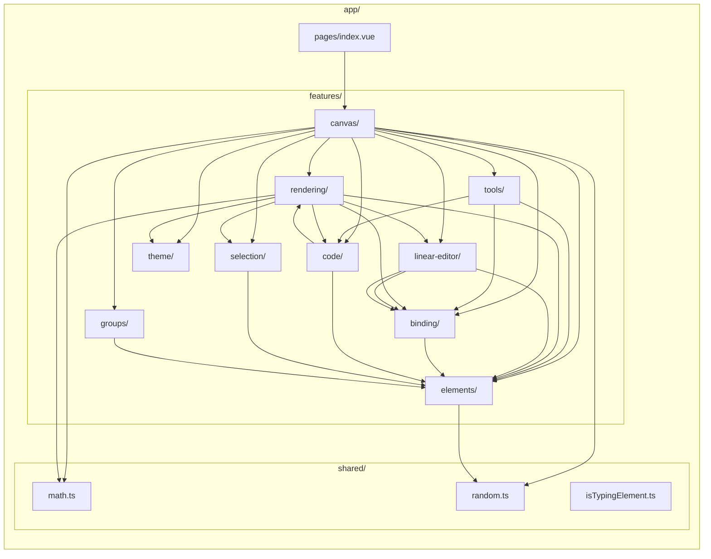

# Feature-Based Architecture

Feature directory layout and inter-feature dependency graph.

## Import Rules

1. **Pages** can import from **features** (pages are top-level orchestrators)
2. **Features** can import from **shared** (zero-dependency utilities)
3. **Features** can import from **other features** (canvas orchestrates elements, rendering, tools, selection, etc.)
4. **shared/** imports from nothing -- it is dependency-free
5. **components/** and **composables/** (top-level) cannot import from **features/**

## Feature Summary

| Feature | Purpose | Key Exports |
|---------|---------|-------------|
| **canvas** | Canvas stack, viewport, render loop, dirty flags, scene orchestration | `useViewport`, `useRenderer`, `useSceneRenderer`, `useCanvasLayers`, `usePanning`, `createDirtyFlags`, `useAnimationController` |
| **elements** | Element data model, creation, mutation | `useElements`, `createElement`, `mutateElement` |
| **rendering** | Grid, shape generation, scene/element/interactive rendering, text measurement | `renderGrid`, `renderScene`, `renderElement`, `generateShape`, `textMeasurement` |
| **tools** | Tool state, drawing interaction, text editing interaction | `useToolStore`, `useDrawingInteraction`, `useTextInteraction` |
| **selection** | Hit testing, bounds, drag/resize, selection state machine | `useSelection`, `useSelectionInteraction`, `hitTest`, `dragElements`, `resizeElement` |
| **linear-editor** | Multi-point arrow creation, point editing | `useMultiPointCreation`, `useLinearEditor`, `pointHandles` |
| **binding** | Arrow-to-shape binding, proximity detection, bound text | `bindArrowToElement`, `proximity`, `updateBoundPoints`, `renderSuggestedBinding`, `boundText` |
| **code** | Code element with syntax highlighting via Shiki | `useCodeInteraction`, `useShikiHighlighter`, `renderCodeElement`, `buildEditorDom`, `measureCode` |
| **theme** | Light/dark mode, color resolution | `useTheme`, `resolveColor`, `applyDarkModeFilter` |
| **groups** | Element grouping, group selection expansion | `useGroups`, `groupUtils` (pure functions), `cleanupAfterDelete` |
