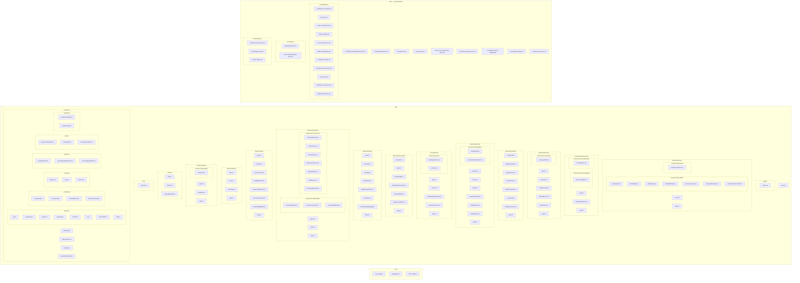

# File Map

Complete file tree with every module in the project.

```mermaid
graph LR
    subgraph Root
        NC[nuxt.config.ts]
        PK[package.json]
        VC[vitest.config.ts]
    end

    subgraph "app/"
        AV[app.vue]
        subgraph "pages/"
            PI[index.vue]
        end
        subgraph "features/canvas/"
            CO[coords.ts]
            CIX[index.ts]
            subgraph "canvas/composables/"
                UV[useViewport.ts]
                UR[useRenderer.ts]
                UP[usePanning.ts]
                DF[createDirtyFlags.ts]
                UCL[useCanvasLayers.ts]
                USR[useSceneRenderer.ts]
                UAC[useAnimationController.ts]
            end
            subgraph "canvas/components/"
                CC[CanvasContainer.vue]
            end
        end
        subgraph "features/context-menu/"
            CMTY[types.ts]
            CMIT[contextMenuItems.ts]
            CMIX[index.ts]
            subgraph "context-menu/composables/"
                CMUC[useContextMenu.ts]
            end
            subgraph "context-menu/components/"
                CMCV[ContextMenu.vue]
            end
        end
        subgraph "features/elements/"
            ET[types.ts]
            EC[constants.ts]
            ECR[createElement.ts]
            EM[mutateElement.ts]
            UE[useElements.ts]
            EIX[index.ts]
            subgraph "elements/composables/"
                ULO[useLayerOrder.ts]
            end
        end
        subgraph "features/rendering/"
            RG[renderGrid.ts]
            SG[shapeGenerator.ts]
            RE[renderElement.ts]
            RS[renderScene.ts]
            RI[renderInteractive.ts]
            AH[arrowhead.ts]
            TM[textMeasurement.ts]
            RDIX[index.ts]
        end
        subgraph "features/selection/"
            SLC[constants.ts]
            SLB[bounds.ts]
            SLH[hitTest.ts]
            SLTH[transformHandles.ts]
            SLD[dragElements.ts]
            SLR[resizeElement.ts]
            SLIX[index.ts]
            subgraph "selection/composables/"
                SLS[useSelection.ts]
                SLSI[useSelectionInteraction.ts]
            end
        end
        subgraph "features/tools/"
            TT[types.ts]
            UT2[useTool.ts]
            UDI[useDrawingInteraction.ts]
            UTI[useTextInteraction.ts]
            TLIX[index.ts]
            subgraph "tools/components/"
                DT[DrawingToolbar.vue]
                TI[toolIcons.ts]
            end
        end
        subgraph "features/linear-editor/"
            LEC[constants.ts]
            LET[types.ts]
            LEPH[pointHandles.ts]
            LEMPC[useMultiPointCreation.ts]
            LELE[useLinearEditor.ts]
            LERLE[renderLinearEditor.ts]
            LEIX[index.ts]
        end
        subgraph "features/binding/"
            BT[types.ts]
            BC[constants.ts]
            BP[proximity.ts]
            BBU[bindUnbind.ts]
            BUBP[updateBoundPoints.ts]
            BBTX[boundText.ts]
            BRH[renderBindingHighlight.ts]
            BIX[index.ts]
        end
        subgraph "features/properties/"
            PRPAL[palette.ts]
            PRTY[types.ts]
            PRIX[index.ts]
            subgraph "properties/composables/"
                PRUSD[useStyleDefaults.ts]
                PRUPA[usePropertyActions.ts]
                PRUSC[useStyleClipboard.ts]
            end
            subgraph "properties/components/"
                PRPP[PropertiesPanel.vue]
                PRCP[ColorPicker.vue]
                PRCSW[ColorSwatch.vue]
                PRBIS[ButtonIconSelect.vue]
                PROS[OpacitySlider.vue]
                PRFP[FontPicker.vue]
                PRAHP[ArrowheadPicker.vue]
            end
        end
        subgraph "features/code/"
            CDT[types.ts]
            CDC[constants.ts]
            CDMC[measureCode.ts]
            CDBED[buildEditorDom.ts]
            CDRCE[renderCodeElement.ts]
            CDUCI[useCodeInteraction.ts]
            CDUSH[useShikiHighlighter.ts]
            CDIX[index.ts]
        end
        subgraph "features/theme/"
            THT[types.ts]
            THC[colors.ts]
            THU[useTheme.ts]
            THIX[index.ts]
        end
        subgraph "features/groups/"
            GRT[types.ts]
            GRU[groupUtils.ts]
            GRIX[index.ts]
            subgraph "groups/composables/"
                GRUG[useGroups.ts]
            end
        end
        subgraph "shared/"
            MT[math.ts]
            RN[random.ts]
            ITE[isTypingElement.ts]
        end
        subgraph "utils/"
            TC[tryCatch.ts]
        end
        subgraph "__test-utils__/"
            WS[withSetup.ts]
            SBR[setup-browser.ts]
            THOOK[testHook.ts]
            DSEED[deterministicSeed.ts]
            subgraph "browser/"
                BAPI[api.ts]
                BCHK[checkpoint.ts]
                BWAIT[waiters.ts]
                BKB[Keyboard.ts]
                BPTR[Pointer.ts]
                BUI[UI.ts]
                BCG[CanvasGrid.ts]
                BIDX[index.ts]
            end
            subgraph "commands/"
                CD[canvasDrag.ts]
                CCK[canvasClick.ts]
                CDBL[canvasDblClick.ts]
                SGO[showGridOverlay.ts]
            end
            subgraph "factories/"
                VPF[viewport.ts]
                PTF[point.ts]
                ELF[element.ts]
            end
            subgraph "matchers/"
                MAE[assertElements.ts]
                MASE[assertSelectedElements.ts]
                MCEP[toCloselyEqualPoints.ts]
            end
            subgraph "mocks/"
                MCM[canvasContextMock.ts]
                MCS[canvasStub.ts]
                MEL[eventListenerMock.ts]
            end
            subgraph "serializers/"
                SES[elementSerializer.ts]
                SFS[floatSerializer.ts]
            end
        end
    end

    subgraph "docs/ — Agent Memory"
        SK[SYSTEM_KNOWLEDGE_MAP.md]
        EG[excalidraw-gotchas.md]
        NG[nuxt-gotchas.md]
        LS[linting-setup.md]
        CMPS[context-menu-properties-spec.md]
        BTDN[bound-text-debug-notes.md]
        ETS[excalidraw-testing-strategy.md]
        OTS[our-testing-strategy.md]
        TRP[testing-refactor-plan.md]
        subgraph "docs/diagrams/"
            DG_AO[architecture-overview.md]
            DG_FM[file-map.md]
            DG_FA[feature-architecture.md]
            DG_RP[render-pipeline.md]
            DG_CA[canvas-architecture.md]
            DG_SD[shape-drawing-flow.md]
            DG_CS[coordinate-system.md]
            DG_SS[selection-state-machine.md]
            DG_EF[event-flow.md]
            DG_IS[initialization-sequence.md]
            DG_TA[testing-architecture.md]
        end
        subgraph "docs/specs/"
            SP_GF[grouping-feature.md]
            SP_AI[arrow-implementation-plan.md]
        end
        subgraph "docs/reference/"
            RF_AD[architectural-decisions.md]
            RF_TS[technology-stack.md]
            RF_ET[element-types.md]
        end
    end
```
