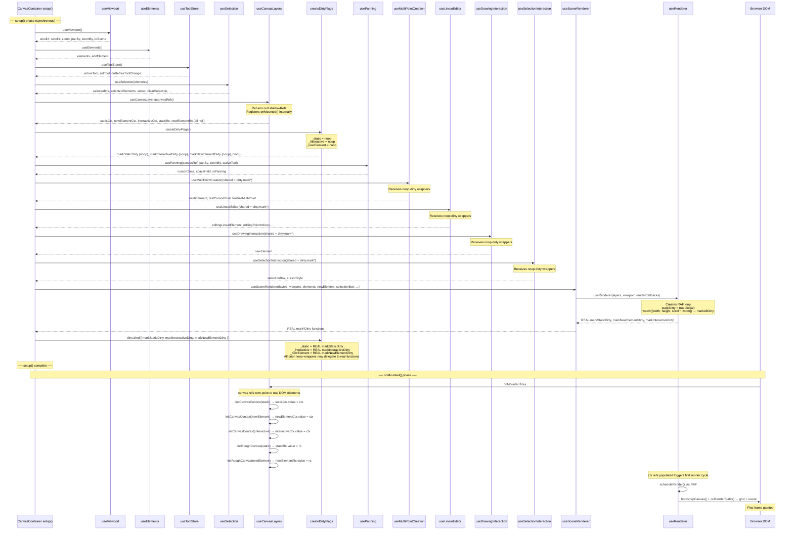

# Initialization Sequence

How `CanvasContainer.vue` boots: composable call order, the deferred dirty-flag pattern, and what runs in `setup()` vs `onMounted()`.

## The Circular Dependency Problem

The canvas initialization has a chicken-and-egg problem:

1. **Drawing/selection composables** need `markStaticDirty()` / `markInteractiveDirty()` to schedule repaints when the user interacts.
2. **`useSceneRenderer`** produces those `mark*Dirty` functions, but it needs access to `newElement`, `selectionBox`, and other refs that come _from_ the drawing/selection composables.
3. You cannot call `useSceneRenderer` first (it needs drawing refs) and you cannot call drawing composables first (they need dirty callbacks).

## The Deferred Dirty-Flag Solution

`createDirtyFlags()` breaks the cycle by returning **stable function references** that delegate to internal `noop` closures. Drawing composables receive these immediately. After `useSceneRenderer` produces the real `mark*Dirty` functions, `dirty.bind()` swaps the noops for real callbacks. Any calls made before `bind()` are silently dropped (no-ops), which is fine because no rendering can happen before the renderer exists.

```
createDirtyFlags()          ─── returns { markStaticDirty, markInteractiveDirty, markNewElementDirty, bind }
                                 internally: _static = noop, _interactive = noop, _newElement = noop

useDrawingInteraction(...)  ─── receives dirty.markNewElementDirty (currently a noop wrapper)
useSelectionInteraction(...)─── receives dirty.markStaticDirty / markInteractiveDirty (noop wrappers)

useSceneRenderer(...)       ─── returns REAL mark*Dirty functions (backed by useRenderer's RAF loop)

dirty.bind({ markStaticDirty, markInteractiveDirty, markNewElementDirty })
                                 swaps noops → real callbacks; all prior references now call through
```

## Full Boot Sequence



## Phase Summary

| Phase | What happens | Key detail |
|-------|-------------|------------|
| **setup() - early** | `useViewport`, `useElements`, `useToolStore`, `useSelection` | Pure reactive state, no DOM needed |
| **setup() - canvas layers** | `useCanvasLayers(canvasRefs)` | Returns `null` shallowRefs; registers internal `onMounted` hook |
| **setup() - dirty flags** | `createDirtyFlags()` | Returns stable noop wrappers; breaks circular dependency |
| **setup() - interactions** | `usePanning`, `useMultiPointCreation`, `useLinearEditor`, `useDrawingInteraction`, `useSelectionInteraction` | All receive noop dirty wrappers via `shared` object |
| **setup() - renderer** | `useSceneRenderer` calls `useRenderer` | Creates RAF loop, returns real `mark*Dirty` functions |
| **setup() - bind** | `dirty.bind(realCallbacks)` | Swaps noops for real callbacks; all composables now trigger real repaints |
| **onMounted()** | `useCanvasLayers` internal hook | Gets 2D contexts + RoughCanvas from real DOM elements |
| **First frame** | RAF fires, `staticDirty=true` | Renders grid + scene on static canvas |
