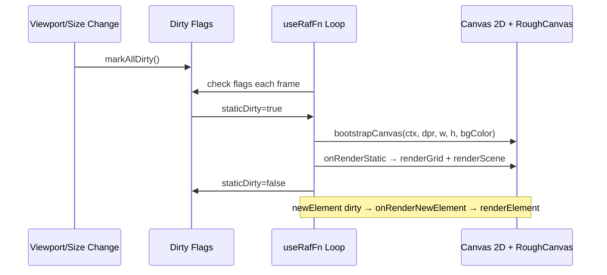

# Render Pipeline

Dirty-flag driven RAF loop: viewport/size changes mark flags, RAF checks each frame, renders only dirty canvases.

```mermaid
sequenceDiagram
    participant State as Viewport/Size Change
    participant Dirty as Dirty Flags
    participant RAF as useRafFn Loop
    participant Canvas as Canvas 2D + RoughCanvas

    State->>Dirty: markAllDirty()
    RAF->>Dirty: check flags each frame
    Dirty->>RAF: staticDirty=true
    RAF->>Canvas: bootstrapCanvas(ctx, dpr, w, h, bgColor)
    RAF->>Canvas: onRenderStatic → renderGrid + renderScene
    RAF->>Dirty: staticDirty=false
    Note over RAF,Canvas: newElement dirty → onRenderNewElement → renderElement
```
