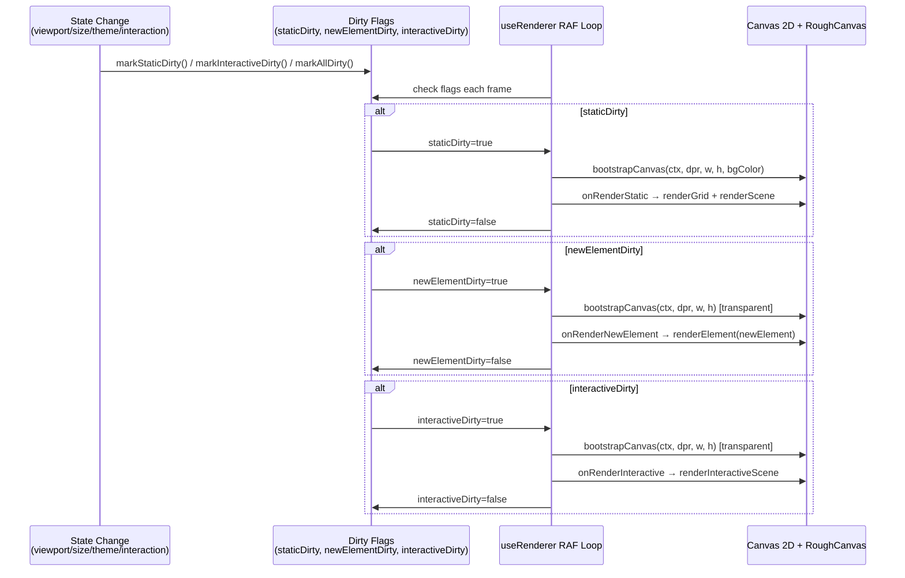
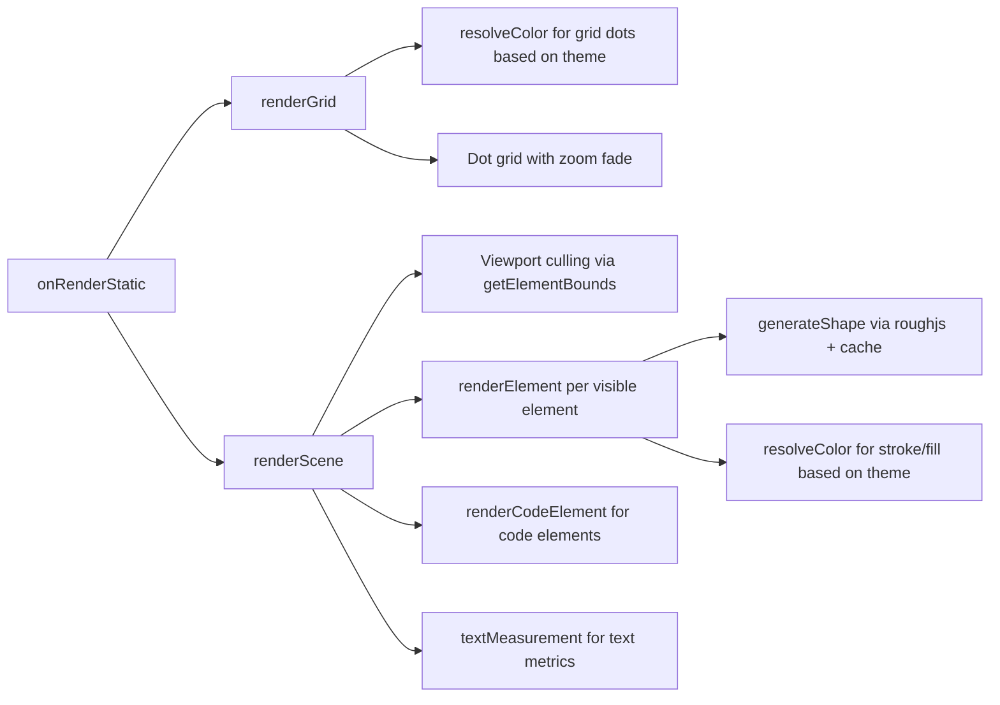
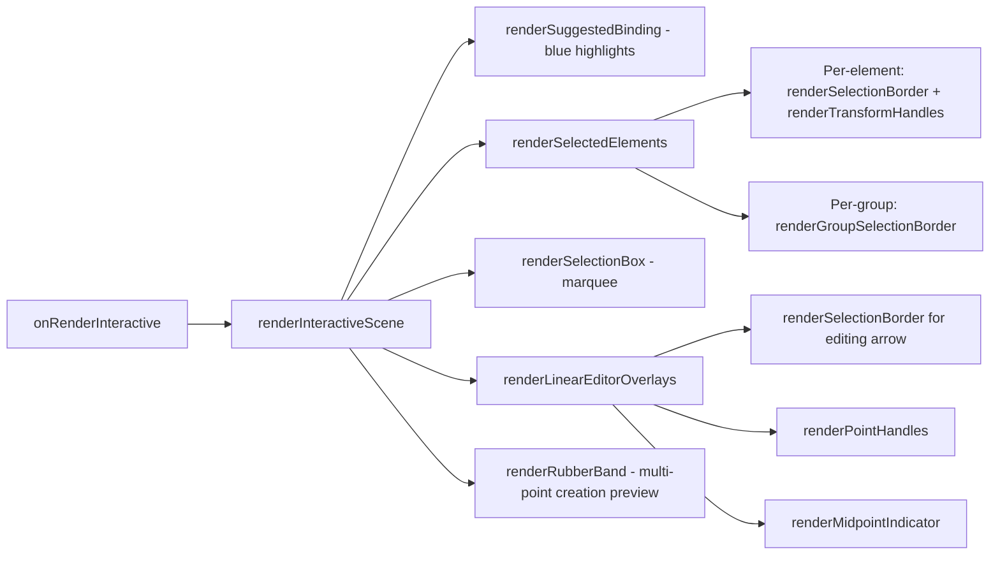

# Render Pipeline

Dirty-flag driven RAF loop: viewport/size/theme changes mark flags, RAF checks each frame, renders only dirty canvases.

## Layer Rendering Flow

## Static Layer Pipeline

## Interactive Layer Pipeline

## What Triggers Dirty Flags

| Trigger | Flag(s) | Source |
|---------|---------|-------|
| `watch([width, height, scrollX, scrollY, zoom, bgColor])` | All three | `useRenderer` |
| `watch(theme)` | All three (`markAllDirty`) | `useSceneRenderer` |
| `watch(visibility)` (tab becomes visible) | All three | `useRenderer` |
| `watch(selectedIds)` | Interactive | `useSceneRenderer` |
| Element created/mutated | Static | interaction composables |
| New element drag | NewElement | `useDrawingInteraction` |
| Selection change/drag/resize | Interactive | `useSelectionInteraction` |
| Group/ungroup | Static + Interactive | `useGroups` |
| Linear editor point move | Static + Interactive | `useLinearEditor` |
| Text editing submit | Static + Interactive | `useTextInteraction` |
| Code editing submit | Static + Interactive | `useCodeInteraction` |
| Animation tick | Interactive | `useAnimationController` |

## Theme Integration

`useSceneRenderer` calls `useTheme()` and computes `bgColor = resolveColor('#ffffff', theme)`. The theme ref is passed through to:
- `renderGrid(ctx, ..., theme)` -- resolves grid dot color
- `renderScene(ctx, ..., theme)` -- each element's stroke/fill resolved
- `renderInteractiveScene(ctx, ..., theme)` -- selection colors from `SELECTION_COLORS[theme]`
- `renderElement(ctx, rc, el, theme)` -- individual element color resolution

A `watch(theme, markAllDirty)` ensures all three canvases repaint when theme changes.
