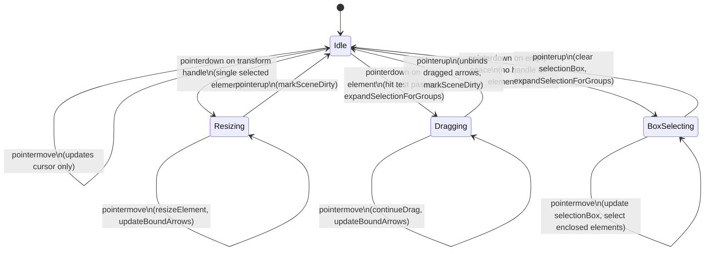

# Selection State Machine

State machine for `useSelectionInteraction` -- governs how pointer and keyboard events transition between idle, dragging, resizing, and box-selecting states.

**Source:** `app/features/selection/composables/useSelectionInteraction.ts`

## State Diagram

## Guard Conditions

All transitions from **Idle** require these guards to pass:

| Guard       | Condition                                    |
| ----------- | -------------------------------------------- |
| Tool check  | `activeTool === 'selection'`                 |
| Not panning | `spaceHeld === false && isPanning === false` |
| Not editing | `editingLinearElement` is null               |
| Left button | `e.button === 0`                             |

## Transition Priority (pointerdown)

The composable tries transitions in this strict order:

1. **tryStartResize** -- checks if pointer is over a transform handle of the single selected element
2. **tryStartDrag** -- checks if pointer hits any element (`getElementAtPosition`), then calls `expandSelectionForGroups()`
3. **startBoxSelecting** -- fallback when nothing is hit

## Group Integration

When an element is clicked (`tryStartDrag`):

1. Element is selected via `select(id)` or `toggleSelection(id)` (with Shift)
2. `expandSelectionForGroups()` is called to select all members of the same group
3. This sets `selectedGroupIds` which renders group selection borders in `renderInteractiveScene`

When box-selecting completes:

1. `selectElementsInBox()` selects all fully-enclosed elements
2. `expandSelectionForGroups()` expands selection to include group members

## Modifier Key Behavior

| Modifier                 | Context                    | Effect                                             |
| ------------------------ | -------------------------- | -------------------------------------------------- |
| **Shift**                | pointerdown on element     | `toggleSelection(id)` instead of `select(id)`      |
| **Shift**                | pointerdown on empty space | Preserves existing selection (no `clearSelection`) |
| **Shift**                | pointermove while resizing | Passed to `resizeElement` for aspect-ratio lock    |
| **Shift**                | Arrow key nudge            | 10px step instead of 1px                           |
| **Ctrl/Cmd + A**         | keydown                    | Select all elements                                |
| **Ctrl/Cmd + G**         | keydown                    | Group selected elements                            |
| **Ctrl/Cmd + Shift + G** | keydown                    | Ungroup selected elements                          |

## Cursor Styles

Updated on every `pointermove` while in **Idle** state (`updateCursor`):

| Hover Target                  | Cursor        |
| ----------------------------- | ------------- |
| Transform handle `n` or `s`   | `ns-resize`   |
| Transform handle `e` or `w`   | `ew-resize`   |
| Transform handle `nw` or `se` | `nwse-resize` |
| Transform handle `ne` or `sw` | `nesw-resize` |
| Transform handle `rotation`   | `grab`        |
| Selected element body         | `move`        |
| Empty space                   | `default`     |

## Transform Handle Types

Defined in `app/features/selection/transformHandles.ts`:

- **Corner handles** (`nw`, `ne`, `sw`, `se`) -- always present (except arrows)
- **Side handles** (`n`, `s`) -- only when element width > 5x handle size
- **Side handles** (`e`, `w`) -- only when element height > 5x handle size
- **Rotation handle** -- positioned above element, excluded from resize (`tryStartResize` filters it out)
- Arrows have **no** transform handles

## Keyboard Shortcuts (Idle)

| Key                    | Action                                                                   |
| ---------------------- | ------------------------------------------------------------------------ |
| `Delete` / `Backspace` | Delete selected elements (unbinds arrows first, cleans up orphan groups) |
| `Escape`               | Clear selection, reset tool to `selection`                               |
| `Ctrl/Cmd + A`         | Select all elements                                                      |
| `Ctrl/Cmd + G`         | Group selected elements (`onGroupAction`)                                |
| `Ctrl/Cmd + Shift + G` | Ungroup selected elements (`onUngroupAction`)                            |
| Arrow keys             | Nudge selected elements 1px (updates bound arrows)                       |
| Shift + Arrow keys     | Nudge selected elements 10px (updates bound arrows)                      |

## Double-Click

| Target                      | Action                                             |
| --------------------------- | -------------------------------------------------- |
| Linear element (arrow/line) | Enters linear editing mode (`onDoubleClickLinear`) |

> **Note:** Double-click on text/code elements is handled by `useTextInteraction` / `useCodeInteraction`, not by `useSelectionInteraction`.

## Pointer Capture

All active states (`dragging`, `resizing`, `boxSelecting`) capture the pointer via `setPointerCapture` on pointerdown and release it via `releasePointerCapture` on pointerup. This ensures events continue even if the pointer leaves the canvas.

## Delete Flow

1. `unbindBeforeDelete` -- unbinds all arrows from deleted shapes, and unbinds deleted arrows from their bound shapes
2. `mutateElement(el, { isDeleted: true })` -- soft delete
3. `onDeleteCleanup(deletedIds)` -- calls `cleanupAfterDelete` to remove orphan groups (groups with < 2 remaining members)
4. `clearSelection()` + `markSceneDirty()`
