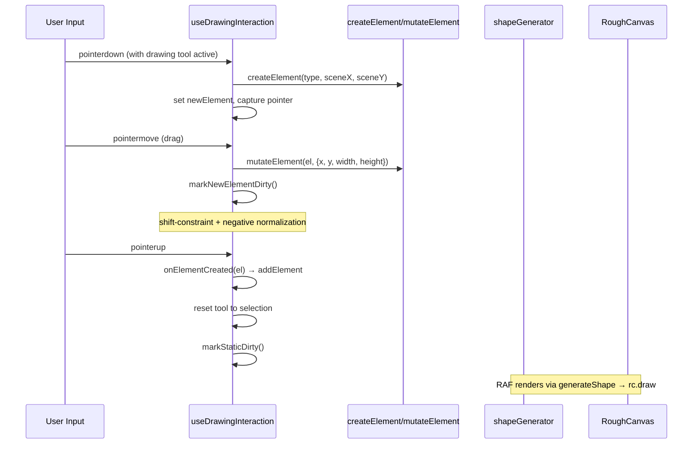
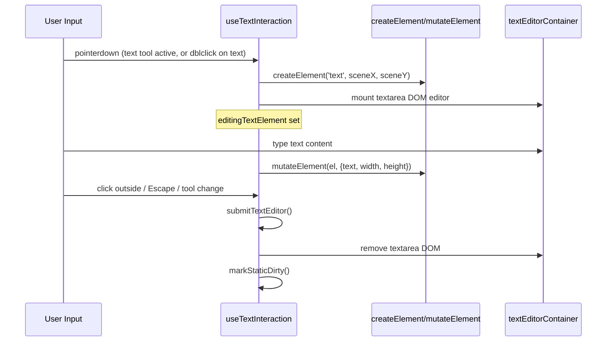
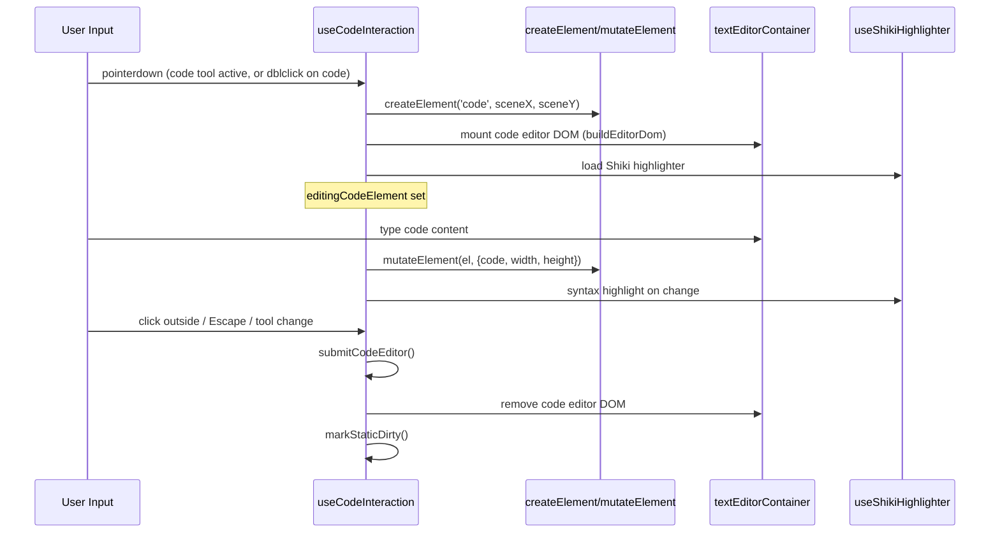
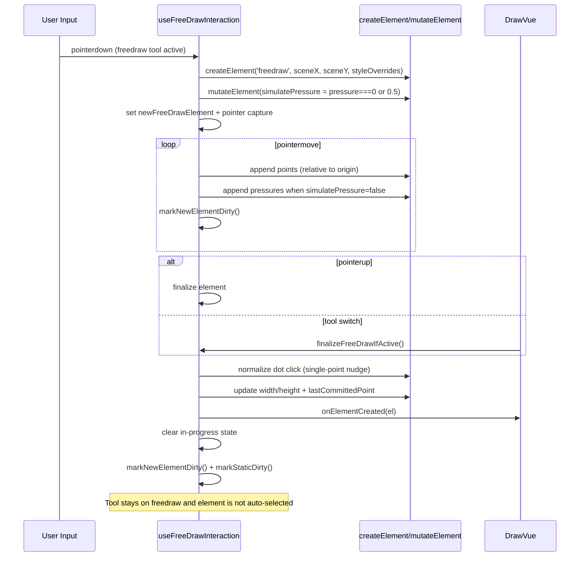

# Shape Drawing Flow

Pointer event sequence for creating shapes (rectangle, ellipse, diamond) and arrows.

## Text Element Creation Flow

## Code Element Creation Flow

## Free-draw (Pencil) Creation Flow

