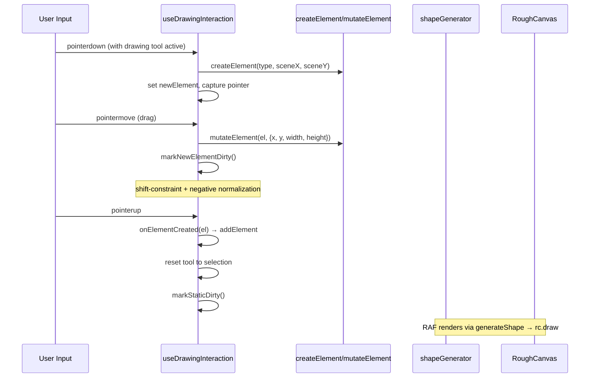

# Shape Drawing Flow

Pointer event sequence for creating shapes (rectangle, ellipse, diamond) and arrows.

```mermaid
sequenceDiagram
    participant User as User Input
    participant DI as useDrawingInteraction
    participant EL as createElement/mutateElement
    participant SG as shapeGenerator
    participant RC as RoughCanvas

    User->>DI: pointerdown (with drawing tool active)
    DI->>EL: createElement(type, sceneX, sceneY)
    DI->>DI: set newElement, capture pointer

    User->>DI: pointermove (drag)
    DI->>EL: mutateElement(el, {x, y, width, height})
    DI->>DI: markNewElementDirty()
    Note over DI: shift-constraint + negative normalization

    User->>DI: pointerup
    DI->>DI: onElementCreated(el) → addElement
    DI->>DI: reset tool to selection
    DI->>DI: markStaticDirty()
    Note over SG,RC: RAF renders via generateShape → rc.draw
```
