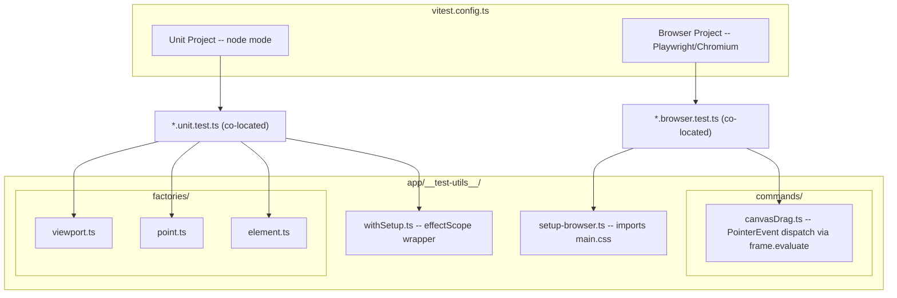

# Testing Architecture

Dual-project Vitest setup: node mode for unit tests, Playwright/Chromium for browser tests.

## Testing Pyramid (Canvas App)

| Layer | Target % | What | How |
|-------|---------|------|-----|
| Unit (node) | 60% | Pure functions, composables | `*.unit.test.ts`, fast, no DOM |
| Integration (browser) | 30% | Event wiring, DOM classes, component mounting | `*.browser.test.ts`, real Chromium |
| Visual | 10% | Canvas pixel output | Future: screenshot comparison |

## Naming Conventions

- `app/shared/math.unit.test.ts` -- co-located unit test
- `app/features/canvas/components/CanvasContainer.browser.test.ts` -- co-located browser test
- `app/__test-utils__/` -- shared helpers and factories

## Key Decisions

- **No `@nuxt/test-utils`** -- overkill for SPA with no SSR
- **No jsdom/happy-dom** -- unit tests run in node (pure functions), browser tests use real Chromium
- **`withSetup` returns `T & Disposable`** -- use with `using` keyword for automatic `effectScope` cleanup (see `docs/testing-conventions.md`)
- **Test files excluded from `nuxi typecheck`** via `typescript.tsConfig.exclude` in nuxt config
- **Vitest globals enabled** -- `describe`, `it`, `expect` available without imports
- **`canvasDrag` custom command** -- dispatches PointerEvents via `frame.evaluate` inside the iframe to avoid page-to-iframe coordinate mismatch (never use `page.mouse`)
- **`setup-browser.ts`** -- imported by browser test setup to load `main.css` for Tailwind styles

## Test Coverage by Feature

| Feature | Unit Tests | Browser Tests |
|---------|------------|---------------|
| **shared/math** | `math.unit.test.ts` | -- |
| **shared/random** | `random.unit.test.ts` | -- |
| **canvas/coords** | `coords.unit.test.ts` | -- |
| **canvas/useViewport** | `useViewport.unit.test.ts` | -- |
| **canvas/useAnimationController** | `useAnimationController.unit.test.ts` | -- |
| **canvas/CanvasContainer** | -- | `CanvasContainer.browser.test.ts` |
| **elements/createElement** | `createElement.unit.test.ts` | -- |
| **elements/mutateElement** | `mutateElement.unit.test.ts` | -- |
| **elements/useElements** | `useElements.unit.test.ts` | -- |
| **rendering/shapeGenerator** | `shapeGenerator.unit.test.ts` | -- |
| **selection/bounds** | `bounds.unit.test.ts` | -- |
| **selection/hitTest** | `hitTest.unit.test.ts` | -- |
| **selection/transformHandles** | `transformHandles.unit.test.ts` | -- |
| **selection/dragElements** | `dragElements.unit.test.ts` | -- |
| **selection/resizeElement** | `resizeElement.unit.test.ts` | -- |
| **selection/useSelection** | `useSelection.unit.test.ts` | -- |
| **tools/types** | `types.unit.test.ts` | -- |
| **tools/useTool** | `useTool.unit.test.ts` | -- |
| **tools/useDrawingInteraction** | `useDrawingInteraction.unit.test.ts` | -- |
| **tools/arrowTool** | `arrowTool.unit.test.ts` | -- |
| **tools/DrawingToolbar** | -- | `DrawingToolbar.browser.test.ts` |
| **tools/arrowToolReset** | -- | `arrowToolReset.browser.test.ts` |
| **linear-editor/pointHandles** | `pointHandles.unit.test.ts` | -- |
| **linear-editor/useLinearEditor** | `useLinearEditor.unit.test.ts` | -- |
| **linear-editor/useMultiPointCreation** | `useMultiPointCreation.unit.test.ts` | -- |
| **theme/colors** | `colors.unit.test.ts` | -- |
| **groups/groupUtils** | `groupUtils.unit.test.ts` | -- |
