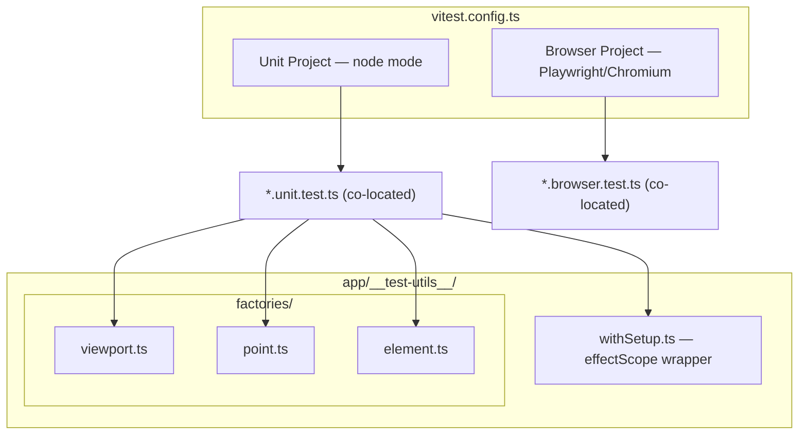

# Testing Architecture

Dual-project Vitest setup: node mode for unit tests, Playwright/Chromium for browser tests.

## Testing Pyramid (Canvas App)

| Layer | Target % | What | How |
|-------|---------|------|-----|
| Unit (node) | 60% | Pure functions, composables | `*.unit.test.ts`, fast, no DOM |
| Integration (browser) | 30% | Event wiring, DOM classes, component mounting | `*.browser.test.ts`, real Chromium |
| Visual | 10% | Canvas pixel output | Future: screenshot comparison |

## Naming Conventions

- `app/shared/math.unit.test.ts` — co-located unit test
- `app/features/canvas/components/CanvasContainer.browser.test.ts` — co-located browser test
- `app/__test-utils__/` — shared helpers and factories

## Key Decisions

- **No `@nuxt/test-utils`** — overkill for SPA with no SSR
- **No jsdom/happy-dom** — unit tests run in node (pure functions), browser tests use real Chromium
- **`withSetup` returns `T & Disposable`** — use with `using` keyword for automatic `effectScope` cleanup (see `docs/testing-conventions.md`)
- **Test files excluded from `nuxi typecheck`** via `typescript.tsConfig.exclude` in nuxt config
- **Vitest globals enabled** — `describe`, `it`, `expect` available without imports
