# Testing Architecture

Dual-project Vitest setup: node mode for unit tests, Playwright/Chromium for browser tests.

```mermaid
graph TD
    subgraph "vitest.config.ts"
        UP[Unit Project -- node mode]
        BP[Browser Project -- Playwright/Chromium]
    end

    UP --> UT["*.unit.test.ts (co-located)"]
    BP --> BT["*.browser.test.ts (co-located)"]

    subgraph "app/__test-utils__/"
        WS[withSetup.ts -- effectScope wrapper]
        SB[setup-browser.ts -- imports main.css]
        TH[testHook.ts -- test hook utilities]
        DS[deterministicSeed.ts -- reproducible randomness]
        subgraph "browser/"
            BAPI[api.ts -- test API helpers]
            BCHK[checkpoint.ts -- state checkpointing]
            BWAIT[waiters.ts -- async wait helpers]
            BKB[Keyboard.ts -- keyboard simulation]
            BPTR[Pointer.ts -- pointer simulation]
            BUI[UI.ts -- high-level UI helpers]
            BCG[CanvasGrid.ts -- grid-based coordinate helpers]
            BIDX[index.ts -- barrel export]
        end
        subgraph "commands/"
            CD["canvasDrag.ts -- PointerEvent dispatch via frame.evaluate"]
            CCK[canvasClick.ts -- single click dispatch]
            CDBL[canvasDblClick.ts -- double click dispatch]
            SGO[showGridOverlay.ts -- visual grid overlay]
        end
        subgraph "factories/"
            VF[viewport.ts]
            PF[point.ts]
            EF[element.ts]
        end
        subgraph "matchers/"
            MAE[assertElements.ts -- element assertion helpers]
            MASE[assertSelectedElements.ts -- selection assertions]
            MCEP[toCloselyEqualPoints.ts -- approximate point matcher]
        end
        subgraph "mocks/"
            MCM[canvasContextMock.ts -- Canvas 2D context mock]
            MCS[canvasStub.ts -- canvas element stub]
            MEL[eventListenerMock.ts -- event listener mock]
        end
        subgraph "serializers/"
            SES[elementSerializer.ts -- element snapshot serializer]
            SFS[floatSerializer.ts -- float precision serializer]
        end
    end

    UT --> WS
    UT --> VF
    UT --> PF
    UT --> EF
    UT --> MCM
    UT --> MCS
    UT --> MEL
    BT --> CD
    BT --> CCK
    BT --> CDBL
    BT --> SB
    BT --> BAPI
    BT --> BKB
    BT --> BPTR
    BT --> BUI
    BT --> BCG
    BT --> MAE
    BT --> MASE
```

## Testing Pyramid (Canvas App)

| Layer                 | Target % | What                                          | How                                          |
| --------------------- | -------- | --------------------------------------------- | -------------------------------------------- |
| Unit (node)           | 60%      | Pure functions, composables                   | `*.unit.test.ts`, fast, no DOM               |
| Integration (browser) | 30%      | Event wiring, DOM classes, component mounting | `*.browser.test.ts`, real Chromium           |
| Visual                | 10%      | Canvas pixel output                           | Screenshot comparison via `__screenshots__/` |

## Naming Conventions

- `app/shared/math.unit.test.ts` -- co-located unit test
- `app/features/canvas/components/CanvasContainer.browser.test.ts` -- co-located browser test
- `app/__test-utils__/` -- shared helpers and factories
- `app/features/*/__screenshots__/` -- screenshot baselines for visual tests

## Key Decisions

- **No `@nuxt/test-utils`** -- overkill for SPA with no SSR
- **No jsdom/happy-dom** -- unit tests run in node (pure functions), browser tests use real Chromium
- **`withSetup` returns `T & Disposable`** -- use with `using` keyword for automatic `effectScope` cleanup (see `docs/testing-conventions.md`)
- **Test files excluded from `nuxi typecheck`** via `typescript.tsConfig.exclude` in nuxt config
- **Vitest globals enabled** -- `describe`, `it`, `expect` available without imports
- **`canvasDrag` custom command** -- dispatches PointerEvents via `frame.evaluate` inside the iframe to avoid page-to-iframe coordinate mismatch (never use `page.mouse`)
- **`canvasClick` / `canvasDblClick` custom commands** -- single click and double click variants of the same approach
- **`showGridOverlay` command** -- visual debug overlay for grid coordinates
- **`setup-browser.ts`** -- imported by browser test setup to load `main.css` for Tailwind styles
- **`browser/` helpers** -- Keyboard, Pointer, UI, CanvasGrid classes for structured browser test interactions
- **`matchers/`** -- custom assertion helpers for elements and selections
- **`serializers/`** -- snapshot serializers for deterministic element and float output

## Test Coverage by Feature

| Feature                                 | Unit Tests                            | Browser Tests                                                |
| --------------------------------------- | ------------------------------------- | ------------------------------------------------------------ |
| **shared/math**                         | `math.unit.test.ts`                   | --                                                           |
| **shared/random**                       | `random.unit.test.ts`                 | --                                                           |
| **canvas/coords**                       | `coords.unit.test.ts`                 | --                                                           |
| **canvas/useViewport**                  | `useViewport.unit.test.ts`            | --                                                           |
| **canvas/useAnimationController**       | `useAnimationController.unit.test.ts` | --                                                           |
| **canvas/CanvasContainer**              | --                                    | `CanvasContainer.browser.test.ts`                            |
| **elements/createElement**              | `createElement.unit.test.ts`          | --                                                           |
| **elements/mutateElement**              | `mutateElement.unit.test.ts`          | --                                                           |
| **elements/useElements**                | `useElements.unit.test.ts`            | --                                                           |
| **elements/elementSnapshot**            | `elementSnapshot.unit.test.ts`        | --                                                           |
| **rendering/shapeGenerator**            | `shapeGenerator.unit.test.ts`         | --                                                           |
| **rendering/renderGrid**                | `renderGrid.unit.test.ts`             | --                                                           |
| **rendering/renderElement**             | `renderElement.unit.test.ts`          | --                                                           |
| **rendering/renderScene**               | `renderScene.unit.test.ts`            | --                                                           |
| **rendering/renderPerformance**         | `renderPerformance.unit.test.ts`      | --                                                           |
| **rendering**                           | --                                    | `rendering.browser.test.ts`                                  |
| **selection/bounds**                    | `bounds.unit.test.ts`                 | --                                                           |
| **selection/hitTest**                   | `hitTest.unit.test.ts`                | --                                                           |
| **selection/transformHandles**          | `transformHandles.unit.test.ts`       | --                                                           |
| **selection/dragElements**              | `dragElements.unit.test.ts`           | --                                                           |
| **selection/resizeElement**             | `resizeElement.unit.test.ts`          | --                                                           |
| **selection/useSelection**              | `useSelection.unit.test.ts`           | --                                                           |
| **selection**                           | --                                    | `selection.browser.test.ts`                                  |
| **tools/types**                         | `types.unit.test.ts`                  | --                                                           |
| **tools/useTool**                       | `useTool.unit.test.ts`                | --                                                           |
| **tools/useDrawingInteraction**         | `useDrawingInteraction.unit.test.ts`  | --                                                           |
| **tools/arrowTool**                     | `arrowTool.unit.test.ts`              | --                                                           |
| **tools/DrawingToolbar**                | --                                    | `DrawingToolbar.browser.test.ts`                             |
| **tools/arrowToolReset**                | --                                    | `arrowToolReset.browser.test.ts`                             |
| **tools/textTool**                      | --                                    | `textTool.browser.test.ts`                                   |
| **tools/boundText**                     | --                                    | `boundText.browser.test.ts`                                  |
| **tools/drawing**                       | --                                    | `drawing.browser.test.ts`                                    |
| **tools/userWorkflows**                 | --                                    | `userWorkflows.browser.test.ts`                              |
| **linear-editor/pointHandles**          | `pointHandles.unit.test.ts`           | --                                                           |
| **linear-editor/useLinearEditor**       | `useLinearEditor.unit.test.ts`        | --                                                           |
| **linear-editor/useMultiPointCreation** | `useMultiPointCreation.unit.test.ts`  | --                                                           |
| **linear-editor**                       | --                                    | `linearEditor.browser.test.ts`, `multiPoint.browser.test.ts` |
| **binding/bindUnbind**                  | `bindUnbind.unit.test.ts`             | --                                                           |
| **binding/updateBoundPoints**           | `updateBoundPoints.unit.test.ts`      | --                                                           |
| **binding/proximity**                   | `proximity.unit.test.ts`              | --                                                           |
| **code**                                | --                                    | `code.browser.test.ts`                                       |
| **theme/colors**                        | `colors.unit.test.ts`                 | --                                                           |
| **theme**                               | --                                    | `theme.browser.test.ts`                                      |
| **groups/groupUtils**                   | `groupUtils.unit.test.ts`             | --                                                           |
