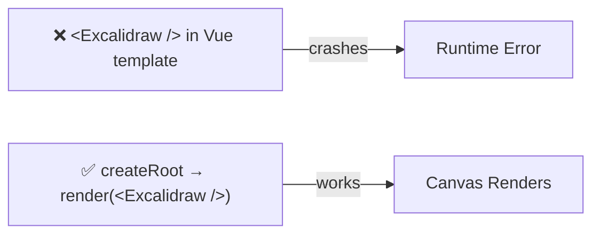
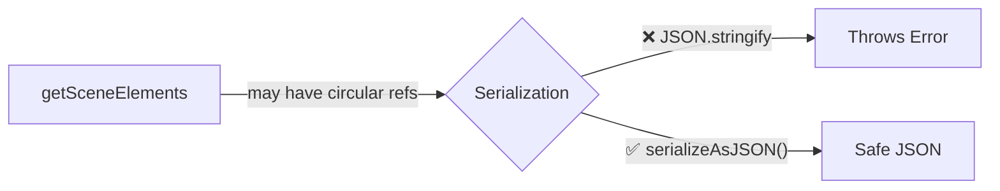
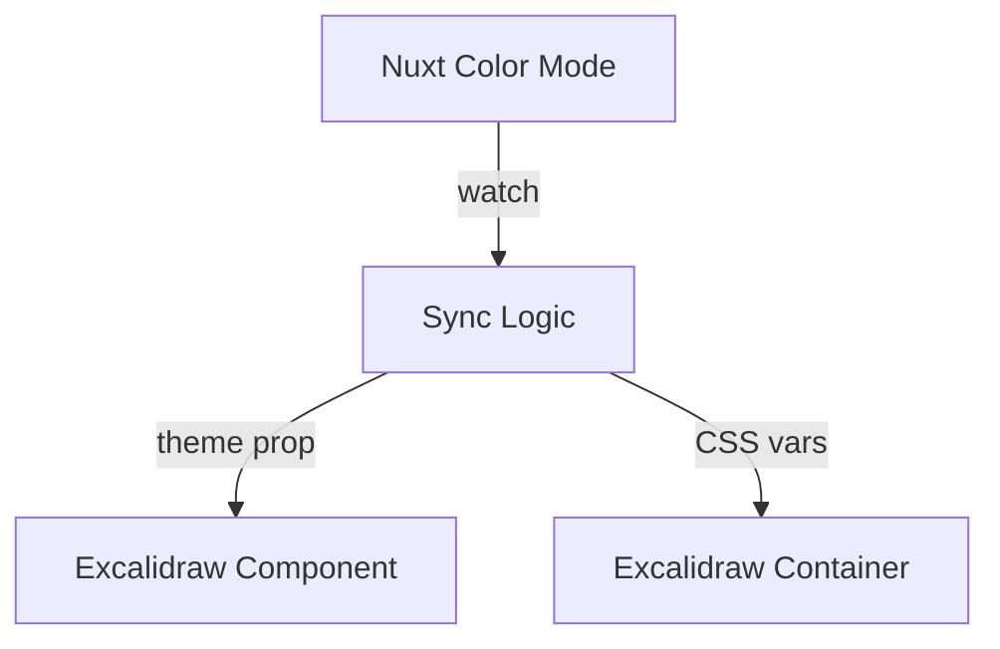

# Excalidraw Integration Gotchas

> **This file is agent memory.** Update it when you discover new pitfalls. Use Mermaid for complex explanations.

## React-in-Vue: Don't Import Excalidraw Directly in Vue Templates

Excalidraw is a React component. You cannot use `<Excalidraw />` directly in a Vue `<template>`.



```ts
// ✅ Bridge pattern
import { createRoot } from 'react-dom/client'
import { Excalidraw } from '@excalidraw/excalidraw'
```

## Client-Side Only: Excalidraw Needs the Browser

Excalidraw uses canvas APIs and window/document. It will crash during SSR.

```vue
<!-- ✅ Always wrap in ClientOnly -->
<ClientOnly>
  <ExcalidrawWrapper />
</ClientOnly>
```

Or name the component file with `.client.vue` suffix to auto-skip SSR.

## Excalidraw API Reference Must Be Current

The Excalidraw API changes between versions. Don't rely on training data for API shapes. Fetch the latest docs from `https://docs.excalidraw.com` when working on Excalidraw features.

## ExcalidrawAPI Instance: Don't Store in Reactive State

The API instance has internal methods. Deep reactivity tracking breaks performance.

```ts
// ❌ Causes performance issues
const api = ref(null)

// ✅ Use shallowRef or a plain variable
const api = shallowRef(null)
```

## Scene Data Serialization



Use the built-in `serializeAsJSON` utility for safe persistence.

## Theme Sync



Excalidraw has its own theme system. When implementing dark mode, you must pass the `theme` prop AND handle the CSS variables it expects. These two systems must be synced manually.
