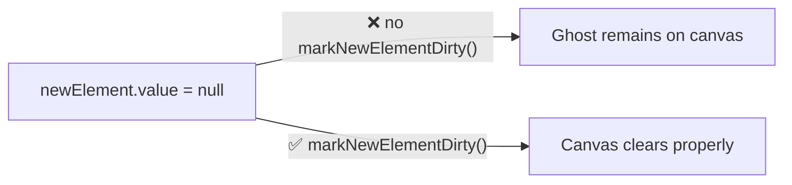
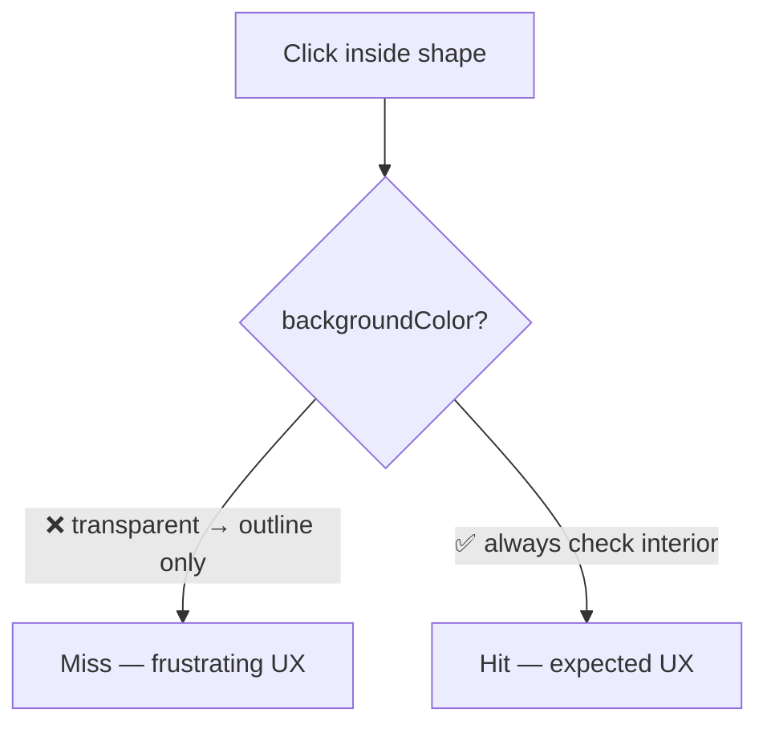
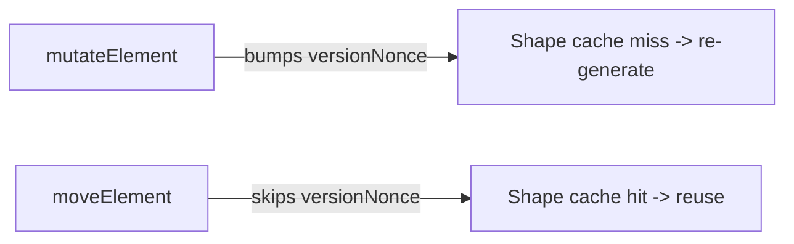
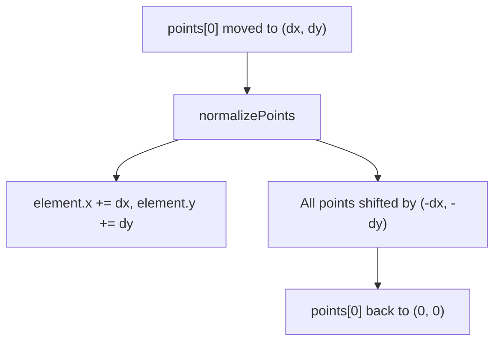
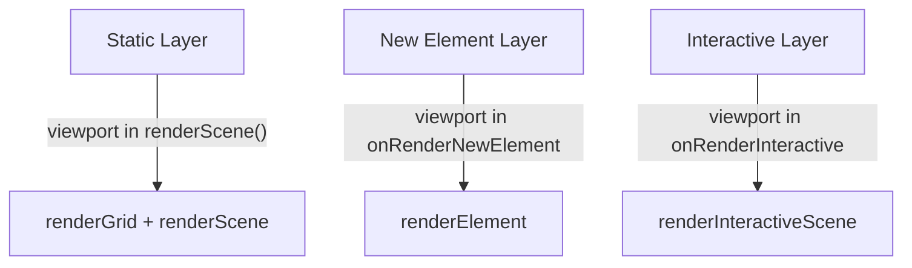
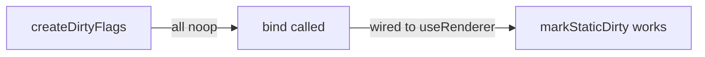
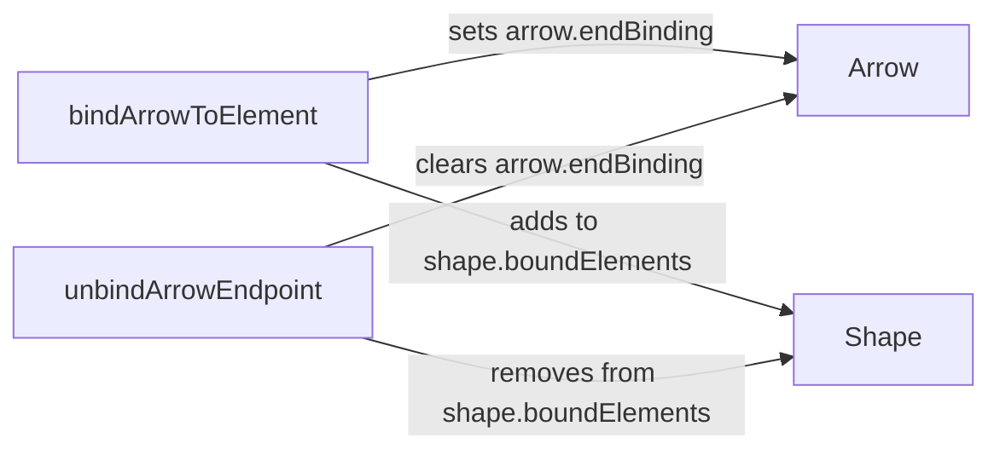
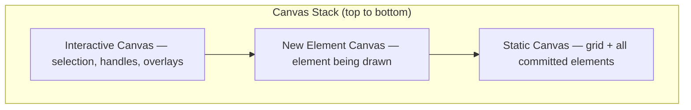
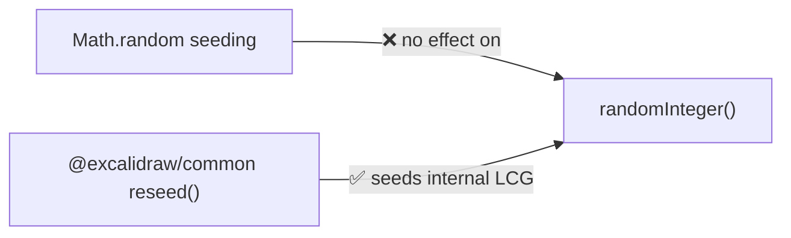
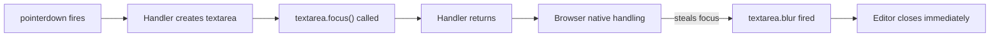

# Excalidraw Integration Gotchas

> **This file is agent memory.** Update it when you discover new pitfalls. Use Mermaid for complex explanations.

## No React Bridge: Native Canvas Rendering

This project does NOT use the Excalidraw React component. Instead, it renders directly to `<canvas>` using RoughJS and its own Vue composables. There is no `createRoot`, no React DOM, and no `<ClientOnly>` wrappers needed.

The `@excalidraw/excalidraw` package is NOT a dependency. Only `@excalidraw/common` is used (for `randomInteger`, `reseed`, and shared constants). The `excalidraw/` directory at the project root contains the original Excalidraw source code for **reference only** (git-ignored).

## SSR Is Disabled Globally

`nuxt.config.ts` sets `ssr: false`. All code runs client-side only. No need for `ClientOnly` wrappers or `.client.vue` suffixes. However, composables using `document` or `window` at module scope must still guard access for Vitest unit tests running in Node mode (see VueUse gotchas).

## Theme: CSS Filter Algorithm (Not Separate Palette)

Dark mode is implemented natively. `resolveColor(color, theme)` passes through in light mode, and in dark mode applies `invert(93%) + hue-rotate(180deg)` — the same algorithm as CSS filters, but computed in JS for canvas use. The document root gets a `theme--dark` class toggled via `watchEffect` in `CanvasContainer.vue`.

## HiDPI Canvas Setup Pattern

Canvas must be configured for devicePixelRatio on mount (window unavailable during SSR/setup):

```ts
const dpr = ref(1)

onMounted(() => {
  dpr.value = window.devicePixelRatio || 1
})

function bootstrapCanvas(ctx: CanvasRenderingContext2D, canvas: HTMLCanvasElement, dpr: number, w: number, h: number) {
  // Physical size (actual pixels)
  canvas.width = w * dpr
  canvas.height = h * dpr

  // CSS size (logical pixels)
  canvas.style.width = `${w}px`
  canvas.style.height = `${h}px`

  // Reset then scale for HiDPI
  ctx.setTransform(1, 0, 0, 1, 0, 0)
  ctx.scale(dpr, dpr)
}
```

All drawing coordinates remain in CSS pixels — the DPR scaling is transparent.

## Template Ref Name Collision with shallowRef

ESLint `vue/prefer-use-template-ref` triggers false positives when a `shallowRef` variable name matches a template ref name:

```vue
<!-- Template -->
<canvas ref="staticCanvas" />

<!-- Script — ❌ triggers lint error -->
<script setup>
const staticCanvas = shallowRef(null)
</script>

<!-- Script — ✅ use different names -->
<script setup>
const staticCanvasRef = useTemplateRef('staticCanvas')
const staticCtx = shallowRef(null)
</script>
```

Use `*Ref` suffix for template refs, plain names for context/state refs.

## Multi-Layer Canvas: Clear All Affected Layers on State Transitions

When using layered canvases (static, new-element, interactive), state transitions must explicitly mark all affected layers dirty. Vue reactivity doesn't automatically trigger canvas re-renders.



**Bug pattern**: After drawing, set `newElement = null` and `markStaticDirty()`, but forgot `markNewElementDirty()`. Result: ghost element visible at original position while dragging the real element.

**Rule**: Any state change that should visually clear a canvas layer must call that layer's dirty marker.

## Hit Testing: Separate Interaction from Visual Fill

Elements should be selectable by clicking anywhere inside their bounds, regardless of whether they have a visible fill color. Don't gate hit-test interior checks on `backgroundColor !== 'transparent'`.



**Bug pattern**: `hitTestRectangle()` only checked interior when `backgroundColor !== 'transparent'`. Since default is `'transparent'`, users could only select shapes by clicking their thin borders.

**Rule**: Selection hit-testing should always include shape interior. Visual rendering and interaction bounds are separate concerns.

## mutateElement vs moveElement: versionNonce and Shape Cache

`mutateElement()` bumps `versionNonce` via `randomVersionNonce()`, which invalidates the roughjs shape cache in `shapeGenerator.ts`. `moveElement()` deliberately does NOT bump `versionNonce` — it writes `x`/`y` directly so the expensive shape re-generation is skipped during drag.



**Bug pattern**: Using `mutateElement()` for every frame of a drag causes hundreds of unnecessary roughjs regenerations. Using `moveElement()` for a property change that should update the visual (e.g., changing strokeColor) causes stale rendering.

**Rule**: Use `moveElement()` only for position changes during drag. Use `mutateElement()` for all other property updates.

## Arrow Points Are Relative Offsets (Must Normalize)

Arrow `points` are offsets from `element.x/y`. `points[0]` must ALWAYS be `{x: 0, y: 0}`. When moving point[0], `normalizePoints()` shifts `element.x/y` to compensate and re-offsets all other points.



**Bug pattern**: Moving an arrow endpoint without calling `normalizePoints()` causes `points[0]` to drift from `(0, 0)`. Subsequent operations that assume `points[0] === (0, 0)` (rendering, hit-testing, binding) break silently.

**Rule**: Any operation that changes `points[0]` must normalize afterward. `movePoint()` and `movePoints()` in `pointHandles.ts` handle this automatically.

## Shape Cache: Keyed on versionNonce + Theme

`shapeGenerator.ts` caches roughjs `Drawable` objects by `(element.id, element.versionNonce, theme)`. Two implications:

1. **Theme switch invalidates the entire cache** — every element is re-generated on next render.
2. **Forgetting to bump versionNonce** means the cache returns stale geometry after mutations.

Use `pruneShapeCache()` (called by scene renderer) to remove cache entries for deleted elements. Otherwise the Map grows unbounded.

## Canvas Contexts Must Be Wrapped with markRaw

`useCanvasLayers` wraps both `CanvasRenderingContext2D` and `RoughCanvas` in `markRaw()` before storing in `shallowRef`. Vue's reactivity proxy wrapping native canvas contexts causes:
- Performance degradation from proxy traps on every draw call
- Potential errors when native methods check `this` identity

```ts
// ❌ Causes proxy wrapping
ctxRef.value = canvas.getContext('2d')

// ✅ Prevent reactivity tracking
ctxRef.value = markRaw(canvas.getContext('2d'))
```

**Rule**: Always `markRaw()` native browser objects (CanvasRenderingContext2D, RoughCanvas, WebGL contexts) before storing in Vue refs.

## Three-Layer Viewport Transform

All three canvas layers apply `ctx.scale(zoom) + ctx.translate(scrollX, scrollY)` before drawing. The static layer handles this inside `renderScene()`, but the new-element and interactive layers apply it in their `onRender*` callbacks in `useSceneRenderer`.



**Bug pattern**: Adding rendering code to the new-element or interactive callbacks without the viewport transform causes elements to render at screen coordinates instead of scene coordinates.

## Dirty Flag Indirection: bind() Required After Construction

`createDirtyFlags()` initializes all markers as `noop`. The real implementation is injected later via `bind(impl)` from `useRenderer`. Code that calls `markStaticDirty()` before `bind()` silently does nothing.



**Rule**: Ensure `bind()` is called during setup before any user interaction can trigger dirty marking. This is typically handled by the composable initialization order.

## triggerRef Required After ShallowRef Object Mutation

When mutating the inner object of a `shallowRef` (rather than replacing the ref value), Vue does not detect the change. You must call `triggerRef()` explicitly.

```ts
// shallowRef only tracks reference identity
const editingElement = shallowRef<ExcalidrawArrowElement | null>(null)

// ❌ mutateElement changes the object in-place — shallowRef doesn't notice
mutateElement(editingElement.value, { points: newPoints })

// ✅ Force reactivity update
mutateElement(editingElement.value, { points: newPoints })
triggerRef(editingElement)
```

This pattern appears in `useLinearEditor` and `useMultiPointCreation` — every `mutateElement()` call on the editing element is followed by `triggerRef()`.

## Zoom-Inverse Scaling for Interactive Visuals

All interactive overlays (selection borders, transform handles, point handles, grid dots, binding highlights, dash patterns) use `size / zoom` to maintain constant screen-space size regardless of zoom level.

```ts
const lineWidth = SELECTION_LINE_WIDTH / zoom
ctx.setLineDash([8 / zoom, 4 / zoom])
const threshold = POINT_HIT_THRESHOLD / zoom
const dotRadius = GRID_DOT_RADIUS / zoom
```

**Bug pattern**: Using a fixed pixel size for any interactive visual element. At zoom < 1, it becomes too large; at zoom > 10, it becomes invisible.

**Rule**: Any size constant used in interactive/overlay rendering must be divided by zoom. This includes line widths, dash arrays, padding, handle sizes, and hit-test thresholds.

## Binding Is Bidirectional: Must Update Both Sides

Arrow-shape binding mutates both objects:
- **Arrow side**: `startBinding` / `endBinding` with `{elementId, fixedPoint}`
- **Shape side**: entry in `boundElements[]` with `{id: arrowId, type: 'arrow'}`



**Bug pattern**: Clearing only the arrow's binding leaves an orphan entry in the shape's `boundElements`. When the shape is later moved, `updateBoundArrowEndpoints` tries to update the arrow with stale binding data.

**Rule**: Always use `unbindArrowEndpoint()` or `unbindArrow()` to clean both sides. Never clear `startBinding`/`endBinding` directly.

## Rotation: Unrotate-Then-Test Pattern

Hit testing, resizing, binding proximity detection, and transform handle positioning all handle rotation by unrotating the test point around the element center first, then checking against axis-aligned geometry.

```ts
const cx = el.x + el.width / 2
const cy = el.y + el.height / 2
const unrotated = rotatePoint(point, { x: cx, y: cy }, -el.angle)
// Now check against unrotated (axis-aligned) element bounds
```

**Bug pattern**: Checking a point against `el.x, el.y, el.width, el.height` without unrotating when `el.angle !== 0` gives wrong results. The bug is silent — it only manifests when users rotate elements.

**Rule**: Any geometric test against an element must check `element.angle` and unrotate accordingly.

## useTheme Is a Global State Singleton

`useTheme()` uses `createGlobalState()` from VueUse, meaning all consumers share the same reactive `theme` ref. Calling `useTheme()` in multiple composables does not create separate state — it returns the same instance.

Dark mode color resolution results are cached in a browser-only `Map` inside `colors.ts`. Since SSR is disabled, there's no server-side memory leak concern.

The `$reset()` method exists for testing teardown.

## Panning Divides Pixel Deltas by Zoom

`useViewport.panBy(dx, dy)` divides by zoom because `scrollX`/`scrollY` are in **scene coordinates**, not screen pixels:

```ts
scrollX.value += dx / zoom.value
scrollY.value += dy / zoom.value
```

**Bug pattern**: Passing scene-space deltas to `panBy()` (which expects screen-space pixel deltas) causes panning speed to scale inversely with zoom.

## Animation Controller: Tab Visibility Reset

`useAnimationController` resets each animation's `lastTime` to `performance.now()` when the browser tab becomes visible again. Without this, `deltaTime` would include all the time the tab was hidden, causing animations to jump to completion instantly.

The same visibility-aware pattern exists in `useRenderer`, which marks all layers dirty when the tab becomes visible.

## groupIds Array Order: Inner-to-Outer

Element `groupIds` are ordered inner-to-outer. `getOutermostGroupId()` returns `.at(-1)` (the last element). When building nested groups, new group IDs are appended: `[...prevGroupIds, newGroupId]`.

**Bug pattern**: Treating `groupIds[0]` as the outermost group. It's actually the innermost.

## Group Cleanup After Element Deletion

After deleting elements, groups may become orphans (fewer than 2 members). `cleanupAfterDelete()` must be called to:
1. Find groups with < 2 active members
2. Remove those groupIds from all remaining elements

**Bug pattern**: Deleting elements without calling `cleanupAfterDelete()`. Remaining elements appear selected as a group but the group has only one member.

## Resize Operates in Unrotated Coordinate Space

`resizeElement()` unrotates the pointer around the element center before computing deltas. It also handles:
- **Negative dimensions**: When dragging past the opposite edge, it flips `x`/`width` (or `y`/`height`)
- **Minimum size**: Enforced via `MIN_ELEMENT_SIZE` constant
- **Aspect ratio lock**: Shift-key constrains to original aspect ratio

## Rendering Order and Layer Z-Index

Elements render back-to-front (array order). Hit testing iterates back-to-front but returns the FIRST hit (topmost element). The three canvas layers stack:



**Bug pattern**: Adding an element to the scene array without sorting/positioning it correctly — it renders behind existing elements.

## Viewport Culling: Only Static Layer

The viewport frustum culling (skipping off-screen elements) only happens in `renderScene()` for the static layer. The interactive layer renders ALL selected elements regardless of viewport bounds. A selected element that is off-screen still gets selection borders rendered (they just aren't visible).

## useElements: shallowRef + elementMap Dual Tracking

`useElements()` maintains both a `shallowRef<readonly ExcalidrawElement[]>` for reactivity and a `Map<string, ExcalidrawElement>` for O(1) ID lookups. When using `replaceElements()`, both must be synchronized. Direct mutation of the array without going through `addElement`/`replaceElements` will desync the Map.

## @excalidraw/common Has Its Own PRNG (Not Math.random)

`randomInteger()` from `@excalidraw/common` uses RoughJS's LCG (Linear Congruential Generator) PRNG, seeded with `Date.now()` at module load — **not `Math.random()`**.



**Impact**: Element `seed` properties (used by RoughJS for hand-drawn stroke jitter) become non-deterministic across runs. Screenshot tests fail with varying pixel diffs.

**Fix**: Seed BOTH sources in test setup:

```ts
import { reseed as excalidrawReseed } from '@excalidraw/common'

export function reseed(seed = 12_345): void {
  // Seed Math.random (for any code using it directly)
  originalRandom = Math.random
  Math.random = mulberry32(seed)

  // Seed @excalidraw/common's PRNG (for element seeds)
  excalidrawReseed(seed)
}
```

**Rule**: When writing deterministic tests involving element creation, always call `@excalidraw/common`'s `reseed()` alongside any `Math.random` seeding.

## Focusing Elements Inside pointerdown Handlers

When creating and focusing an input/textarea inside a `pointerdown` handler, the browser's native pointer event processing may steal focus back after the handler returns. This causes an immediate `blur` event with `relatedTarget: null`.



**Symptom**: Editor opens and closes instantly on click — no error, no console warning.

**Current implementations differ:**
- `useTextInteraction.ts` calls `textarea.focus()` synchronously (works because the text editor container is separate from the canvas pointer target)
- `useCodeInteraction.ts` defers with `requestAnimationFrame(() => textarea.focus())` to avoid the focus-steal race

**Both use the tool-switch-before-open pattern** — `setTool('selection')` is called before opening the editor, preventing `onBeforeToolChange` from closing it immediately:

```ts
// In pointerdown handler:
setTool('selection')  // Switch BEFORE opening
openEditor(element)   // Editor sets editingElement ref
```

**Reference**: See `useTextInteraction.ts` (line ~329) and `useCodeInteraction.ts` (line ~162).

## createElement Override Ordering

When adding a new element type branch in `createElement.ts`, **always spread `...overrides` after type-specific defaults**:

```ts
// ❌ Bug: overrides from base get overwritten by type-specific defaults
if (type === 'image') {
  return {
    ...base,           // base includes ...overrides
    type: 'image',
    fileId: null,      // overwrites caller's fileId!
    status: 'pending',
  } as SupportedElement
}

// ✅ Correct: spread overrides again after defaults
if (type === 'image') {
  return {
    ...base,
    type: 'image',
    fileId: null,
    status: 'pending',
    ...overrides,      // caller overrides win
  } as SupportedElement
}
```

The `base` object already includes `...overrides`, but type-specific defaults set afterward overwrite them. This gotcha is non-obvious because `base` appears to handle overrides, yet type-specific branches silently clobber them.

## @excalidraw/math Subpath Imports Fail at Build Time

The `@excalidraw/math` package's `exports` map only defines `types` for `./*` subpaths — no runtime JS condition:

```json
"./*": {
  "types": "./dist/types/math/src/*.d.ts"
}
```

`@excalidraw/element` imports `@excalidraw/math/ellipse` at runtime, which causes Vite/Rollup to fail during production build:

```
Error: [commonjs--resolver] No known conditions for "./ellipse" specifier in "@excalidraw/math" package
```

The main entry (`"."`) already re-exports all ellipse functions, so the fix is a Vite resolve alias in `nuxt.config.ts`:

```ts
vite: {
  resolve: {
    alias: {
      '@excalidraw/math/ellipse': '@excalidraw/math',
    },
  },
},
```

**Rule**: If a new `@excalidraw/*` package update introduces more subpath imports (e.g., `/polygon`, `/curve`), add additional aliases as needed.
