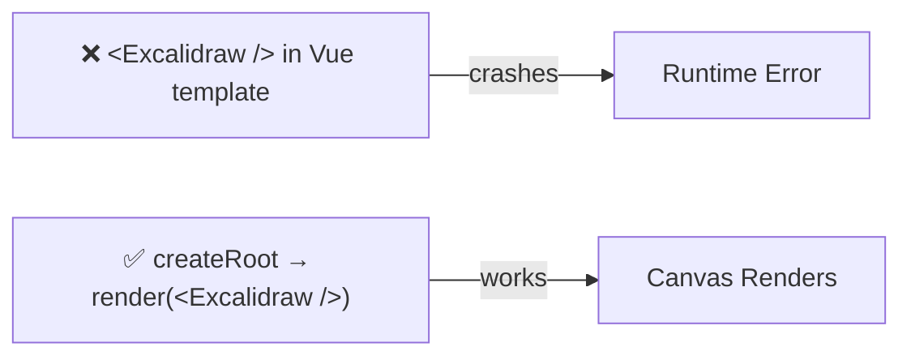
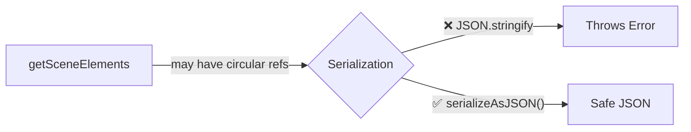
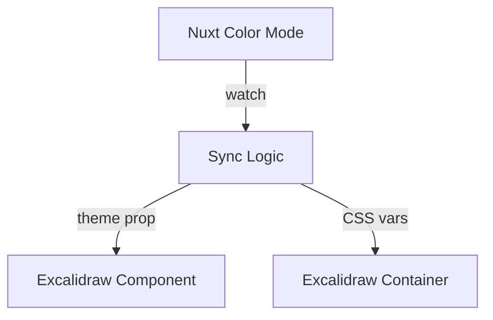
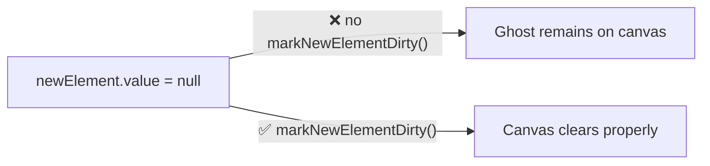
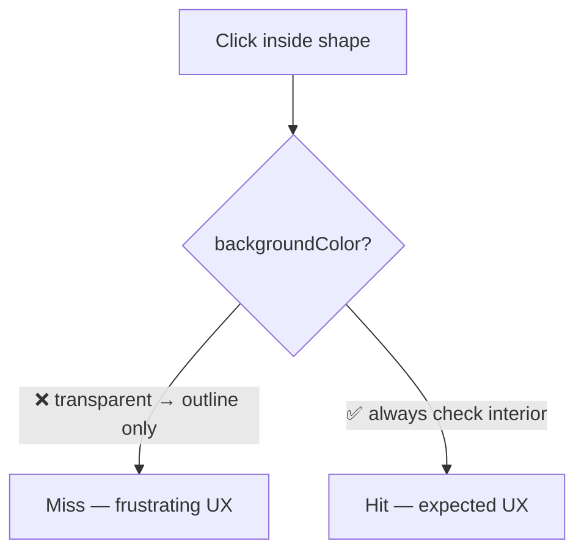

# Excalidraw Integration Gotchas

> **This file is agent memory.** Update it when you discover new pitfalls. Use Mermaid for complex explanations.

## React-in-Vue: Don't Import Excalidraw Directly in Vue Templates

Excalidraw is a React component. You cannot use `<Excalidraw />` directly in a Vue `<template>`.



```ts
// ✅ Bridge pattern
import { createRoot } from 'react-dom/client'
import { Excalidraw } from '@excalidraw/excalidraw'
```

## Client-Side Only: Excalidraw Needs the Browser

Excalidraw uses canvas APIs and window/document. It will crash during SSR.

```vue
<!-- ✅ Always wrap in ClientOnly -->
<ClientOnly>
  <ExcalidrawWrapper />
</ClientOnly>
```

Or name the component file with `.client.vue` suffix to auto-skip SSR.

## Excalidraw API Reference Must Be Current

The Excalidraw API changes between versions. Don't rely on training data for API shapes. Fetch the latest docs from `https://docs.excalidraw.com` when working on Excalidraw features.

## ExcalidrawAPI Instance: Don't Store in Reactive State

The API instance has internal methods. Deep reactivity tracking breaks performance.

```ts
// ❌ Causes performance issues
const api = ref(null)

// ✅ Use shallowRef or a plain variable
const api = shallowRef(null)
```

## Scene Data Serialization



Use the built-in `serializeAsJSON` utility for safe persistence.

## Theme Sync



Excalidraw has its own theme system. When implementing dark mode, you must pass the `theme` prop AND handle the CSS variables it expects. These two systems must be synced manually.

## HiDPI Canvas Setup Pattern

Canvas must be configured for devicePixelRatio on mount (window unavailable during SSR/setup):

```ts
const dpr = ref(1)

onMounted(() => {
  dpr.value = window.devicePixelRatio || 1
})

function bootstrapCanvas(ctx: CanvasRenderingContext2D, canvas: HTMLCanvasElement, dpr: number, w: number, h: number) {
  // Physical size (actual pixels)
  canvas.width = w * dpr
  canvas.height = h * dpr

  // CSS size (logical pixels)
  canvas.style.width = `${w}px`
  canvas.style.height = `${h}px`

  // Reset then scale for HiDPI
  ctx.setTransform(1, 0, 0, 1, 0, 0)
  ctx.scale(dpr, dpr)
}
```

All drawing coordinates remain in CSS pixels — the DPR scaling is transparent.

## Template Ref Name Collision with shallowRef

ESLint `vue/prefer-use-template-ref` triggers false positives when a `shallowRef` variable name matches a template ref name:

```vue
<!-- Template -->
<canvas ref="staticCanvas" />

<!-- Script — ❌ triggers lint error -->
<script setup>
const staticCanvas = shallowRef(null)
</script>

<!-- Script — ✅ use different names -->
<script setup>
const staticCanvasRef = useTemplateRef('staticCanvas')
const staticCtx = shallowRef(null)
</script>
```

Use `*Ref` suffix for template refs, plain names for context/state refs.

## Multi-Layer Canvas: Clear All Affected Layers on State Transitions

When using layered canvases (static, new-element, interactive), state transitions must explicitly mark all affected layers dirty. Vue reactivity doesn't automatically trigger canvas re-renders.



**Bug pattern**: After drawing, set `newElement = null` and `markStaticDirty()`, but forgot `markNewElementDirty()`. Result: ghost element visible at original position while dragging the real element.

**Rule**: Any state change that should visually clear a canvas layer must call that layer's dirty marker.

## Hit Testing: Separate Interaction from Visual Fill

Elements should be selectable by clicking anywhere inside their bounds, regardless of whether they have a visible fill color. Don't gate hit-test interior checks on `backgroundColor !== 'transparent'`.



**Bug pattern**: `hitTestRectangle()` only checked interior when `backgroundColor !== 'transparent'`. Since default is `'transparent'`, users could only select shapes by clicking their thin borders.

**Rule**: Selection hit-testing should always include shape interior. Visual rendering and interaction bounds are separate concerns.
