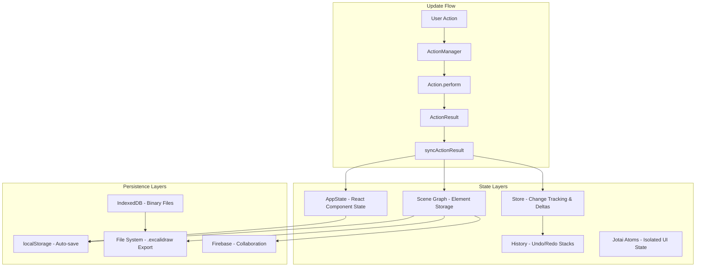
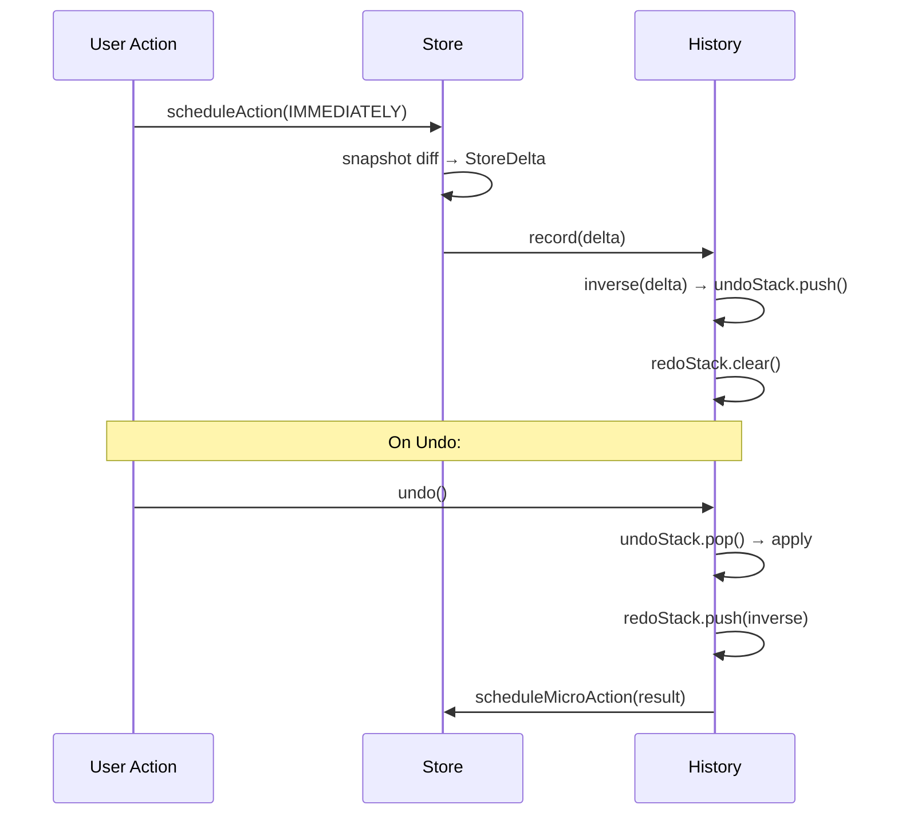
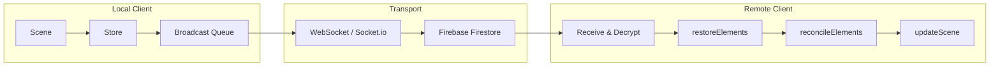

# Excalidraw State Management & Persistence

> Reference documentation reverse-engineered from the Excalidraw source code.
> Use this to understand patterns before implementing state/persistence in our Nuxt app.

## Table of Contents

- [Architecture Overview](#architecture-overview)
- [1. AppState](#1-appstate)
- [2. Scene & Element Storage](#2-scene--element-storage)
- [3. Element Mutability](#3-element-mutability)
- [4. Actions System](#4-actions-system)
- [5. History & Undo/Redo](#5-history--undoredo)
- [6. Change Tracking (Store & Deltas)](#6-change-tracking-store--deltas)
- [7. Fractional Indexing](#7-fractional-indexing)
- [8. Persistence & Serialization](#8-persistence--serialization)
- [9. Collaboration & Reconciliation](#9-collaboration--reconciliation)
- [10. Jotai Atoms (Lightweight UI State)](#10-jotai-atoms-lightweight-ui-state)
- [Key Takeaways for Our Nuxt App](#key-takeaways-for-our-nuxt-app)

---

## Architecture Overview

Excalidraw uses a **hybrid, multi-layered** state architecture:



| Layer | Mechanism | Purpose | Persisted? |
|-------|-----------|---------|------------|
| **AppState** | React `this.state` / `setState()` | UI state (tools, menus, zoom, selections) | Partially (per config) |
| **Scene Graph** | `Scene` class with element maps | Element storage and ordering | Yes (elements only) |
| **Store** | `Store` class with snapshots | Change detection, delta emission | No (runtime only) |
| **History** | `History` class with dual stacks | Undo/redo via inverse deltas | No (in-memory) |
| **Jotai Atoms** | `editorJotaiStore` | Lightweight isolated UI state | No |
| **Actions** | `ActionManager` command dispatcher | Encapsulates state mutations | No |

---

## 1. AppState

**Source:** `packages/excalidraw/types.ts` (lines 269-463), `packages/excalidraw/appState.ts`

AppState is a single large interface (~130 properties) managed as React component state. It covers:

### Key Property Groups

| Group | Examples | Persisted To |
|-------|----------|-------------|
| **Active Tool** | `activeTool`, `preferredSelectionTool` | Browser |
| **Viewport** | `zoom`, `scrollX`, `scrollY`, `width`, `height` | Browser |
| **Selection** | `selectedElementIds`, `selectedGroupIds`, `editingGroupId` | Browser only |
| **Editing** | `editingTextElement`, `newElement`, `multiElement` | Never |
| **Drawing Prefs** | `currentItemStrokeColor`, `currentItemFontFamily`, etc. | All (browser + export + server) |
| **UI Panels** | `openMenu`, `openPopup`, `openSidebar`, `openDialog` | Never |
| **Canvas** | `gridSize`, `gridModeEnabled`, `zenModeEnabled`, `theme` | All |
| **Collaboration** | `collaborators`, `followedBy`, `userToFollow` | Never |
| **Transient** | `isLoading`, `isResizing`, `isRotating`, `isCropping` | Never |

### Initialization

`getDefaultAppState()` creates the full default state. The App constructor merges defaults with props:

```typescript
this.state = {
  ...defaultAppState,
  theme,
  isLoading: true,
  ...this.getCanvasOffsets(),
  // prop overrides...
};
```

### Storage Configuration

`APP_STATE_STORAGE_CONF` (in `appState.ts`) defines per-field persistence targets:

```typescript
// Examples:
theme:              { browser: true, export: true,  server: true  }
gridSize:           { browser: true, export: true,  server: true  }
selectedElementIds: { browser: true, export: false, server: false }
newElement:         { browser: false, export: false, server: false }
```

Three cleanup functions filter AppState before storage:
- `clearAppStateForLocalStorage()` — browser storage
- `cleanAppStateForExport()` — file export
- `clearAppStateForDatabase()` — server/collaboration

---

## 2. Scene & Element Storage

**Source:** `packages/element/src/Scene.ts`

The `Scene` class is the authoritative element store. It maintains four synchronized data structures:

```
elements                 → readonly array of ALL elements (including deleted)
elementsMap              → Map<id, Ordered<ExcalidrawElement>>     (SceneElementsMap)
nonDeletedElements       → filtered array of non-deleted only
nonDeletedElementsMap    → Map<id, Ordered<NonDeleted<...>>>       (NonDeletedSceneElementsMap)
```

### Key Methods

```typescript
replaceAllElements(nextElements)     // Bulk replace (used by actions, reconciliation)
insertElement(element)               // Add single element
insertElements(elements[])           // Add multiple elements
mutateElement(element, updates)      // In-place mutation with version bump
mapElements(iteratee)                // Map + auto-invalidation
getSelectedElements(opts)            // Cached selection lookup
getElement(id)                       // By ID lookup
```

### Render Invalidation

- `sceneNonce` — random integer regenerated on every update, used for renderer cache invalidation

### Soft Deletion

Elements are **never hard-deleted**. Instead, `isDeleted: true` is set:

```typescript
// Filtering:
const nonDeleted = allElements.filter(el => !el.isDeleted);
```

Why soft deletion?
1. Undo/redo can restore deleted elements
2. Collaboration peers can recover elements
3. History deltas reference elements by ID (they must still exist)

---

## 3. Element Mutability

**Source:** `packages/element/src/mutateElement.ts`

Elements are typed as `Readonly<>` but Excalidraw uses **two mutation strategies**:

### A) `mutateElement()` — In-Place Mutation

```typescript
mutateElement(element, elementsMap, { x: 100, y: 200 });
// Directly mutates the object
// Bumps version, versionNonce, updated timestamp
// Invalidates ShapeCache
```

Used during: dragging, resizing, real-time editing (performance-critical paths).

### B) `newElementWith()` — Immutable Spread

```typescript
const updated = newElementWith(element, { x: 100, y: 200 });
// Returns a new object via { ...element, ...updates }
// Also bumps version/versionNonce/updated
```

Used by: actions that return new element arrays.

### Version Tracking (Per Element)

Every element carries three versioning fields:

| Field | Type | Purpose |
|-------|------|---------|
| `version` | `number` | Sequential counter, incremented on every change |
| `versionNonce` | `number` | Random integer for deterministic tie-breaking |
| `updated` | `number` | Epoch ms timestamp |

---

## 4. Actions System

**Source:** `packages/excalidraw/actions/manager.tsx`, `actions/types.ts`

The `ActionManager` is the command dispatcher. All state mutations flow through actions.

### Action Interface

```typescript
interface Action {
  name: string;
  label: string;
  keywords?: string[];
  keyTest?: (event: KeyboardEvent) => boolean;  // Keyboard shortcut
  perform: (
    elements: ExcalidrawElement[],
    appState: AppState,
    formData: any,
    app: AppClassProperties,
  ) => ActionResult | false;
}
```

### ActionResult

```typescript
interface ActionResult {
  elements?: ExcalidrawElement[] | null;      // New elements array
  appState?: Partial<AppState> | null;        // State patches
  files?: BinaryFiles | null;                 // Binary file updates
  captureUpdate: CaptureUpdateActionType;     // History control
  replaceFiles?: boolean;
}
```

### Update Flow

```
User Event → ActionManager.executeAction(action)
           → action.perform(elements, appState)
           → ActionResult
           → syncActionResult()
               ├─ store.scheduleAction(captureUpdate)
               ├─ scene.replaceAllElements(elements)
               ├─ addMissingFiles(files)
               └─ setState(appState)
```

### CaptureUpdateAction — History Control

| Mode | When Used | Undo-able? |
|------|-----------|------------|
| `IMMEDIATELY` | User-initiated actions (draw, delete, style change) | Yes, immediately |
| `EVENTUALLY` | Frequent updates (scroll, zoom, typing batches) | Yes, batched later |
| `NEVER` | Remote collaboration updates, scene initialization | No |

---

## 5. History & Undo/Redo

**Source:** `packages/excalidraw/history.ts`

### Dual-Stack Architecture

```typescript
class History {
  undoStack: HistoryDelta[] = [];
  redoStack: HistoryDelta[] = [];
}
```

### How It Works

1. **Recording:** When `Store` emits a `DurableIncrement`, `History.record()` is called
2. **Inversion:** The delta is inverted (`HistoryDelta.inverse()`) and pushed to `undoStack`
3. **Redo clear:** If element changes occurred, `redoStack` is cleared (appState-only changes preserve redo)
4. **Undo:** Pop from `undoStack`, apply inverse, push result to `redoStack`
5. **Redo:** Pop from `redoStack`, apply inverse, push result to `undoStack`

### Key Design Decisions

- **Stores deltas, not snapshots** — more memory-efficient, enables collaboration
- **Skips invisible changes** — if undo results in no visible difference, auto-continues to next entry
- **Excludes `version`/`versionNonce`** from history application — each undo/redo is treated as a new edit for collaboration sync



---

## 6. Change Tracking (Store & Deltas)

**Source:** `packages/element/src/store.ts`, `packages/element/src/delta.ts`

### Hierarchy

```
StoreChange        — What changed (lightweight, reference comparison)
StoreDelta         — How to reverse it (heavy, property-level diffs)
StoreIncrement     — Change event wrapper
  ├─ DurableIncrement    — Has both StoreChange + StoreDelta (undoable)
  └─ EphemeralIncrement  — Has only StoreChange (not undoable)
```

### Delta System

The `Delta<T>` class stores bidirectional changes:

```typescript
class Delta<T> {
  deleted: Partial<T>;   // Values before the change
  inserted: Partial<T>;  // Values after the change
}
```

Supports: calculation (shallow diff), inversion (swap deleted/inserted), squashing (merge), application.

### ElementsDelta

Categorizes element changes:

```typescript
class ElementsDelta {
  added:   Record<id, Delta<ElementPartial>>  // isDeleted: true → false
  removed: Record<id, Delta<ElementPartial>>  // isDeleted: false → true
  updated: Record<id, Delta<ElementPartial>>  // Property changes only
}
```

### Store Snapshot Mechanism

- `StoreSnapshot` — immutable cached state for change detection
- Uses **reference equality** for elements (cheap) and **hashing** for `EVENTUALLY` actions
- Only clones when changes are detected

### Macro/Micro Actions

- **Macro actions:** One per commit cycle, priority: `IMMEDIATELY > NEVER > EVENTUALLY`
- **Micro actions:** Pre-executed before macro (used by history to re-emit changes without re-recording)

---

## 7. Fractional Indexing

**Source:** `packages/element/src/fractionalIndex.ts`

Uses the [`fractional-indexing`](https://github.com/rocicorp/fractional-indexing) library for element ordering.

### Why?

Enables element reordering in multiplayer without global index coordination. Each element has a string-based `index` property that maintains sort order.

### Key Functions

| Function | Purpose |
|----------|---------|
| `orderByFractionalIndex(elements)` | Sort by index, break ties by ID |
| `syncMovedIndices(elements, moved)` | Generate new indices for moved elements only |
| `syncInvalidIndices(elements)` | Fix contiguous groups of invalid indices |
| `validateFractionalIndices(elements)` | Assert: `prev.index < el.index < next.index` |

### Invariant

The `Scene` class keeps fractional indices in sync with array order on every mutation.

---

## 8. Persistence & Serialization

**Source:** `packages/excalidraw/data/`

### Storage Layers

| Storage | Data | Purpose | Limits |
|---------|------|---------|--------|
| **localStorage** | Elements JSON, AppState | Quick auto-save | ~5-10MB |
| **IndexedDB** | Binary files (images) | Large media | Quota-based (~GB) |
| **File System** | `.excalidraw` exports | User downloads | None |
| **PNG/SVG** | Scene metadata in image chunks | Shareable images with embedded data | Image size |
| **Firebase** | Encrypted elements + files | Collaboration | Cloud quota |

### .excalidraw File Format

```json
{
  "type": "excalidraw",
  "version": 2,
  "source": "https://excalidraw.com",
  "elements": [ /* ExcalidrawElement[] */ ],
  "appState": { /* cleaned AppState */ },
  "files": { /* FileId → BinaryFileData */ }
}
```

MIME type: `application/vnd.excalidraw+json`

### Serialization Pipeline

```
serializeAsJSON(elements, appState, files, type)
  ├─ cleanAppStateForExport(appState)     // Strip transient fields
  ├─ filterOutDeletedFiles(elements, files) // Remove unused images
  └─ JSON.stringify(data, null, 2)        // Pretty-printed JSON
```

### localStorage Auto-Save

```typescript
// Debounced save (prevents excessive writes)
saveDataStateToLocalStorage(elements, appState):
  1. clearAppStateForLocalStorage(appState)   // Strip transient state
  2. getNonDeletedElements(elements)          // Only non-deleted
  3. localStorage.setItem(ELEMENTS_KEY, JSON.stringify(...))
  4. localStorage.setItem(APP_STATE_KEY, JSON.stringify(...))
  5. Update version tracking
  // Catches QuotaExceededError for graceful degradation
```

Save can be **paused/resumed** (e.g., during collaboration or when tab is hidden).

### IndexedDB — Binary File Storage

```typescript
// Uses idb-keyval library
filesStore = createStore("files-db", "files-store");

// File entry:
{
  id: FileId,
  mimeType: string,
  created: number,
  lastRetrieved: number,  // For cleanup
  data: ArrayBuffer
}

// Cleanup: deletes files older than 24h not referenced in canvas
```

### Embedded Scene in Images

**PNG:** Scene data compressed (pako) → embedded as PNG `tEXt` chunk with keyword `application/vnd.excalidraw+json`

**SVG:** Scene data → Base64-encoded → embedded in SVG metadata

### Encryption (for Collaboration)

- Algorithm: **AES-GCM** (128-bit key, 12-byte IV)
- Key format: JWK (JSON Web Key)
- Uses Web Crypto API (`crypto.subtle`)
- Each collaboration room has its own encryption key

### Data Restoration

`restoreElements()` handles:
- Schema migrations
- Binding repair (arrow → shape connections)
- Element validation
- Merging imported state with local state

---

## 9. Collaboration & Reconciliation

**Source:** `excalidraw-app/collab/Collab.tsx`, `packages/excalidraw/data/reconcile.ts`

### Architecture



### Reconciliation Algorithm

```typescript
reconcileElements(localElements, remoteElements, localAppState):
  // For each remote element:
  //   LOCAL WINS if:
  //     1. Element is being actively edited locally
  //     2. Local version > remote version
  //     3. Same version but local versionNonce <= remote versionNonce
  //   REMOTE WINS otherwise

  // Final: merge + reorder by fractional index
```

### Scene Version

```typescript
getSceneVersion(elements) = elements.reduce((acc, el) => acc + el.version, 0);
// Sum of all element versions — used to detect if broadcast needed
```

### Firebase Storage Structure

```typescript
// Firestore document per room:
{
  sceneVersion: number,
  iv: Bytes,           // AES-GCM initialization vector
  ciphertext: Bytes    // Encrypted elements JSON
}

// Cloud Storage for files:
// files/rooms/{roomId}/{fileId}
```

### Collaborator State

```typescript
collaborators: Map<SocketId, {
  pointer: { x, y, tool }
  selectedElementIds: Record<string, true>
  username: string
  avatarUrl: string
  isIdleState: boolean
}>
```

---

## 10. Jotai Atoms (Lightweight UI State)

**Source:** `packages/excalidraw/editor-jotai.ts`

For UI state that doesn't need to be in AppState or serialized:

```typescript
import { createStore, atom } from "jotai";
import { createIsolation } from "jotai-scope";

const jotai = createIsolation();
export const { useAtom, useSetAtom, useAtomValue } = jotai;
export const editorJotaiStore = createStore();
```

**Example atoms:** `convertElementTypePopupAtom`, `activeEyeDropperAtom`, `isSidebarDockedAtom`, `searchItemInFocusAtom`

These atoms are UI-only — they don't affect undo/redo, aren't serialized, and avoid full re-renders.

---

## Key Takeaways for Our Nuxt App

### What to Adopt

1. **Soft deletion** (`isDeleted` flag) — essential for undo/redo and future collaboration
2. **Version + versionNonce per element** — enables deterministic conflict resolution
3. **Delta-based history** — store diffs not snapshots; more efficient and collaboration-friendly
4. **CaptureUpdateAction pattern** — three modes (IMMEDIATELY/EVENTUALLY/NEVER) to control what's undoable
5. **Fractional indexing** — element ordering without global coordination
6. **Storage config per field** — explicit control over what persists where
7. **Scene class as element authority** — single source of truth with maps + filtered views

### What to Translate to Vue

| React Pattern | Vue Equivalent |
|---------------|----------------|
| `this.state` + `setState()` | `reactive()` / `ref()` in composables |
| React Context + hooks | `provide`/`inject` or composables with shared state |
| Jotai atoms | `ref()` in module-scoped composables |
| `ActionManager` class | Composable with action registry |
| `withBatchedUpdates()` | `nextTick()` or `watchEffect()` batching |
| `PureComponent` | `defineComponent` with `shallowRef` for elements |

### What to Simplify

- **No Firebase initially** — start with localStorage + IndexedDB only
- **No encryption** — add when collaboration is implemented
- **Simpler action system** — Vue composables can directly mutate reactive state
- **Use `shallowRef` for elements array** — triggers reactivity on array replacement, not deep mutations (matches Excalidraw's `replaceAllElements` pattern)
