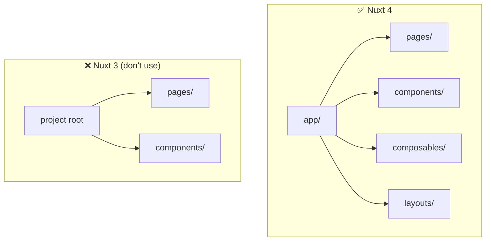
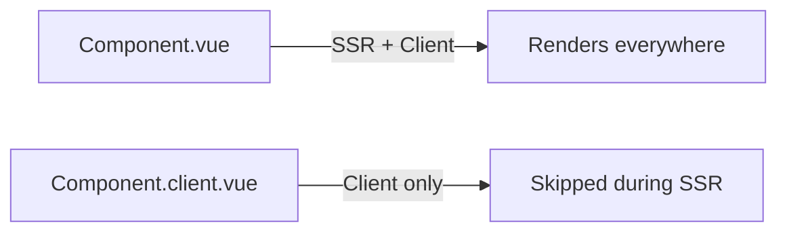

# Nuxt 4 Gotchas

> **This file is agent memory.** Update it when you discover new pitfalls. Use Mermaid for complex explanations.

## Nuxt 4 Directory Structure



Everything lives under `app/`. Don't put pages, components, or composables at the project root.

## Auto-Imports: Don't Manually Import Vue/Nuxt APIs

Nuxt auto-imports `ref`, `computed`, `useState`, `useRoute`, `useFetch`, `definePageMeta`, and all other Vue/Nuxt composables. Adding manual imports creates duplicate declarations.

```ts
// ❌ Unnecessary
import { ref, computed } from 'vue'

// ✅ Just use them
const count = ref(0)
```

## `compatibilityDate` Is Required in Nuxt 4

The `nuxt.config.ts` must include `compatibilityDate`. This locks behavior to a specific date so Nuxt can introduce breaking changes in minor versions without affecting existing projects.

## Client-Only Components: Use `.client.vue` Suffix



Components that need browser APIs (canvas, window, document) use the `.client.vue` convention.

## `useHead` Replaces Manual `<head>` Tags

Don't add `<meta>` or `<link>` tags directly. Use `useHead()` or `useSeoMeta()` composables.

## Dev Server Port Conflicts

Default port is 3000. If another service uses it, Nuxt will auto-increment. Check terminal output for actual port.
