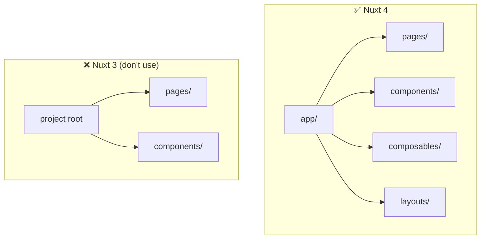

# Nuxt 4 Gotchas

> **This file is agent memory.** Update it when you discover new pitfalls. Use Mermaid for complex explanations.

## Nuxt 4 Directory Structure



Everything lives under `app/`. Don't put pages, components, or composables at the project root.

## Auto-Imports Are DISABLED

`nuxt.config.ts` sets `imports: { autoImport: false }`. **All imports must be explicit** — no Vue APIs, no composables, no utilities are auto-imported.

```ts
// ✅ Every file must import what it uses
import { shallowRef, triggerRef } from "vue";
import type { Ref, ShallowRef } from "vue";

export function useFoo(bar: Ref<number>) {
  const x = shallowRef(null);
  return x;
}
```

```ts
// ❌ This fails — nothing is auto-imported
export function useFoo() {
  const x = ref(0); // Error: ref is not defined
}
```

This applies equally to `.ts` and `.vue` files. The rationale is explicit dependency tracking and avoiding "magic" imports.

## `compatibilityDate` Is Required in Nuxt 4

The `nuxt.config.ts` must include `compatibilityDate`. This locks behavior to a specific date so Nuxt can introduce breaking changes in minor versions without affecting existing projects.

## SSR Is Disabled: No `.client.vue` Needed

`nuxt.config.ts` sets `ssr: false`, so all components run client-side only. The `.client.vue` suffix convention and `<ClientOnly>` wrappers are unnecessary in this project.

However, composables that access `document` or `window` at the module level still need guards for **Vitest unit tests running in Node mode** (see VueUse gotchas).

## `useHead` Replaces Manual `<head>` Tags

Don't add `<meta>` or `<link>` tags directly. Use `useHead()` or `useSeoMeta()` composables.

## Dev Server Port Conflicts

Default port is 3000. If another service uses it, Nuxt will auto-increment. Check terminal output for actual port.

## Tailwind CSS v4: Use Vite Plugin, Not Nuxt Module

The `@nuxtjs/tailwindcss` module still uses Tailwind v3. For Tailwind v4 (2025+), use the official Vite plugin directly:

```bash
pnpm add tailwindcss @tailwindcss/vite
```

```ts
// nuxt.config.ts
import tailwindcss from "@tailwindcss/vite";

export default defineNuxtConfig({
  css: ["~/assets/css/main.css"],
  vite: {
    plugins: [tailwindcss()],
  },
});
```

Tailwind v4 uses CSS-first configuration — no `tailwind.config.js`:

```css
/* app/assets/css/main.css */
@import "tailwindcss";

@theme {
  --color-base: rgb(33, 39, 55);
  --color-accent: rgb(255, 107, 237);
}
```

Colors become utilities automatically: `bg-base`, `text-accent`, etc.
