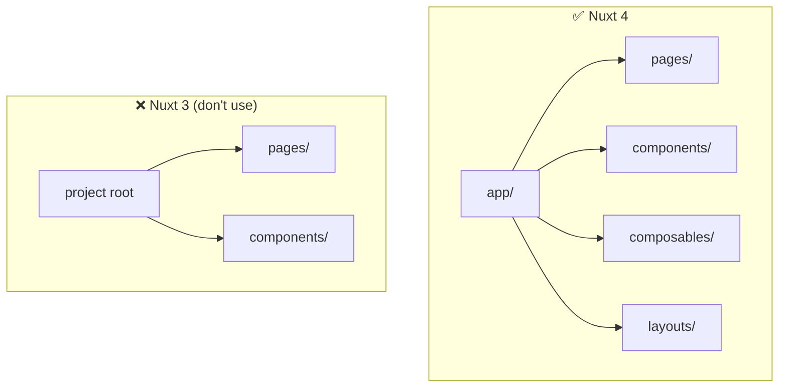
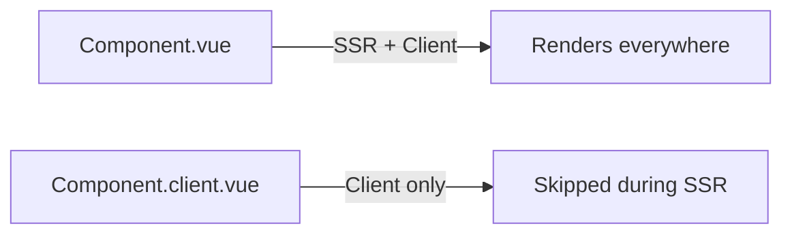

# Nuxt 4 Gotchas

> **This file is agent memory.** Update it when you discover new pitfalls. Use Mermaid for complex explanations.

## Nuxt 4 Directory Structure



Everything lives under `app/`. Don't put pages, components, or composables at the project root.

## Auto-Imports: Values vs Types in `features/`

Nuxt auto-imports **values** (`ref`, `computed`, `shallowRef`, `watch`, `toRaw`, `markRaw`, `onMounted`) globally — they work in `app/features/**/*.ts` and `.vue` files without imports.

However, **type-only references** like `Ref`, `ShallowRef`, `ComputedRef` used in function signatures need explicit imports in `.ts` files inside `features/`:

```ts
// ✅ In features/*.ts — import types explicitly
import type { Ref, ShallowRef } from 'vue'

export function useFoo(bar: Ref<number>, baz: ShallowRef<string | null>) {
  const x = ref(0)      // ← value auto-imported, works fine
  const y = shallowRef() // ← value auto-imported, works fine
}
```

```ts
// ❌ This fails typecheck in features/*.ts
export function useFoo(bar: ShallowRef<number>) { } // ShallowRef not found
```

In `.vue` files the same applies — if you use `ShallowRef` or `Ref` as a type annotation, import it.

## `compatibilityDate` Is Required in Nuxt 4

The `nuxt.config.ts` must include `compatibilityDate`. This locks behavior to a specific date so Nuxt can introduce breaking changes in minor versions without affecting existing projects.

## Client-Only Components: Use `.client.vue` Suffix



Components that need browser APIs (canvas, window, document) use the `.client.vue` convention.

## `useHead` Replaces Manual `<head>` Tags

Don't add `<meta>` or `<link>` tags directly. Use `useHead()` or `useSeoMeta()` composables.

## Dev Server Port Conflicts

Default port is 3000. If another service uses it, Nuxt will auto-increment. Check terminal output for actual port.

## Tailwind CSS v4: Use Vite Plugin, Not Nuxt Module

The `@nuxtjs/tailwindcss` module still uses Tailwind v3. For Tailwind v4 (2025+), use the official Vite plugin directly:

```bash
bun add tailwindcss @tailwindcss/vite
```

```ts
// nuxt.config.ts
import tailwindcss from '@tailwindcss/vite'

export default defineNuxtConfig({
  css: ['~/assets/css/main.css'],
  vite: {
    plugins: [tailwindcss()],
  },
})
```

Tailwind v4 uses CSS-first configuration — no `tailwind.config.js`:

```css
/* app/assets/css/main.css */
@import "tailwindcss";

@theme {
  --color-base: rgb(33, 39, 55);
  --color-accent: rgb(255, 107, 237);
}
```

Colors become utilities automatically: `bg-base`, `text-accent`, etc.
