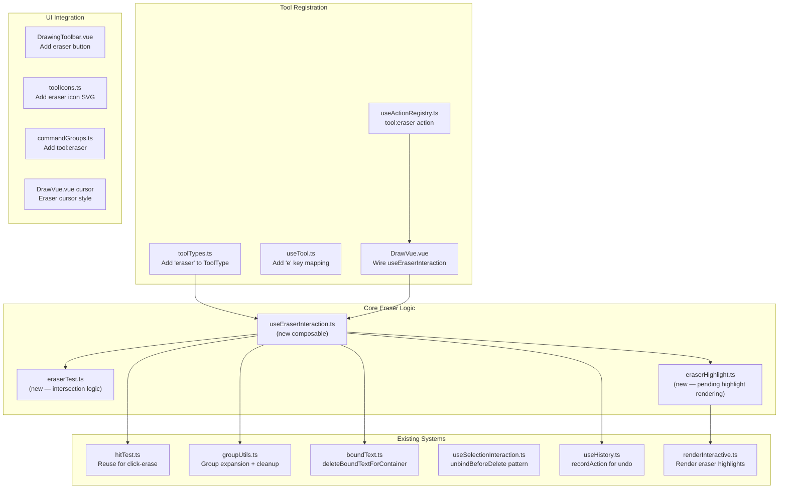

# feat: Add Eraser Tool

## Overview

Add an eraser tool to DrawVue that matches Excalidraw's eraser behavior. Users can click to erase single elements or drag to erase multiple elements with a visual trail. The eraser is group-aware, handles bound text cascading, supports Alt-key restore mode during drag, and integrates fully with the undo/redo history system.

## Problem Statement / Motivation

DrawVue currently has no way to delete elements without first selecting them and pressing Delete. Excalidraw provides an eraser tool (`E` key) that allows direct, intuitive element removal by clicking or sweeping over elements. This is a core drawing tool that users expect in any whiteboard application.

## Proposed Solution

Implement the eraser as a new tool type with its own composable (`useEraserInteraction`), following the established patterns from `useFreeDrawInteraction` (continuous pointer interaction, pointer capture, tool-stays-active behavior). The eraser renders a visual trail on the interactive canvas and maintains a reactive set of elements pending erasure, which are highlighted with a semi-transparent overlay during drag.

## Technical Approach

### Architecture



### Implementation Phases

#### Phase 1: Tool Registration & Type System

Add `"eraser"` to the tool type system and wire it into all registration points.

**Files to modify:**

- `packages/core/src/shared/toolTypes.ts` — Add `"eraser"` to `ToolType` union, add `isEraserTool()` type guard
- `packages/core/src/features/tools/useTool.ts` — Add `e: "eraser"` to `KEY_TO_TOOL` mapping
- `packages/core/src/shared/useActionRegistry.ts` — No changes needed (ToolActionId is derived from `ToolType` via template literal)
- `packages/core/src/components/DrawVue.vue:444-456` — Add eraser to `TOOL_DEFS` array: `{ type: "eraser", icon: "i-lucide-eraser", kbd: "E" }`
- `packages/core/src/components/DrawVue.vue:651` — Add `"eraser"` to `CROSSHAIR_TOOLS` set (or use custom cursor — see Phase 4)
- `packages/core/src/features/command-palette/commandGroups.ts:13-25` — Add `"tool:eraser"` to tools group
- `app/features/tools/components/toolIcons.ts` — Add eraser SVG icon definition
- `app/features/tools/components/DrawingToolbar.vue:16-28` — Add eraser entry: `{ type: "eraser", label: "Eraser", shortcutNumber: null, shortcutKey: "E" }`

**Eraser icon SVG** (Lucide eraser style):

```typescript
eraser: {
  viewBox: "0 0 24 24",
  paths: `<g stroke="currentColor" stroke-width="1.5" fill="none" stroke-linecap="round" stroke-linejoin="round">
    <path d="m7 21-4.3-4.3c-1-1-1-2.5 0-3.4l9.6-9.6c1-1 2.5-1 3.4 0l5.6 5.6c1 1 1 2.5 0 3.4L13 21"/>
    <path d="M22 21H7"/>
    <path d="m5 11 9 9"/>
  </g>`,
},
```

**Success criteria:**

- [x] `"eraser"` exists in `ToolType` union
- [x] Pressing `E` activates eraser tool
- [x] Eraser appears in toolbar with icon
- [x] Eraser appears in command palette
- [x] Cursor changes when eraser is active

**Estimated scope:** ~8 files, small changes each

---

#### Phase 2: Eraser Intersection Testing

Create the core `eraserTest` function that determines whether a line segment (from the eraser trail) intersects an element. This is adapted from Excalidraw's `eraserTest` (`excalidraw/packages/excalidraw/eraser/index.ts:198-306`).

**New file:** `packages/core/src/features/tools/eraserTest.ts`

```typescript
// packages/core/src/features/tools/eraserTest.ts

import type { ExcalidrawElement } from "../elements/types";
import type { GlobalPoint } from "../../shared/math";

/**
 * Test whether a line segment from the eraser trail intersects an element.
 *
 * Uses a multi-phase approach:
 * 1. Fast bounding-box reject (cheap AABB test)
 * 2. Point-in-element for filled shapes (interior click)
 * 3. Shape-specific intersection (stroke proximity)
 */
export function eraserTest(
  segmentStart: GlobalPoint,
  segmentEnd: GlobalPoint,
  element: ExcalidrawElement,
  zoom: number,
): boolean {
  /* ... */
}
```

**Algorithm (from Excalidraw reference):**

1. **Bounds check** — Compute AABB of the line segment (expanded by `threshold`), compare against element bounds. Return `false` if no overlap. This is the fast path that rejects most elements.
2. **Interior check** — For shapes that should test inside (rectangles, ellipses, diamonds with fill), check if the segment endpoint is inside the element using the existing `hitTest` point-in-element logic.
3. **Freedraw check** — For freedraw elements, compute outline segments and test distance between outline segments and the eraser segment. Tolerance: `Math.max(2.25, 5 / zoom)`.
4. **Linear check** — For arrows and lines, get element line segments and test segment-to-segment distance. Tolerance: `Math.max(strokeWidth, strokeWidth * 2 / zoom)`.
5. **Shape stroke check** — For other shapes, test line-segment intersection against the element's geometric edges.

**Reuse from existing code:**

- `getElementBounds()` from `packages/core/src/features/selection/bounds.ts`
- `hitTest()` from `packages/core/src/features/selection/hitTest.ts` (for click-erase single-element mode)
- `distanceToLineSegment()`, `lineSegment()` from `packages/core/src/shared/math.ts`

**New math utilities needed:**

- `lineSegmentsDistance(seg1, seg2)` — Minimum distance between two line segments (needed for freedraw and linear intersection)
- `doBoundsIntersect(a, b)` — AABB intersection test

Add these to `packages/core/src/shared/math.ts`.

**Success criteria:**

- [x] `eraserTest()` correctly identifies intersection for rectangles, ellipses, diamonds
- [x] `eraserTest()` correctly identifies intersection for arrows and lines
- [x] `eraserTest()` correctly identifies intersection for freedraw elements
- [x] `eraserTest()` handles rotated elements (leveraging existing unrotate-then-test in bounds/hitTest)
- [x] Fast bounding-box rejection works (performance)
- [x] Unit tests cover all element types + edge cases

**Estimated scope:** 1 new file (~120 lines), math utility additions (~30 lines), unit tests

---

#### Phase 3: Core Eraser Composable

Create `useEraserInteraction` — the main composable that handles pointer events, manages the pending-erasure set, and performs deletion on pointer up. Follows the pattern of `useFreeDrawInteraction.ts`.

**New file:** `packages/core/src/features/tools/useEraserInteraction.ts`

**Interface:**

```typescript
interface UseEraserInteractionOptions {
  canvasRef: Readonly<Ref<HTMLCanvasElement | null>>;
  activeTool: ShallowRef<ToolType>;
  spaceHeld: Ref<boolean>;
  isPanning: Ref<boolean>;
  toScene: (screenX: number, screenY: number) => GlobalPoint;
  zoom: Ref<number>;
  elements: ShallowRef<readonly ExcalidrawElement[]>;
  elementMap: ElementsMap;

  // Deletion dependencies
  onDelete: (elementsToDelete: readonly ExcalidrawElement[]) => void;

  // Dirty flags
  markStaticDirty: () => void;
  markInteractiveDirty: () => void;

  // History
  onInteractionStart: () => void; // saveCheckpoint
  onInteractionEnd: () => void; // commitCheckpoint
  recordAction: (fn: () => void) => void;
}

interface UseEraserInteractionReturn {
  /** Set of element IDs currently marked for erasure (during drag) */
  pendingErasureIds: ShallowRef<ReadonlySet<string>>;
  /** Trail points for rendering the eraser path */
  eraserTrailPoints: ShallowRef<readonly GlobalPoint[]>;
  /** Whether eraser is currently in restore mode (Alt held) */
  isRestoreMode: ShallowRef<boolean>;
  /** Cancel any in-progress eraser drag */
  cancelEraserIfActive: () => void;
}
```

**Behavior — Pointer events:**

1. **`pointerdown`:**
   - Guard: skip if `spaceHeld`, `isPanning`, not eraser tool, or not button 0
   - Call `onInteractionStart()` (save history checkpoint)
   - Set pointer capture
   - Convert to scene coords
   - Initialize trail with first point
   - **Click-erase check:** Record start position for later zero-drag detection

2. **`pointermove`:**
   - Guard: skip if not currently erasing (no active drag)
   - Convert to scene coords, add to trail
   - Check `e.altKey` to toggle restore mode
   - Build line segment from last two trail points
   - Run `eraserTest()` against visible, non-locked, non-deleted elements
   - **Erase mode:** Add intersecting elements to `pendingErasureIds`
   - **Restore mode (Alt):** Remove intersecting elements from `pendingErasureIds`
   - **Group expansion:** If any element in a group is hit, add/remove entire group
   - **Bound text cascade:** If a container is hit, also add/remove its bound text; if bound text is hit, also add/remove its container
   - Mark interactive layer dirty (for highlight rendering)

3. **`pointerup`:**
   - Release pointer capture
   - **Zero-drag detection:** If pointer barely moved (< 3px), treat as click-erase:
     - Use existing `getElementAtPosition()` for single-element hit test
     - If hit, expand to group + bound text
   - **Apply deletion:** Call `recordAction(() => onDelete(pendingElements))`
   - Clear trail points and pending set
   - Mark both canvas layers dirty
   - Tool stays active (no `setTool("selection")`)

4. **Escape / tool switch:**
   - `cancelEraserIfActive()` clears pending set and trail without deleting
   - Called from `onBeforeToolChange` in `DrawVue.vue`

**Gotchas to respect (from institutional learnings):**

- Always check `spaceHeld` and `isPanning` before handling events (panning priority)
- Use `setPointerCapture` / `releasePointerCapture` for reliable drag tracking
- Wrap deletion in `recordAction()` for undo support
- Call both `markStaticDirty()` and `markInteractiveDirty()` after deletion
- Use `unbindBeforeDelete()` + `deleteBoundTextForContainer()` + `cleanupAfterDelete()` (4-step deletion lifecycle)

**Success criteria:**

- [x] Click-erase deletes single element under cursor
- [x] Drag-erase collects elements intersecting trail, deletes on pointer up
- [x] Group expansion: erasing one group member erases entire group
- [x] Bound text cascade: erasing container also erases its bound text (and vice versa)
- [x] Locked elements are excluded from eraser hit testing
- [x] Alt-key during drag switches to restore mode (un-marks pending elements)
- [x] Escape during drag cancels without deleting
- [x] Space during drag defers to panning
- [x] Undo restores all erased elements in one step
- [x] Eraser tool stays active after operation (no auto-switch to selection)

**Estimated scope:** 1 new file (~200-250 lines), wiring in DrawVue.vue (~30 lines)

---

#### Phase 4: Visual Feedback (Trail + Pending Highlights)

Render the eraser trail and pending-erasure highlights on the interactive canvas layer.

**4a. Eraser Trail Rendering**

The trail is a series of scene-coordinate points rendered as a semi-transparent path on the interactive canvas. Unlike Excalidraw's SVG overlay approach, DrawVue renders everything on canvas — so the trail renders during the interactive layer paint.

**Modify:** `packages/core/src/features/rendering/renderInteractive.ts`

Add a `renderEraserTrail()` function:

```typescript
export function renderEraserTrail(
  ctx: CanvasRenderingContext2D,
  trailPoints: readonly GlobalPoint[],
  scrollX: number,
  scrollY: number,
  zoom: number,
  isDark: boolean,
): void {
  if (trailPoints.length < 2) return;
  ctx.save();
  ctx.strokeStyle = isDark ? "rgba(255, 255, 255, 0.25)" : "rgba(0, 0, 0, 0.25)";
  ctx.lineWidth = 5 / zoom; // constant visual size regardless of zoom
  ctx.lineCap = "round";
  ctx.lineJoin = "round";
  ctx.beginPath();
  const [first, ...rest] = trailPoints;
  ctx.moveTo((first[0] + scrollX) * zoom, (first[1] + scrollY) * zoom);
  for (const pt of rest) {
    ctx.lineTo((pt[0] + scrollX) * zoom, (pt[1] + scrollY) * zoom);
  }
  ctx.stroke();
  ctx.restore();
}
```

**Trail decay (optional enhancement):** Fade older trail segments by reducing opacity proportionally. Can be deferred to a follow-up.

**4b. Pending Erasure Highlights**

Elements in `pendingErasureIds` are rendered with a semi-transparent overlay on the interactive canvas.

Add a `renderPendingErasure()` function to `renderInteractive.ts`:

```typescript
export function renderPendingErasure(
  ctx: CanvasRenderingContext2D,
  elements: readonly ExcalidrawElement[],
  pendingIds: ReadonlySet<string>,
  scrollX: number,
  scrollY: number,
  zoom: number,
): void {
  if (pendingIds.size === 0) return;
  ctx.save();
  ctx.fillStyle = "rgba(255, 107, 237, 0.15)"; // accent color with low opacity
  for (const el of elements) {
    if (!pendingIds.has(el.id) || el.isDeleted) continue;
    const [x1, y1, x2, y2] = getElementBounds(el);
    ctx.fillRect(
      (x1 + scrollX) * zoom - 2,
      (y1 + scrollY) * zoom - 2,
      (x2 - x1) * zoom + 4,
      (y2 - y1) * zoom + 4,
    );
  }
  ctx.restore();
}
```

**4c. Cursor**

**Modify:** `packages/core/src/components/DrawVue.vue:651-662` (the `combinedCursor` computed)

- When eraser is active and not dragging: use `"crosshair"` or a custom CSS cursor
- When eraser is active and Alt is held (restore mode): different cursor style

Simplest approach: add `"eraser"` to `CROSSHAIR_TOOLS` set on line 651. Revisit with custom cursor SVG in a follow-up if desired.

**4d. Scene Renderer Wiring**

**Modify:** `packages/core/src/features/canvas/composables/useSceneRenderer.ts`

Pass `pendingErasureIds` and `eraserTrailPoints` through to the interactive render callback so `renderEraserTrail()` and `renderPendingErasure()` are called during the interactive canvas paint.

**Success criteria:**

- [x] Eraser trail renders during drag (semi-transparent path following cursor)
- [x] Trail is theme-aware (dark on light, light on dark)
- [x] Trail visual size is constant regardless of zoom level
- [x] Pending elements show pink/accent overlay during drag
- [x] Highlights clear immediately after pointer up or cancel
- [x] Cursor changes to crosshair when eraser is active
- [x] No ghost trails or highlights after operation completes

**Estimated scope:** ~80 lines in renderInteractive.ts, ~20 lines cursor logic, ~30 lines scene renderer wiring

---

#### Phase 5: DrawVue Integration & Wiring

Wire the eraser composable into `DrawVue.vue`, connecting it to existing systems.

**Modify:** `packages/core/src/components/DrawVue.vue`

1. **Import** `useEraserInteraction` and `isEraserTool`
2. **Instantiate** the composable (after selection interaction, ~line 371):

```typescript
const { pendingErasureIds, eraserTrailPoints, isRestoreMode, cancelEraserIfActive } =
  useEraserInteraction({
    ...shared,
    activeTool,
    spaceHeld,
    isPanning,
    elementMap,
    onDelete(elementsToDelete) {
      unbindBeforeDelete(elementsToDelete);
      if (elementMap) {
        for (const el of elementsToDelete) {
          if (!isArrowElement(el)) {
            deleteBoundTextForContainer(el, elementMap);
          }
        }
      }
      for (const el of elementsToDelete) {
        mutateElement(el, { isDeleted: true });
      }
      const deletedIds = new Set(elementsToDelete.map((el) => el.id));
      cleanupAfterDelete(elements.value, deletedIds);
      clearSelection();
    },
    onInteractionStart: history.saveCheckpoint,
    onInteractionEnd: history.commitCheckpoint,
    recordAction: history.recordAction,
  });
```

3. **Add to `onBeforeToolChange`** (line 307-313):

```typescript
onBeforeToolChange(() => {
  // ... existing finalizers ...
  cancelEraserIfActive();
});
```

4. **Pass to scene renderer** — Add `pendingErasureIds` and `eraserTrailPoints` to `useSceneRenderer` options.

5. **Expose to test hook** (`__h` on line 613-644) — Add `pendingErasureIds`, `eraserTrailPoints` for browser test access.

**Extract `unbindBeforeDelete`** — Currently this lives inside `useSelectionInteraction.ts:508-518`. Extract it to a shared utility in `packages/core/src/features/elements/` so both selection and eraser can use it without duplication.

**Success criteria:**

- [x] Eraser composable is wired into DrawVue lifecycle
- [x] `onBeforeToolChange` cancels in-progress eraser drag
- [x] Eraser rendering appears on interactive canvas
- [x] `__h` test hook exposes eraser state
- [x] `unbindBeforeDelete` is shared between selection and eraser (no duplication)

**Estimated scope:** ~50 lines in DrawVue.vue, extraction of shared deletion utility

---

#### Phase 6: Testing

**6a. Unit Tests** — `packages/core/src/features/tools/eraserTest.unit.test.ts`

Test the intersection logic:

- [x] Rectangle intersection (trail crosses edge)
- [x] Rectangle interior (trail endpoint inside filled rect)
- [x] Ellipse intersection
- [x] Diamond intersection
- [x] Arrow/line proximity detection
- [ ] Freedraw proximity detection
- [ ] Rotated element intersection (unrotate-then-test)
- [x] Bounding box fast rejection (no intersection → returns false fast)
- [x] Deleted elements are skipped
- [x] Zoom affects tolerance correctly

**6b. Unit Tests** — `packages/core/src/features/tools/useEraserInteraction.unit.test.ts`

Test composable behavior using `withDrawVue` test helper:

- [ ] Click-erase: single element deleted
- [ ] Click-erase: missed click does nothing
- [ ] Drag-erase: multiple elements collected and deleted
- [ ] Group expansion: one member hit → entire group pending
- [ ] Bound text cascade: container erased → text also erased
- [ ] Locked elements excluded from hit testing
- [ ] Cancel clears pending without deleting
- [ ] Tool stays active after erase operation

**6c. Browser Tests** — `app/features/tools/eraser.browser.test.ts`

End-to-end canvas interaction tests:

- [ ] Activate eraser via `E` key, verify tool state
- [ ] Click-erase a rectangle, verify it disappears
- [ ] Drag-erase across multiple shapes, verify all deleted
- [ ] Undo after erase restores all elements
- [ ] Redo after undo re-deletes elements
- [ ] Eraser tool stays active after erasing (draw another shape, erase again)
- [ ] Escape cancels mid-drag without deleting

**Estimated scope:** ~150 lines unit tests, ~100 lines browser tests

---

#### Phase 7: Polish & Edge Cases

After core implementation, address these refinements:

- [ ] **Window blur handling:** Cancel eraser drag on `blur` event (clear pending, release pointer capture)
- [x] **Trail point limit:** Cap trail at 500 points, drop oldest when exceeded
- [ ] **Throttle hit testing:** Use `requestAnimationFrame` to throttle `eraserTest` calls during rapid drag (performance with many elements)
- [ ] **ARIA announcement:** After erasing, update an `aria-live` region with count: "{n} element(s) deleted"
- [ ] **Restore mode visual feedback:** Change cursor or add subtle indicator when Alt is held during drag

**Estimated scope:** ~40 lines additions across existing files

## Alternative Approaches Considered

### 1. SVG Overlay Trail (Excalidraw approach)

Excalidraw renders the eraser trail as an SVG element overlaid on the canvas using `AnimatedTrail` + `@excalidraw/laser-pointer`. This provides smooth, animated trail decay.

**Rejected because:** DrawVue uses a pure canvas-based rendering pipeline with no SVG overlays. Introducing SVG would break the rendering architecture. Canvas-drawn trail is simpler and consistent with our three-layer system.

### 2. Reuse Selection Hit Testing Only

Could skip custom `eraserTest` and just use `hitTest()` point-by-point on every trail point.

**Rejected because:** Point-by-point testing misses elements between trail points during fast drag. Excalidraw explicitly uses line-segment intersection to avoid this gap. The segment approach catches elements even with fast mouse movement.

### 3. Eraser as Selection Mode

Could implement eraser as "select then delete" — eraser drag selects elements, pointer-up deletes selection.

**Rejected because:** This conflates eraser and selection semantics. Excalidraw treats them as distinct tools with different UX (eraser shows trail, not selection box; eraser deletes on release, selection persists). Separate composable is cleaner.

## Acceptance Criteria

### Functional Requirements

- [x] Eraser tool activatable via `E` key, toolbar button, and command palette
- [x] Click-erase: clicking on an element deletes it immediately
- [x] Drag-erase: dragging over elements marks them pending, deletes all on pointer up
- [x] Visual trail renders during drag (theme-aware)
- [x] Pending elements highlighted during drag (semi-transparent overlay)
- [x] Group-aware: erasing one group member erases entire group
- [x] Bound text aware: erasing container deletes its bound text (and vice versa)
- [x] Arrow binding cleanup: erasing a shape unbinds connected arrows
- [x] Locked elements are excluded from eraser
- [x] Alt-key during drag switches to restore mode (un-marks elements)
- [x] Escape during drag cancels without deleting
- [x] Eraser stays active after operation (no auto-switch to selection)
- [x] Works correctly at all zoom levels
- [x] Works correctly with rotated elements

### Non-Functional Requirements

- [x] Undo/redo: entire erase operation undoable in one step
- [x] Performance: no frame drops with 100+ elements on canvas during drag
- [x] No memory leaks (trail points capped, sets cleared)
- [x] Panning takes priority (space bar + drag pans, not erases)

### Quality Gates

- [x] Unit tests for eraserTest intersection logic (all element types)
- [ ] Unit tests for useEraserInteraction composable
- [ ] Browser tests for end-to-end eraser workflow
- [x] Lint passes (`pnpm run lint`)
- [x] Type-check passes (`pnpm typecheck`)

## Success Metrics

- Eraser tool behaves identically to Excalidraw's eraser for common operations
- Zero regressions in existing selection/deletion functionality
- All tests pass across 3 vitest projects

## Dependencies & Prerequisites

- **Existing hit testing** (`packages/core/src/features/selection/hitTest.ts`) — Reused for click-erase
- **Group utilities** (`packages/core/src/features/groups/groupUtils.ts`) — `getElementsInGroup`, `cleanupAfterDelete`
- **Bound text utilities** (`packages/core/src/features/binding/boundText.ts`) — `deleteBoundTextForContainer`
- **History system** (`packages/core/src/features/history/useHistory.ts`) — `recordAction`, `saveCheckpoint`, `commitCheckpoint`
- **Math utilities** (`packages/core/src/shared/math.ts`) — May need new `lineSegmentsDistance` function

**No external dependencies needed.** All logic is self-contained using existing math and rendering primitives.

## Risk Analysis & Mitigation

| Risk                                           | Impact                                             | Likelihood                  | Mitigation                                                                        |
| ---------------------------------------------- | -------------------------------------------------- | --------------------------- | --------------------------------------------------------------------------------- |
| Fast drag misses elements between trail points | Elements not erased despite drag passing over them | Medium                      | Use line-segment intersection (not point checks) between consecutive trail points |
| Performance degradation with many elements     | Frame drops during drag                            | Low                         | Bounding-box fast rejection + throttle hit testing to rAF                         |
| Undo doesn't restore all erased elements       | Data loss                                          | High impact, low likelihood | Wrap entire operation in single `recordAction()` call                             |
| Ghost highlights after cancel/complete         | Visual bug                                         | Medium                      | Clear `pendingErasureIds` in all exit paths (pointer up, cancel, tool switch)     |
| Eraser conflicts with panning                  | Can't pan while eraser active                      | Low                         | Existing `spaceHeld`/`isPanning` guard pattern (proven in all other tools)        |

## Future Considerations

- **Trail animation/decay:** Animate trail fade-out for polish (Excalidraw uses easeOut decay over 200ms)
- **Custom cursor:** Replace crosshair with eraser-shaped cursor SVG
- **Touch/stylus support:** Eraser via stylus eraser end (pen mode detection)
- **Partial element erasure:** Freedraw stroke splitting (Excalidraw doesn't support this either)

## Documentation Plan

After implementation:

- [ ] Update `docs/SYSTEM_KNOWLEDGE_MAP.md` — Add eraser to tools section
- [ ] Create `docs/eraser-gotchas.md` if non-obvious patterns emerge
- [ ] Update `docs/diagrams/event-flow.md` — Add eraser to tool dispatch flowchart

## References & Research

### Internal References

- **Tool registration pattern:** `packages/core/src/components/DrawVue.vue:444-468`
- **Tool type system:** `packages/core/src/shared/toolTypes.ts:1-12`
- **Key-to-tool mapping:** `packages/core/src/features/tools/useTool.ts:31-54`
- **Freedraw composable (template):** `packages/core/src/features/tools/useFreeDrawInteraction.ts`
- **Hit testing:** `packages/core/src/features/selection/hitTest.ts:20-77`
- **Deletion pattern:** `packages/core/src/components/DrawVue.vue:114-125`
- **Selection deletion (unbind):** `packages/core/src/features/selection/composables/useSelectionInteraction.ts:508-538`
- **Group expansion:** `packages/core/src/features/groups/groupUtils.ts:29-52`
- **Bound text deletion:** `packages/core/src/features/binding/boundText.ts:50-58`
- **History system:** `packages/core/src/features/history/useHistory.ts:99-105`
- **Action registry:** `packages/core/src/shared/useActionRegistry.ts:9-42`
- **Command palette groups:** `packages/core/src/features/command-palette/commandGroups.ts:13-25`
- **Interactive rendering:** `packages/core/src/features/rendering/renderInteractive.ts`
- **Toolbar UI:** `app/features/tools/components/DrawingToolbar.vue:16-28`
- **Tool icons:** `app/features/tools/components/toolIcons.ts`

### Excalidraw Reference

- **EraserTrail class:** `excalidraw/packages/excalidraw/eraser/index.ts:42-196`
- **eraserTest function:** `excalidraw/packages/excalidraw/eraser/index.ts:198-306`
- **Eraser integration:** `excalidraw/packages/excalidraw/components/App.tsx` (lines 660, 7383-7388, 6814-6826, 10498-10522)
- **AnimatedTrail:** `excalidraw/packages/excalidraw/animated-trail.ts`

### Institutional Learnings

- **Hit testing must include shape interior** — `docs/excalidraw-gotchas.md:89-103`
- **Rotation: unrotate-then-test pattern** — `docs/excalidraw-gotchas.md:237-250`
- **Panning priority over all tools** — `docs/diagrams/event-flow.md:134-154`
- **Pointer capture lifecycle** — `docs/diagrams/event-flow.md:98-133`
- **recordAction required for undoable keyboard shortcuts** — `docs/excalidraw-gotchas.md:313-350`
- **Clear all affected canvas layers on state transitions** — `docs/excalidraw-gotchas.md:75-87`
- **4-step deletion lifecycle** — `docs/diagrams/selection-state-machine.md` (unbind → soft delete → cleanup groups → clear selection)

## New Files Summary

| File                                                                 | Purpose                     | ~Lines |
| -------------------------------------------------------------------- | --------------------------- | ------ |
| `packages/core/src/features/tools/eraserTest.ts`                     | Eraser intersection testing | 120    |
| `packages/core/src/features/tools/useEraserInteraction.ts`           | Core eraser composable      | 250    |
| `packages/core/src/features/tools/eraserTest.unit.test.ts`           | Unit tests for intersection | 150    |
| `packages/core/src/features/tools/useEraserInteraction.unit.test.ts` | Unit tests for composable   | 100    |
| `app/features/tools/eraser.browser.test.ts`                          | Browser integration tests   | 100    |

## Modified Files Summary

| File                                                                | Change                                                               |
| ------------------------------------------------------------------- | -------------------------------------------------------------------- |
| `packages/core/src/shared/toolTypes.ts`                             | Add `"eraser"` to `ToolType`, add `isEraserTool()`                   |
| `packages/core/src/shared/math.ts`                                  | Add `lineSegmentsDistance()`, `doBoundsIntersect()`                  |
| `packages/core/src/features/tools/useTool.ts`                       | Add `e: "eraser"` to `KEY_TO_TOOL`                                   |
| `packages/core/src/components/DrawVue.vue`                          | Wire eraser composable, add to TOOL_DEFS, cursor, onBeforeToolChange |
| `packages/core/src/features/rendering/renderInteractive.ts`         | Add `renderEraserTrail()`, `renderPendingErasure()`                  |
| `packages/core/src/features/canvas/composables/useSceneRenderer.ts` | Pass eraser state to interactive render                              |
| `packages/core/src/features/command-palette/commandGroups.ts`       | Add `"tool:eraser"`                                                  |
| `app/features/tools/components/toolIcons.ts`                        | Add eraser icon SVG                                                  |
| `app/features/tools/components/DrawingToolbar.vue`                  | Add eraser to tools array                                            |
