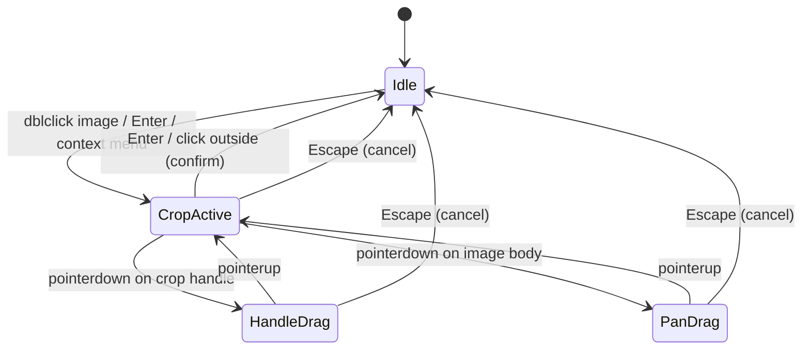

# feat: Add Image Crop Tool

## Overview

Add a non-destructive image crop feature matching Excalidraw's UX. Users enter crop mode by double-clicking an image (or pressing Enter / using the context menu), then resize the visible region via L-shaped corner handles or pan the image within the crop window. Crop data is stored in natural image pixel coordinates on the element, keeping the original image intact.

## Problem Statement / Motivation

Currently images in DrawVue can only be displayed at their full extent. Users who insert large images or want to focus on a specific region must pre-crop externally. Excalidraw provides a polished in-canvas crop that DrawVue should match for feature parity and UX quality.

## Data Model

The `crop` field **already exists** on `ExcalidrawImageElement` (from `@excalidraw/element/types`):

```typescript
type ImageCrop = {
  x: number; // crop origin X in natural image pixels
  y: number; // crop origin Y in natural image pixels
  width: number; // visible region width in natural pixels
  height: number; // visible region height in natural pixels
  naturalWidth: number; // full image width (for ratio calculations)
  naturalHeight: number; // full image height
};

// On the element:
crop: ImageCrop | null; // null = uncropped
```

**Key relationship**: `element.width / element.height` always matches `crop.width / crop.height` — the element dimensions represent the visible crop region in scene space.

Our `createElement` already initializes `crop: null`. No schema changes needed.

## Proposed Solution

### Architecture: `useCropInteraction` composable

Follow the **`useLinearEditor` pattern** — a separate composable that owns the crop state machine and exposes refs/methods to `DrawVue.vue`.

```
useCropInteraction
├── State: croppingElementId: Ref<string | null>
├── State: isCropping: Ref<boolean>  (actively dragging a handle)
├── State: preCropSnapshot: element state for cancel/undo
├── Methods: enterCropMode(elementId)
├── Methods: exitCropMode(confirm: boolean)
├── Methods: handlePointerDown/Move/Up (crop handle drag + pan)
└── Methods: handleKeyDown (Enter=confirm, Escape=cancel)
```

Wired into `DrawVue.vue` alongside `useLinearEditor`, `useTextInteraction`, etc. The `onBeforeToolChange` lifecycle hook will call `exitCropMode(true)` to auto-confirm on tool switch.

### Crop Mode State Machine



### Visual Design

**Crop mode active:**

- Normal transform handles **hidden**
- 4 L-shaped corner handles (NW, NE, SW, SE) — 3px stroke, 20px arm length, selection color
- Ghost overlay: full uncropped image at 30% opacity behind the crop region
- Crop region shown at 100% opacity
- Cursor: `move` when hovering image body, directional resize cursors on handles

**Not in crop mode (cropped image):**

- Normal transform handles shown
- Only the cropped portion of the image is visible (no ghost overlay)

## Technical Approach

### Phase 1: Crop-aware rendering (static canvas)

**Goal**: Cropped images display correctly even without crop mode interaction.

#### 1.1 Update `renderImageElement.ts`

```typescript
// packages/core/src/features/image/renderImageElement.ts
// Change from 5-arg drawImage to 9-arg when crop exists:

if (element.crop) {
  const { x: sx, y: sy, width: sw, height: sh } = element.crop;
  ctx.drawImage(cached.image, sx, sy, sw, sh, 0, 0, element.width, element.height);
} else {
  ctx.drawImage(cached.image, 0, 0, element.width, element.height);
}
```

**Files:**

- `packages/core/src/features/image/renderImageElement.ts` — add crop-aware drawImage

#### 1.2 Test rendering

- Unit test: cropped image uses 9-arg drawImage with correct source rect
- Unit test: uncropped image (crop: null) uses 5-arg drawImage unchanged

---

### Phase 2: Crop math module (pure functions)

**Goal**: Port Excalidraw's crop calculation logic, adapted for our types.

#### 2.1 Create `cropElement.ts`

```
packages/core/src/features/image/cropElement.ts
```

Pure functions (no Vue reactivity, fully testable):

| Function                                                        | Purpose                                                                                                                       |
| --------------------------------------------------------------- | ----------------------------------------------------------------------------------------------------------------------------- |
| `cropElement(params)`                                           | Core crop calculation — given pointer position, handle type, and current element, returns new `{ x, y, width, height, crop }` |
| `getUncroppedWidthAndHeight(element)`                           | Calculate element dimensions without crop                                                                                     |
| `adjustCropPosition(crop, scale)`                               | Adjust crop x/y for flipped images                                                                                            |
| `getFlipAdjustedCropPosition(element)`                          | Get crop position accounting for element flip                                                                                 |
| `panCrop(element, deltaX, deltaY, naturalWidth, naturalHeight)` | Pan the crop region within image bounds                                                                                       |
| `recomputeOrigin(params)`                                       | Adjust element x,y to keep fixed corner in place during crop resize                                                           |

**Constants:**

```typescript
const MINIMAL_CROP_SIZE = 10; // minimum visible crop in natural pixels
```

**Ported from**: `excalidraw/packages/element/src/cropElement.ts` (~470 lines). Adapt to our element types, remove React-specific patterns.

#### 2.2 Unit tests for crop math

- Each handle direction (nw, ne, sw, se) — verify crop and element bounds change correctly
- Aspect ratio locking (Shift) — verify proportional constraint
- Minimum crop size — verify clamping to 10px
- Flip adjustments — verify crop position correction for scale [-1,1], [1,-1], [-1,-1]
- Pan clamping — verify crop stays within [0,0] to [naturalWidth, naturalHeight]
- Rotation handling — verify unrotate-then-calculate pattern
- Reset detection — when crop equals full image, return null

**Files:**

- `packages/core/src/features/image/cropElement.ts` — new file
- `packages/core/src/features/image/cropElement.unit.test.ts` — new file

---

### Phase 3: Crop handle rendering (interactive canvas)

**Goal**: Render L-shaped crop handles and ghost overlay.

#### 3.1 Create `renderCropHandles.ts`

```
packages/core/src/features/image/renderCropHandles.ts
```

Functions:

| Function                                                | Purpose                                                        |
| ------------------------------------------------------- | -------------------------------------------------------------- |
| `renderCropHandles(ctx, element, zoom, selectionColor)` | Draw 4 L-shaped corner handles in element-local rotated space  |
| `renderCropGhostOverlay(ctx, element, image, zoom)`     | Draw the uncropped image at 30% opacity behind the crop region |

Handle rendering uses translate-rotate-translate pattern for rotated elements. Handle sizes scale inversely with zoom (`size / zoom`).

#### 3.2 Integrate into `renderInteractive.ts`

In `renderInteractiveScene()`:

- When `croppingElementId` is set: skip normal transform handles for that element, render crop handles instead
- Render ghost overlay for the cropping element

Add `croppingElementId: string | null` to `InteractiveSceneOptions`.

#### 3.3 Forward crop state through rendering pipeline

- `useSceneRenderer.ts` — accept `croppingElementId` and pass to interactive render
- `DrawVue.vue` — pass `croppingElementId` from `useCropInteraction` to the renderer

**Files:**

- `packages/core/src/features/image/renderCropHandles.ts` — new file
- `packages/core/src/features/rendering/renderInteractive.ts` — modify to conditionally render crop handles
- `packages/core/src/features/canvas/composables/useSceneRenderer.ts` — accept crop state

---

### Phase 4: Crop interaction composable

**Goal**: Full crop mode lifecycle — enter, handle drag, pan, confirm, cancel.

#### 4.1 Create `useCropInteraction.ts`

```
packages/core/src/features/image/useCropInteraction.ts
```

**State:**

```typescript
const croppingElementId = shallowRef<string | null>(null);
const isCropping = ref(false); // actively dragging
const preCropSnapshot = ref<ElementSnapshot | null>(null); // for cancel/undo
```

**Entry points (3 ways):**

1. Double-click on selected image (wired from `useSelectionInteraction`)
2. Enter key on single selected image (wired from `useSelectionInteraction`)
3. `image:crop` action (context menu / command palette)

**Handle drag flow:**

1. `handlePointerDown`: Hit-test crop handles → store handle type, snapshot state, set `isCropping = true`
2. `handlePointerMove`: Call `cropElement()` with current pointer, update element via `mutateElement`
3. `handlePointerUp`: Set `isCropping = false`

**Pan flow (drag image body in crop mode):**

1. `handlePointerDown` on image body (not a handle) → start pan, record start position
2. `handlePointerMove`: Calculate delta in natural image coords, call `panCrop()`
3. `handlePointerUp`: End pan

**Exit:**

- **Confirm** (Enter / click outside): Commit history checkpoint, set `croppingElementId = null`, mark both layers dirty
- **Cancel** (Escape): Restore from `preCropSnapshot`, discard checkpoint, set `croppingElementId = null`, mark both layers dirty

**History integration:**

- `enterCropMode` → `history.saveCheckpoint()`
- `exitCropMode(confirm: true)` → `history.commitCheckpoint()`
- `exitCropMode(confirm: false)` → `history.discardCheckpoint()`

**Dirty flags:**

- Handle drag / pan → `markInteractiveDirty()` (handles move)
- Confirm crop → `markStaticDirty()` + `markInteractiveDirty()` (element rendering changes + handles disappear)
- Cancel crop → `markStaticDirty()` + `markInteractiveDirty()`

#### 4.2 Wire into `DrawVue.vue`

```typescript
// In DrawVue.vue setup
const cropInteraction = useCropInteraction({ elements, history, dirty, imageCache });

// onBeforeToolChange — auto-confirm crop
onBeforeToolChange(() => {
  if (cropInteraction.croppingElementId.value) {
    cropInteraction.exitCropMode(true);
  }
});

// Pass to renderer
provide(/* croppingElementId to scene renderer */);
```

#### 4.3 Wire into `useSelectionInteraction`

- Add to `isSelectionBlocked()`: return true when `croppingElementId` is set (block box-select/drag while cropping)
- Double-click handler (line ~555): if clicked element is image → call `cropInteraction.enterCropMode(element.id)`
- Enter key handler: if single selected image → `cropInteraction.enterCropMode(element.id)`
- Pointer events: when `croppingElementId` is set, delegate to crop interaction instead of normal resize/drag

**Files:**

- `packages/core/src/features/image/useCropInteraction.ts` — new file
- `packages/core/src/components/DrawVue.vue` — wire composable
- `packages/core/src/features/selection/composables/useSelectionInteraction.ts` — add crop entry points and delegation
- `packages/core/src/context.ts` — add `croppingElementId` to `DrawVueContext` if needed

---

### Phase 5: Actions & UI integration

**Goal**: Register crop actions, add to context menu and command palette.

#### 5.1 Register action IDs

Add to `useActionRegistry.ts`:

```typescript
type ImageActionId =
  | "image:remove-background"
  | "image:split-objects"
  | "image:crop"
  | "image:reset-crop";
```

#### 5.2 Register action definitions

In `app/composables/useImageActions.ts`:

```typescript
register({
  id: "image:crop",
  label: "Crop image",
  icon: "crop", // or appropriate icon
  kbds: [], // Enter key handled separately in selection interaction
  enabled: () => {
    const selected = selection.selected.value;
    return (
      selected.length === 1 &&
      selected[0].type === "image" &&
      isInitializedImageElement(selected[0]) &&
      !cropInteraction.croppingElementId.value
    );
  },
  handler: () => {
    cropInteraction.enterCropMode(selection.selected.value[0].id);
  },
});

register({
  id: "image:reset-crop",
  label: "Reset crop",
  icon: "crop-off",
  enabled: () => {
    const selected = selection.selected.value;
    return selected.length === 1 && selected[0].type === "image" && selected[0].crop !== null;
  },
  handler: () => {
    // Reset crop: set crop to null, expand element to uncropped size
    const element = selection.selected.value[0];
    const { width, height } = getUncroppedWidthAndHeight(element);
    mutateElement(element, { crop: null, width, height });
  },
});
```

#### 5.3 Add to context menu

In `contextMenuItems.ts`, add to image-specific items:

```typescript
{
  actionId: "image:crop";
}
{
  actionId: "image:reset-crop";
}
```

#### 5.4 Add to command palette (optional)

Add `"image:crop"` and `"image:reset-crop"` to the image command group.

**Files:**

- `packages/core/src/shared/useActionRegistry.ts` — extend `ImageActionId`
- `app/composables/useImageActions.ts` — register crop + reset-crop actions
- `packages/core/src/features/context-menu/contextMenuItems.ts` — add menu entries
- `packages/core/src/features/image/index.ts` — export crop functions

---

### Phase 6: Browser tests

**Goal**: End-to-end tests for the crop workflow.

#### 6.1 Crop flow tests

```
app/features/image/image-crop.browser.test.ts
```

| Test                                | What it verifies                              |
| ----------------------------------- | --------------------------------------------- |
| Double-click image enters crop mode | Crop handles appear, transform handles hidden |
| Drag corner handle crops image      | Element dimensions and crop data change       |
| Shift+drag locks aspect ratio       | Crop maintains proportional constraint        |
| Drag image body pans crop region    | crop.x/crop.y change, element position stays  |
| Enter confirms crop                 | Crop persists, crop mode exits                |
| Escape cancels crop                 | Element reverts to pre-crop state             |
| Click outside confirms crop         | Same as Enter confirmation                    |
| Undo after crop                     | Element reverts to pre-crop state             |
| Reset crop via context menu         | crop becomes null, element expands            |
| Crop a rotated image                | Handles render correctly, crop math works     |

**Files:**

- `app/features/image/image-crop.browser.test.ts` — new file

---

## Acceptance Criteria

### Functional Requirements

- [ ] Double-click, Enter key, and context menu all enter crop mode on a single selected image
- [ ] 4 L-shaped corner handles appear, replacing normal transform handles
- [ ] Ghost overlay shows uncropped region at 30% opacity
- [ ] Dragging a corner handle resizes the crop region (minimum 10px in natural coords)
- [ ] Shift+drag locks crop to current aspect ratio
- [ ] Dragging image body in crop mode pans the crop window (clamped to image bounds)
- [ ] Enter or click-outside confirms the crop
- [ ] Escape cancels and reverts to pre-crop state
- [ ] "Crop image" and "Reset crop" appear in context menu for image elements
- [ ] Reset crop sets `crop: null` and expands element to uncropped dimensions
- [ ] Cropped images render correctly on the static canvas (only visible region shown)
- [ ] Undo (Ctrl+Z) after confirming a crop restores the previous state
- [ ] Crop mode auto-confirms when switching tools
- [ ] Crop handles scale inversely with zoom
- [ ] Crop works on rotated images
- [ ] Crop works on flipped images (scale [-1,1] etc.)
- [ ] Cannot enter crop mode on pending/error images
- [ ] Cannot enter crop mode with multiple images selected
- [ ] Copy/paste preserves crop data
- [ ] Duplicate preserves crop data

### Non-Functional Requirements

- [ ] Crop handle drag feels responsive (no perceptible lag)
- [ ] No flash/flicker when entering or exiting crop mode
- [ ] Both dirty flags (static + interactive) are managed correctly — no ghost handles or stale renders

### Quality Gates

- [ ] All crop math functions have unit tests
- [ ] Browser tests cover the 10 scenarios listed above
- [ ] Linting passes (`pnpm lint`)
- [ ] Type checking passes (`pnpm typecheck`)
- [ ] All existing tests pass (`pnpm test`)

## Edge Cases & Decisions

| Edge Case                          | Decision                                                                               |
| ---------------------------------- | -------------------------------------------------------------------------------------- |
| Image smaller than 10px natural    | Block crop mode entry (enabled predicate returns false)                                |
| Grouped image                      | Requires element-level selection first (click into group, then double-click to crop)   |
| Image with bound text              | After crop confirm, call `updateBoundTextAfterContainerChange` to reflow text position |
| Crop region equals full image      | Reset crop to `null` automatically                                                     |
| Switching tools while in crop mode | Auto-confirm the crop                                                                  |
| Right-click in crop mode           | Exit crop mode (confirm), show normal context menu                                     |
| Zoom/scroll during crop mode       | Works normally — handles scale inversely with zoom                                     |
| Background removal processing      | Block crop mode entry (isAnythingProcessing guard)                                     |
| Properties panel during crop mode  | Show normal properties (no crop-specific UI)                                           |

## Dependencies & Prerequisites

- Image element type with `crop: ImageCrop | null` field (already exists)
- Image cache with `HTMLImageElement` access for `naturalWidth`/`naturalHeight` (already exists)
- History system with save/commit/discard checkpoint (already exists)
- Transform handle hit-testing utilities (already exists, reusable for crop handles)

## File Summary

### New Files (5)

| File                                                        | Lines (est.) | Purpose                                      |
| ----------------------------------------------------------- | ------------ | -------------------------------------------- |
| `packages/core/src/features/image/cropElement.ts`           | ~350         | Core crop math (pure functions)              |
| `packages/core/src/features/image/cropElement.unit.test.ts` | ~200         | Crop math unit tests                         |
| `packages/core/src/features/image/renderCropHandles.ts`     | ~120         | L-shaped handle + ghost overlay rendering    |
| `packages/core/src/features/image/useCropInteraction.ts`    | ~250         | Crop mode composable (state machine, events) |
| `app/features/image/image-crop.browser.test.ts`             | ~200         | Browser integration tests                    |

### Modified Files (9)

| File                                                                          | Change                                         |
| ----------------------------------------------------------------------------- | ---------------------------------------------- |
| `packages/core/src/features/image/renderImageElement.ts`                      | Use 9-arg drawImage when crop exists           |
| `packages/core/src/features/image/index.ts`                                   | Export crop functions                          |
| `packages/core/src/features/rendering/renderInteractive.ts`                   | Render crop handles, accept croppingElementId  |
| `packages/core/src/features/canvas/composables/useSceneRenderer.ts`           | Forward crop state to renderer                 |
| `packages/core/src/features/selection/composables/useSelectionInteraction.ts` | Add dblclick/Enter crop entry, delegate events |
| `packages/core/src/components/DrawVue.vue`                                    | Wire useCropInteraction, onBeforeToolChange    |
| `packages/core/src/shared/useActionRegistry.ts`                               | Add image:crop and image:reset-crop IDs        |
| `packages/core/src/features/context-menu/contextMenuItems.ts`                 | Add crop menu items                            |
| `app/composables/useImageActions.ts`                                          | Register crop action definitions               |

## References & Research

### Internal References

- Excalidraw crop implementation: `excalidraw/packages/element/src/cropElement.ts`
- Excalidraw crop handle rendering: `excalidraw/packages/excalidraw/renderer/interactiveScene.ts:1134-1237`
- Excalidraw crop interaction: `excalidraw/packages/excalidraw/components/App.tsx:11707-11797`
- Our image rendering: `packages/core/src/features/image/renderImageElement.ts`
- Our selection interaction: `packages/core/src/features/selection/composables/useSelectionInteraction.ts`
- Our linear editor pattern: `packages/core/src/features/linear-editor/`
- Our action registry: `packages/core/src/shared/useActionRegistry.ts`

### Gotchas to Watch

- **Dirty flags**: Mark BOTH static and interactive layers when crop geometry changes (see `docs/excalidraw-gotchas.md:75-87`)
- **Rotation**: Unrotate pointer before hit-testing crop handles (see `docs/excalidraw-gotchas.md:237-250`)
- **Zoom scaling**: All handle sizes must use `size / zoom` (see `docs/excalidraw-gotchas.md:203-216`)
- **ShallowRef + triggerRef**: If storing croppingElement in a shallowRef, call `triggerRef()` after mutation (see `docs/excalidraw-gotchas.md:185-201`)
- **Tool-switch order**: Switch to selection tool BEFORE entering crop mode to avoid `onBeforeToolChange` closing it immediately (see `docs/bound-text-debug-notes.md`)
