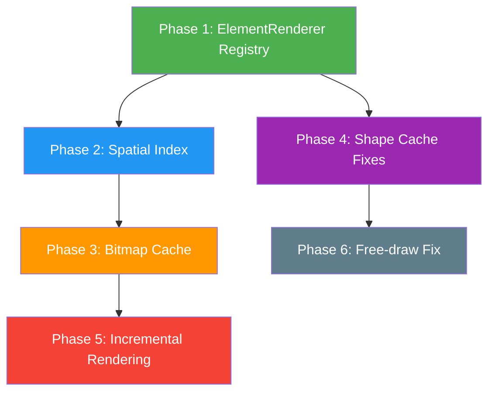
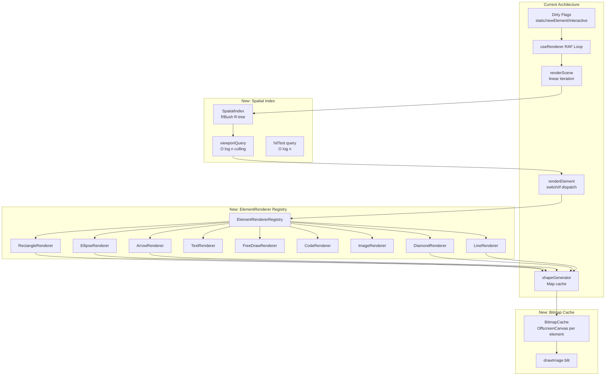

# Rendering Architecture Improvements

## Overview

Comprehensive refactor of DrawVue's rendering pipeline to achieve best-in-class performance and extensibility, drawing on architectural patterns from both **tldraw** and **Excalidraw**. This plan introduces 6 interconnected improvements: an ElementRenderer registry for pluggable element types, R-tree spatial indexing for fast culling/hit-testing, element bitmap caching for reduced draw calls, shape cache improvements, incremental static rendering, and free-draw path caching fixes.

## Problem Statement

DrawVue's rendering architecture is functional but has several scaling bottlenecks and extensibility limitations exposed by comparison with tldraw and Excalidraw:

| Problem                         | Current State                                                                 | Impact                                                                                                      |
| ------------------------------- | ----------------------------------------------------------------------------- | ----------------------------------------------------------------------------------------------------------- |
| **Hard-coded element dispatch** | `renderElement.ts` uses if/switch chains for each type                        | Adding a new element type requires touching 5+ files (renderer, hit-test, bounds, shape generator, factory) |
| **Linear viewport culling**     | `renderScene()` iterates ALL elements with AABB check                         | O(n) per frame; degrades at 500+ visible elements                                                           |
| **Full scene repaint**          | `markStaticDirty()` redraws ALL visible elements                              | Even single-element changes cause full repaint of 100s of elements                                          |
| **No bitmap caching**           | RoughJS `Drawable` objects cached, but canvas draw calls repeated every frame | `rc.draw()` is re-executed for every visible element on every static repaint                                |
| **Shape cache memory leak**     | `Map<string, CacheEntry>` never auto-prunes                                   | Deleted elements leave orphaned entries; no size limit                                                      |
| **Free-draw stale cache**       | `generateFreeDrawShape()` always regenerates Path2D                           | Comment in code notes WeakMap returns stale data due to in-place mutation                                   |

## Proposed Solution

A phased approach that incrementally improves the architecture without breaking existing consumers:



## Technical Approach

### Architecture

The target architecture introduces three new subsystems that compose with the existing dirty-flag RAF loop:



### Implementation Phases

#### Phase 1: ElementRenderer Registry

**Goal:** Replace hard-coded switch/if chains with a pluggable registry pattern, inspired by tldraw's `ShapeUtil`.

**Design:**

```typescript
// packages/core/src/features/rendering/elementRenderer.ts

interface ElementRenderer<T extends ExcalidrawElement = ExcalidrawElement> {
  /** Which element type(s) this renderer handles */
  readonly types: readonly string[];

  /** Can this renderer handle the given element? (for subtypes like code) */
  canRender(element: ExcalidrawElement): element is T;

  /** Render the element to canvas */
  render(
    ctx: CanvasRenderingContext2D,
    rc: RoughCanvas,
    element: T,
    theme: Theme,
    imageCache?: ReadonlyMap<FileId, ImageCacheEntry>,
    zoom?: number,
  ): void;

  /** Get the element's bounding box [x1, y1, x2, y2] */
  getBounds(element: T): readonly [number, number, number, number];

  /** Hit-test: distance from point to element edge */
  distanceToEdge?(element: T, point: GlobalPoint): number;

  /** Generate RoughJS shape (if applicable) */
  generateShape?(element: T, theme: Theme, zoom?: number): Drawable;
}
```

```typescript
// packages/core/src/features/rendering/rendererRegistry.ts

class ElementRendererRegistry {
  private renderers = new Map<string, ElementRenderer>();
  private subtypeRenderers: ElementRenderer[] = [];

  register(renderer: ElementRenderer): void {
    for (const type of renderer.types) {
      this.renderers.set(type, renderer);
    }
    // Subtype renderers (like code = rectangle + customData) checked via canRender
    if (renderer.types.length === 0) {
      this.subtypeRenderers.push(renderer);
    }
  }

  getRenderer(element: ExcalidrawElement): ElementRenderer {
    // Check subtypes first (code element is a rectangle with customData)
    for (const renderer of this.subtypeRenderers) {
      if (renderer.canRender(element)) return renderer;
    }
    const renderer = this.renderers.get(element.type);
    if (!renderer) throw new Error(`No renderer for type: ${element.type}`);
    return renderer;
  }
}

// Singleton with built-in renderers pre-registered
export const defaultRegistry = new ElementRendererRegistry();

// Register all built-in renderers
defaultRegistry.register(new RectangleRenderer());
defaultRegistry.register(new EllipseRenderer());
defaultRegistry.register(new DiamondRenderer());
defaultRegistry.register(new ArrowRenderer());
defaultRegistry.register(new LineRenderer());
defaultRegistry.register(new TextRenderer());
defaultRegistry.register(new FreeDrawRenderer());
defaultRegistry.register(new ImageRenderer());
defaultRegistry.register(new CodeRenderer()); // Subtype: rectangle + customData
```

**Files to create:**

- `packages/core/src/features/rendering/elementRenderer.ts` — Interface definition
- `packages/core/src/features/rendering/rendererRegistry.ts` — Registry class + default instance
- `packages/core/src/features/rendering/renderers/rectangleRenderer.ts`
- `packages/core/src/features/rendering/renderers/ellipseRenderer.ts`
- `packages/core/src/features/rendering/renderers/diamondRenderer.ts`
- `packages/core/src/features/rendering/renderers/arrowRenderer.ts`
- `packages/core/src/features/rendering/renderers/lineRenderer.ts`
- `packages/core/src/features/rendering/renderers/textRenderer.ts`
- `packages/core/src/features/rendering/renderers/freeDrawRenderer.ts`
- `packages/core/src/features/rendering/renderers/imageRenderer.ts`
- `packages/core/src/features/rendering/renderers/codeRenderer.ts`

**Files to modify:**

- `packages/core/src/features/rendering/renderElement.ts` — Delegate to registry
- `packages/core/src/features/rendering/renderScene.ts` — Use registry for rendering
- `packages/core/src/features/rendering/index.ts` — Export registry

**Migration strategy:** The existing `renderElement()` function becomes a thin wrapper that delegates to the registry. Existing behavior is preserved; the refactor is purely structural.

```typescript
// renderElement.ts — after refactor
export function renderElement(
  ctx: CanvasRenderingContext2D,
  rc: RoughCanvas,
  element: ExcalidrawElement,
  theme: Theme,
  imageCache?: ReadonlyMap<FileId, ImageCacheEntry>,
  zoom = 1,
): void {
  if (element.isDeleted) return;
  if (isLinearElement(element) && element.points.length < 2) return;
  if (isZeroSizeShape(element)) return;

  const renderer = defaultRegistry.getRenderer(element);
  renderer.render(ctx, rc, element, theme, imageCache, zoom);
}
```

**Testing:**

- Unit tests for each renderer in isolation
- Registry tests: register, lookup, subtype priority
- Integration test: render scene with registry matches existing output

---

#### Phase 2: Spatial Index (R-tree)

**Goal:** Replace O(n) linear viewport culling and hit testing with O(log n) R-tree queries.

**Dependency:** `rbush` npm package (~6KB gzipped, zero dependencies)

**Design:**

```typescript
// packages/core/src/features/canvas/spatialIndex.ts

import RBush from "rbush";

interface SpatialEntry {
  minX: number;
  minY: number;
  maxX: number;
  maxY: number;
  id: string;
}

export class SpatialIndex {
  private tree = new RBush<SpatialEntry>();
  private entries = new Map<string, SpatialEntry>();

  /** Bulk-load all elements (used on init and full rebuild) */
  load(elements: readonly ExcalidrawElement[]): void {
    this.tree.clear();
    this.entries.clear();
    const items: SpatialEntry[] = [];
    for (const el of elements) {
      if (el.isDeleted) continue;
      const [x1, y1, x2, y2] = getElementBounds(el);
      const entry = { minX: x1, minY: y1, maxX: x2, maxY: y2, id: el.id };
      this.entries.set(el.id, entry);
      items.push(entry);
    }
    this.tree.load(items);
  }

  /** Update a single element's bounds (remove + re-insert) */
  update(element: ExcalidrawElement): void {
    const existing = this.entries.get(element.id);
    if (existing) this.tree.remove(existing);
    if (element.isDeleted) {
      this.entries.delete(element.id);
      return;
    }
    const [x1, y1, x2, y2] = getElementBounds(element);
    const entry = { minX: x1, minY: y1, maxX: x2, maxY: y2, id: element.id };
    this.entries.set(element.id, entry);
    this.tree.insert(entry);
  }

  /** Query visible element IDs in viewport */
  queryViewport(minX: number, minY: number, maxX: number, maxY: number): Set<string> {
    const results = this.tree.search({ minX, minY, maxX, maxY });
    return new Set(results.map((r) => r.id));
  }

  /** Query elements near a point (for hit testing) */
  queryPoint(x: number, y: number, padding: number): SpatialEntry[] {
    return this.tree.search({
      minX: x - padding,
      minY: y - padding,
      maxX: x + padding,
      maxY: y + padding,
    });
  }
}
```

**Integration with existing code:**

```typescript
// renderScene.ts — after spatial index
export function renderScene(
  ctx: CanvasRenderingContext2D,
  rc: RoughCanvas,
  elements: readonly ExcalidrawElement[],
  scrollX: number,
  scrollY: number,
  zoom: number,
  w: number,
  h: number,
  theme: Theme,
  imageCache?: ReadonlyMap<FileId, ImageCacheEntry>,
  spatialIndex?: SpatialIndex, // Optional — graceful fallback
): void {
  ctx.save();
  ctx.scale(zoom, zoom);
  ctx.translate(scrollX, scrollY);

  const viewMinX = -scrollX;
  const viewMinY = -scrollY;
  const viewMaxX = viewMinX + w / zoom;
  const viewMaxY = viewMinY + h / zoom;

  // Use spatial index if available, else fall back to linear scan
  const visibleIds = spatialIndex
    ? spatialIndex.queryViewport(viewMinX, viewMinY, viewMaxX, viewMaxY)
    : null;

  const arrowIds = collectArrowIds(elements);

  for (const element of elements) {
    // Fast path: spatial index tells us it's not visible
    if (visibleIds && !visibleIds.has(element.id)) continue;
    // Fallback: linear AABB check
    if (!visibleIds && isOutsideViewport(element, viewMinX, viewMinY, viewMaxX, viewMaxY)) continue;

    if (isArrowBoundText(element, arrowIds)) {
      renderArrowTextBackground(ctx, element, theme);
    }

    renderElement(ctx, rc, element, theme, imageCache, zoom);
  }

  ctx.restore();
}
```

**Index update strategy:**

- Full rebuild on `replaceElements()` (rare — undo/redo, file load)
- Incremental `update(element)` on `mutateElement()` and `moveElement()`
- No rebuild on theme/viewport changes (bounds don't change)

**Files to create:**

- `packages/core/src/features/canvas/spatialIndex.ts`
- `packages/core/src/features/canvas/spatialIndex.unit.test.ts`

**Files to modify:**

- `packages/core/src/features/rendering/renderScene.ts` — Accept optional spatialIndex
- `packages/core/src/features/canvas/composables/useSceneRenderer.ts` — Create and maintain spatial index
- `packages/core/src/features/elements/mutateElement.ts` — Trigger spatial index update
- `packages/core/src/features/selection/hitTest.ts` — Use spatial index for hit testing (optional, later optimization)

---

#### Phase 3: Element Bitmap Cache

**Goal:** Pre-render static elements to offscreen canvases so the static layer can blit via `drawImage()` instead of re-executing RoughJS draw calls.

**How Excalidraw does it:**

- Uses `elementWithCanvasCache` WeakMap storing pre-rendered `HTMLCanvasElement`
- Regenerates when zoom, theme, version, or angle changes
- Uses `drawImage()` to blit cached canvas onto main canvas
- Caps canvas size to prevent browser crashes (16.7M area, 32K width/height)

**Our design:**

```typescript
// packages/core/src/features/rendering/bitmapCache.ts

interface BitmapCacheEntry {
  canvas: OffscreenCanvas | HTMLCanvasElement;
  versionNonce: number;
  theme: Theme;
  zoomBucket: number;
  angle: number;
  width: number;
  height: number;
  offsetX: number;
  offsetY: number;
}

const AREA_LIMIT = 16_777_216; // Safari mobile limit
const DIMENSION_LIMIT = 32_767; // Safari dimension limit
const PADDING = 20; // Extra space for roughjs stroke overflow

export class BitmapCache {
  private cache = new Map<string, BitmapCacheEntry>();

  get(element: ExcalidrawElement, theme: Theme, zoom: number): BitmapCacheEntry | null {
    const entry = this.cache.get(element.id);
    if (!entry) return null;
    if (
      entry.versionNonce !== element.versionNonce ||
      entry.theme !== theme ||
      entry.zoomBucket !== getZoomBucket(zoom) ||
      entry.angle !== element.angle
    ) {
      return null; // Cache miss — needs regeneration
    }
    return entry;
  }

  set(element: ExcalidrawElement, theme: Theme, zoom: number, entry: BitmapCacheEntry): void {
    this.cache.set(element.id, entry);
  }

  delete(id: string): void {
    this.cache.delete(id);
  }

  prune(activeIds: Set<string>): void {
    for (const key of this.cache.keys()) {
      if (!activeIds.has(key)) this.cache.delete(key);
    }
  }

  clear(): void {
    this.cache.clear();
  }
}
```

**Rendering flow with bitmap cache:**

```typescript
function renderElementWithCache(
  ctx: CanvasRenderingContext2D,
  rc: RoughCanvas,
  element: ExcalidrawElement,
  theme: Theme,
  zoom: number,
  bitmapCache: BitmapCache,
  registry: ElementRendererRegistry,
): void {
  // Try bitmap cache first
  const cached = bitmapCache.get(element, theme, zoom);
  if (cached) {
    // Fast path: blit from cache
    ctx.save();
    const cx = element.x + element.width / 2;
    const cy = element.y + element.height / 2;
    ctx.translate(cx, cy);
    ctx.rotate(element.angle);
    ctx.globalAlpha = element.opacity / 100;
    ctx.drawImage(
      cached.canvas,
      -cached.width / 2 - cached.offsetX,
      -cached.height / 2 - cached.offsetY,
      cached.width,
      cached.height,
    );
    ctx.restore();
    return;
  }

  // Slow path: render to offscreen canvas, cache, then blit
  const renderer = registry.getRenderer(element);
  // ... create offscreen canvas, render, store in bitmapCache, drawImage
}
```

**Which elements benefit from bitmap caching?**

- RoughJS shapes (rectangle, ellipse, diamond, arrow, line) — high draw-call cost
- Free-draw elements — complex paths
- Code elements — Shiki rendering is expensive

**Which elements should NOT be bitmap-cached?**

- Text elements — Canvas `fillText()` is already fast
- Image elements — Already using `drawImage()`
- Very small elements (< 20px) — Cache overhead exceeds draw cost

**Files to create:**

- `packages/core/src/features/rendering/bitmapCache.ts`
- `packages/core/src/features/rendering/bitmapCache.unit.test.ts`

**Files to modify:**

- `packages/core/src/features/rendering/renderElement.ts` — Integrate bitmap cache
- `packages/core/src/features/canvas/composables/useSceneRenderer.ts` — Create and pass bitmap cache

---

#### Phase 4: Shape Cache Improvements

**Goal:** Fix memory management and stale cache issues in the existing shape cache.

**Changes:**

1. **Auto-prune on element deletion:** Hook `pruneShapeCache()` into element removal flow
2. **Size limit:** Cap at 2000 entries (LRU eviction)
3. **WeakMap consideration:** Cannot use WeakMap because elements are mutated in-place (same object reference, different versionNonce). The current Map approach is correct; we just need pruning.

```typescript
// shapeGenerator.ts improvements

const MAX_CACHE_SIZE = 2000;

export function generateShape(element: ExcalidrawElement, theme: Theme, zoom = 1): Drawable {
  const bucket = getZoomBucket(zoom);
  const cached = shapeCache.get(element.id);

  const isCacheHit =
    cached &&
    cached.nonce === element.versionNonce &&
    cached.theme === theme &&
    cached.zoomBucket === bucket;

  if (isCacheHit) {
    return cached.drawable;
  }

  const drawable = generateDrawable(element, theme);
  shapeCache.set(element.id, { nonce: element.versionNonce, theme, zoomBucket: bucket, drawable });

  // LRU-style eviction: if over limit, remove oldest entries
  if (shapeCache.size > MAX_CACHE_SIZE) {
    const keysToDelete = [...shapeCache.keys()].slice(0, shapeCache.size - MAX_CACHE_SIZE);
    for (const key of keysToDelete) {
      shapeCache.delete(key);
    }
  }

  return drawable;
}
```

**Files to modify:**

- `packages/core/src/features/rendering/shapeGenerator.ts` — Add size limit, auto-prune
- `packages/core/src/features/elements/useElements.ts` — Call `pruneShapeCache()` on element removal

---

#### Phase 5: Incremental Static Rendering

**Goal:** When a single element changes, only repaint the affected region instead of the full scene.

**This is the highest-complexity, highest-reward optimization.** It should be attempted last.

**Design approach — Element-level dirty tracking:**

Instead of a single `staticDirty` boolean, track WHICH elements are dirty:

```typescript
interface StaticDirtyState {
  fullRepaint: boolean; // True = repaint everything (viewport change, theme, etc.)
  dirtyElementIds: Set<string>; // Elements that changed since last render
}
```

**When `fullRepaint` is false and `dirtyElementIds` is non-empty:**

1. For each dirty element, compute its bounding region (old bounds union new bounds)
2. Clear only those regions on the static canvas
3. Re-render elements that intersect the cleared regions (using spatial index)
4. Reset dirty state

**When `fullRepaint` is true:**

- Existing behavior: clear entire canvas, render all visible elements

**Complexity warning:** Incremental rendering requires careful handling of:

- Overlapping elements (clearing one element's region may erase parts of overlapping elements)
- Z-order dependencies
- Anti-aliasing artifacts at region boundaries

**Simpler alternative:** Instead of dirty rectangles, use the bitmap cache (Phase 3) to make full repaints fast. If each element is a pre-rendered bitmap, "full repaint" becomes N `drawImage()` calls instead of N `rc.draw()` calls — potentially fast enough to not need incremental rendering at all.

**Recommendation:** Implement Phase 3 (bitmap cache) first, benchmark, and only pursue Phase 5 if performance is still insufficient for 1000+ element scenes.

**Files to modify (if pursued):**

- `packages/core/src/features/canvas/composables/useRenderer.ts` — Change `staticDirty` from boolean to StaticDirtyState
- `packages/core/src/features/rendering/renderScene.ts` — Add incremental render path
- `packages/core/src/features/canvas/composables/useSceneRenderer.ts` — Wire dirty element tracking

---

#### Phase 6: Free-draw Path Caching Fix

**Goal:** Fix the known stale Path2D issue in free-draw rendering.

**Current problem** (from `renderFreeDraw.ts` comments):

> The WeakMap cache in `@excalidraw/element` returns stale Path2D because elements are mutated in place.

**Root cause:** `generateFreeDrawShape()` from `@excalidraw/element` uses a WeakMap keyed by element object reference. Since `mutateElement()` does in-place mutation (same object), the WeakMap always returns the old cached value.

**Fix:** Use our own `versionNonce`-based cache for free-draw paths, similar to `shapeGenerator.ts`:

```typescript
// packages/core/src/features/rendering/renderFreeDraw.ts

interface FreeDrawCacheEntry {
  path: Path2D;
  nonce: number;
  theme: Theme;
}

const freeDrawCache = new Map<string, FreeDrawCacheEntry>();

export function renderFreeDrawElement(
  ctx: CanvasRenderingContext2D,
  element: ExcalidrawFreeDrawElement,
  theme: Theme,
): void {
  const cached = freeDrawCache.get(element.id);
  let path: Path2D;

  if (cached && cached.nonce === element.versionNonce && cached.theme === theme) {
    path = cached.path;
  } else {
    path = generateFreeDrawShape(element);
    freeDrawCache.set(element.id, { path, nonce: element.versionNonce, theme });
  }

  ctx.save();
  applyElementTransform(ctx, element);
  ctx.fillStyle = resolveColor(element.strokeColor, theme);
  ctx.fill(path);
  ctx.restore();
}
```

**Files to modify:**

- `packages/core/src/features/rendering/renderFreeDraw.ts` — Add versionNonce-based cache

---

## Alternative Approaches Considered

### 1. tldraw's HTML/SVG Hybrid Rendering (Rejected)

tldraw renders shapes as HTML elements with CSS transforms and uses canvas only for selection indicators. This gives better accessibility and allows embedding HTML content inside shapes, but:

- **Incompatible with RoughJS** — RoughJS generates canvas draw operations, not SVG paths
- **DOM thrashing at scale** — 1000+ HTML elements would cause layout performance issues
- **Would require complete rewrite** — Not compatible with our canvas-based architecture

### 2. WebGL/WebGPU Acceleration (Deferred)

Figma moved to WebGPU for rendering. While this would give the best raw performance:

- **Overkill for our scale** — We target 100s-1000s of elements, not 100K+
- **Incompatible with RoughJS** — Would need custom shader-based rough rendering
- **Browser support** — WebGPU only became universally available Nov 2025
- **Massive scope** — Would be a ground-up rewrite

**Recommendation:** Revisit if bitmap cache + spatial index proves insufficient.

### 3. OffscreenCanvas in Web Worker (Deferred)

Moving rendering to a Web Worker via `OffscreenCanvas` would unblock the main thread:

- **Complexity** — Requires message passing for all state
- **Vue integration** — Refs and reactivity don't cross worker boundary
- **RoughJS compatibility** — Would need to verify

**Recommendation:** Consider as a future Phase 7 if main-thread jank remains an issue.

## Acceptance Criteria

### Functional Requirements

- [ ] New element types can be added by implementing `ElementRenderer` interface and calling `registry.register()` — no core file modifications needed
- [ ] `renderElement()` delegates to registry without behavior change (verified by screenshot tests)
- [ ] Spatial index returns same visible elements as linear scan (verified by unit tests)
- [ ] Bitmap cache produces pixel-identical output to uncached rendering
- [ ] Shape cache stays bounded at MAX_CACHE_SIZE entries
- [ ] Free-draw elements render correctly after mutation (no stale paths)
- [ ] All existing browser tests pass without modification

### Non-Functional Requirements

- [ ] **Viewport culling**: < 1ms for 1000 elements (vs current ~5ms linear scan)
- [ ] **Hit testing**: < 0.5ms for point query in 1000 element scene
- [ ] **Static repaint**: < 16ms (60fps budget) for 500 visible elements with bitmap cache
- [ ] **Memory**: Bitmap cache < 50MB for 500 elements at 2x DPR
- [ ] **Bundle size**: < 10KB gzipped increase (rbush is ~6KB)

### Quality Gates

- [ ] All existing unit tests pass (core + app)
- [ ] All existing browser tests pass
- [ ] New unit tests for: each renderer, registry, spatial index, bitmap cache, free-draw cache
- [ ] Performance benchmarks added for: viewport culling, full scene render, hit test
- [ ] No TypeScript errors (`bun typecheck`)
- [ ] Linting passes (`bun lint`)

## Success Metrics

| Metric                             | Current              | Target                 | How to Measure                     |
| ---------------------------------- | -------------------- | ---------------------- | ---------------------------------- |
| Time to add new element type       | ~5 files, ~200 LOC   | 1 file, ~50 LOC        | Code review                        |
| Viewport culling (1000 elements)   | ~5ms (linear)        | < 1ms (R-tree)         | `performance.now()` in renderScene |
| Static repaint (500 visible)       | ~12ms (rc.draw each) | < 5ms (drawImage blit) | Performance panel in DevTools      |
| Shape cache memory (1000 elements) | Unbounded            | Capped at 2000 entries | `shapeCache.size`                  |
| Free-draw correctness              | Stale paths possible | Always correct         | Regression test                    |

## Dependencies & Prerequisites

- **rbush** package (~6KB gzipped) for R-tree spatial indexing
- Phase 2 depends on Phase 1 (registry provides getBounds interface)
- Phase 3 depends on Phase 1 (registry provides per-type render)
- Phase 5 depends on Phase 2 (spatial index for dirty-region queries) and Phase 3 (bitmap cache as simpler alternative)
- Phase 6 is independent (can be done at any time)

## Risk Analysis & Mitigation

| Risk                             | Likelihood | Impact | Mitigation                                                                                                                                |
| -------------------------------- | ---------- | ------ | ----------------------------------------------------------------------------------------------------------------------------------------- |
| Registry overhead per element    | Low        | Medium | Benchmark; Map lookup is O(1). Subtype check is O(k) where k = number of subtypes (currently 1: code)                                     |
| R-tree update cost during drag   | Medium     | Medium | `moveElement()` calls `spatialIndex.update()` — RBush remove+insert is O(log n). Benchmark with 1000 elements during drag                 |
| Bitmap cache memory explosion    | Medium     | High   | Cap total cache memory; use `OffscreenCanvas` where supported (lower memory than HTMLCanvasElement); implement LRU eviction               |
| OffscreenCanvas browser support  | Low        | Low    | Fallback to `document.createElement('canvas')` — `OffscreenCanvas` supported in all modern browsers since 2020                            |
| Bitmap visual artifacts          | Medium     | Medium | Anti-aliasing at bitmap boundaries. Use padding (PADDING=20) around cached canvases. Compare with uncached rendering via screenshot tests |
| Breaking existing consumers      | Low        | High   | Registry wraps existing functions; default export maintains same API surface. All changes are additive                                    |
| Incremental rendering complexity | High       | Medium | Phase 5 is explicitly deferred — benchmark bitmap cache first. May not be needed                                                          |

## Critical Design Decisions (from SpecFlow Analysis)

### Decision 1: Keep Map-based shape cache, NOT WeakMap

**Problem:** The spec initially suggested WeakMap for auto-GC. But elements are mutated in-place (`Object.assign` in `mutateElement()`), meaning the object reference never changes. A WeakMap keyed by element would always return stale data — the exact problem we're fixing for free-draw.

**Decision:** Keep the current `Map<string, CacheEntry>` keyed by `element.id` with `versionNonce` comparison. Add LRU eviction (cap at 2000 entries) and auto-pruning on element deletion. This is correct for in-place mutation semantics.

### Decision 2: R-tree sync via mutation hooks

**Problem:** `mutateElement()` and `moveElement()` modify elements in-place. The R-tree needs explicit remove+re-insert when bounds change. `moveElement()` is called ~60/sec during drag.

**Strategy:**

- Add an optional `onBoundsChanged` callback parameter to `mutateElement()` and `moveElement()`
- `useSceneRenderer` passes a callback that calls `spatialIndex.update(element)`
- For `moveElement()` during drag: RBush remove+insert is O(log n), acceptable at 60fps with 1000 elements (~0.1ms per update)
- For `replaceElements()` (undo/redo, file load): Full rebuild via `rbush.load()` which is O(n log n) — ~5ms for 1000 elements, acceptable

```typescript
// mutateElement.ts — with spatial index hook
export function mutateElement(
  element: ExcalidrawElement,
  updates: Partial<MutableElement>,
  onBoundsChanged?: (element: ExcalidrawElement) => void,
): void {
  Object.assign(element, updates);
  element.versionNonce = randomVersionNonce();
  element.version++;
  element.updated = Date.now();
  onBoundsChanged?.(element);
}
```

### Decision 3: Bitmap cache renders at identity transform

**Problem:** If rotation or opacity is baked into the cached bitmap, the cache invalidates whenever the element rotates.

**Decision:** Cache elements at identity transform (no rotation, full opacity, centered at origin). Apply rotation and opacity at blit time via `ctx.rotate()` and `ctx.globalAlpha`. This maximizes cache reuse.

### Decision 4: Bitmap cache memory budget

**Budget:** Cap at 100 cached elements, LRU eviction. At worst case (200x200px elements at 2x DPR with 20px padding):

- Per element: 480 x 480 x 4 bytes = ~920KB
- 100 elements: ~90MB GPU memory

**Which elements to cache:** Only elements where rendering cost exceeds `drawImage()` cost:

- RoughJS shapes (rectangle, ellipse, diamond) — YES
- Arrows/lines — YES (complex paths + arrowheads)
- Free-draw — YES (highest rendering cost)
- Code elements — YES (Shiki rendering is expensive)
- Text elements — NO (fillText is faster than drawImage)
- Image elements — NO (already using drawImage)
- Very small elements (< 20px both dimensions) — NO (overhead exceeds benefit)

### Decision 5: Registry is internal-only (v1)

**Problem:** Exposing a public registration API for custom element types conflicts with the closed `ExcalidrawElementType` union from `@excalidraw/element`.

**Decision:** The ElementRenderer registry is an internal refactor for maintainability. No public `registry.register()` API in v1. Consumers cannot add custom types yet. Revisit for v2 if needed.

### Decision 6: Incremental rendering deferred — benchmark bitmap cache first

**Problem:** Incremental rendering (dirty rectangles) is extremely complex: requires handling overlapping elements, grid repainting in dirty regions, anti-aliasing artifacts, and fallback thresholds.

**Decision:** Implement bitmap cache first (Phase 3). With bitmap caching, "full repaint" becomes N `drawImage()` calls (~0.1ms each) instead of N `rc.draw()` calls (~1-2ms each). For 500 elements, this reduces repaint from ~500ms to ~50ms. If this is sufficient, skip Phase 5 entirely.

### Decision 7: R-tree supplements, does not replace, linear iteration

Non-spatial queries (group membership, property filtering) continue to use array iteration. The R-tree is only used for:

- Viewport culling in `renderScene()`
- Hit testing in `hitTest.ts`
- Future: eraser tool spatial queries

## Resource Requirements

- **Estimated phases:** 6 phases, can be implemented incrementally
- **New dependency:** `rbush` (MIT license, widely used, zero dependencies)
- **No infrastructure changes** — all improvements are library-internal

## Future Considerations

1. **Custom element types for consumers:** With the registry pattern, library consumers (`@drawvue/core` users) can register their own element types without forking the library
2. **Web Worker rendering:** OffscreenCanvas in a worker thread for main-thread-free rendering
3. **WebGPU acceleration:** For scenes with 10K+ elements, shader-based rendering
4. **Collaboration-aware caching:** Invalidate bitmap cache only for elements modified by remote peers
5. **Level-of-Detail (LOD):** At low zoom levels, render simplified versions of elements (tldraw does this for text shadows)

## Documentation Plan

- Update `docs/SYSTEM_KNOWLEDGE_MAP.md` with new subsystems (registry, spatial index, bitmap cache)
- Update `docs/diagrams/render-pipeline.md` with new data flow
- Create `docs/rendering-registry.md` for the ElementRenderer pattern and how to add custom types
- Update `docs/reference/architectural-decisions.md` with new decisions

## References & Research

### Internal References

- Current render pipeline: `packages/core/src/features/rendering/renderElement.ts`
- Current shape cache: `packages/core/src/features/rendering/shapeGenerator.ts`
- Current viewport culling: `packages/core/src/features/rendering/renderScene.ts:22-31`
- RAF loop: `packages/core/src/features/canvas/composables/useRenderer.ts`
- Scene renderer: `packages/core/src/features/canvas/composables/useSceneRenderer.ts`
- Render pipeline docs: `docs/diagrams/render-pipeline.md`
- Architecture overview: `docs/SYSTEM_KNOWLEDGE_MAP.md`

### External References

- tldraw ShapeUtil pattern: `tldraw/packages/editor/src/lib/editor/shapes/ShapeUtil.ts`
- tldraw spatial index (RBush): `tldraw/packages/editor/src/lib/editor/managers/SpatialIndexManager/`
- tldraw culling: `tldraw/packages/editor/src/lib/hooks/useShapeCulling.tsx`
- Excalidraw shape cache (WeakMap): `excalidraw/packages/element/src/shape.ts`
- Excalidraw element canvas cache: `excalidraw/packages/element/src/renderElement.ts`
- Excalidraw viewport culling: `excalidraw/packages/element/src/sizeHelpers.ts`
- RBush R-tree library: https://github.com/mourner/rbush
