# Increase Browser Test Coverage to 80%

## Overview

Increase browser test statement coverage from **67.1% → 80%** by adding 6 targeted test suites covering the largest uncovered code paths, plus strategic coverage exclusions for genuinely untestable code. This builds on the 5 test suites already implemented today (panZoom, commandPalette, contextMenu, styleCopyPaste, drag).

## Current State

| Metric     | Current | Target | Gap      |
| ---------- | ------- | ------ | -------- |
| Statements | 67.1%   | 80%    | +12.9pp  |
| Branches   | 55.11%  | —      | —        |
| Functions  | 69.26%  | —      | —        |
| Lines      | 69.98%  | 80%    | +10.02pp |
| Tests      | 194     | ~270   | ~+76     |
| Test Files | 34      | ~40    | ~+6      |

## Coverage Gap Analysis

### Tier 1: Near-Zero Coverage (Highest Impact)

| Module              | File                                                      | Stmts  | Est. Uncovered Lines | Testable via Browser?                         |
| ------------------- | --------------------------------------------------------- | ------ | -------------------- | --------------------------------------------- |
| elbow/              | astar.ts, grid.ts, routeElbow.ts, shape.ts, validation.ts | ~1%    | ~800                 | Partially — algorithmic, better as unit tests |
| linear-editor/      | useLinearEditor.ts                                        | 24%    | ~250                 | Yes — arrow/line point editing                |
| linear-editor/      | useMultiPointCreation.ts                                  | 19.5%  | ~130                 | Yes — multi-click point creation              |
| binding/            | heading.ts                                                | 23%    | ~180                 | Partially — triggered by binding arrows       |
| binding/            | boundText.ts                                              | 34%    | ~100                 | Yes — double-click shape to add text          |
| rendering/          | arrowhead.ts                                              | 30%    | ~230                 | Yes — drawing arrows exercises this           |
| image/              | useImageUpload.ts                                         | 5.5%   | ~65                  | No — requires file API                        |
| image/              | useImageInteraction.ts                                    | 24.5%  | ~115                 | Partially — image drag/resize                 |
| canvas/             | useAnimationController.ts                                 | 20.75% | ~80                  | No — RAF mocking unreliable                   |
| shared/             | math.ts                                                   | 8.33%  | ~200                 | No — pure functions, better as unit tests     |
| rendering/handlers/ | lineHandler.ts                                            | 10%    | ~25                  | Yes — drawing lines                           |
| rendering/handlers/ | diamondHandler.ts                                         | 37%    | ~100                 | Yes — drawing diamonds                        |
| properties/         | palette.ts                                                | 22%    | ~55                  | Yes — color picker interactions               |
| properties/         | usePropertyActions.ts                                     | 41%    | ~85                  | Yes — changing properties                     |

### Tier 2: Medium Coverage (Push Higher)

| Module                         | File | Stmts                        | Testable? |
| ------------------------------ | ---- | ---------------------------- | --------- |
| ColorSwatch.vue                | 48%  | Yes — click color swatches   |
| FontPicker.vue                 | 64%  | Yes — font selection         |
| selection/resizeElement.ts     | 63%  | Yes — already tested, expand |
| tools/eraserTest.ts            | 60%  | Yes — eraser edge cases      |
| tools/useDrawingInteraction.ts | 74%  | Yes — more shape types       |
| binding/arrowMidpoint.ts       | 46%  | Yes — midpoint interactions  |
| binding/proximity.ts           | 80%  | Minimal gain                 |
| persistence/sceneStorage.ts    | 58%  | Already well-tested          |

## Strategy

### Coverage math

- Current covered: ~6,710 / 10,000 lines
- Target: 8,000 / 10,000 lines = 80%
- Need: +1,290 lines covered

**Approach:**

1. **6 new browser test suites** covering ~950 new lines (+9.5%)
2. **Coverage exclusions** removing ~800 untestable lines from denominator
3. **Net result**: ~7,660 / 9,200 = **83.3%**

### What to exclude (not test via browser)

These are genuinely untestable in browser mode and should use `/* v8 ignore */` or be covered by core unit tests:

| Code                                              | Why Exclude                                                                          | Alternative                     |
| ------------------------------------------------- | ------------------------------------------------------------------------------------ | ------------------------------- |
| `elbow/` (6 files, ~800 lines)                    | A\* pathfinding — algorithmic, not UI-driven. Already has `routeElbow.unit.test.ts`. | Expand core unit tests          |
| `useImageUpload.ts` (~65 lines)                   | Requires file API / drag-drop simulation                                             | Mock-based unit test            |
| `useAnimationController.ts` (~80 lines)           | RAF timing unreliable in browser tests                                               | Core unit test with fake timers |
| `shared/math.ts` (~200 lines)                     | Pure geometry functions                                                              | Core unit tests                 |
| `rendering/renderBindingHighlight.ts` (~25 lines) | Visual-only, no interaction path                                                     | Screenshot tests                |

---

## Phase 0: Clarify Blockers (1 hour)

Before writing tests, verify assumptions:

- [ ] **0a.** Confirm elbow arrows are NOT directly triggerable via toolbar (only via internal code path in `useDrawingInteraction.ts:259`). If confirmed, exclude from browser coverage.
- [ ] **0b.** Decide on `shared/math.ts` — audit which functions are actually called. Dead code → delete. Live code → core unit tests.
- [ ] **0c.** Add `v8 ignore` comments to genuinely untestable modules (see exclusion table above).

---

## Phase 1: Quick Wins (Est. +7% coverage, 4-5 hours)

### Suite 1: Shape Type Drawing — Diamond & Line

**File:** `app/features/tools/shapeTypes.browser.test.ts`
**Target:** `diamondHandler.ts` (37% → 80%), `lineHandler.ts` (10% → 60%), `ellipseHandler.ts` (66% → 85%)

```
describe("shape type drawing")
  describe("diamond")
    it("draws a diamond and renders it on canvas")
    it("draws diamond with hachure fill style")
    it("draws diamond with dashed stroke style")
    it("selects drawn diamond by clicking on it")

  describe("line")
    it("draws a 2-point line")
    it("draws a multi-point line with clicks")
    it("line renders with correct stroke style")

  describe("ellipse")
    it("draws ellipse with solid fill")
    it("draws ellipse with cross-hatch fill")
    it("selects drawn ellipse by clicking center")
```

**Pattern:**

- `td.createElement("diamond", [3, 2], [6, 5])` for diamond
- For line: `td.selectTool("line")`, click multiple points, press Escape to finish
- After drawing, change properties via `API.setElements()` with different fillStyle/strokeStyle, then `td.flush()` to exercise rendering handlers with different styles

**Implementation notes:**

- Diamond tool shortcut: `3`
- Line tool shortcut: `l`
- Ellipse tool shortcut: `4`
- After creating element, assert `td.getLastElement().type === "diamond"` etc.

---

### Suite 2: Eraser Tool Expansion

**File:** `app/features/tools/eraser.browser.test.ts` (expand existing)
**Target:** `eraserTest.ts` (60% → 80%), `useEraserInteraction.ts` (75% → 85%)

```
// Add to existing file:
  it("erases text element")
  it("erases arrow and removes bindings from connected shapes")
  it("erases while zoomed in (coordinate transform)")
  it("erases only elements touched by stroke, not nearby ones")
  it("eraser does not affect locked elements")
```

**Pattern:**

- Create elements programmatically with `td.addElement()`
- Switch to eraser: `td.selectTool("eraser")` (shortcut: `e`)
- Drag across element, assert `isDeleted: true`
- For zoom: `td.zoomBy(2)` first, then erase, verify coordinates correct

---

## Phase 2: Core User Flows (Est. +14% coverage, 8-10 hours)

### Suite 3: Deep Linear Editor

**File:** `app/features/linear-editor/linearEditorDeep.browser.test.ts`
**Target:** `useLinearEditor.ts` (24% → 65%), `useMultiPointCreation.ts` (19.5% → 60%), `pointHandles.ts` (45% → 75%), `renderLinearEditor.ts` (30% → 60%)

```
describe("linear editor deep interactions")
  describe("enter/exit edit mode")
    it("enters edit mode on double-click arrow")
    it("exits edit mode on Escape")
    it("exits edit mode when clicking outside element")
    it("shows point handles in edit mode")

  describe("point manipulation")
    it("drags existing point to new position")
    it("adds point by double-clicking on segment midpoint")
    it("deletes selected point with Delete key")
    it("prevents deletion when only 2 points remain")
    it("undo/redo point addition")
    it("undo/redo point deletion")

  describe("multi-point creation")
    it("creates multi-point arrow with sequential clicks")
    it("finishes multi-point creation on double-click")
    it("finishes multi-point creation on Escape")
    it("cancels creation if fewer than 2 points on Escape")
```

**Pattern:**

- Create arrow: `td.createElement("arrow", [2, 2], [8, 5])`
- Enter edit mode: `td.dblClick([5, 3])` (click on arrow midpoint area)
- Drag point: `td.drag([2, 2], [3, 3])` while in edit mode
- Add point: `td.dblClick([5, 3])` on segment
- Multi-point: select arrow tool, click multiple cells, double-click or Escape to finish
- Assert via `td.getElement(id).points` array length and coordinates

**Implementation notes:**

- Linear editor state is managed by `useLinearEditor.ts`
- Point handles rendered by `renderLinearEditor.ts` + `pointHandles.ts`
- Multi-point creation uses `useMultiPointCreation.ts`
- Need to verify that double-clicking on a segment adds a point (hit test on line segment)

---

### Suite 4: Bound Text Interactions

**File:** `app/features/tools/boundTextDeep.browser.test.ts`
**Target:** `boundText.ts` (34% → 70%), `binding/heading.ts` (23% → 55%)

```
describe("bound text interactions")
  it("adds bound text to rectangle via double-click")
  it("adds bound text to ellipse via double-click")
  it("adds bound text to diamond via double-click")
  it("edits existing bound text on double-click")
  it("deletes shape also deletes bound text")
  it("bound text repositions when container resized")
  it("empty bound text is removed on blur")
  it("bound text respects container width for wrapping")
  it("undo binding creation restores previous state")
```

**Pattern:**

- Create shape: `const r = await td.createElement("rectangle", [3, 2], [7, 5])`
- Double-click center: `await td.dblClick([5, 3])` — opens text editor
- Type text: use `userEvent.keyboard("Hello world")`
- Submit: press Escape or click outside
- Assert: `td.elements` should have 2 elements (shape + bound text)
- Assert binding: `td.getElement(r.id).boundElements` contains text element ID
- For delete: select shape, press Delete, both shape and text gone

**Implementation notes:**

- `boundText.ts` handles text wrapping and positioning within containers
- `heading.ts` determines which side of a shape an arrow approaches from
- The text editor is a `<textarea>` positioned over the canvas
- Need `waitForPaint()` after text submission for rendering update

---

### Suite 5: Property Panel Deep Interactions

**File:** `app/features/properties/propertyDeep.browser.test.ts`
**Target:** `usePropertyActions.ts` (41% → 75%), `palette.ts` (22% → 60%), `ColorSwatch.vue` (48% → 70%)

```
describe("property panel deep interactions")
  describe("color changes")
    it("changes stroke color via color swatch click")
    it("changes background color via color swatch click")
    it("applies color to all selected elements")

  describe("stroke and fill")
    it("changes fill style from hachure to solid")
    it("changes stroke width")
    it("changes stroke style from solid to dashed")

  describe("text properties")
    it("changes font family on text element")
    it("changes font size on text element")
    it("changes text alignment")

  describe("opacity")
    it("changes element opacity via slider")
```

**Pattern:**

- Create element, select it, find property controls in DOM
- Click color swatches: `screen.getByTestId("color-swatch-#e03131")` or similar
- Change fill style: click fill style buttons in PropertiesPanel
- Assert via `td.getElement(id).strokeColor`, `.fillStyle`, etc.
- For multiple selection: create 2 elements, select both, change property, verify both updated

**Implementation notes:**

- Properties panel renders when elements are selected
- ColorSwatch emits color value on click
- FontPicker uses USelectMenu (stubbed in tests as USelectMenuStub)
- `palette.ts` generates the color swatches — exercised by rendering the panel
- Some controls may need `data-testid` attributes added for reliable selection

---

### Suite 6: Arrow Binding Deep Tests

**File:** `app/features/tools/arrowBindingDeep.browser.test.ts`
**Target:** `arrowMidpoint.ts` (46% → 75%), `bindUnbind.ts` (59% → 80%), `updateBoundPoints.ts` (69% → 85%), `proximity.ts` (80% → 90%)

```
describe("arrow binding deep")
  describe("binding to shapes")
    it("arrow start binds to rectangle when drawn from its edge")
    it("arrow end binds to ellipse when drawn to its edge")
    it("arrow binds to diamond shape")
    it("arrow does not bind when endpoint is far from shape")

  describe("bound arrow updates")
    it("moving bound shape updates arrow endpoint")
    it("resizing bound shape updates arrow endpoint")
    it("deleting bound shape unbinds arrow gracefully")

  describe("unbinding")
    it("dragging arrow endpoint away from shape unbinds it")
    it("undo unbind restores the binding")

  describe("midpoint")
    it("arrow midpoint renders between connected shapes")
    it("dragging midpoint converts straight arrow to curved")
```

**Pattern:**

- Create rectangle + ellipse in separate grid regions
- Draw arrow from one to the other
- Check binding: `td.getElement(arrowId).startBinding` and `.endBinding`
- Move shape: select shape, drag to new position
- Assert arrow endpoint moved: compare `el.points` before/after
- For midpoint: need to click on arrow midpoint area, then drag

**Implementation notes:**

- Binding proximity is checked in `proximity.ts`
- `bindUnbind.ts` manages the actual bind/unbind operations
- `updateBoundPoints.ts` recalculates arrow points when shapes move
- `arrowMidpoint.ts` handles the draggable midpoint on straight arrows
- Arrow binding requires precise positioning — use CanvasGrid cells near shape edges

---

## Phase 3: Coverage Exclusions (1 hour)

After all test suites pass, add strategic exclusions for genuinely untestable code:

### 3a. Elbow Module (~800 lines)

**Action:** Add `/* v8 ignore start/stop */` to `packages/core/src/features/elbow/` files:

- `astar.ts` — A\* pathfinding algorithm
- `grid.ts` — Grid generation for pathfinding
- `routeElbow.ts` — Elbow routing orchestration (keep unit test coverage)
- `shape.ts` — Elbow shape generation
- `validation.ts` — Route validation

**Rationale:** Elbow arrows use A\* pathfinding — algorithmic code better tested via unit tests (already has `routeElbow.unit.test.ts`). The elbow tool is not directly exposed in the toolbar; it's triggered internally when arrow elbowType is set. Expand core unit tests for proper coverage.

### 3b. Image Upload (~65 lines)

**Action:** `/* v8 ignore */` on `useImageUpload.ts` upload/drop handlers.

**Rationale:** File API simulation is unreliable in Vitest browser mode. Add a unit test with mocked File API in core.

### 3c. Animation Controller (~80 lines)

**Action:** `/* v8 ignore */` on `useAnimationController.ts` RAF loop body.

**Rationale:** `requestAnimationFrame` timing is non-deterministic in headless browsers. Frame-level behavior is implicitly tested through all rendering tests (they call `flush()` which triggers the same code path).

### 3d. Math Utilities (~200 lines)

**Action:** Move uncovered functions in `shared/math.ts` to core unit tests. Delete any dead code.

---

## Implementation Order

```mermaid
gantt
  title Coverage 67% → 80%
  dateFormat HH:mm
  axisFormat %H:%M

  section Phase 0
  Clarify blockers & add exclusions  :p0, 00:00, 1h

  section Phase 1 (Quick Wins)
  Suite 1 - Shape types (diamond, line) :p1a, after p0, 3h
  Suite 2 - Eraser expansion           :p1b, after p0, 2h

  section Phase 2 (Core Flows)
  Suite 3 - Linear editor deep         :p2a, after p1a, 5h
  Suite 4 - Bound text interactions     :p2b, after p1b, 4h
  Suite 5 - Property panel deep         :p2c, after p2b, 4h
  Suite 6 - Arrow binding deep          :p2d, after p2a, 5h

  section Phase 3
  Coverage exclusions & validation      :p3, after p2c, 1h
```



**Recommended execution order (for maximum progressive coverage gains):**

1. **Phase 0** — Exclusions + blockers (instant coverage boost from reduced denominator)
2. **Suite 1** — Shape types (quick, exercises rendering handlers) → est. 72%
3. **Suite 2** — Eraser expansion (quick, extends existing file) → est. 73%
4. **Suite 3** — Linear editor deep (biggest single gain) → est. 76%
5. **Suite 4** — Bound text (high-value user flow) → est. 78%
6. **Suite 5** — Property panel (medium gain, UI interactions) → est. 79%
7. **Suite 6** — Arrow binding deep (complex but important) → est. 81%
8. **Phase 3** — Final validation run → confirm ≥ 80%

## Acceptance Criteria

### Functional Requirements

- [ ] All new test suites pass in `pnpm test:browser`
- [ ] All existing 194 tests still pass (no regressions)
- [ ] Each test is self-contained (no shared mutable state)
- [ ] Tests use `TestDrawVue` facade (not legacy `CanvasPage`)
- [ ] No `page.mouse` usage — all interactions through custom commands

### Coverage Targets

| Module                     | Before    | After    | Delta       |
| -------------------------- | --------- | -------- | ----------- |
| `diamondHandler.ts`        | 37%       | 80%+     | +43pp       |
| `lineHandler.ts`           | 10%       | 60%+     | +50pp       |
| `useLinearEditor.ts`       | 24%       | 65%+     | +41pp       |
| `useMultiPointCreation.ts` | 19.5%     | 60%+     | +40.5pp     |
| `boundText.ts`             | 34%       | 70%+     | +36pp       |
| `heading.ts`               | 23%       | 55%+     | +32pp       |
| `usePropertyActions.ts`    | 41%       | 75%+     | +34pp       |
| `palette.ts`               | 22%       | 60%+     | +38pp       |
| `ColorSwatch.vue`          | 48%       | 70%+     | +22pp       |
| `arrowMidpoint.ts`         | 46%       | 75%+     | +29pp       |
| `eraserTest.ts`            | 60%       | 80%+     | +20pp       |
| **Overall Statements**     | **67.1%** | **≥80%** | **+12.9pp** |

### Quality Gates

- [ ] `pnpm lint` passes on all new test files
- [ ] No `test()` usage — all tests use `it()`
- [ ] Max 2 nested describes per ESLint rule
- [ ] All `v8 ignore` comments have rationale

## Risks

| Risk                                                    | Severity | Mitigation                                                                           |
| ------------------------------------------------------- | -------- | ------------------------------------------------------------------------------------ |
| Elbow module is actually reachable via UI               | Medium   | Phase 0 verification. If reachable, add browser tests instead of excluding.          |
| Bound text test requires textarea interaction in iframe | Medium   | Use `userEvent.keyboard()` for typing. If blocked, dispatch InputEvent manually.     |
| Property panel controls need `data-testid` attributes   | Low      | Add attributes as needed during implementation.                                      |
| Linear editor point hit-testing is position-sensitive   | Medium   | Use CanvasGrid center of arrow for reliable targeting.                               |
| Coverage exclusions are overused                        | Low      | Only exclude after confirming code is genuinely untestable. Document each exclusion. |
| New tests add >30s to CI runtime                        | Low      | Browser tests already take 38s. Adding ~76 tests may push to ~55s. Acceptable.       |

## References

### Internal

- Previous plan: `docs/plans/2026-02-16-feat-browser-test-coverage-user-workflows-plan.md`
- Testing conventions: `docs/testing-conventions.md`
- Testing strategy: `docs/our-testing-strategy.md`
- Testing refactor plan: `docs/testing-refactor-plan.md`
- Test harness: `app/__test-utils__/browser/DrawVueTestHarness.vue`
- TestDrawVue API: `app/__test-utils__/browser/TestDrawVue.ts`
- Custom commands: `app/__test-utils__/commands/`
- Elbow module: `packages/core/src/features/elbow/`
- Binding module: `packages/core/src/features/binding/`
- Linear editor: `packages/core/src/features/linear-editor/`
- Properties: `packages/core/src/features/properties/`

### Conventions

- Use `it()` not `test()` (ESLint rule)
- Max 2 nested describes (ESLint rule)
- `TestDrawVue.create()` handles seeding and cleanup
- Tool shortcuts: selection=1, rectangle=2, diamond=3, ellipse=4, arrow=a, line=l, freedraw=p, text=t, hand=h, code=c, eraser=e
- Grid cells: `[col, row]` on 16x9 grid
- Assert via `API.*` and `td.expect*()` helpers
