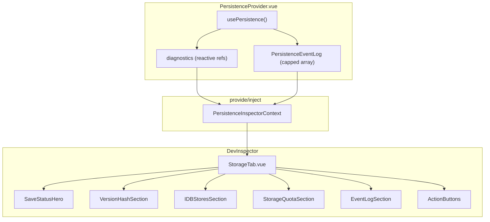
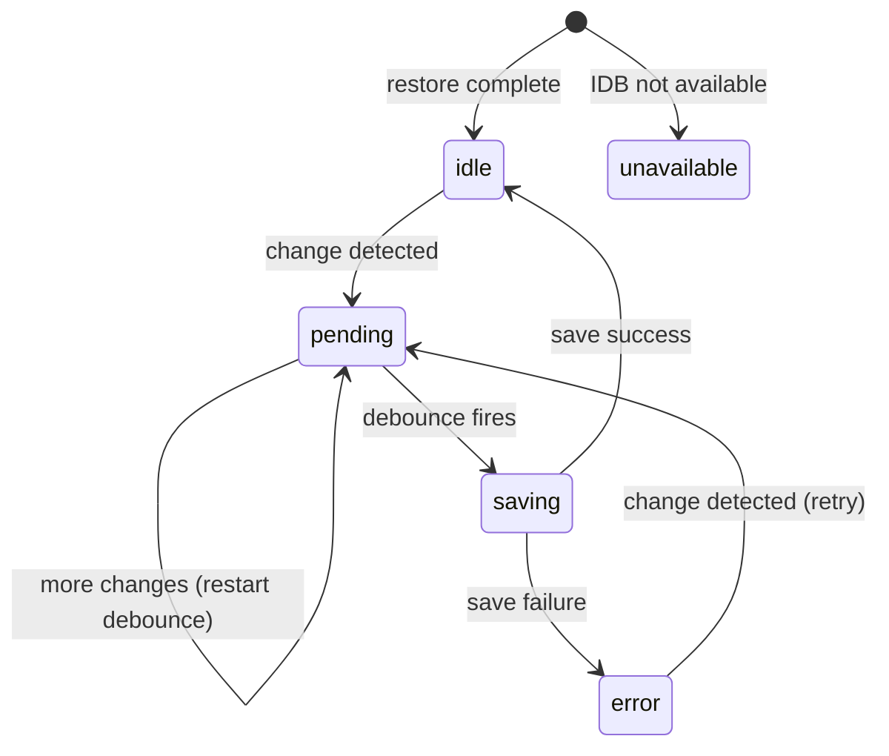

# feat: Add Storage Tab to Dev Inspector

## Overview

Add a "Storage" tab to the existing Dev Inspector panel that visualizes the persistence layer's internal state in real-time. This gives developers visibility into the save lifecycle, IndexedDB stores, storage quota, and a rolling event log — making persistence behavior debuggable without opening browser DevTools.

The visual spec is defined in `storage-tab-mockup.html` (project root).

## Problem Statement / Motivation

The persistence feature (`app/features/persistence/`) works silently — save status, hash comparisons, debounce behavior, backup strategies, and error states are only visible via `console.log` with `[persistence]` prefix. Developers debugging save issues must open browser DevTools, filter console output, manually inspect IndexedDB via Application tab, and mentally reconstruct the state machine. The Storage tab surfaces all of this in a purpose-built UI inside the existing Dev Inspector.

## Proposed Solution

### Architecture Overview



**Key decisions:**

1. **Data access via provide/inject** — `PersistenceProvider.vue` provides a `PersistenceInspectorContext` that `StorageTab` injects. Both live inside `<DrawVue>`, so the provide/inject scope is correct. No global state needed.

2. **Expand `usePersistence()` return type** — Convert internal `let` variables (`lastSavedHash`, `forwardVersionMode`, `hasPersistedStorage`) to `ref()` and expose them in a `diagnostics` object. Minimal perf impact since these update infrequently.

3. **Event log as capped reactive array** — Replace `console.log("[persistence] ...")` calls with a helper that both logs to console AND pushes to a reactive event array (max 50 entries, FIFO). This is the only clean way to populate the event log.

4. **IDB metadata read on demand** — Read store cards after each save event (event-driven via the log), not on a polling timer. Read once on tab first-open. Avoids unnecessary IDB reads.

## Technical Considerations

### Data Access Gaps (Current vs. Needed)

| Data point            | Currently exposed              | Change needed                                    |
| --------------------- | ------------------------------ | ------------------------------------------------ |
| `saveStatus`          | `ref<SaveStatus>` returned     | None                                             |
| `isRestored`          | `ref<boolean>` returned        | None                                             |
| `error`               | `shallowRef<Error>` returned   | None                                             |
| `lastSavedHash`       | local `let`                    | Convert to `ref<number>`, expose in diagnostics  |
| `forwardVersionMode`  | local `let`                    | Convert to `ref<boolean>`, expose in diagnostics |
| `hasPersistedStorage` | local `let`                    | Convert to `ref<boolean>`, expose in diagnostics |
| `sceneHash` (live)    | computed in `executeSave` only | Add as `computed` in diagnostics                 |
| Event log             | `console.log` only             | Add reactive event array + helper                |
| `flushSave()`         | local function                 | Expose in diagnostics                            |
| IDB store metadata    | not exposed                    | Add `readStoreMetadata()` function               |
| Storage quota         | not tracked                    | Compute via `navigator.storage.estimate()`       |

### State Machine (Already Implemented)



The Storage tab visualizes this existing state machine — no new state machine logic needed.

### Action Button Behaviors

| Action         | Behavior                                                                                                                                                                                        | Guard                                                                |
| -------------- | ----------------------------------------------------------------------------------------------------------------------------------------------------------------------------------------------- | -------------------------------------------------------------------- |
| **Force Save** | Call `flushSave()` (bypasses debounce, calls `executeSave()` immediately)                                                                                                                       | Disabled when `forwardVersionMode` or `saveStatus === 'unavailable'` |
| **Export**     | Read `scene:current` from IDB, serialize to JSON, trigger browser download as `drawvue-scene-{timestamp}.json`                                                                                  | Disabled when IDB unavailable or `scene:current` empty               |
| **Clear**      | Confirm dialog -> pause watcher -> delete IDB entries (`scene:current`, `scene:backup`) -> clear `EMERGENCY_BACKUP_KEY` from localStorage -> resume watcher. Does NOT clear in-memory elements. | Always available. Shows confirmation first.                          |

### Clear Action Safety

Clear does **not** wipe the canvas. After clearing:

- In-memory elements remain (user can keep drawing)
- Watcher resumes, so the next element change triggers a fresh save to now-empty IDB
- Event log records the clear action
- Store cards update to show empty state

### Edge Cases

| Scenario                                   | Behavior                                                                |
| ------------------------------------------ | ----------------------------------------------------------------------- |
| Fresh install (no IDB data)                | Backup card shows "No backup", emergency card shows empty placeholder   |
| IDB unavailable (privacy mode)             | Hero shows "unavailable", Force Save/Export disabled, quota shows "N/A" |
| Forward version mode                       | Hero shows amber warning, Force Save disabled, saves blocked            |
| Restore in progress                        | Hero shows "Restoring...", all actions disabled until `isRestored`      |
| Concurrent IDB read during save            | IDB transaction isolation handles this — reads return committed data    |
| `navigator.storage.estimate()` unavailable | Quota section shows "Not available" instead of meter                    |
| Emergency backup corrupted                 | Show "Invalid backup" with red indicator                                |

## Acceptance Criteria

### Functional Requirements

- [ ] Storage tab appears as 6th tab in Dev Inspector with database icon
- [ ] Tab badge shows colored dot matching save status (green/amber/blue/red/gray)
- [ ] **Save Status Hero** displays: animated status ring, status label, "last save X ago" timestamp, hash pill (green when synced, amber when dirty), state machine strip with active state highlighted
- [ ] **Version & Hash Section** (collapsible) shows: sceneHash, lastSavedHash, in-memory element count, persisted element count, schemaVersion, forwardMode
- [ ] **IndexedDB Stores Section** (collapsible) shows: `scene:current` card (schema, count, timestamp, size), `scene:backup` card (schema, count, timestamp, delta vs current), emergency localStorage card (timestamp, count, size) or empty placeholder
- [ ] **Storage Quota Section** (collapsible) shows: usage meter bar, used/available text, persisted grant status, IDB availability
- [ ] **Persistence Event Log** shows: rolling log (max 50 entries), timestamp, colored dot per event type (green=save, amber=debounce, purple=backup, blue=restore, cyan=probe), event description
- [ ] New log entries flash pink on arrival (matching existing `event-flash` animation)
- [ ] **Force Save** button bypasses debounce and writes immediately
- [ ] **Export** button downloads `scene:current` as JSON file
- [ ] **Clear** button shows confirmation, then wipes IDB + localStorage (not in-memory elements)
- [ ] Force Save disabled when `forwardVersionMode` or `unavailable`
- [ ] Export disabled when no persisted scene data
- [ ] All sections use the same collapsible pattern as StateTab.vue (chevron rotation, section icons)

### Testing Requirements

- [ ] Unit tests for expanded `usePersistence()` diagnostics (hash refs, forward mode ref, event log push)
- [ ] Unit test for `readStoreMetadata()` returning correct shape
- [ ] Unit test for event log capping at 50 entries
- [ ] Browser test: Storage tab renders with correct save status
- [ ] Browser test: Force Save triggers immediate write
- [ ] Browser test: Export downloads JSON file
- [ ] Browser test: Clear wipes IDB and updates UI

## Implementation Phases

### Phase 1: Expand Persistence Internals

**Files modified:**

- `app/features/persistence/types.ts` — Add `PersistenceEvent`, `PersistenceDiagnostics`, `StoreMetadata` types
- `app/features/persistence/usePersistence.ts` — Convert `let` vars to `ref()`, add event log array, expose `diagnostics` object, expose `flushSave()`
- `app/features/persistence/sceneStorage.ts` — Add `readStoreMetadata()` function (reads both IDB keys + localStorage emergency, returns metadata for display)
- `app/features/persistence/PersistenceProvider.vue` — Provide `PersistenceInspectorContext` via `provide()`
- `app/features/persistence/index.ts` — Export new types and injection key

**New types:**

```typescript
// types.ts additions
type PersistenceEventType =
  | "save"
  | "save-skip"
  | "backup"
  | "debounce"
  | "change"
  | "restore"
  | "probe"
  | "error"
  | "clear"
  | "export";

type PersistenceEvent = {
  id: number;
  type: PersistenceEventType;
  timestamp: number;
  message: string;
};

type StoreMetadata = {
  current: {
    schemaVersion: number;
    elementCount: number;
    savedAt: number;
    dataSize: number;
  } | null;
  backup: {
    schemaVersion: number;
    elementCount: number;
    savedAt: number;
    deltaVsCurrent: number;
  } | null;
  emergency: { timestamp: number; elementCount: number; dataSize: number } | null;
};

type PersistenceDiagnostics = {
  lastSavedHash: Readonly<Ref<number>>;
  sceneHash: Readonly<ComputedRef<number>>;
  forwardVersionMode: Readonly<Ref<boolean>>;
  hasPersistedStorage: Readonly<Ref<boolean>>;
  events: Readonly<ShallowRef<readonly PersistenceEvent[]>>;
  flushSave: () => void;
  clearStorage: () => Promise<void>;
  readStoreMetadata: () => Promise<StoreMetadata>;
};
```

**Key change in `usePersistence.ts`:**

```typescript
// Before: let lastSavedHash = 0;
// After:  const lastSavedHash = ref(0);

// Before: let forwardVersionMode = false;
// After:  const forwardVersionMode = ref(false);

// Before: let hasPersistedStorage = false;
// After:  const hasPersistedStorage = ref(false);

// Add event log
const events = shallowRef<readonly PersistenceEvent[]>([]);
let eventIdCounter = 0;

function logEvent(type: PersistenceEventType, message: string): void {
  const event: PersistenceEvent = {
    id: ++eventIdCounter,
    type,
    timestamp: Date.now(),
    message,
  };
  const next = [...events.value, event];
  events.value = next.length > 50 ? next.slice(-50) : next;
  // Also log to console for traditional debugging
  console.log(`[persistence] ${type}: ${message}`);
}
```

### Phase 2: StorageTab Component

**Files created:**

- `app/features/dev-inspector/tabs/StorageTab.vue` — Main tab component with all 6 sections

**Files modified:**

- `app/features/dev-inspector/DevInspector.vue` — Add "storage" to tab union, import StorageTab, add tab entry with icon, wire conditional render, add badge logic

**Component structure:**

```
StorageTab.vue
├── SaveStatusHero (inline — status ring, label, hash pill, state machine strip)
├── VersionHashSection (collapsible — 6 kv-rows)
├── IDBStoresSection (collapsible — 2 store cards + emergency card)
├── StorageQuotaSection (collapsible — meter bar, kv-rows)
├── EventLog (scrollable — capped list with colored dots)
└── ActionButtons (3 buttons — Force Save, Export, Clear)
```

**Data flow:**

- Inject `PersistenceInspectorContext` for reactive state (saveStatus, diagnostics)
- Compute `sceneHash` from `hashElementsVersion(getNonDeletedElements(elements))`
- Read IDB metadata on mount and after each save event
- Read storage quota on mount via `navigator.storage.estimate()`
- "Last save X ago" uses `useTimeAgo` from VueUse

**Collapsible sections** follow the StateTab pattern:

- `openSections: Set<string>` tracks open sections
- `toggleSection(id)` adds/removes from set
- Chevron rotates 90deg when open

### Phase 3: Action Implementations

**Force Save:**

```typescript
async function handleForceSave(): Promise<void> {
  diagnostics.flushSave();
  await refreshMetadata();
}
```

**Export:**

```typescript
async function handleExport(): Promise<void> {
  const metadata = await diagnostics.readStoreMetadata();
  if (!metadata.current) return;
  const scene = await getScene("scene:current");
  const blob = new Blob([JSON.stringify(scene, null, 2)], { type: "application/json" });
  const url = URL.createObjectURL(blob);
  const a = document.createElement("a");
  a.href = url;
  a.download = `drawvue-scene-${Date.now()}.json`;
  a.click();
  URL.revokeObjectURL(url);
  logEvent("export", "Exported scene:current as JSON");
}
```

**Clear (with confirmation):**

```typescript
async function handleClear(): Promise<void> {
  // Use native confirm() — simple, no extra component needed
  if (!confirm("Clear all persisted data? Your current drawing stays in memory.")) return;
  await diagnostics.clearStorage();
  await refreshMetadata();
}
```

### Phase 4: Tests

**Files created:**

- `app/features/persistence/diagnostics.unit.test.ts` — Tests for expanded return type
- `app/features/dev-inspector/tabs/StorageTab.browser.test.ts` — Browser tests for the tab

**Unit test coverage:**

- `lastSavedHash` ref updates after successful save
- `forwardVersionMode` ref set during forward-version restore
- Event log pushes entries and caps at 50
- `readStoreMetadata()` returns correct shape for populated/empty stores
- `clearStorage()` removes IDB entries and localStorage key

**Browser test coverage:**

- Storage tab renders when selected
- Save status hero shows correct state after drawing + save
- Force Save triggers immediate write (verify via IDB read)
- Export downloads a JSON file
- Clear removes persisted data (verify IDB empty after clear)

## Dependencies & Risks

| Risk                                                   | Likelihood | Mitigation                                                                                                     |
| ------------------------------------------------------ | ---------- | -------------------------------------------------------------------------------------------------------------- |
| Converting `let` to `ref()` breaks existing save logic | Low        | Each converted variable is used in the same closures — `ref.value` is a drop-in. Unit tests catch regressions. |
| Event log allocation pressure during rapid drawing     | Low        | Capped at 50 entries, debounce means ~3 events per save cycle max.                                             |
| IDB metadata read slows down tab switching             | Low        | Reads are event-driven (not polling), IDB reads are <1ms for small records.                                    |
| `navigator.storage.estimate()` throttled by browser    | Medium     | Cache result, refresh only on save events. Show "N/A" if unavailable.                                          |
| Clear action causes unexpected behavior                | Medium     | Clear does NOT touch in-memory elements. Confirmation dialog required. Watcher resumes normally.               |

## References & Research

### Internal References

- Persistence feature: `app/features/persistence/` (all files)
- Dev Inspector: `app/features/dev-inspector/DevInspector.vue`
- StateTab pattern: `app/features/dev-inspector/tabs/StateTab.vue`
- Persistence plan: `docs/plans/2026-02-16-feat-local-persistence-indexeddb-plan.md`
- Excalidraw state reference: `docs/excalidraw-state-and-persistence.md`
- Visual mockup: `storage-tab-mockup.html` (project root)

### Core APIs Used

- `hashElementsVersion` and `getNonDeletedElements` from `@excalidraw/element` (re-exported by `@drawvue/core`)
- `useDrawVue()` for element access
- `useDebounceFn` from `@vueuse/core`
- `useTimeAgo` from `@vueuse/core` for "last save X ago"
- `navigator.storage.estimate()` for quota
- `idb-keyval` `get()` / `del()` for store metadata and clear
