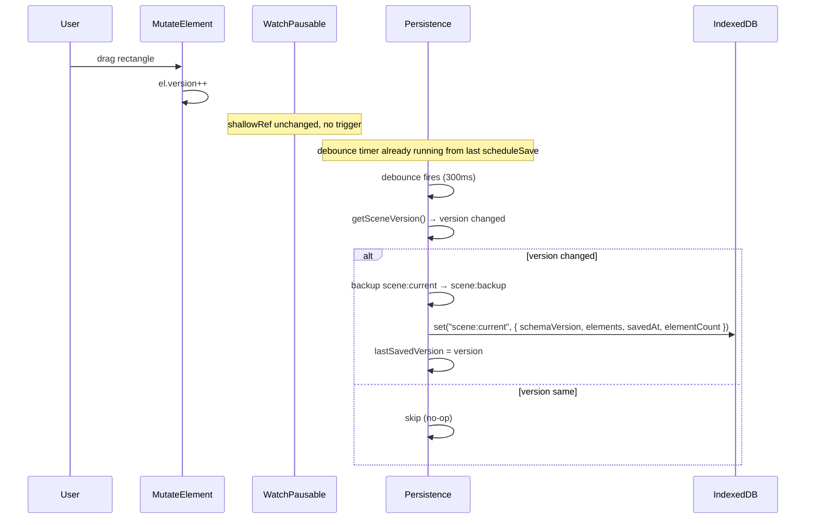
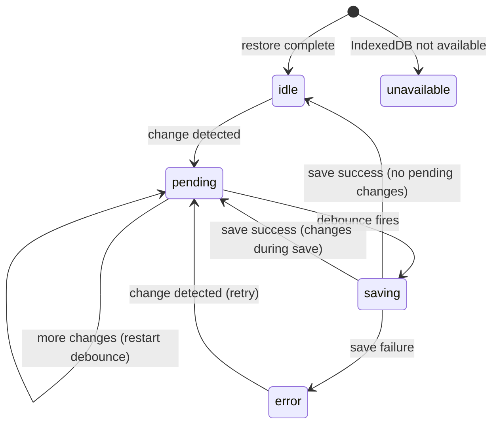

# feat: Add Local Persistence via IndexedDB

## Enhancement Summary

**Deepened on:** 2026-02-16
**Research agents used:** Type Safety, Performance, Data Integrity, Architecture/Patterns

### Key Improvements

1. **Type-safe storage layer**: Branded keys, discriminated union schema versions, typed `idb-keyval` wrappers matching existing codebase conventions (`FileId`, `MakeBrand`)
2. **Image storage as Blob**: 33% space savings over dataURL strings; IndexedDB natively supports Blob structured clone
3. **Rolling backup before migration**: Write `scene:backup` key before migrating data, preventing data loss on failed schema upgrades
4. **Composable architecture clarified**: `usePersistence()` as thin reactive wrapper + pure modules; `watchPausable` to prevent save-during-restore; `onScopeDispose` for flush-not-cancel cleanup
5. **Safari eviction protection**: Call `navigator.storage.persist()` to prevent 7-day ITP data deletion

### New Considerations Discovered

- `useDebounceFn` does NOT auto-cleanup on unmount — must manually flush pending saves via `onScopeDispose`
- `beforeunload` listener disables bfcache — only attach when there are unsaved changes
- Chrome 121+ defaults IndexedDB to relaxed durability (writes survive browser crash but not power failure)
- Schema version field should be named `schemaVersion` to avoid confusion with `element.version`
- Single-key storage scales well to ~3,000 elements; add `console.warn` at threshold for future migration path
- `@vueuse/integrations` is NOT installed — `useIDBKeyval` not available without new dependency. Use raw `idb-keyval` only.

---

## Overview

Add local browser persistence so drawing elements and image data survive page refresh and browser close. Uses `idb-keyval` for IndexedDB storage (raw API, not VueUse wrapper). No cloud sync, no server — purely client-side.

**Reference implementations studied:**

- **Excalidraw**: localStorage for elements JSON + `idb-keyval` for binary images. 300ms debounced saves.
- **tldraw**: Full IndexedDB via `idb` library. Individual records by ID. 350ms throttled writes. BroadcastChannel for cross-tab sync.

**Our approach**: Hybrid inspired by both — IndexedDB for everything (avoids localStorage's 5-10MB limit), using `idb-keyval` for simplicity, with debounced writes and version-gated saves.

## Problem Statement / Motivation

Currently all drawing state is lost on page refresh. The only persisted value in the entire app is the theme preference (`useLocalStorage('excalidraw-theme')`). Users expect their drawings to survive browser sessions — this is table stakes for any drawing application.

## Proposed Solution

### Architecture Decision: App Layer Persistence

Persistence lives in the **app layer** (`app/features/persistence/`), NOT in `@drawvue/core`. Reasoning:

- Core is a reusable library — not all consumers want IndexedDB
- The app layer already has access to `DrawVueContext` via `useDrawVue()`
- Keeps the core free of browser storage dependencies

The persistence layer watches context state and syncs to/from IndexedDB.

> **Research: Core boundary validation.** VueFlow and Pinia both treat persistence as a consumer/plugin concern, not a core feature. Our approach aligns with industry patterns. Persistence reads context slices directly via `useDrawVue()` — no new core API needed for Phase 1. Only `ImageCacheEntry.dataURL` addition needed for Phase 2 (additive, non-breaking). The stability boundary (elements ShallowRef, replaceElements, imageCache, dirty) is all public API surface unlikely to change.

### Library Choice: `idb-keyval` (raw)

| Considered     | Size (gzip) | Decision                                                                               |
| -------------- | ----------- | -------------------------------------------------------------------------------------- |
| **idb-keyval** | ~573 bytes  | **Selected** — minimal, proven (used by Excalidraw), raw API for manual control        |
| idb            | ~1.2 KB     | Rejected — multi-store transactions not needed for our use case                        |
| Dexie.js       | ~26 KB      | Rejected — ORM features (queries, reactive liveQuery) are overkill; needs rxjs for Vue |

Usage strategy:

- **Raw `idb-keyval`** (`get`/`set`/`del`/`entries`/`createStore`) for element saves and image storage — we need manual debounced writes, not reactive auto-sync
- **`useLocalStorage`** (already used) — for viewport state and style defaults (small, JSON-serializable, instant sync)

> **Research: `@vueuse/integrations` is NOT installed.** The `useIDBKeyval` composable requires `@vueuse/integrations` which is not in `package.json`. Since we use raw `idb-keyval` with manual debounced saves, this dependency is not needed. Only `idb-keyval@^6` needs to be added.

### Data Stores

Two separate IndexedDB stores via `idb-keyval`'s `createStore`:

```
drawvue-scene-db / scene-store
  └── "scene:current" → { schemaVersion: 1, elements: ExcalidrawElement[], savedAt: number }
  └── "scene:backup"  → { schemaVersion: 1, elements: ExcalidrawElement[], savedAt: number }  // rolling backup

drawvue-files-db / files-store
  └── "<fileId>" → Blob  // native Blob, NOT dataURL string
```

Small preferences via localStorage (existing pattern):

- `drawvue-viewport` → `{ scrollX, scrollY, zoom }`
- `drawvue-style-defaults` → `{ strokeColor, fillStyle, ... }`
- `excalidraw-theme` → already exists

> **Research: Image storage as Blob, not dataURL.** Base64 encoding adds 33% overhead. A 5MB image becomes ~6.65MB as dataURL. IndexedDB natively supports Blob storage since Chrome 55+, Firefox 11+, Safari 10+. `idb-keyval.set(key, blob)` works directly. Chrome's Snappy compression (since 2024) compresses Blob data more efficiently than base64 strings. Store as Blob, keep `dataURL` in memory for canvas rendering.

> **Research: Rolling backup key.** Store previous good state under `scene:backup` before each successful save. On corruption, fall back to backup before trying localStorage emergency. One rolling backup is sufficient — the 300ms save interval means the delta between consecutive saves is tiny.

## Technical Approach

### Architecture

```mermaid
graph TD
    subgraph "App Layer (app/features/persistence/)"
        UP["usePersistence()<br/>Thin reactive wrapper"]
        MTG["useMultiTabGuard()<br/>BroadcastChannel peer (Phase 3)"]
        UI[Save Status Indicator]

        subgraph "Pure Modules"
            SV["sceneVersion.ts<br/>getSceneVersion()<br/>getNonDeletedElements()"]
            SS["sceneStorage.ts<br/>saveScene() / loadScene()<br/>migrateScene()"]
            ST["stores.ts<br/>createStore() definitions<br/>typed wrappers"]
            FS["fileStorage.ts<br/>saveFile() / getFiles()"]
            TY["types.ts<br/>PersistedScene, SaveStatus"]
        end
    end

    subgraph "VueUse (reactive utilities)"
        DF["useDebounceFn(save, 300, maxWait: 1000)"]
        WP["watchPausable(elements, ...)"]
        UEL["useEventListener<br/>(visibilitychange, pagehide, beforeunload)"]
        UBC["useBroadcastChannel (Phase 3)"]
    end

    subgraph "Core (@drawvue/core via useDrawVue())"
        CTX[DrawVueContext]
        EL["elements.elements (ShallowRef)"]
        RE["elements.replaceElements()"]
        IC[imageCache]
        DT["dirty.markStaticDirty()"]
    end

    subgraph "Storage"
        IDB_S[IndexedDB: scene store]
        IDB_F[IndexedDB: files store]
        LS["localStorage: viewport, styles, emergency backup"]
    end

    UP --> SV
    UP --> SS
    UP --> ST
    UP --> FS

    UP --> DF
    UP --> WP
    UP --> UEL

    MTG --> UBC

    UP --> CTX
    CTX --> EL
    CTX --> RE
    CTX --> IC
    CTX --> DT

    SS --> IDB_S
    FS --> IDB_F
    UP --> LS

    UP --> UI
```



### Type-Safe Storage Layer

> **Research: Branded types for store separation.** The codebase already uses branded types (`FileId`, `FractionalIndex`, `FontString`). Apply the same pattern to storage keys to prevent passing a scene store key to the files store.

```typescript
// types.ts — follows existing _brand convention from @excalidraw/element

// Schema versions as discriminated union for type-safe migrations
interface PersistedSceneV1 {
  schemaVersion: 1;
  elements: ExcalidrawElement[];
  savedAt: number;
  elementCount: number; // lightweight integrity check
}

// When v2 arrives, add PersistedSceneV2 to the union
type PersistedScene = PersistedSceneV1;
type CurrentPersistedScene = PersistedSceneV1;
const CURRENT_SCHEMA_VERSION = 1 as const;

// Migration map: compiler enforces entry for every version except current
type MigrationMap = {
  [V in PersistedScene["schemaVersion"] as V extends typeof CURRENT_SCHEMA_VERSION ? never : V]: (
    data: Extract<PersistedScene, { schemaVersion: V }>,
  ) => CurrentPersistedScene;
};

// Image file record for metadata (actual data stored as Blob)
interface PersistedFileMetadata {
  id: string; // re-brand with toFileId() on load
  mimeType: string;
  created: number;
  lastRetrieved: number;
}

// Save status state machine
type SaveStatus = "idle" | "pending" | "saving" | "unavailable" | "error";
```

> **Research: Type-safe `idb-keyval` wrappers.** Define registry interfaces mapping keys to value types. The files store uses `FileId` (branded) as keys, the scene store uses string literals.

```typescript
// stores.ts — typed wrappers around idb-keyval

interface SceneStoreSchema {
  "scene:current": PersistedScene;
  "scene:backup": PersistedScene;
}

// Factory returns typed get/set/del constrained by schema
function createTypedStore<Schema extends Record<string, unknown>>(
  store: ReturnType<typeof createStore>,
) {
  return {
    get: <K extends keyof Schema & string>(key: K) => tryCatch(idbGet<Schema[K]>(key, store)),
    set: <K extends keyof Schema & string>(key: K, value: Schema[K]) =>
      tryCatch(idbSet(key, value, store)),
    del: <K extends keyof Schema & string>(key: K) => tryCatch(idbDel(key, store)),
  };
}

// Files store: separate typed functions accepting FileId
function getFile(id: FileId): Promise<Result<Blob | undefined>>;
function setFile(id: FileId, blob: Blob): Promise<Result<void>>;
```

> **Research: Error narrowing without native try/catch.** Use `.name`-based predicates on the `Error` returned by `tryCatch()`. IndexedDB errors are `DOMException` instances preserved by `tryCatch`. Cross-realm safe (unlike `instanceof`).

```typescript
function isQuotaExceeded(error: Error): boolean {
  return error.name === "QuotaExceededError";
}

function isIDBUnavailable(error: Error): boolean {
  return (
    error.name === "SecurityError" ||
    error.name === "InvalidStateError" ||
    error.message.includes("indexedDB")
  );
}
```

### Composable Return Type

> **Research: Follow established convention exactly.** Every composable in the codebase uses an explicitly named `interface` return type (`UseElementsReturn`, `UseHistoryReturn`, etc.). Outputs are `Readonly<Ref<T>>` to prevent external mutation.

```typescript
interface UsePersistenceReturn {
  isRestored: Readonly<Ref<boolean>>;
  saveStatus: Readonly<Ref<SaveStatus>>;
  error: Readonly<ShallowRef<Error | null>>;
}
```

### Save Trigger: The Mutation Detection Problem

**Problem**: `elements` is a `shallowRef`. `mutateElement()` modifies elements in-place without replacing the array reference. A `watch(elements)` misses all drags, resizes, and style changes.

**Solution**: Use a **scene version counter** (like Excalidraw's `getSceneVersion`):

```typescript
// Compute scene version by summing all element versions
function getSceneVersion(elements: readonly ExcalidrawElement[]): number {
  return elements.reduce((acc, el) => acc + el.version, 0);
}
```

The save mechanism:

1. `watchPausable(elements, scheduleSave)` catches array replacements (add, delete, undo/redo)
2. The debounced save callback computes `getSceneVersion(elements.value)` to catch in-place mutations
3. Compare with `lastSavedVersion` — skip save if unchanged
4. This avoids the dual-ref problem entirely

> **Research: Why `watchPausable`, not plain `watch`.** Critical for preventing saves during restore. The restore flow calls `replaceElements()`, which triggers the elements watcher, which would immediately trigger a save cycle. `watchPausable` lets us pause the save watcher during restore and resume after. This is precisely its use case.

> **Research: `markStaticDirty` is NOT the right hook.** It fires for ALL rendering changes — viewport moves, selection overlays, interactive feedback — not just persistence-relevant element changes. Hooking into it would trigger unnecessary version checks on every mouse move. The plan's `getSceneVersion()` comparison in the debounced callback is the correct approach: it catches both array replacements (via `watchPausable`) and in-place mutations (via version sum comparison), without coupling to rendering internals.



### Save Suppression During Active Interactions

Saves are suppressed while a history checkpoint is pending (user mid-drag/resize):

- `saveCheckpoint()` → set `isPending = true`
- `commitCheckpoint()` / `revertCheckpoint()` → set `isPending = false`, trigger save

This avoids persisting transient mid-interaction states.

### Image Data Persistence

**Core change needed**: The current `ImageCacheEntry` stores `{ image: HTMLImageElement, mimeType: string }`. The `HTMLImageElement` is not serializable. We need to retain the `dataURL` string.

```typescript
// packages/core/src/features/image/types.ts
interface ImageCacheEntry {
  image: HTMLImageElement;
  mimeType: string;
  dataURL: string; // NEW — retained for persistence
}
```

**Upload flow change** (`useImageUpload.ts`):

```
File → FileReader.readAsDataURL → dataURL string
  → loadImage(dataURL) → HTMLImageElement
  → addImage(fileId, { image, mimeType, dataURL })  // dataURL now preserved
```

**Image persistence flow (Blob storage)**:

```
On save: iterate imageCache entries → for each, convert dataURL to Blob → store Blob to files store
On load: read Blob entries from files store → URL.createObjectURL(blob) → loadImage(url) → addImage to cache → render
```

> **Research: dataURL to Blob conversion.** Use `fetch(dataURL).then(r => r.blob())` or manual `atob` + `Uint8Array`. On load, use `URL.createObjectURL(blob)` for the HTMLImageElement src. Keep the `dataURL` in the in-memory `ImageCacheEntry` for immediate use (canvas rendering, export), but persist as Blob for 33% storage savings.

> **Research: Orphan cleanup strategy.** Follow Excalidraw's pattern — delete files older than 24 hours that are not referenced by any non-deleted element. Run on load only (not periodically). Use `created` timestamp with 24-hour grace period to protect against race conditions where an image is uploaded but the referencing element hasn't been saved yet.

### Serialization Safety

> **Research: JSON round-trip as serialization boundary.** `ExcalidrawElement` includes `customData?: Record<string, any>` which may contain non-serializable values. `structuredClone` (used internally by IndexedDB) would throw on functions/DOM nodes in `customData`. Use `JSON.parse(JSON.stringify(elements))` as a pre-serialization boundary wrapped in `tryCatch`. This strips non-serializable values safely. Do NOT attempt a `Serializable<T>` utility type — `ExcalidrawElement` is an upstream type that cannot be modified.

> **Research: `FileId` branding survives structured clone but NOT JSON round-trip.** The `_brand` property is a phantom type at compile time. After deserialization, re-brand with the existing `toFileId()` utility from `packages/core/src/features/image/types.ts`.

> **Research: Don't pre-serialize.** Pass plain objects to `idb-keyval.set()`. IndexedDB uses structured clone internally — calling `JSON.stringify` first is counterproductive (double serialization). The JSON round-trip is only for the pre-validation step to catch non-serializable `customData`.

### Page Unload Strategy

IndexedDB writes are async — `beforeunload` doesn't guarantee completion.

**Triple strategy:**

1. **Primary**: Frequent debounced saves (300ms) to IndexedDB — at most 300ms of work can be lost
2. **Backup**: On `visibilitychange` to `hidden` AND `pagehide`, immediately flush pending save (this fires reliably when switching tabs or minimizing)
3. **Last resort**: On `beforeunload`, write elements JSON to `localStorage` synchronously as emergency backup. On load, compare timestamps between IndexedDB and localStorage, use the newer one.

```typescript
// visibilitychange is more reliable than beforeunload
useEventListener(document, "visibilitychange", () => {
  if (document.hidden) flushSave();
});

// pagehide fires before bfcache — better mobile coverage
useEventListener(window, "pagehide", () => flushSave());

// beforeunload as last resort — synchronous localStorage write
// ONLY attach when there are unsaved changes (preserves bfcache eligibility)
useEventListener(window, "beforeunload", () => {
  localStorage.setItem(
    "drawvue-emergency-backup",
    JSON.stringify({
      timestamp: Date.now(),
      elements: getNonDeletedElements(elements.value),
    }),
  );
});
```

> **Research: `beforeunload` disables bfcache.** Only attach the listener when `saveStatus === 'pending'`, remove after save completes. This preserves bfcache eligibility when the drawing is fully saved.

> **Research: Chrome relaxed durability (since v121).** IndexedDB `complete` event fires after data reaches OS buffer, not disk. Writes survive browser/tab close but NOT power failure. Acceptable for a drawing app — the 300ms debounce window is the real data loss ceiling.

> **Research: Emergency backup size limit.** localStorage is ~5MB. For canvases with 3000+ elements (~1-3MB JSON), the emergency backup should use `getNonDeletedElements()` to minimize size. If it exceeds quota, catch the error silently — the 300ms debounced IndexedDB save is the real safety net.

### Soft-Deleted Elements: Persist Non-Deleted Only

Following Excalidraw's pattern: only persist `getNonDeletedElements()`. Reasoning:

- Soft-deleted elements accumulate unboundedly over time
- Undo history is already lost on refresh (history is in-memory only)
- Storage stays lean

### Multi-Tab Strategy: Last-Write-Wins (v1)

No cross-tab coordination for v1. Documented limitation. A simple detection mechanism warns users:

```typescript
// Phase 3: Use VueUse's useBroadcastChannel for auto-cleanup
const { post, data } = useBroadcastChannel({ name: "drawvue-tab-sync" });
post({ type: "tab-opened", timestamp: Date.now() });
watch(data, (msg) => {
  if (msg?.type === "tab-opened") {
    showWarning("Drawing is open in another tab. Changes may conflict.");
  }
});
```

> **Research: BroadcastChannel limitations.** Does not work between normal and incognito windows. Same-origin only. No message persistence or delivery guarantee. No acknowledgment mechanism. Safari 15.4+ supported. For v1 warning-only use case, these limitations are acceptable.

> **Research: IndexedDB serializes concurrent writes.** Two tabs writing to the same key will NOT corrupt data — IndexedDB transactions are serialized. The risk is semantic (last write overwrites), not structural. Web Locks API could prevent concurrent writes but adds complexity and deadlock risk. Save for v2.

### Schema Versioning

Store a version number from day one:

```typescript
interface PersistedSceneV1 {
  schemaVersion: 1; // named schemaVersion to avoid confusion with element.version
  elements: ExcalidrawElement[];
  savedAt: number;
  elementCount: number; // lightweight integrity check
}
```

> **Research: Discriminated unions for compile-time migration enforcement.** When `PersistedSceneV2` is added to the union, TypeScript will immediately flag that `MigrationMap` is missing a key `1` — meaning the v1→v2 migration function hasn't been written. The `schemaVersion` field acts as the discriminant.

Migration runner on load:

```typescript
const migrations: MigrationMap = {
  // Future: 1 → 2 migration would go here
  // TypeScript enforces this map has an entry for every version except current
};

function migrateScene(stored: PersistedScene): CurrentPersistedScene {
  if (stored.schemaVersion === CURRENT_SCHEMA_VERSION) return stored;
  const migrate = migrations[stored.schemaVersion];
  return migrate(stored);
}
```

> **Research: Pre-migration backup.** Before running migrations, copy `scene:current` to `scene:backup`. If migration fails, the backup holds the last known-good state. Delete backup only after confirming the migrated write succeeded.

> **Research: Forward-version guard.** If `data.schemaVersion > CURRENT_SCHEMA_VERSION` (e.g., another tab with a newer app version migrated the data), enter read-only mode and show "Please refresh this tab." This prevents older code from overwriting data in a format it doesn't understand.

### Data Validation on Load

> **Research: Normalize on read, don't reject.** Follow Excalidraw's `restoreElements()` pattern — fill missing properties with defaults, remove degenerate elements, repair broken bindings. Never throw on validation failure at the element level. A lenient approach maximizes data recovery.

Validation strategy (manual type guards for v1):

1. Check top-level shape: `schemaVersion` exists, `elements` is an array, `savedAt` is a number
2. Verify `elementCount` matches `elements.length` (lightweight integrity check)
3. For each element: verify required fields (`id`, `type`) exist with correct types
4. Missing fields → fill with defaults; structurally irrecoverable elements → filter out and warn
5. If everything fails → start with empty canvas, console error

> **Research: No validation library needed for v1.** Both Zod (~13KB) and Valibot (~1KB) are overkill for a simple shape check. Manual type guards suffice. Consider Valibot when schema grows complex (v2+).

### Error Handling

| Failure                                  | Handling                                                                             |
| ---------------------------------------- | ------------------------------------------------------------------------------------ |
| IndexedDB unavailable (private browsing) | Detect early via probe, set `saveStatus = 'unavailable'`, memory-only mode           |
| `QuotaExceededError`                     | Toast: "Storage full — drawing safe in memory but won't persist"                     |
| Corrupted data on load                   | Normalize on read; fall back to `scene:backup`; then localStorage; then empty canvas |
| Non-serializable element (`customData`)  | JSON round-trip pre-validation in `tryCatch`; skip save cycle, warn in console       |
| Load race with user interaction          | `pointer-events: none` until `isRestored = true`                                     |
| Forward schema version                   | Read-only mode, show "Please refresh this tab"                                       |
| Safari 7-day eviction                    | Call `navigator.storage.persist()` on first save                                     |

> **Research: Early IndexedDB availability probe.** Attempt a trivial `indexedDB.open('__drawvue_probe')` on init. If it fails, set `saveStatus = 'unavailable'` and skip all subsequent save attempts. This avoids repeated error handling in every save cycle.

### Load Race Condition

On mount, the persistence layer loads before enabling drawing:

```typescript
const { isRestored, saveStatus } = usePersistence();
// DrawVue template: :style="{ pointerEvents: isRestored ? 'auto' : 'none' }"
```

> **Research: Use `pointer-events: none` style binding, NOT `v-if`.** `v-if="isRestored"` on DrawVue would delay canvas initialization and all composable setup until after the IndexedDB read, creating visible layout shift. With `pointer-events: none`, the empty canvas renders immediately (better perceived performance) while pointer events are blocked until restore completes.

> **Research: Restore starts in setup, NOT in `onMounted`.** Use an immediately-invoked async function in setup phase. This matches VueUse's pattern where `useIDBKeyval` starts loading immediately during setup.

### Save Status State Machine

> **Research: Simple `ref<SaveStatus>`, NOT XState.** The state machine is simple (5 states, 7 transitions). XState adds ~12KB — overkill. A `ref` with explicit transitions is consistent with project patterns.



### Cleanup and Disposal

> **Research: `onScopeDispose` to FLUSH, not cancel.** VueUse's `useDebounceFn` cancels the pending timer on scope disposal. For persistence, we need to flush (immediately execute) the pending save to prevent data loss. Use `onScopeDispose` (not `onUnmounted`) — works in both component setup and `effectScope` (test helpers like `withSetup`/`withDrawVue`).

> **Research: VueUse auto-cleanups.** `useEventListener`, `watchPausable`, `useBroadcastChannel` all auto-cleanup on scope disposal. The only manual cleanup needed is the flush-on-dispose for the debounced save.

### VueUse Integration

| Composable            | Use?              | Why                                                                                                                    |
| --------------------- | ----------------- | ---------------------------------------------------------------------------------------------------------------------- |
| `useDebounceFn`       | **YES**           | Primary save trigger. Has `maxWait` option for ceiling. Use `maxWait: 1000` to ensure saves during continuous drawing. |
| `watchPausable`       | **YES**           | Pause save watcher during restore to prevent save-on-load race.                                                        |
| `useEventListener`    | **YES**           | For `visibilitychange`, `pagehide`, `beforeunload`. Auto-cleanup.                                                      |
| `useLocalStorage`     | **YES**           | For viewport and style defaults. Already used for theme.                                                               |
| `useBroadcastChannel` | **YES (Phase 3)** | Multi-tab detection. Auto-cleanup. `isSupported` check included.                                                       |
| `useIDBKeyval`        | **NO**            | Requires `@vueuse/integrations` (not installed). Creates reactive ref that conflicts with debounced strategy.          |
| `whenever`            | **NO**            | Marginal value. Simple `if` check is clearer.                                                                          |

### Performance Characteristics

> **Research: IndexedDB write benchmarks.** From Nolan Lawson's IndexedDB benchmarks and RxDB analysis:

| Element Count   | Estimated JSON Size | Structured Clone Time | Recommendation               |
| --------------- | ------------------- | --------------------- | ---------------------------- |
| 100 elements    | ~20-50 KB           | <5ms                  | No concerns                  |
| 1,000 elements  | ~200-500 KB         | ~20-50ms              | Target sweet spot            |
| 3,000 elements  | ~600KB-1.5MB        | ~60-150ms             | Add `console.warn`           |
| 5,000+ elements | ~1-2.5MB            | ~100-250ms+           | Consider per-element storage |

> **Research: Don't use `requestIdleCallback`.** The 300ms debounce already prevents writes during active interaction. IndexedDB writes at 200-500KB are fast enough (~50ms) that they won't cause visible frame drops without `rIC`.

> **Research: Web Worker not needed for v1.** At target scale (1,000 elements, 200-500KB), main-thread cost is under 50ms. Worker overhead (`postMessage` structured clone ~6-11ms + scheduling ~2-8ms) doesn't justify the complexity. Add Worker when profiling shows jank above 3,000 elements.

### IndexedDB Quotas

> **Research: Current browser quotas (2025-2026)**:

| Browser     | Best-Effort Quota (per origin)             |
| ----------- | ------------------------------------------ |
| Chrome/Edge | 60% of total disk (~150GB on 256GB device) |
| Firefox     | min(10% of disk, 10 GiB)                   |
| Safari 17+  | ~60% of disk                               |

A drawing app will never approach these limits with element data. Image storage could accumulate but would need hundreds of large images.

> **Research: Call `navigator.storage.persist()` on first save.** Safari auto-approves for regularly-visited sites. Prevents the 7-day ITP eviction. Use `navigator.storage.estimate()` to check quota before large writes.

## Implementation Phases

### Phase 1: Foundation — Element Persistence

**Goal**: Elements survive page refresh.

**Tasks:**

- [ ] Install `idb-keyval@^6` as dependency in `app/package.json`
- [ ] Create `app/features/persistence/` directory structure
- [ ] Create `app/features/persistence/types.ts` — `PersistedSceneV1`, `CurrentPersistedScene`, `MigrationMap`, `SaveStatus`, `UsePersistenceReturn`
- [ ] Create `app/features/persistence/stores.ts` — IndexedDB store definitions via `createStore` + typed wrappers
- [ ] Create `app/features/persistence/sceneStorage.ts` — `saveScene()`, `loadScene()`, `migrateScene()` with schema versioning + rolling backup
- [ ] Create `app/features/persistence/sceneVersion.ts` — `getSceneVersion()` and `getNonDeletedElements()` helpers
- [ ] Create `app/features/persistence/usePersistence.ts` — main composable: `watchPausable` + `useDebounceFn(300, maxWait: 1000)`, version-gated writes, restore in setup
- [ ] Add IndexedDB availability probe on init (detect private browsing early)
- [ ] Add `navigator.storage.persist()` call on first successful save
- [ ] Add `visibilitychange` + `pagehide` flush via `useEventListener`
- [ ] Add conditional `beforeunload` localStorage backup (only when unsaved changes exist)
- [ ] Add data validation on load (manual type guards, normalize-on-read pattern)
- [ ] Add forward-version guard (`schemaVersion > CURRENT` → read-only warning)
- [ ] Wire `usePersistence()` into `app/pages/index.vue` with `pointer-events: none` gate
- [ ] Add error handling with `tryCatch` + `.name`-based error predicates
- [ ] Add `onScopeDispose` flush (not cancel) for pending saves

**Success criteria:**

- [ ] Draw shapes → refresh → shapes restored
- [ ] Undo → refresh → undone state persisted (not the pre-undo state)
- [ ] Empty canvas on first visit (no stale data)

**Estimated files:**

```
app/features/persistence/
├── stores.ts              # IndexedDB store definitions + typed wrappers
├── sceneStorage.ts        # Save/load/migrate scene data + rolling backup
├── sceneVersion.ts        # Version computation helpers
├── usePersistence.ts      # Main composable (thin reactive wrapper)
└── types.ts               # PersistedSceneV1, SaveStatus, MigrationMap, UsePersistenceReturn
```

### Phase 2: Image Persistence

**Goal**: Uploaded images survive page refresh.

**Tasks:**

- [ ] Extend `ImageCacheEntry` type in `packages/core/src/features/image/types.ts` to include `dataURL: string`
- [ ] Update `useImageUpload.processFile()` in core to retain `dataURL` when creating cache entries
- [ ] Create `app/features/persistence/fileStorage.ts` — `saveFile()` (dataURL→Blob conversion), `getFiles()` (Blob→ObjectURL), `clearObsoleteFiles()`
- [ ] On save: detect image elements, convert dataURL to Blob, persist to files store
- [ ] On load: read Blob entries, `URL.createObjectURL(blob)` → loadImage → populate image cache; re-brand IDs with `toFileId()`
- [ ] Add orphan cleanup: on load, delete stored images not referenced by any non-deleted element (24-hour grace period)
- [ ] Handle image load failures gracefully (show placeholder if stored image is corrupted)

**Success criteria:**

- [ ] Upload image → refresh → image visible on canvas
- [ ] Delete image element → refresh → orphaned image data cleaned up (after 24hr grace)
- [ ] Multiple images persist and restore correctly

**Estimated files changed:**

```
packages/core/src/features/image/types.ts          # Add dataURL field
packages/core/src/features/image/useImageUpload.ts  # Retain dataURL
app/features/persistence/fileStorage.ts             # NEW: image persistence (Blob storage)
app/features/persistence/usePersistence.ts          # Wire in image save/load
```

### Phase 3: UX Polish

**Goal**: Save status visibility, preference persistence, multi-tab warning.

**Tasks:**

- [ ] Add save status indicator to `BottomBar.vue` — "Saved" / "Saving..." / "Unsaved" / "Storage unavailable" / "Save failed"
- [ ] Persist viewport state (scrollX, scrollY, zoom) via `useLocalStorage('drawvue-viewport')` — restore on mount
- [ ] Persist style defaults via `useLocalStorage('drawvue-style-defaults')` — restore on mount
- [ ] Add `useBroadcastChannel` multi-tab detection with user warning toast
- [ ] Add `QuotaExceededError` handling with user-facing toast notification
- [ ] Handle IndexedDB-unavailable gracefully (memory-only mode indicator)
- [ ] Add "Clear saved data" escape hatch in help/settings

**Success criteria:**

- [ ] User sees save status in bottom bar
- [ ] Viewport position restored on refresh
- [ ] Style defaults (last used color, fill, etc.) restored on refresh
- [ ] Warning shown when opening in second tab
- [ ] App works (in-memory) when IndexedDB is unavailable
- [ ] User can reset to empty canvas via escape hatch

**Estimated files changed:**

```
app/features/canvas/components/BottomBar.vue        # Save status indicator
app/features/persistence/usePersistence.ts          # Viewport + style persistence
app/features/persistence/useMultiTabGuard.ts        # NEW: useBroadcastChannel detection
```

### Phase 4: Testing

**Goal**: Comprehensive test coverage for persistence flows.

**Tasks:**

- [ ] Unit tests for `sceneStorage.ts` — save, load, migrate, version comparison, rolling backup
- [ ] Unit tests for `sceneVersion.ts` — version computation, getNonDeletedElements
- [ ] Unit tests for `fileStorage.ts` — save (Blob conversion), load, cleanup of orphaned files
- [ ] Unit tests for `usePersistence.ts` — debounce, version gating, status transitions, restore flow (DI with mock storage)
- [ ] Unit tests for data validation — corrupted data, missing fields, forward version
- [ ] Browser test: draw → refresh → elements restored
- [ ] Browser test: upload image → refresh → image restored
- [ ] Browser test: storage full → graceful degradation (mock `idb-keyval.set` to reject with `QuotaExceededError`)
- [ ] Browser test: empty first visit → clean canvas
- [ ] Browser test: save status indicator shows correct states

> **Research: Testing strategy.** Use DI (inject mock storage via options object) for unit tests — no `fake-indexeddb` or `vi.mock('idb-keyval')` needed. Real IndexedDB for browser tests. `withDrawVue` for composable tests needing context. `vi.useFakeTimers()` + `vi.advanceTimersByTime(300)` for debounce tests.

> **Research: Simulating failures.** Mock `idb-keyval.set()` to reject with `new DOMException('Storage quota exceeded', 'QuotaExceededError')`. Mock `idb-keyval.get()` to return malformed data for corruption tests.

**Estimated files:**

```
app/features/persistence/__tests__/sceneStorage.test.ts
app/features/persistence/__tests__/sceneVersion.test.ts
app/features/persistence/__tests__/fileStorage.test.ts
app/features/persistence/__tests__/usePersistence.test.ts
app/features/persistence/persistence.browser.test.ts
```

## Alternative Approaches Considered

### 1. localStorage for Elements (Excalidraw's Approach)

**Pros**: Synchronous reads, simpler API, instant unload flush
**Cons**: 5-10MB hard limit, large canvases will hit `QuotaExceededError`
**Rejected because**: Drawing apps can easily exceed 5MB with 1000+ elements. IndexedDB has quota-based limits in the GB range.

### 2. Dexie.js

**Pros**: Declarative schema migrations, reactive `liveQuery()`, rich querying
**Cons**: 26KB gzipped (50x larger than idb-keyval), needs rxjs for Vue reactivity, ORM features unused
**Rejected because**: We're doing key-value storage, not database queries. Overkill.

### 3. Full IndexedDB via `idb` (tldraw's Approach)

**Pros**: Multi-store transactions, per-record storage, full IndexedDB control
**Cons**: Slightly larger (1.2KB), more complex API, no VueUse integration
**Rejected because**: We don't need atomic cross-store transactions. Saving elements and images in separate operations is fine — if one fails, the other still has the last good save.

### 4. Persistence in Core Library

**Pros**: Every consumer gets persistence for free
**Cons**: Couples the drawing library to browser APIs, not all consumers want IndexedDB, harder to test
**Rejected because**: Core should remain a pure drawing library. Persistence is a consumer concern.

### 5. `useIDBKeyval` as Primary Save Mechanism

**Pros**: Reactive auto-persist, less code
**Cons**: Requires `@vueuse/integrations` (not installed), creates a second ref for elements (dual-ref sync complexity), auto-persist on every reactive change (no debounce control), `deep: true` needed for element array changes (performance concern)
**Rejected because**: The elements `shallowRef` is deeply wired into `DrawVueContext`. Adding a parallel reactive ref creates sync complexity. Manual debounced saves with raw `idb-keyval` are simpler and more predictable.

## Acceptance Criteria

### Functional Requirements

- [ ] Drawing elements persist across page refresh
- [ ] Images persist across page refresh (stored as Blobs)
- [ ] Empty canvas on first visit (no stale/default data)
- [ ] Save happens automatically (no manual save button needed)
- [ ] Undo/redo changes are persisted (the current state after undo, not undo history)
- [ ] Soft-deleted elements are NOT persisted (only non-deleted)
- [ ] Viewport position (scroll, zoom) restored on refresh
- [ ] Style defaults restored on refresh
- [ ] Theme already persists (no regression)
- [ ] Corrupted data recoverable via rolling backup or emergency backup

### Non-Functional Requirements

- [ ] Save debounce: 300ms with `maxWait: 1000`
- [ ] Save is version-gated: no I/O if nothing changed
- [ ] Saves suppressed during active interactions (mid-drag/resize)
- [ ] Page unload flushes pending save via `visibilitychange` + `pagehide`
- [ ] IndexedDB unavailable → app works in memory-only mode
- [ ] `QuotaExceededError` → user notified, app continues
- [ ] Corrupted data → normalize on read, fallback chain (backup → localStorage → empty canvas)
- [ ] Schema versioning from day one (`schemaVersion` field, discriminated union)
- [ ] Forward-version guard (newer schema → read-only warning)
- [ ] Safari eviction protection via `navigator.storage.persist()`
- [ ] idb-keyval adds < 1KB to bundle
- [ ] Single-key storage performant up to ~3,000 elements

### Quality Gates

- [ ] Unit tests for save/load/migrate logic (DI with mock storage)
- [ ] Unit tests for data validation and error handling
- [ ] Browser test for draw-refresh-restore flow
- [ ] Browser test for image-refresh-restore flow
- [ ] No regressions in existing browser tests
- [ ] Lint passes (`pnpm lint`)
- [ ] Typecheck passes (`pnpm typecheck`)

## Dependencies & Prerequisites

- `idb-keyval@^6` — new dependency (573 bytes gzipped, zero deps)
- Core library change: `ImageCacheEntry` needs `dataURL` field added

**No breaking changes** to the core library's public API. The `ImageCacheEntry` type extension is additive.

> **Note**: `@vueuse/integrations` is NOT needed. We use raw `idb-keyval` directly, not the VueUse wrapper.

## Risk Analysis & Mitigation

| Risk                                      | Likelihood | Impact          | Mitigation                                                                |
| ----------------------------------------- | ---------- | --------------- | ------------------------------------------------------------------------- |
| In-place mutations missed by save trigger | High       | Data loss       | Use `getSceneVersion()` comparison, not `watch(elements)`                 |
| Large canvases slow to serialize          | Medium     | UX lag          | Single-key performant to ~3,000 elements; `console.warn` at threshold     |
| IndexedDB unavailable in private browsing | Low        | No persistence  | Early probe, fall back to memory-only, warn user                          |
| Multi-tab data overwrite                  | Medium     | Data loss       | BroadcastChannel warning for v1; future: cross-tab sync                   |
| Schema migration breaks old data          | Low        | Data loss       | Rolling backup before migration; normalize-on-read; forward-version guard |
| `beforeunload` flush doesn't complete     | Medium     | Last 300ms lost | `visibilitychange` + `pagehide` more reliable; `maxWait: 1000` limits gap |
| Safari 7-day eviction                     | Low        | Data loss       | `navigator.storage.persist()` on first save                               |
| `useDebounceFn` cancel on unmount         | Medium     | Data loss       | `onScopeDispose` flush override                                           |
| Non-serializable `customData`             | Low        | Save failure    | JSON round-trip pre-validation in `tryCatch`                              |

## Future Considerations

These are explicitly **out of scope** for this plan but inform architectural decisions:

- **Export/Import (.drawvue files)**: The `PersistedScene` format is the natural file format. Exporting becomes `JSON.stringify(loadScene())`.
- **Cloud sync**: The version fields on elements enable conflict resolution. The scene version enables incremental sync detection.
- **Cross-tab sync**: BroadcastChannel foundation in Phase 3 can be extended to broadcast element diffs. Web Locks API for write coordination.
- **Collaboration**: Element versioning (`version`, `versionNonce`, `updated`) already matches Excalidraw's conflict resolution model.
- **History persistence**: Storing undo/redo stacks requires serializing `HistoryEntry[]` — possible but adds complexity. Consider converting to delta-based history first.
- **Per-element storage**: When canvases routinely exceed 3,000 elements, migrate to per-element IndexedDB storage (tldraw pattern) with diff-based incremental writes.
- **Web Worker serialization**: When profiling shows jank during saves, offload serialization to a dedicated worker using `JSON.stringify` + transfer string pattern.

## Documentation Plan

After implementation, update:

- [ ] `docs/SYSTEM_KNOWLEDGE_MAP.md` — add persistence feature to feature inventory
- [ ] `docs/excalidraw-state-and-persistence.md` — add "Our Implementation" section
- [ ] Create `docs/persistence-gotchas.md` — capture implementation gotchas

## References & Research

### Internal References

- `docs/excalidraw-state-and-persistence.md` — Excalidraw persistence architecture reference (595 lines)
- `packages/core/src/features/elements/useElements.ts` — Element storage (shallowRef + Map)
- `packages/core/src/features/elements/mutateElement.ts` — In-place mutation with version bump
- `packages/core/src/features/image/useImageUpload.ts` — Image upload flow (File → dataURL → HTMLImageElement)
- `packages/core/src/features/image/types.ts` — ImageCacheEntry type
- `packages/core/src/features/history/useHistory.ts` — Snapshot-based undo/redo
- `packages/core/src/features/theme/useTheme.ts` — Existing localStorage persistence pattern
- `packages/core/src/context.ts` — DrawVueContext slices
- `packages/core/src/utils/tryCatch.ts` — Result<T> tuple type

### External References

- [idb-keyval](https://github.com/jakearchibald/idb-keyval) — Selected IndexedDB library
- [Nolan Lawson - Speeding up IndexedDB reads and writes](https://nolanlawson.com/2021/08/22/speeding-up-indexeddb-reads-and-writes/)
- [RxDB - Why IndexedDB is slow](https://rxdb.info/slow-indexeddb.html)
- [web.dev - IndexedDB Best Practices](https://web.dev/articles/indexeddb-best-practices-app-state)
- [Chrome - Page Lifecycle API](https://developer.chrome.com/docs/web-platform/page-lifecycle-api)
- [Chrome - IndexedDB durability default](https://developer.chrome.com/blog/indexeddb-durability-mode-now-defaults-to-relaxed)
- [Chrome - IndexedDB storage improvements](https://developer.chrome.com/docs/chromium/indexeddb-storage-improvements)
- [MDN - Storage quotas and eviction criteria](https://developer.mozilla.org/en-US/docs/Web/API/Storage_API/Storage_quotas_and_eviction_criteria)
- [WebKit - Updates to Storage Policy](https://webkit.org/blog/14403/updates-to-storage-policy/)
- [MDN - BroadcastChannel API](https://developer.mozilla.org/en-US/docs/Web/API/Broadcast_Channel_API)
- [MDN - Web Locks API](https://developer.mozilla.org/en-US/docs/Web/API/Web_Locks_API)
- [VueUse - useDebounceFn](https://vueuse.org/shared/usedebouncefn/)
- [VueUse - watchPausable](https://vueuse.org/shared/watchPausable/)
- Excalidraw source: `excalidraw/excalidraw-app/data/LocalData.ts` — Reference persistence implementation
- tldraw source: `tldraw/packages/editor/src/lib/utils/sync/TLLocalSyncClient.ts` — Alternative reference implementation
- [fake-indexeddb](https://github.com/dumbmatter/fakeIndexedDB) — Testing IndexedDB in Node

### Related Work

- Excalidraw uses `idb-keyval` for images + localStorage for elements (hybrid)
- tldraw uses `idb` for everything with per-record storage and BroadcastChannel sync
- Neither uses Dexie.js
