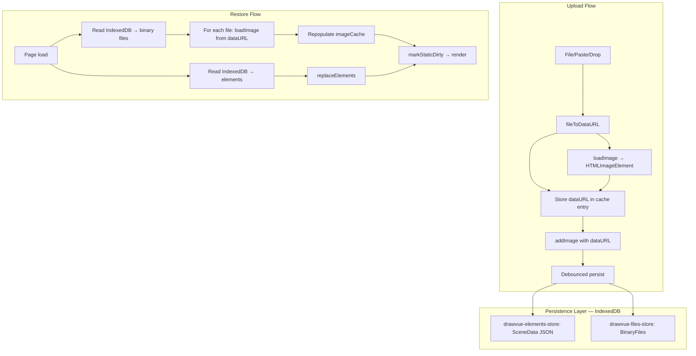

# Fix Image Persistence on Reload

## Overview

Images show as placeholders after page reload because the image cache is purely in-memory (`Map<FileId, ImageCacheEntry>`) and no scene persistence exists. The `dataURL` created during upload is discarded after creating the `HTMLImageElement`. On reload, image elements reference `fileId` values that no longer exist in the cache.

This fix implements IndexedDB-based scene persistence for all data (elements + image binaries), following Excalidraw's proven approach adapted for Vue. Unlike Excalidraw's two-tier split (localStorage for elements, IndexedDB for files), we use IndexedDB exclusively — simpler mental model, no localStorage quota concerns, and a single async storage backend.

## Problem Statement

```
Upload image → fileId stored in element → dataURL used to create HTMLImageElement → dataURL discarded
                                            ↓
                                   imageCache.addImage(fileId, htmlImage, mimeType)
                                            ↓
                                   Page reload → Map clears → fileId exists but cache empty → placeholder
```

**Root cause chain:**

1. `useImageUpload.processFile()` creates a `dataURL` via `FileReader.readAsDataURL()` but only passes the loaded `HTMLImageElement` to `addImage()` — the `dataURL` string is discarded (`useImageUpload.ts:51-54`)
2. `ImageCacheEntry` stores only `{ image: HTMLImageElement, mimeType: string }` — no serializable representation (`useImageCache.ts:3`)
3. No persistence mechanism exists for elements or binary files — zero `localStorage`/`IndexedDB` usage in `packages/core/src/`
4. `renderImageElement()` falls back to `drawImagePlaceholder()` when cache lookup returns `undefined` (`renderImageElement.ts:69-82`)

**How Excalidraw solves this:**

- Elements are serialized to localStorage (debounced)
- Image binary data stored as `BinaryFileData { id, dataURL, mimeType, created }` in IndexedDB via `idb-keyval`
- On load, `updateImageCache()` repopulates the in-memory cache from stored `dataURL` strings
- Scene exports embed files in a `files: Record<FileId, BinaryFileData>` object

## Proposed Solution

Implement an **IndexedDB-only persistence strategy**:

- **IndexedDB** for everything — element JSON and image binary data in separate object stores within a single database
- No localStorage usage — avoids the ~5-10MB quota limit entirely, simplifies the adapter to one async backend
- `idb-keyval` provides a thin wrapper; we use `createStore()` to create two stores in one DB

**Why IndexedDB-only?**

- Elements JSON is small but images can be huge — localStorage's 5-10MB limit would be hit quickly with a few images
- IndexedDB has quotas in the hundreds of MB to GB range
- Single storage backend = simpler code, simpler error handling, simpler clear/reset
- All persistence operations are async anyway (image restore needs `loadImage`), so synchronous localStorage reads add no real benefit

### Architecture



## Technical Approach

### Phase 1: Extend Image Cache to Store dataURL

**Files:** `packages/core/src/features/image/`

1. **Extend `ImageCacheEntry` type** (`types.ts`)

```typescript
// types.ts
export interface ImageCacheEntry {
  image: HTMLImageElement;
  mimeType: string;
  dataURL: string; // NEW: persistable representation
}
```

2. **Update `addImage` signature** (`useImageCache.ts`)

```typescript
// useImageCache.ts
function addImage(id: FileId, image: HTMLImageElement, mimeType: string, dataURL: string): void {
  cache.value.set(id, { image, mimeType, dataURL });
  triggerRef(cache);
}
```

3. **Update `ImageCacheSlice` interface** (`context.ts`)

```typescript
// context.ts
export interface ImageCacheSlice {
  // ... existing methods
  addImage: (id: FileId, image: HTMLImageElement, mimeType: string, dataURL: string) => void;
}
```

4. **Pass dataURL through in `useImageUpload.processFile()`** (`useImageUpload.ts`)

```typescript
// useImageUpload.ts:51-54 — dataURL is already created, just pass it through
const dataURL = await fileToDataURL(file);
const image = await loadImage(dataURL);
addImage(fileId, image, mimeType, dataURL); // pass dataURL
```

5. **Fix background-removal and segmentation flows** — these create images from `URL.createObjectURL(blob)` which is NOT serializable. Add a `imageToDataURL` helper:

```typescript
// packages/core/src/features/image/imageToDataURL.ts
export function imageToDataURL(image: HTMLImageElement, mimeType: string): string {
  const canvas = document.createElement("canvas");
  canvas.width = image.naturalWidth;
  canvas.height = image.naturalHeight;
  const ctx = canvas.getContext("2d")!;
  ctx.drawImage(image, 0, 0);
  return canvas.toDataURL(mimeType);
}
```

Update `app/composables/useImageActions.ts` and `app/composables/useBackgroundRemoval.ts` to:

- Convert the result image to a dataURL via `imageToDataURL()`
- Pass the dataURL to `addImage()`
- Revoke the object URL after conversion (fixes existing memory leak)

### Phase 2: Create BinaryFiles Serialization

**Files:** `packages/core/src/features/image/`

1. **Define `BinaryFileData` type** (`types.ts`)

```typescript
// types.ts
export interface BinaryFileData {
  id: FileId;
  dataURL: string;
  mimeType: string;
  created: number; // epoch timestamp
}

export type BinaryFiles = Record<string, BinaryFileData>;
```

2. **Add serialization helpers** (`packages/core/src/features/image/serializeFiles.ts`)

```typescript
// serializeFiles.ts
export function serializeFiles(
  cache: ReadonlyMap<FileId, ImageCacheEntry>,
  elements: readonly ExcalidrawElement[],
): BinaryFiles {
  // Only serialize files referenced by non-deleted elements
  const referencedFileIds = new Set(
    elements
      .filter((el) => !el.isDeleted && isInitializedImageElement(el))
      .map((el) => (el as InitializedExcalidrawImageElement).fileId),
  );

  const files: BinaryFiles = {};
  for (const [fileId, entry] of cache) {
    if (referencedFileIds.has(fileId)) {
      files[String(fileId)] = {
        id: fileId,
        dataURL: entry.dataURL,
        mimeType: entry.mimeType,
        created: Date.now(),
      };
    }
  }
  return files;
}

export async function restoreImageCache(
  files: BinaryFiles,
  addImage: ImageCacheSlice["addImage"],
): Promise<void> {
  const entries = Object.values(files);
  await Promise.all(
    entries.map(async (file) => {
      const image = await loadImage(file.dataURL);
      addImage(toFileId(file.id as string), image, file.mimeType, file.dataURL);
    }),
  );
}
```

### Phase 3: Create Scene Persistence Composable

**Files:** `packages/core/src/features/persistence/` (new feature module)

The persistence composable lives in `@drawvue/core` but uses a **storage adapter interface** so consumers can provide their own backend. The default implementation uses IndexedDB for everything.

1. **Storage adapter interface** (`packages/core/src/features/persistence/types.ts`)

```typescript
// types.ts
export interface SceneData {
  version: number;
  elements: readonly ExcalidrawElement[];
}

export interface PersistenceAdapter {
  saveElements(data: SceneData): Promise<void>;
  loadElements(): Promise<SceneData | null>;
  saveFiles(files: BinaryFiles): Promise<void>;
  loadFiles(): Promise<BinaryFiles>;
  clear(): Promise<void>;
}
```

2. **IndexedDB adapter** (`packages/core/src/features/persistence/indexedDBAdapter.ts`)

```typescript
// indexedDBAdapter.ts
import { get, set, del, createStore } from "idb-keyval";

const DB_NAME = "drawvue-db";
const ELEMENTS_STORE = "drawvue-elements-store";
const FILES_STORE = "drawvue-files-store";
const ELEMENTS_KEY = "scene";
const FILES_KEY = "binary-files";

export function createIndexedDBAdapter(): PersistenceAdapter {
  const elementsStore = createStore(DB_NAME, ELEMENTS_STORE);
  const filesStore = createStore(`${DB_NAME}-files`, FILES_STORE);

  return {
    async saveElements(data) {
      await set(ELEMENTS_KEY, data, elementsStore);
    },

    async loadElements() {
      const data = await get<SceneData>(ELEMENTS_KEY, elementsStore);
      return data ?? null;
    },

    async saveFiles(files) {
      await set(FILES_KEY, files, filesStore);
    },

    async loadFiles() {
      const files = await get<BinaryFiles>(FILES_KEY, filesStore);
      return files ?? {};
    },

    async clear() {
      await del(ELEMENTS_KEY, elementsStore);
      await del(FILES_KEY, filesStore);
    },
  };
}
```

3. **Persistence composable** (`packages/core/src/features/persistence/useScenePersistence.ts`)

```typescript
// useScenePersistence.ts
export function useScenePersistence(options: {
  elements: ShallowRef<readonly ExcalidrawElement[]>;
  replaceElements: (els: readonly ExcalidrawElement[]) => void;
  imageCache: ImageCacheSlice;
  dirty: { markStaticDirty: () => void };
  adapter: PersistenceAdapter;
  debounceMs?: number;
}) {
  const { elements, replaceElements, imageCache, dirty, adapter, debounceMs = 1000 } = options;

  // --- Restore on mount ---
  async function restore(): Promise<void> {
    const [sceneData, files] = await Promise.all([adapter.loadElements(), adapter.loadFiles()]);

    if (sceneData?.elements?.length) {
      replaceElements(sceneData.elements);
    }

    if (Object.keys(files).length > 0) {
      await restoreImageCache(files, imageCache.addImage);
    }

    dirty.markStaticDirty();
  }

  // --- Auto-save (debounced) ---
  const save = useDebounceFn(async () => {
    const nonDeleted = elements.value.filter((el) => !el.isDeleted);
    const files = serializeFiles(imageCache.cache.value, elements.value);

    await Promise.all([
      adapter.saveElements({ version: SCHEMA_VERSION, elements: nonDeleted }),
      adapter.saveFiles(files),
    ]);
  }, debounceMs);

  // Watch elements for changes
  watch(elements, save, { deep: false });

  // Watch image cache for additions (new uploads, bg removal results)
  watch(imageCache.cache, save, { deep: false });

  return { restore, save };
}
```

### Phase 4: Integrate into the App

**Files:** `app/pages/index.vue` or `packages/core/src/components/DrawVue.vue`

The persistence composable should be activated in the app layer (not in the core library), since it's a consumer choice. Two integration options:

**Option A: App-layer composable (recommended)**

Create `app/composables/useScenePersistence.ts` that wraps the core composable with the IndexedDB adapter and calls `restore()` after DrawVue mounts.

**Option B: DrawVue prop**

Add an `autosave` prop to `<DrawVue>` that enables persistence. This is simpler but couples the core to IndexedDB.

Recommended: **Option A** — keeps core library clean, app layer controls persistence.

Since persistence needs DrawVue context (elements, imageCache), it should be wired up as a child component or a composable inside the DrawVue slot scope. The cleanest approach is a **`<ScenePersistence />`** component placed inside `<DrawVue>`:

```vue
<!-- app/features/persistence/ScenePersistence.vue -->
<script setup lang="ts">
import { onMounted } from "vue";
import { useDrawVue } from "@drawvue/core";
import { useScenePersistence } from "@drawvue/core";
import { createIndexedDBAdapter } from "@drawvue/core";

const ctx = useDrawVue();
const adapter = createIndexedDBAdapter();

const { restore } = useScenePersistence({
  elements: ctx.elements.elements,
  replaceElements: ctx.elements.replaceElements,
  imageCache: ctx.imageCache,
  dirty: ctx.dirty.value!,
  adapter,
});

onMounted(restore);
</script>

<template>
  <div />
</template>
```

Then in `app/pages/index.vue`:

```vue
<DrawVue ref="drawvue">
  <ScenePersistence />
  <!-- ... other slots -->
</DrawVue>
```

### Phase 5: Add `idb-keyval` Dependency

```bash
pnpm add idb-keyval --filter @drawvue/core
```

`idb-keyval` is tiny (~600B gzipped), has zero dependencies, and is the same library Excalidraw uses.

## Acceptance Criteria

- [ ] Images persist across page reloads (no more placeholder after reload)
- [ ] All element types (rectangles, arrows, text, etc.) persist across reloads
- [ ] Background-removed images persist (object URLs converted to dataURLs)
- [ ] Cropped images persist (crop metadata saved with element)
- [ ] Copy-pasted image elements share the same binary file entry
- [ ] Debounced saves (1s) prevent performance issues during rapid edits
- [ ] IndexedDB errors are caught gracefully (warn, don't crash)
- [ ] Corrupt/invalid IndexedDB data doesn't crash the app (falls back to empty canvas)
- [ ] Schema version field included for future migrations (`version: 1`)
- [ ] Only non-deleted elements and their referenced files are persisted
- [ ] Image cache entries include `dataURL` for serialization
- [ ] Existing object URL memory leak in background removal is fixed

## Key Files to Modify

| File                                                 | Change                                                                         |
| ---------------------------------------------------- | ------------------------------------------------------------------------------ |
| `packages/core/src/features/image/types.ts`          | Add `dataURL` to `ImageCacheEntry`, add `BinaryFileData` + `BinaryFiles` types |
| `packages/core/src/features/image/useImageCache.ts`  | Update `addImage` to accept `dataURL` parameter                                |
| `packages/core/src/features/image/useImageUpload.ts` | Pass `dataURL` to `addImage`                                                   |
| `packages/core/src/context.ts`                       | Update `ImageCacheSlice.addImage` signature                                    |
| `packages/core/src/features/image/index.ts`          | Export new types and helpers                                                   |
| `packages/core/src/index.ts`                         | Export persistence feature                                                     |
| `app/composables/useImageActions.ts`                 | Convert object URLs to dataURLs before `addImage`                              |
| `app/composables/useBackgroundRemoval.ts`            | Revoke object URLs after conversion                                            |
| `app/pages/index.vue`                                | Add `<ScenePersistence />` component                                           |

## New Files

| File                                                            | Purpose                                                  |
| --------------------------------------------------------------- | -------------------------------------------------------- |
| `packages/core/src/features/image/imageToDataURL.ts`            | Helper to convert HTMLImageElement to dataURL via canvas |
| `packages/core/src/features/image/serializeFiles.ts`            | Serialize/restore binary files to/from image cache       |
| `packages/core/src/features/persistence/types.ts`               | `PersistenceAdapter` interface, `SceneData` type         |
| `packages/core/src/features/persistence/indexedDBAdapter.ts`    | IndexedDB-only adapter (elements + files)                |
| `packages/core/src/features/persistence/useScenePersistence.ts` | Main persistence composable                              |
| `packages/core/src/features/persistence/index.ts`               | Public exports                                           |
| `app/features/persistence/ScenePersistence.vue`                 | App-layer persistence component                          |

## Edge Cases Addressed

1. **Large images**: All data stored in IndexedDB, avoiding localStorage's ~5-10MB quota entirely
2. **Corrupt data**: `idb-keyval` get returns `undefined` on missing keys; adapter returns `null`/`{}` gracefully
3. **Object URL images**: Converted to dataURL via canvas before caching
4. **Shared FileIds** (copy-paste): `serializeFiles` uses a Set of referenced FileIds — multiple elements can reference the same file
5. **Undo/redo**: Binary files are NOT garbage-collected during a session; cleanup happens only on fresh load
6. **Private browsing**: IndexedDB may be unavailable — adapter calls wrapped in try/catch, app degrades gracefully to no persistence
7. **SVG images**: `canvas.toDataURL()` handles SVG → PNG conversion automatically

## Out of Scope (Future Work)

- Viewport persistence (scroll position, zoom level) — separate ticket
- `.excalidraw` file export/import (TICKET-003)
- Cross-tab sync
- Cloud persistence / collaboration
- Storage quota management UI
- Element schema migrations beyond version check

## Dependencies & Risks

- **New dependency**: `idb-keyval` (~600B gzipped, zero deps, well-maintained)
- **Risk**: `canvas.toDataURL()` for SVG images may lose external references or fonts — acceptable trade-off for persistence
- **Risk**: Very large scenes with many images could slow down debounced saves — mitigated by IndexedDB being async
- **Risk**: Deferred slice binding (`dirty`, `history`) means restore must happen after `DrawVue` fully mounts — addressed by using `onMounted` in the persistence component

## References

- `docs/excalidraw-state-and-persistence.md` — Excalidraw's full persistence architecture
- `docs/specs/image-tool-spec.md` — Image cache design and upload pipeline
- `docs/BACKLOG.md` — TICKET-002 (Auto-save to localStorage), TICKET-003 (Save/Load JSON)
- `excalidraw/packages/element/src/image.ts` — `updateImageCache()` function
- `excalidraw/packages/excalidraw/types.ts` — `BinaryFiles` type definition
- `excalidraw/packages/excalidraw/data/EditorLocalStorage.ts` — localStorage wrapper
