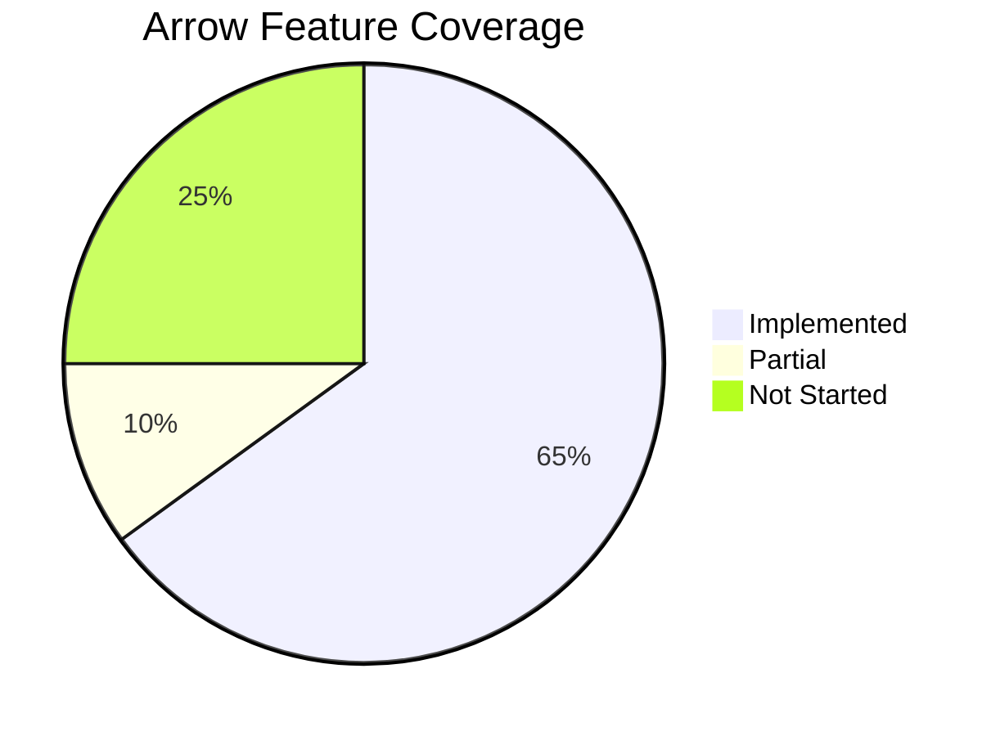
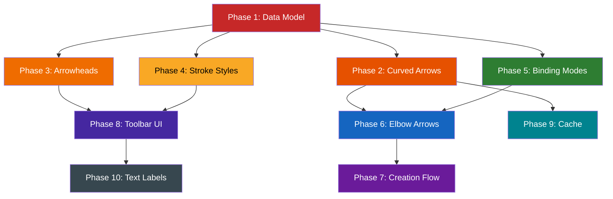

# Arrow Implementation Plan

> **Goal:** Reach feature parity with Excalidraw's arrow system as documented in [`arrow-tech-spec.md`](../arrow-tech-spec.md).
>
> **Status key:** `DONE` = shipped, `PARTIAL` = basic version exists, `TODO` = not started

---

## Current State Summary

We have a **production-ready straight-line arrow and line system** with single-segment drag creation, multi-point click-to-place creation, binding to shapes, interactive linear editing (point handles, midpoint insertion, point deletion), hit testing, grouping, and bound text. Types come from the official `@excalidraw/element/types` package and include all fields needed for future features (roundness, elbowed, strokeStyle, all 12 Arrowhead types). The major gaps are **rendering** curved arrows, elbow arrow routing, advanced arrowhead rendering (only 2 of 12 rendered), stroke style rendering, and binding modes.



---

## Phase 1 — Data Model Gaps

> Fill in missing type properties so all downstream features can reference them.
>
> **Updated 2026-02:** All element types are re-exported from the official `@excalidraw/element/types` package. Many "missing" properties already exist on the official types. The tasks below are updated to reflect reality.

### 1.1 Add `roundness` property `DONE` (via official types)

**Status:** The `roundness` field already exists on `_ExcalidrawElementBase` in `@excalidraw/element/types`. Our `createElement.ts` defaults it to `null`. No custom type needed.

**Remaining work:**
- [x] `roundness` field exists on element type (from official package)
- [x] Default `roundness: null` in `createElement` (already there)
- [ ] Add `PROPORTIONAL_RADIUS = 2` and `DEFAULT_ROUNDNESS_VALUE = 0.25` constants (only needed when implementing curved arrows)

### 1.2 Add `elbowed` property `DONE` (via official types + createElement)

**Status:** The `elbowed` field exists on `ExcalidrawArrowElement` in `@excalidraw/element/types`. Our `createElement.ts` sets `elbowed: false` for arrows. Type guards `isElbowArrow()` and `isLineElement()` are re-exported from the official package in `elements/types.ts`.

**Remaining work:**
- [x] `elbowed: boolean` on arrow type (from official package)
- [x] Default `elbowed: false` in `createElement`
- [x] `isElbowArrow()` type guard (re-exported from `@excalidraw/element`)

### 1.3 Add `strokeStyle` property `DONE` (via official types + createElement)

**Status:** The `strokeStyle` field already exists on `_ExcalidrawElementBase` in `@excalidraw/element/types` and the `StrokeStyle` type is re-exported. Our `createElement.ts` defaults it to `'solid'`.

**Remaining work:**
- [x] `StrokeStyle` type and `strokeStyle` field on element (from official package)
- [x] Default `strokeStyle: 'solid'` in `createElement`
- [ ] Add dash array constants for RoughJS rendering (only needed when implementing stroke style rendering)

### 1.4 Expand arrowhead types `DONE` (via official types)

**Status:** The official `Arrowhead` type in `@excalidraw/element/types` already includes all 12 types: `'arrow' | 'bar' | 'dot' | 'circle' | 'circle_outline' | 'triangle' | 'triangle_outline' | 'diamond' | 'diamond_outline' | 'crowfoot_one' | 'crowfoot_many' | 'crowfoot_one_or_many'`. Re-exported as `Arrowhead` in our `elements/types.ts`.

**Remaining work:**
- [x] Full `Arrowhead` type available (from official package)
- [ ] Add arrowhead size/angle constants per type (see tech spec Section 6)
- [ ] Implement **rendering** for each arrowhead type (currently only `arrow` and `triangle` are rendered in `rendering/arrowhead.ts`)

### 1.5 Add binding mode `TODO` (NOT in official types)

**Why:** The Excalidraw source code uses `mode: 'inside' | 'orbit' | 'skip'` on bindings internally, but this is **NOT exposed in the official `@excalidraw/element/types` npm package**. The official `FixedPointBinding` type only has `elementId`, `focus`, `gap`, and `fixedPoint`.

**Decision needed:** Either:
- (a) Extend the official `FixedPointBinding` with a custom `mode` field via module augmentation
- (b) Add a separate mapping from binding → mode stored elsewhere
- (c) Defer until the official package adds the `mode` field

**Note:** Our current `FixedPointBinding` usage from the official package has `elementId`, `focus`, `gap`, `fixedPoint`. Our `bindUnbind.ts` creates bindings without a `mode` field, which is correct for the current official type.

**Tasks:**
- [ ] Decide on approach for binding modes
- [ ] Implement orbit/inside behavior in `getPointFromFixedPoint()`
- [ ] Set `'inside'` when creating arrow from inside a shape (Alt key)

---

## Phase 2 — Curved Arrows (Catmull-Rom)

> Enable smooth curved arrows via the `roundness` property.

### 2.1 Catmull-Rom curve math `TODO`

**Why:** Core math for converting point arrays into cubic Bezier curves.

**Files:**
- New: `app/shared/curve.ts`

**Reference:** `arrow-tech-spec.md` Section 5 — Catmull-Rom Cubic Approximation

```typescript
// Given points with tension τ = 0.5:
// tangent₁ = (p₂ - p₀) × τ
// controlPoint1 = p₁ + tangent₁ / 3
// controlPoint2 = p₂ - tangent₂ / 3
// Bezier: [p₁, cp1, cp2, p₂]
```

**Tasks:**
- [ ] Implement `curveCatmullRomToBezier(points, tension)` — returns `CubicBezier[]`
- [ ] Implement `bezierPoint(curve, t)` — evaluate point at parameter t
- [ ] Implement `bezierClosestPoint(curve, point)` — ternary search for nearest point
- [ ] Implement `bezierLength(curve)` — approximate arc length
- [ ] Add `CATMULL_ROM_TENSION = 0.5` constant
- [ ] Unit tests for all curve functions

### 2.2 Curved shape generation `TODO`

**Why:** RoughJS `generator.curve()` instead of `generator.linearPath()` for curved arrows.

**Files:**
- `app/features/rendering/shapeGenerator.ts` — branch on `roundness`

**Tasks:**
- [ ] Check `element.roundness` in `generateShape()`
- [ ] Use `generator.curve(points)` when `roundness !== null`
- [ ] Use `generator.linearPath(points)` when `roundness === null` (existing)
- [ ] Pass through stroke style to RoughJS options (see Phase 4)

### 2.3 Curved arrow hit testing `TODO`

**Why:** Current hit test uses distance-to-line-segment. Curved arrows need distance-to-Bezier.

**Files:**
- `app/features/selection/hitTest.ts` — add `hitTestCurvedArrow()`
- `app/shared/curve.ts` — `distanceToBezier()` from 2.1

**Reference:** `arrow-tech-spec.md` Section 10 — Ternary Search

**Tasks:**
- [ ] Add `hitTestCurvedArrow()` that decomposes arrow into Bezier segments
- [ ] Use `bezierClosestPoint()` for each segment, return min distance
- [ ] Branch in `hitTestArrow()`: if `roundness !== null` → curved path, else → line segments
- [ ] Unit tests with curved arrow fixtures

### 2.4 Curved midpoint calculation `TODO`

**Why:** Linear editor midpoints should be on the curve, not the straight line between points.

**Files:**
- `app/features/linear-editor/pointHandles.ts` — update `getMidpointPositions()`

**Tasks:**
- [ ] When element has `roundness`, compute midpoint at 50% curve length instead of linear interpolation
- [ ] Use `bezierPoint(curve, 0.5)` for each segment

---

## Phase 3 — Advanced Arrowheads

> Render all arrowhead types with proper sizing and orientation.

### 3.1 Arrowhead geometry engine `PARTIAL`

**Why:** Current code supports only `arrow` (two lines) and `triangle` (filled polygon). Need bar, circle, diamond, and outline variants.

**Files:**
- `app/features/rendering/arrowhead.ts` — expand `drawArrowhead()`

**Reference:** `arrow-tech-spec.md` Section 6 — Arrowhead Geometry

**Tasks:**
- [ ] Add `getArrowheadSize(type)` — returns size in px per type (see constant table)
- [ ] Add `getArrowheadAngle(type)` — returns angle in degrees per type
- [ ] Implement `bar` arrowhead: perpendicular line, 15px, 90deg
- [ ] Implement `circle` arrowhead: filled circle, radius from size
- [ ] Implement `circle_outline` arrowhead: stroked circle with background fill
- [ ] Implement `diamond` arrowhead: filled 4-point polygon, 12px
- [ ] Implement `diamond_outline` arrowhead: stroked diamond with background fill
- [ ] Implement `triangle_outline` arrowhead: stroked triangle with background fill

### 3.2 Arrowhead scaling `TODO`

**Why:** Arrowheads should shrink when the last segment is shorter than the arrowhead size.

**Reference:** `arrow-tech-spec.md` Section 6 — Size Scaling

```typescript
lengthMultiplier = isDiamond ? 0.25 : 0.5
actualSize = Math.min(arrowheadSize, lastSegmentLength * lengthMultiplier)
```

**Tasks:**
- [ ] Compute last segment length in `drawArrowhead()`
- [ ] Scale arrowhead size down when segment is too short
- [ ] Ensure arrowhead never exceeds segment length

### 3.3 Tangent-based arrowhead orientation `TODO`

**Why:** For curved arrows, arrowhead angle should follow the curve tangent at t=0.3, not the straight line between last two points.

**Reference:** `arrow-tech-spec.md` Section 6 — Orientation Calculation

**Tasks:**
- [ ] For curved arrows, evaluate Bezier at t=0.3 near the endpoint
- [ ] Use direction vector from t=0.3 point to endpoint for arrowhead angle
- [ ] For straight arrows, keep existing angle calculation (endpoint-to-previous-point)

---

## Phase 4 — Stroke Styles

> Render dashed and dotted lines for all element types.

### 4.1 RoughJS stroke style options `TODO`

**Files:**
- `app/features/rendering/shapeGenerator.ts` — pass `strokeLineDash` to RoughJS

**Reference:** `arrow-tech-spec.md` Section 5 — RoughJS Options

```typescript
// In generateRoughOptions():
strokeLineDash:
  dashed → [8, 8 + strokeWidth]
  dotted → [1.5, 6 + strokeWidth]
  solid  → undefined

disableMultiStroke: strokeStyle !== 'solid'
strokeWidth: strokeStyle === 'solid' ? sw : sw + 0.5
```

**Tasks:**
- [ ] Read `element.strokeStyle` in shape generator
- [ ] Map to `strokeLineDash` array for RoughJS
- [ ] Set `disableMultiStroke: true` for non-solid styles
- [ ] Bump strokeWidth by 0.5 for non-solid styles (compensates for visual thinning)
- [ ] Apply to all element types (shapes + arrows)

### 4.2 Interactive stroke style for arrowheads `TODO`

**Why:** Arrowhead strokes should match the arrow's stroke style.

**Files:**
- `app/features/rendering/arrowhead.ts` — apply dash pattern to arrowhead strokes

**Tasks:**
- [ ] Pass `strokeStyle` into `drawArrowhead()`
- [ ] Apply `ctx.setLineDash()` for bar and outline arrowheads
- [ ] Filled arrowheads (triangle, circle, diamond) ignore dash pattern

---

## Phase 5 — Binding System Enhancements

> Upgrade binding to support orbit/inside modes and improve edge snapping.

### 5.1 Binding mode logic `TODO`

**Why:** `orbit` mode stops the arrow at the element edge (with gap). `inside` mode extends to the fixedPoint location within the shape.

**Files:**
- `app/features/binding/proximity.ts` — update `getPointFromFixedPoint()`
- `app/features/binding/updateBoundPoints.ts` — respect mode in `updateArrowEndpoint()`

**Reference:** `arrow-tech-spec.md` Section 4 — Binding Modes by Context

**Tasks:**
- [ ] `orbit` mode: compute intersection of line (adjacent-point → fixedPoint) with shape edge, offset by binding gap
- [ ] `inside` mode: arrow endpoint goes directly to the fixedPoint global position (no edge snap)
- [ ] Apply mode context rules:
  - Creating from inside shape → start=`inside`, end=`orbit`
  - Creating from outside shape → end=`orbit`
  - Both endpoints on same shape → both `inside`
  - Alt key held → both `inside`

### 5.2 Zoom-adjusted binding distance `TODO`

**Why:** Binding detection distance should scale with zoom to maintain consistent feel.

**Files:**
- `app/features/binding/proximity.ts` — update threshold in `getHoveredElementForBinding()`
- `app/features/binding/constants.ts` — add zoom formula

**Reference:** `arrow-tech-spec.md` Section 4 — Detection Thresholds

```typescript
maxBindingDistance(zoom) {
  const BASE = Math.max(BASE_BINDING_GAP, 15)
  const zoomValue = zoom < 1 ? zoom : 1
  return clamp(BASE / (zoomValue * 1.5), BASE, BASE * 2)  // 15–30px
}
```

**Tasks:**
- [ ] Replace fixed `BASE_BINDING_DISTANCE = 15` with zoom-adjusted formula
- [ ] Ensure binding feels consistent at all zoom levels
- [ ] Unit test: binding distance at zoom 0.5, 1.0, 2.0

### 5.3 Edge intersection calculation `TODO`

**Why:** Current `getPointFromFixedPoint()` uses a simplified projection. The spec describes a ray-intersection approach for more accurate edge snapping.

**Files:**
- `app/features/binding/proximity.ts` — improve edge calculation

**Reference:** `arrow-tech-spec.md` Section 4 — Intersection Calculation

**Tasks:**
- [ ] Cast a ray from the adjacent arrow point through the fixedPoint
- [ ] Find intersection with the shape boundary (rectangle edges, ellipse curve, diamond diagonals)
- [ ] Offset intersection point outward by binding gap
- [ ] This replaces the current direct-projection approach

### 5.4 Short arrow inside-mode fallback `TODO`

**Why:** When two bound elements are very close (<40px apart), switch to `inside` mode to avoid visual glitches.

**Tasks:**
- [ ] In `updateBoundArrowEndpoints()`, check distance between bound shapes
- [ ] If distance < 40px, temporarily override both endpoints to `inside` mode
- [ ] Add constant `SHORT_ARROW_THRESHOLD = 40`

---

## Phase 6 — Elbow Arrows (A* Routing)

> Orthogonal arrows that route around obstacles with 90deg corners.

### 6.1 Heading system `TODO`

**Why:** Elbow arrows need to know which edge of a shape to exit/enter from.

**Files:**
- New: `app/features/binding/heading.ts`

**Reference:** `arrow-tech-spec.md` Section 7 — Heading System

```typescript
type Heading = readonly [number, number]
const HEADING_RIGHT: Heading = [1, 0]
const HEADING_DOWN:  Heading = [0, 1]
const HEADING_LEFT:  Heading = [-1, 0]
const HEADING_UP:    Heading = [0, -1]
```

**Tasks:**
- [ ] Implement `headingForPointFromElement(point, element)` — returns exit direction
- [ ] Implement `vectorToHeading(vector)` — cardinal direction snapping
- [ ] Implement `flipHeading()`, `compareHeading()`, `headingIsHorizontal()`
- [ ] Use triangle search cones (SEARCH_CONE_MULTIPLIER = 2) for quadrant detection

### 6.2 Non-uniform grid `TODO`

**Files:**
- New: `app/features/elbow/grid.ts`

**Reference:** `arrow-tech-spec.md` Section 7 — Grid System

**Tasks:**
- [ ] Build grid from obstacle AABB edges
- [ ] Add start/end constraint points based on heading
- [ ] Variable-resolution grid that snaps to obstacle boundaries

### 6.3 A* pathfinding `TODO`

**Files:**
- New: `app/features/elbow/astar.ts`

**Reference:** `arrow-tech-spec.md` Section 7 — A* Cost Function

**Tasks:**
- [ ] Implement A* with Manhattan distance heuristic
- [ ] Add heavy bend penalty (bendMultiplier^3) for direction changes → straighter paths
- [ ] Obstacle collision: midpoint test against dynamic AABBs
- [ ] No backtracking (reverse direction forbidden)
- [ ] Return array of orthogonal points

### 6.4 Elbow arrow shape generation `TODO`

**Files:**
- `app/features/rendering/shapeGenerator.ts` — generate SVG path with quadratic corner curves

**Reference:** `arrow-tech-spec.md` Section 5 — Elbow Arrow Shape

```typescript
cornerRadius = Math.min(16, distToNext / 2, distToPrev / 2)
// SVG path: L <before_corner> Q <corner_point> <after_corner>
```

**Tasks:**
- [ ] Convert elbow points to SVG path string with Q (quadratic) curves at corners
- [ ] Use `generator.path(svgPath)` for RoughJS rendering
- [ ] Add `ELBOW_CORNER_RADIUS = 16` constant

### 6.5 Elbow point validation `TODO`

**Reference:** `arrow-tech-spec.md` Section 7 — Validation

**Tasks:**
- [ ] `validateElbowPoints()` — every segment must be purely horizontal or vertical
- [ ] `removeShortSegments()` — filter segments shorter than 1px
- [ ] `getCornerPoints()` — keep only points where direction changes

### 6.6 Fixed segments (user-anchored) `TODO`

**Why:** Users can drag segments to lock them. Only non-fixed segments reroute.

**Reference:** `arrow-tech-spec.md` Section 7 — Fixed Segments

**Tasks:**
- [ ] Add `fixedSegments` to `ExcalidrawElbowArrowElement` type
- [ ] First and last segments cannot be fixed
- [ ] Each fixed segment must be purely H or V
- [ ] Reroute only around fixed segments
- [ ] Add `BASE_PADDING = 40px` constant

---

## Phase 7 — Creation Flow Enhancements

> Improve arrow creation UX to match Excalidraw.

### 7.1 Drag vs click detection `PARTIAL`

**Why:** Single drag creates a 2-point arrow. Clicks add points for multi-segment arrows. Need `LINE_CONFIRM_THRESHOLD` to distinguish.

**Files:**
- `app/features/tools/useDrawingInteraction.ts` — add distance check

**Reference:** `arrow-tech-spec.md` Section 9 — State Machine

**Tasks:**
- [ ] Add `LINE_CONFIRM_THRESHOLD = 8` constant
- [ ] On pointerDown during multi-point mode: if distance to last point < 8px → finalize, else → add point
- [ ] On pointerDown on binding target → finalize with binding
- [ ] Ensure drag-to-create still works for single-segment arrows

### 7.2 Alt key — start inside shape `TODO`

**Why:** Holding Alt while creating an arrow marks it as starting inside a shape, which affects binding mode.

**Reference:** `arrow-tech-spec.md` Section 9 — Keyboard Modifiers

**Tasks:**
- [ ] Track Alt key state in `useDrawingInteraction`
- [ ] When Alt held at creation start and pointer is inside a shape → set `startBinding.mode = 'inside'`
- [ ] Arrow extends from the interior fixedPoint, not the edge

### 7.3 Elbow arrow auto-finalize `TODO`

**Why:** Elbow arrows always have exactly 2 user-set points (start + end). Middle points are auto-computed by A*.

**Tasks:**
- [ ] When tool is `arrow` with elbow subtype, finalize on first pointerUp (no multi-point)
- [ ] Run A* routing after finalization to compute middle points
- [ ] Re-route on any subsequent drag of the elbow arrow

---

## Phase 8 — Toolbar & UI

> Expose arrow subtypes and options in the toolbar.

### 8.1 Arrow subtype selector `TODO`

**Why:** Users need to choose between sharp, curved, and elbow arrows.

**Files:**
- `app/features/tools/components/DrawingToolbar.vue` — add subtype options
- `app/features/tools/types.ts` — add `ArrowSubtype`

```typescript
type ArrowSubtype = 'sharp' | 'curved' | 'elbow'
```

**Tasks:**
- [ ] Add arrow subtype state to tool store
- [ ] Render subtype options when arrow tool is active
- [ ] Set `roundness` and `elbowed` based on selected subtype
- [ ] Persist last-used subtype

### 8.2 Arrowhead picker `TODO`

**Why:** Users need to choose start/end arrowhead types.

**Tasks:**
- [ ] Add arrowhead picker dropdown to toolbar (when arrow tool active or arrow selected)
- [ ] Separate pickers for start and end arrowheads
- [ ] Show visual preview of each arrowhead type
- [ ] Apply selection to `startArrowhead` / `endArrowhead`

### 8.3 Stroke style picker `TODO`

**Why:** Users need to toggle between solid, dashed, and dotted.

**Tasks:**
- [ ] Add stroke style toggle to toolbar (applies to all element types)
- [ ] Visual preview of each style
- [ ] Apply to `strokeStyle` property

---

## Phase 9 — Shape Caching Improvements

> Optimize rendering performance for complex arrows.

### 9.1 Version-based cache invalidation `DONE`

**Current:** `shapeGenerator.ts` caches by `element.id + versionNonce`. This already invalidates when the element changes.

### 9.2 Zoom-level cache invalidation `TODO`

**Why:** RoughJS roughness should reduce for small elements. Cache needs to account for zoom.

**Reference:** `arrow-tech-spec.md` Section 5 — Shape Caching

**Tasks:**
- [ ] Include zoom level in cache key (or zoom bucket)
- [ ] Implement `adjustRoughness(roughness, size)` — reduce roughness for small elements
- [ ] `preserveVertices: roughness < 2` in RoughJS options

---

## Phase 10 — Text Labels on Arrows

> Arrows can have bound text labels that move with the arrow.

### 10.1 BoundElement text support `TODO`

**Why:** Excalidraw allows text labels on arrows that auto-position at the midpoint.

**Tasks:**
- [ ] Add `boundElements: readonly BoundElement[] | null` to arrow type (already partly there)
- [ ] Implement text element that can be bound to an arrow
- [ ] Position text at arrow midpoint (50% arc length for curves)
- [ ] Re-position when arrow moves or reshapes
- [ ] Double-click arrow to add/edit text label

---

## Implementation Order



### Recommended Priority

| Priority | Phase | Effort | Impact |
|----------|-------|--------|--------|
| **P0** | Phase 1 — Data Model | Low | Unblocks everything |
| **P1** | Phase 4 — Stroke Styles | Low | Quick win, applies to all elements |
| **P1** | Phase 3 — Arrowheads | Medium | Visible improvement, self-contained |
| **P2** | Phase 5 — Binding Modes | Medium | Better arrow-shape connections |
| **P2** | Phase 2 — Curved Arrows | High | Major feature, needs new math |
| **P3** | Phase 8 — Toolbar UI | Medium | Expose new features to users |
| **P3** | Phase 7 — Creation Flow | Medium | UX polish |
| **P4** | Phase 6 — Elbow Arrows | Very High | Complex A* system, can defer |
| **P4** | Phase 9 — Cache | Low | Performance optimization |
| **P5** | Phase 10 — Text Labels | High | Requires text element system |

### Estimated File Changes per Phase

| Phase | New Files | Modified Files |
|-------|-----------|----------------|
| 1. Data Model | 0 | 4 |
| 2. Curved Arrows | 1 (`shared/curve.ts`) | 3 |
| 3. Arrowheads | 0 | 2 |
| 4. Stroke Styles | 0 | 2 |
| 5. Binding | 0 | 3 |
| 6. Elbow Arrows | 3 (`elbow/` feature) | 3 |
| 7. Creation Flow | 0 | 2 |
| 8. Toolbar UI | 0 | 3 |
| 9. Cache | 0 | 1 |
| 10. Text Labels | 2+ | 4+ |

---

## Already Done (No Action Needed)

These features are fully implemented and match the spec:

| Feature | Status | Key Files |
|---------|--------|-----------|
| Arrow data model (basic) | `DONE` | `elements/types.ts` (re-export from `@excalidraw/element/types`), `createElement.ts` |
| Line element type | `DONE` | `elements/types.ts`, `createElement.ts` (type `'line'`, `endArrowhead: null`) |
| Single-segment creation (drag) | `DONE` | `tools/useDrawingInteraction.ts` |
| Multi-point creation (click-click) | `DONE` | `linear-editor/useMultiPointCreation.ts` |
| Linear editor (point manipulation) | `DONE` | `linear-editor/useLinearEditor.ts` |
| Point handles + midpoints | `DONE` | `linear-editor/pointHandles.ts` |
| Rubber band preview | `DONE` | `linear-editor/renderLinearEditor.ts` |
| Binding detection | `DONE` | `binding/proximity.ts` |
| Bind/unbind lifecycle | `DONE` | `binding/bindUnbind.ts` |
| Binding maintenance on move | `DONE` | `binding/updateBoundPoints.ts` |
| Binding highlight rendering | `DONE` | `binding/renderBindingHighlight.ts` |
| Bound text for shapes | `DONE` | `binding/boundText.ts`, `tools/useTextInteraction.ts` |
| Hit testing (straight segments) | `DONE` | `selection/hitTest.ts` |
| Selection border + handles | `DONE` | `rendering/renderInteractive.ts` |
| RoughJS shape generation (straight) | `DONE` | `rendering/shapeGenerator.ts` |
| Arrow arrowheads (arrow + triangle) | `DONE` | `rendering/arrowhead.ts` |
| Shift angle snapping | `DONE` | `tools/useDrawingInteraction.ts` |
| Keyboard shortcuts (A, 5) | `DONE` | `tools/useTool.ts` |
| Point normalization (first=[0,0]) | `DONE` | `linear-editor/pointHandles.ts` |
| Version-based shape cache | `DONE` | `rendering/shapeGenerator.ts` |
| Grouping support | `DONE` | `groups/groupUtils.ts`, `groups/composables/useGroups.ts` |
| Data model: `roundness` | `DONE` | Official `@excalidraw/element/types`, `createElement.ts` defaults `null` |
| Data model: `elbowed` | `DONE` | Official `@excalidraw/element/types`, `createElement.ts` defaults `false` |
| Data model: `strokeStyle` | `DONE` | Official `@excalidraw/element/types`, `createElement.ts` defaults `'solid'` |
| Data model: `Arrowhead` (all 12 types) | `DONE` | Official `@excalidraw/element/types` (rendering only supports 2) |
| Binding in linear editor | `DONE` | `linear-editor/useLinearEditor.ts` (endpoint drag rebinds, arrows only) |

---

## Cross-Cutting Concerns

### Testing Strategy

Each phase should include:
- **Unit tests** for new pure functions (curve math, grid, A*, arrowhead geometry)
- **Unit tests** for composable behavior changes (binding modes, creation flow)
- **Browser tests** for full interaction flows (create curved arrow, bind with mode, elbow routing)

### Excalidraw Source Reference

Always browse the original Excalidraw source before implementing. Key files:
- `excalidraw/packages/element/src/shape.ts` — shape generation
- `excalidraw/packages/element/src/binding.ts` — binding system
- `excalidraw/packages/element/src/elbowArrow.ts` — elbow routing
- `excalidraw/packages/math/src/curve.ts` — Bezier math
- `excalidraw/packages/element/src/bounds.ts` — arrowhead geometry

### Convention Reminders

- No `as` type assertions — use type guards
- No `try/catch` — use `tryCatch()` from `~/utils/tryCatch`
- No `else`/`else-if` — use early returns
- Arrow points are always relative to element `(x, y)`
- First point must always be `[0, 0]` — enforce via `normalizePoints()`
- Use `mutateElement()` for all element mutations (bumps version)
