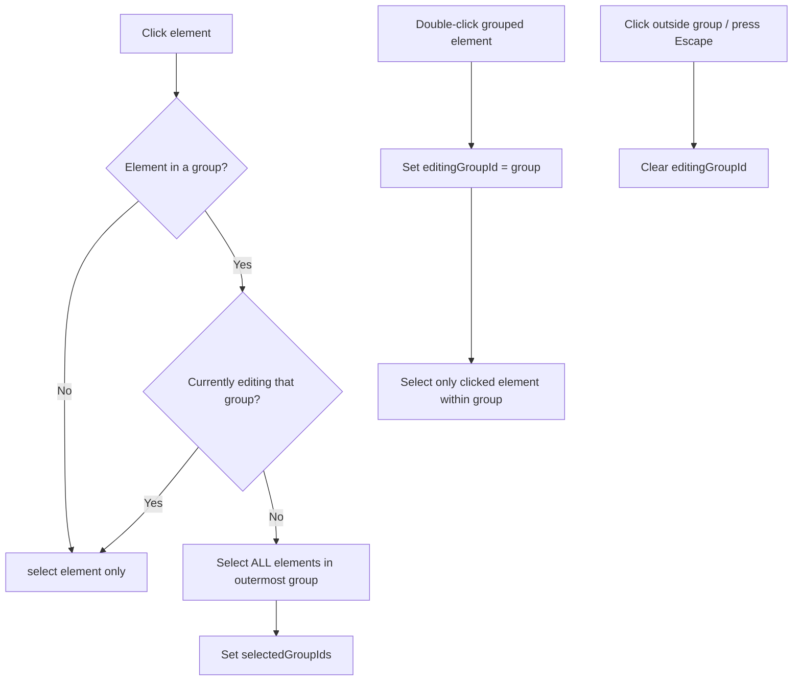
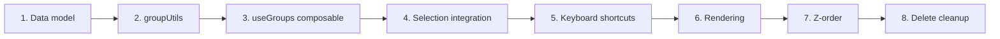

# Grouping Feature Spec

> Status: **V1 Implemented** — flat groupIds model, no nested groups.

## Overview

Add element grouping (Cmd+G / Cmd+Shift+G) so users can treat multiple elements as a single unit for selection, drag, and transform. Follows Excalidraw's model: a flat `groupIds` array on each element (no tree hierarchy).

## Excalidraw Reference

Source files studied:
- `excalidraw/packages/element/src/groups.ts` — all group utilities
- `excalidraw/packages/excalidraw/actions/actionGroup.tsx` — group/ungroup actions
- `excalidraw/packages/element/src/types.ts` — `GroupId` type, `groupIds` field

Key design decisions from Excalidraw:
- `GroupId = string` (random ID, same generator as element IDs)
- `groupIds: readonly GroupId[]` — ordered **deepest → shallowest** (supports nesting)
- Groups are NOT a separate entity — they exist only as shared IDs on elements
- Arrow bindings and groups are **independent** systems

## Data Model Changes

### 1. Add `groupIds` to `ExcalidrawElementBase`

```typescript
// app/features/elements/types.ts

export type GroupId = string

export interface ExcalidrawElementBase {
  // ... existing fields ...
  readonly groupIds: readonly GroupId[]  // NEW — empty array = ungrouped
}
```

### 2. Update `createElement`

```typescript
// app/features/elements/createElement.ts
const base = {
  // ... existing fields ...
  groupIds: [],  // NEW — default to no groups
  ...overrides,
}
```

### 3. Add group-related app state

```typescript
// In useSelection or a new useGroups composable
selectedGroupIds: Record<GroupId, boolean>  // which groups are selected as units
editingGroupId: GroupId | null              // group being "drilled into"
```

## New Feature: `app/features/groups/`

### Directory Structure

```
app/features/groups/
├── types.ts              # GroupId type (re-exported from elements/types)
├── groupUtils.ts         # Pure functions for group manipulation
├── composables/
│   └── useGroups.ts      # Composable wiring group/ungroup to state
└── groupUtils.unit.test.ts
```

### `groupUtils.ts` — Pure Functions

These mirror Excalidraw's `groups.ts` logic, adapted to our patterns:

```typescript
// Get the outermost group for an element (last in array)
function getOutermostGroupId(element: ExcalidrawElement): GroupId | null

// Get all elements sharing a group ID
function getElementsInGroup(
  elements: readonly ExcalidrawElement[],
  groupId: GroupId,
): ExcalidrawElement[]

// Add a group ID to an element's groupIds array
// Inserts relative to editingGroupId position (for nested groups)
function addToGroup(
  existingGroupIds: readonly GroupId[],
  newGroupId: GroupId,
  editingGroupId: GroupId | null,
): readonly GroupId[]

// Remove specific group IDs from an element
function removeFromGroups(
  groupIds: readonly GroupId[],
  groupIdsToRemove: Record<GroupId, boolean>,
): readonly GroupId[]

// Given selected element IDs, expand selection to include all group members
// Returns { selectedElementIds, selectedGroupIds }
function selectGroupsForSelectedElements(
  elements: readonly ExcalidrawElement[],
  selectedElementIds: ReadonlySet<string>,
  editingGroupId: GroupId | null,
): {
  selectedElementIds: Set<string>
  selectedGroupIds: Record<GroupId, boolean>
}

// Check if element is selected because its group is selected (not individually)
function isSelectedViaGroup(
  element: ExcalidrawElement,
  selectedGroupIds: Record<GroupId, boolean>,
): boolean

// Get selected group IDs as an array
function getSelectedGroupIds(
  selectedGroupIds: Record<GroupId, boolean>,
): GroupId[]
```

### `useGroups.ts` — Composable

```typescript
function useGroups(
  elements: ShallowRef<readonly ExcalidrawElement[]>,
  selection: UseSelectionReturn,  // existing selection composable
): {
  // State
  selectedGroupIds: ShallowRef<Record<GroupId, boolean>>
  editingGroupId: ShallowRef<GroupId | null>

  // Actions
  groupSelection: () => void       // Cmd+G
  ungroupSelection: () => void     // Cmd+Shift+G
  enterGroupEditing: (element: ExcalidrawElement) => void  // double-click
  exitGroupEditing: () => void     // click outside group

  // Queries
  isSelectedViaGroup: (element: ExcalidrawElement) => boolean
  getGroupElements: (groupId: GroupId) => ExcalidrawElement[]
}
```

## Selection Changes

### Current Flow (no groups)
```
click element → select(element.id) → selectedIds = {elementId}
```

### New Flow (group-aware)



### Changes to `useSelection`

The `select()` method needs a group-aware wrapper. Two approaches:

**Option A (preferred): Wrap in `useGroups`**
- `useSelection` stays unchanged (it manages raw IDs)
- `useGroups` intercepts clicks and calls `replaceSelection()` with expanded group member IDs
- Keeps separation of concerns clean

**Option B: Modify `useSelection`**
- Add `groupIds` awareness directly into `select()`
- Tighter coupling but fewer indirections

### Changes to `useSelectionInteraction`

Currently in `composables/useSelectionInteraction.ts`:

1. **`pointerdown` handler** — after hit-testing, pass through group expansion before setting selection
2. **`dblclick` handler** — if clicking a grouped element that's already selected-via-group, enter group editing mode
3. **Escape key** — if `editingGroupId` is set, exit group editing instead of clearing selection

### Changes to `hitTest.ts` / `getElementAtPosition`

No changes needed. Hit testing stays per-element. Group expansion happens **after** identifying which element was clicked.

## Drag & Transform Changes

### `dragElements.ts`

Currently drags all `selectedElements`. With groups, this already works because group-aware selection ensures all group members are in `selectedElements`. **No changes needed** as long as selection expansion is correct.

### `resizeElement.ts`

Single-element resize. When a group is selected:
- Show a single bounding box around the entire group
- Resize scales all group members proportionally from the group center
- This is a **follow-up task** — initially, disable resize handles when multiple elements are selected via group (Excalidraw does the same)

## Rendering Changes

### Selection rendering

Currently renders individual selection boxes per element. With groups:

1. **Group selected (not editing)** — render ONE bounding box around all group members
2. **Group editing** — render individual selection boxes for elements within the group, plus a dashed border around the group boundary
3. **`isSelectedViaGroup()`** — skip individual selection border for elements selected only because their group is selected

### Visual indicator

Dashed border style for group bounding box (distinct from element selection border).

## Keyboard Shortcuts

| Shortcut | Action | Condition |
|----------|--------|-----------|
| Cmd+G | Group selected elements | 2+ elements selected |
| Cmd+Shift+G | Ungroup | Group(s) selected |
| Escape | Exit group editing | `editingGroupId` is set |

### Integration Point

Add to the existing keyboard handler (wherever shortcuts are registered):

```typescript
// Cmd+G
if (event.metaKey && event.key === 'g' && !event.shiftKey) {
  groupSelection()
}
// Cmd+Shift+G
if (event.metaKey && event.key === 'G' && event.shiftKey) {
  ungroupSelection()
}
```

## Z-Order on Group

When grouping, reorder elements so group members are contiguous in the elements array:

1. Find the position of the **topmost** selected element (highest index)
2. Move all other selected elements to be adjacent (just below the topmost)
3. This ensures the group renders as a visual unit without interleaving

```typescript
function reorderElementsForGroup(
  elements: readonly ExcalidrawElement[],
  groupElementIds: Set<string>,
): ExcalidrawElement[]
```

## Nested Groups

Excalidraw supports nested groups via the array ordering in `groupIds`:

```
element.groupIds = ["inner-group", "outer-group"]
//                   deepest →→→→→→ shallowest
```

**For v1, skip nested groups.** Keep the array but only ever have 0 or 1 entries. This keeps selection logic simple while the data model is forward-compatible.

## Copy/Paste & Delete

### Delete
- Deleting an element removes it from its group. If only 1 element remains in the group, auto-ungroup it (remove the `groupId` from the remaining element).

### Copy/Paste
- Copying grouped elements should preserve their group relationship but assign a **new** `groupId` to the pasted group (so it's independent of the original).

## Implementation Order



| Phase | Files to change | Complexity |
|-------|----------------|------------|
| 1. Data model | `elements/types.ts`, `elements/createElement.ts` | Low |
| 2. Group utils | New `groups/groupUtils.ts` + tests | Medium |
| 3. useGroups | New `groups/composables/useGroups.ts` | Medium |
| 4. Selection integration | `useSelectionInteraction.ts`, `useSelection.ts` | High |
| 5. Keyboard shortcuts | Keyboard handler integration | Low |
| 6. Rendering | `renderElement.ts` or selection renderer | Medium |
| 7. Z-order reordering | `useElements.ts` or group action | Medium |
| 8. Delete cleanup | Delete handler | Low |

## Testing Strategy

- **Unit tests** for all `groupUtils` functions (pure, easy to test)
- **Unit tests** for `useGroups` composable (mock elements + selection)
- **Browser tests** for full flow: create elements → Cmd+G → click one → all selected → double-click → edit mode → Escape → back to group selection
