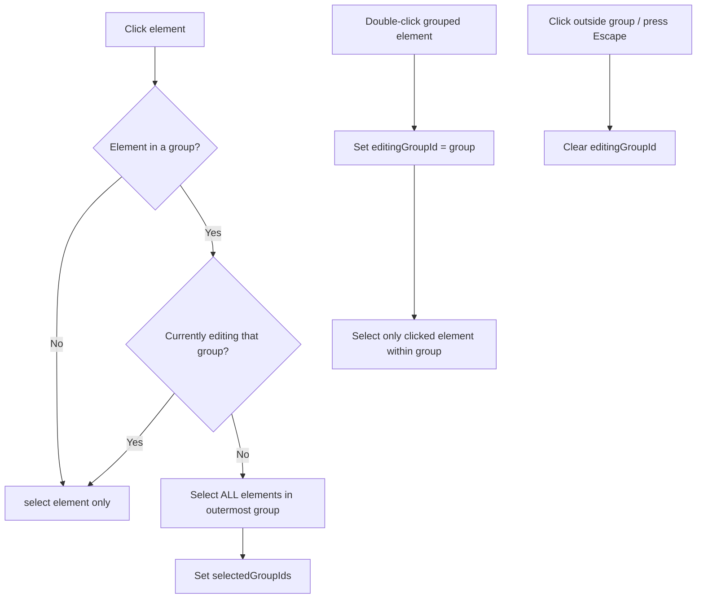
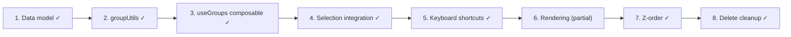

# Grouping Feature Spec

> Status: **V1 Implemented** — flat groupIds model, no nested groups.
>
> **Updated 2026-02:** All implementation phases complete. Types re-exported from `@excalidraw/element/types`. Some Excalidraw upstream utilities (`isElementInGroup`, `getElementsInGroup`, `elementsAreInSameGroup`) are re-exported directly from `@excalidraw/element`.

## Overview

Add element grouping (Cmd+G / Cmd+Shift+G) so users can treat multiple elements as a single unit for selection, drag, and transform. Follows Excalidraw's model: a flat `groupIds` array on each element (no tree hierarchy).

## Excalidraw Reference

Source files studied:
- `excalidraw/packages/element/src/groups.ts` — all group utilities
- `excalidraw/packages/excalidraw/actions/actionGroup.tsx` — group/ungroup actions
- `excalidraw/packages/element/src/types.ts` — `GroupId` type, `groupIds` field

Key design decisions from Excalidraw:
- `GroupId = string` (random ID, same generator as element IDs)
- `groupIds: readonly GroupId[]` — ordered **deepest → shallowest** (supports nesting)
- Groups are NOT a separate entity — they exist only as shared IDs on elements
- Arrow bindings and groups are **independent** systems

## Data Model Changes

### 1. `groupIds` on `ExcalidrawElementBase` — `DONE`

`GroupId` and `groupIds` come from the official `@excalidraw/element/types` package. Re-exported in `app/features/elements/types.ts`. Re-exported again as convenience in `app/features/groups/types.ts`.

```typescript
// app/features/elements/types.ts
export type { GroupId } from '@excalidraw/element/types'
// groupIds: readonly GroupId[] — already on _ExcalidrawElementBase
```

### 2. `createElement` defaults — `DONE`

```typescript
// app/features/elements/createElement.ts
const base = {
  // ... existing fields ...
  groupIds: [] as readonly string[],  // DONE — default to no groups
  ...overrides,
}
```

### 3. Group-related app state — `DONE`

Implemented in `useGroups` composable (`app/features/groups/composables/useGroups.ts`):

```typescript
// Actual implementation uses ReadonlySet<GroupId> not Record<GroupId, boolean>
selectedGroupIds: ShallowRef<ReadonlySet<GroupId>>
// Note: editingGroupId is NOT yet implemented (deferred — no nested group editing)
```

## New Feature: `app/features/groups/`

### Directory Structure — `DONE`

```
app/features/groups/
├── types.ts                  # GroupId re-export from elements/types
├── index.ts                  # Barrel exports (not in original spec)
├── groupUtils.ts             # Pure functions + re-exports from @excalidraw/element
├── groupUtils.unit.test.ts   # Unit tests
└── composables/
    └── useGroups.ts          # Composable wiring group/ungroup to state
```

### `groupUtils.ts` — Pure Functions — `DONE`

Actual implementation. Note: some functions re-exported from `@excalidraw/element`, others are custom:

```typescript
// Re-exported from @excalidraw/element (upstream utilities):
export { isElementInGroup, getElementsInGroup, elementsAreInSameGroup } from '@excalidraw/element'

// Custom implementations:
function getOutermostGroupId(element: ExcalidrawElement): GroupId | null
// Note: simplified from spec — no editingGroupId parameter (nested groups deferred)
function addToGroup(prevGroupIds: readonly GroupId[], newGroupId: GroupId): readonly GroupId[]
// Note: uses ReadonlySet instead of Record<GroupId, boolean>
function removeFromGroups(groupIds: readonly GroupId[], groupIdsToRemove: ReadonlySet<GroupId>): readonly GroupId[]
// Note: renamed from selectGroupsForSelectedElements; returns ReadonlySet not Record
function expandSelectionToGroups(
  elements: readonly ExcalidrawElement[],
  selectedElementIds: ReadonlySet<string>,
): GroupExpansionResult  // { elementIds: ReadonlySet<string>; groupIds: ReadonlySet<GroupId> }
// Note: uses ReadonlySet instead of Record<GroupId, boolean>
function isSelectedViaGroup(element: ExcalidrawElement, selectedGroupIds: ReadonlySet<GroupId>): boolean
function reorderElementsForGroup(elements: readonly ExcalidrawElement[], groupElementIds: ReadonlySet<string>): readonly ExcalidrawElement[]
function cleanupAfterDelete(elements: readonly ExcalidrawElement[], deletedIds: ReadonlySet<string>): void
```

**Differences from original spec:**
- Uses `ReadonlySet<GroupId>` instead of `Record<GroupId, boolean>` for type safety
- `addToGroup` does not take `editingGroupId` (nested groups deferred)
- Added `cleanupAfterDelete` — auto-ungroups when a group has <2 members
- Added `reorderElementsForGroup` — z-order reordering on group creation
- `getSelectedGroupIds` not needed (sets have `.values()` iteration)

### `useGroups.ts` — Composable — `DONE`

Actual interface (differs from original spec):

```typescript
function useGroups(options: UseGroupsOptions): UseGroupsReturn

interface UseGroupsOptions {
  elements: ShallowRef<readonly ExcalidrawElement[]>
  selectedIds: ShallowRef<ReadonlySet<string>>
  selectedElements: () => readonly ExcalidrawElement[]
  replaceSelection: (ids: Set<string>) => void
  replaceElements: (elements: readonly ExcalidrawElement[]) => void
  markStaticDirty: () => void
  markInteractiveDirty: () => void
}

interface UseGroupsReturn {
  selectedGroupIds: ShallowRef<ReadonlySet<GroupId>>  // ReadonlySet, not Record
  groupSelection: () => void       // Cmd+G
  ungroupSelection: () => void     // Cmd+Shift+G
  isSelectedViaGroup: (element: ExcalidrawElement) => boolean
  expandSelectionForGroups: () => void  // expands selection to include all group members
}
```

**Differences from original spec:**
- Takes an options object instead of positional args
- Uses `ReadonlySet<GroupId>` instead of `Record<GroupId, boolean>`
- No `editingGroupId` (nested group editing deferred)
- No `enterGroupEditing`/`exitGroupEditing` (deferred)
- No `getGroupElements` (use `getElementsInGroup` from groupUtils directly)
- Added `expandSelectionForGroups` for explicit group expansion

## Selection Changes

### Current Flow (no groups)
```
click element → select(element.id) → selectedIds = {elementId}
```

### New Flow (group-aware)



### Changes to `useSelection`

The `select()` method needs a group-aware wrapper. Two approaches:

**Option A (preferred): Wrap in `useGroups`**
- `useSelection` stays unchanged (it manages raw IDs)
- `useGroups` intercepts clicks and calls `replaceSelection()` with expanded group member IDs
- Keeps separation of concerns clean

**Option B: Modify `useSelection`**
- Add `groupIds` awareness directly into `select()`
- Tighter coupling but fewer indirections

### Changes to `useSelectionInteraction`

Currently in `composables/useSelectionInteraction.ts`:

1. **`pointerdown` handler** — after hit-testing, pass through group expansion before setting selection
2. **`dblclick` handler** — if clicking a grouped element that's already selected-via-group, enter group editing mode
3. **Escape key** — if `editingGroupId` is set, exit group editing instead of clearing selection

### Changes to `hitTest.ts` / `getElementAtPosition`

No changes needed. Hit testing stays per-element. Group expansion happens **after** identifying which element was clicked.

## Drag & Transform Changes

### `dragElements.ts`

Currently drags all `selectedElements`. With groups, this already works because group-aware selection ensures all group members are in `selectedElements`. **No changes needed** as long as selection expansion is correct.

### `resizeElement.ts`

Single-element resize. When a group is selected:
- Show a single bounding box around the entire group
- Resize scales all group members proportionally from the group center
- This is a **follow-up task** — initially, disable resize handles when multiple elements are selected via group (Excalidraw does the same)

## Rendering Changes

### Selection rendering

Currently renders individual selection boxes per element. With groups:

1. **Group selected (not editing)** — render ONE bounding box around all group members
2. **Group editing** — render individual selection boxes for elements within the group, plus a dashed border around the group boundary
3. **`isSelectedViaGroup()`** — skip individual selection border for elements selected only because their group is selected

### Visual indicator

Dashed border style for group bounding box (distinct from element selection border).

## Keyboard Shortcuts

| Shortcut | Action | Condition |
|----------|--------|-----------|
| Cmd+G | Group selected elements | 2+ elements selected |
| Cmd+Shift+G | Ungroup | Group(s) selected |
| Escape | Exit group editing | `editingGroupId` is set |

### Integration Point

Add to the existing keyboard handler (wherever shortcuts are registered):

```typescript
// Cmd+G
if (event.metaKey && event.key === 'g' && !event.shiftKey) {
  groupSelection()
}
// Cmd+Shift+G
if (event.metaKey && event.key === 'G' && event.shiftKey) {
  ungroupSelection()
}
```

## Z-Order on Group

When grouping, reorder elements so group members are contiguous in the elements array:

1. Find the position of the **topmost** selected element (highest index)
2. Move all other selected elements to be adjacent (just below the topmost)
3. This ensures the group renders as a visual unit without interleaving

```typescript
function reorderElementsForGroup(
  elements: readonly ExcalidrawElement[],
  groupElementIds: Set<string>,
): ExcalidrawElement[]
```

## Nested Groups

Excalidraw supports nested groups via the array ordering in `groupIds`:

```
element.groupIds = ["inner-group", "outer-group"]
//                   deepest →→→→→→ shallowest
```

**For v1, skip nested groups.** Keep the array but only ever have 0 or 1 entries. This keeps selection logic simple while the data model is forward-compatible.

## Copy/Paste & Delete

### Delete
- Deleting an element removes it from its group. If only 1 element remains in the group, auto-ungroup it (remove the `groupId` from the remaining element).

### Copy/Paste
- Copying grouped elements should preserve their group relationship but assign a **new** `groupId` to the pasted group (so it's independent of the original).

## Implementation Order



| Phase | Status | Files |
|-------|--------|-------|
| 1. Data model | DONE | `elements/types.ts` (re-export), `elements/createElement.ts` |
| 2. Group utils | DONE | `groups/groupUtils.ts` + `groupUtils.unit.test.ts` |
| 3. useGroups | DONE | `groups/composables/useGroups.ts` |
| 4. Selection integration | DONE | `useSelectionInteraction.ts` calls `expandSelectionForGroups()` |
| 5. Keyboard shortcuts | DONE | Cmd+G / Cmd+Shift+G wired in |
| 6. Rendering | PARTIAL | Group bounding box rendering not yet implemented (individual elements render, no group-level dashed border) |
| 7. Z-order reordering | DONE | `reorderElementsForGroup()` in groupUtils |
| 8. Delete cleanup | DONE | `cleanupAfterDelete()` auto-ungroups orphaned groups |

### Still TODO
- Group bounding box rendering (dashed border around grouped elements when selected as group)
- `editingGroupId` / nested group editing (double-click to drill into group)
- Escape to exit group editing mode

## Testing Strategy

- **Unit tests** for all `groupUtils` functions (pure, easy to test)
- **Unit tests** for `useGroups` composable (mock elements + selection)
- **Browser tests** for full flow: create elements → Cmd+G → click one → all selected → double-click → edit mode → Escape → back to group selection
