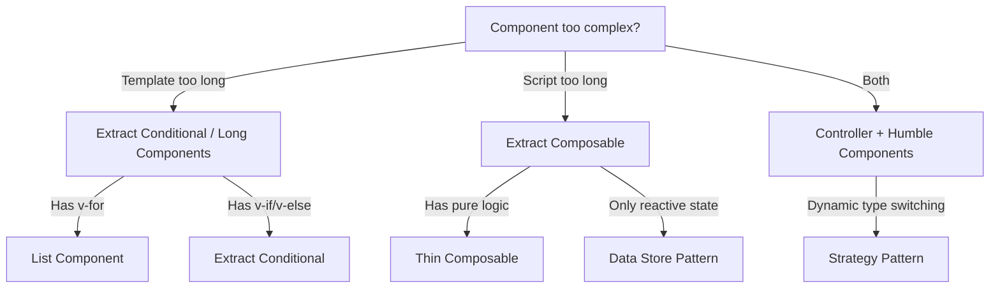

# Vue Design Patterns

Concise reference for component design, refactoring, and planning. Based on Michael Thiessen's patterns, adapted for our Nuxt 4 / Vue 3.5+ codebase.

## 1. Data Store Pattern

Global reactive state in a composable. Expose only what consumers need via `toRefs` and `readonly`.

```ts
const state = reactive({ darkMode: false, theme: 'nord' })

export function useSettings() {
  const { darkMode } = toRefs(state)
  const changeTheme = (t: string) => { state.theme = t }
  return { darkMode, theme: readonly(toRef(state, 'theme')), changeTheme }
}
```

**When:** Shared state across features without Pinia. Already used for `useElementsStore`, `useSelectionStore`.

## 2. Thin Composables

Separate reactivity from business logic. The composable is a thin reactive wrapper around pure functions.

```ts
// pure function — easy to unit test
export function convertToFahrenheit(c: number): number { return c * 9 / 5 + 32 }

// thin composable — only wiring
export function useTemperatureConverter(celsius: Ref<number>) {
  const fahrenheit = ref(convertToFahrenheit(celsius.value))
  watch(celsius, (c) => { fahrenheit.value = convertToFahrenheit(c) })
  return { fahrenheit }
}
```

**When:** Complex calculations, validators, transformers. Keep the pure function in a separate file for isolated testing.

## 3. Humble Components

Components that only render props and emit events. Zero business logic.

```vue
<script setup lang="ts">
defineProps<{ label: string; active: boolean }>()
defineEmits<{ select: [] }>()
</script>
<template>
  <button :class="{ active }" @click="$emit('select')">{{ label }}</button>
</template>
```

**When:** Any leaf UI component. Pair with Controller Components (#8) for orchestration.

## 4. Extract Conditional

Replace inline `v-if`/`v-else` blocks with named components to improve readability.

```vue
<!-- before -->
<div v-if="isEditing"><!-- 40 lines --></div>
<div v-else><!-- 30 lines --></div>

<!-- after -->
<EditingView v-if="isEditing" />
<DisplayView v-else />
```

**When:** Each branch exceeds ~10 lines of template code.

## 5. Extract Composable

Pull logic out of components into composables — even for single-use. Keeps components focused on template rendering.

**When:** A component's `<script setup>` grows beyond ~30 lines of logic, or the logic is testable in isolation.

## 6. List Component Pattern

Abstract `v-for` loops into a dedicated list component to keep the parent clean.

```vue
<!-- parent -->
<TaskList :tasks="tasks" @remove="removeTask" />

<!-- TaskList.vue -->
<TaskItem v-for="task in tasks" :key="task.id" :task="task" @remove="$emit('remove', task.id)" />
```

**When:** The loop body is more than a few lines, or the list needs its own empty/loading states.

## 7. Preserve Object Pattern

Pass an entire object as a single prop instead of destructuring into many props.

```vue
<CustomerCard :customer="customer" />
<!-- NOT: <CustomerCard :name="customer.name" :email="customer.email" :phone="customer.phone" /> -->
```

**When:** Props are tightly coupled and always come from the same source. Avoid for generic/reusable components that shouldn't depend on a specific shape.

## 8. Controller Components

Orchestrators that wire composables (logic) to Humble Components (UI). No template markup of their own beyond child components.

```vue
<script setup lang="ts">
import { useTasks } from '~/features/tasks/composables/useTasks'
const { tasks, addTask, removeTask } = useTasks()
</script>
<template>
  <TaskInput @add="addTask" />
  <TaskList :tasks="tasks" @remove="removeTask" />
</template>
```

**When:** Pages and feature entry points. Maps directly to our `app/pages/` and feature root components.

## 9. Strategy Pattern

Use `<component :is>` with a computed to dynamically select components at runtime.

```vue
<component :is="activeRenderer" v-bind="elementProps" />
```

**When:** Rendering varies by type (element renderers, tool panels, form field types). Already used in our rendering pipeline.

## 10. Hidden Components

Split a component when different call-sites use mutually exclusive subsets of its props.

```vue
<!-- If some callers pass chart props and others pass table props, split into two -->
<ChartDisplay :data="data" :options="chartOptions" />
<TableDisplay :data="data" :settings="tableSettings" />
```

**When:** You see prop groups that never overlap across usages.

## 11. Insider Trading (Inline Child)

If a child component receives *all* of its parent's props and re-emits *all* events, it adds no value — inline it back into the parent.

**When:** A child is just a pass-through wrapper with no independent logic or reuse.

## 12. Long Components

If a component is hard to understand at a glance, break it into named sub-components. The names serve as documentation.

**When:** Template exceeds ~100 lines or has clearly separable sections.

---

## Decision Flowchart



## Mapping to Our Codebase

| Pattern | Where we use it |
|---|---|
| Data Store | `useElementsStore`, `useSelectionStore`, `useCanvasStore` |
| Thin Composable | Pure math in `app/shared/math/`, composables wrap them |
| Humble Component | Toolbar buttons, property panels |
| Controller Component | `app/pages/index.vue`, feature root components |
| Strategy Pattern | Element renderers (`<component :is>` in render pipeline) |
| Extract Composable | Every `use*.ts` in `features/*/composables/` |
